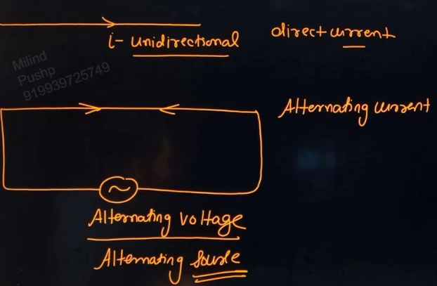
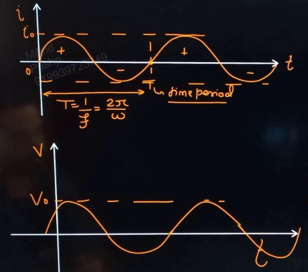
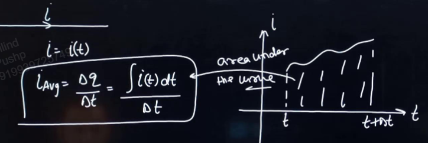
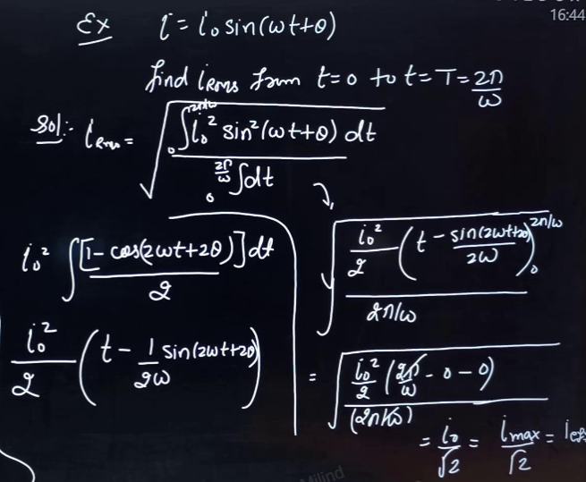
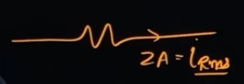
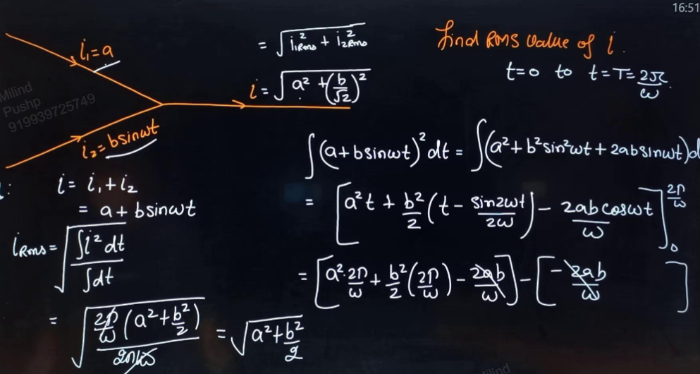
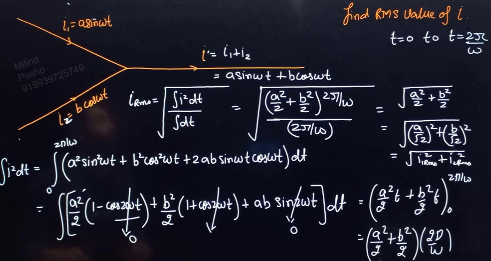
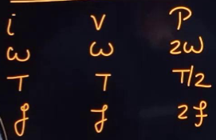
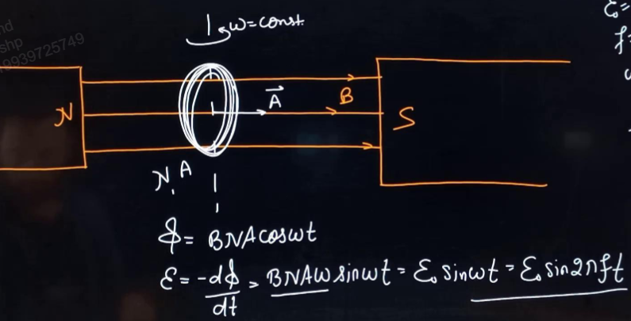
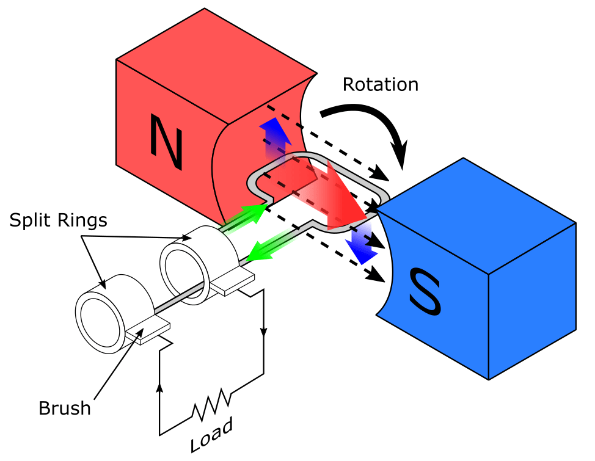

Links: 
___
# Alternating Current
When the direction of current is fixed, it is called direct. 

In Alternating current, the direction of current changes many times a second. 
Thus the source also changes polarity. 

#### Sinusoidal AC
$$i = i_{o}\sin \omega t$$
$i$ varies from $[-i_{o},i_{o}]$ and $i_{o}$ is called peak current or current amplitude.
$\omega$ is angular frequency, 
$$\omega = 2 \pi f = \frac{2\pi}{T}$$

Anything inside of sin is called phase. 

As $i$ is varying sinusoidally $V$ also varies sinusoidally.
$$V = V_{o} \sin \upomega t$$

##### Average Current 
$$i_{avg} = \frac{ \Delta q }{ \Delta t } = \frac{ \smallint i(t)dt }{ \Delta t }$$

##### RMS value of AC
Root mean Square Value.

First square, then take mean, then take root.

It is the effective value of AC. If nothing is said, assume the value to be rms. 

$$i_{rms} = \sqrt{ \frac{ \int i^{2} \, dt  }{ \int dt  } }$$

Let the current be,
$$i = i_{o}\sin (\omega t + \theta)$$
Now, we find RMS value of this current from t=0 to t=T. 
This value will be the same for $t = 0 \to 2T, 0 \to 3T$ etc. 

$$i_{rms} = \sqrt{ \frac{ \int_{0}^{2\pi/\omega} i^{2} \sin ^{2}(\omega t + \theta) \, dt  }{ \int_{0}^{2\pi/\omega} dt } }$$

And finally, we get,
$$i_{rms} = \frac{i_{o}}{\sqrt{ 2 }}$$

The rms value is shown in the circuit. A hot wire ammeter measures rms current. 

If current is given as the sum of 2 other sinusoidal out-of-phase currents,

$$i = i_{1}\sin\upomega t + i_{2}\sin(\upomega t + \theta)$$

$$
\begin{split}
i_{rms} &= \sqrt{ \left( \frac{ i_{1} }{ \sqrt{ 2 } } \right)^{2} +  \left( \frac{ i_{2} }{ \sqrt{ 2 } } \right)^{2} + 2. \frac{ i_{1} }{ \sqrt{ 2 } }. \frac{ i_{2} }{ \sqrt{ 2 } } \cos \theta } \\
\\
i_{rms} &= \sqrt{ i_{1rms}^{2} + i_{2rms}^{2} + 2i_{1rms}i_{2rms}\cos \theta }
\end{split}
$$
Which is just like addition of vectors.

## Power of Source of Load
[[04 Power]]

Let the current and voltage be,
$$i= i_{o}\sin \omega t$$
$$V = V_{o}(\sin\omega t + \theta)$$

At any instant,
$$
\begin{split}
P &= Vi \\
&= i_{o} V_{o} \sin(\omega t + \theta) \sin \omega t \\
&= \frac{ i_{o}V_{o} }{ 2 } [\cos \theta - \cos (2\omega t + \theta)] \\
&= \frac{ i_{o}V_{o} }{ 2 } \cos \theta - \frac{ i_{o}V_{o} }{ 2 } \cos (2\omega t + \theta) 
\end{split}
$$

Thus, 

Now, average power,
$$
\begin{split}
P_{avg} &= \frac{ i_{o}V_{o} }{ 2 }\cos \theta \\
&= \frac{ i_{o} }{ \sqrt{ 2 } }. \frac{ V_{o} }{ \sqrt{ 2 } } \cos \theta \\
&= i_{rms} . V_{rms}\cos \theta 
\end{split}
$$
Here, $\theta$ is the *power factor angle* or the *phase difference* between i and V. And $\cos \theta$ is called the power factor. 

## AC Generator
It converts mechanical energy into electrical energy. 

It works on the principle that when a loop is moved in a magnetic field, an emf is generated in it. 

When the coil is rotated with constant angular speed $\upomega$, the angle between $\vec{B}$ and $\vec{A}$ is,
$$\theta = \upomega t$$
Now, magnetic flux,
$$\phi = BAN\cos\upomega t$$
From Faraday's laws, induced emf,
$$\varepsilon = -N \frac{ d\phi }{ dt }$$

Thus,
$$\varepsilon = -NBA\upomega \sin\upomega t$$
$\varepsilon = NBA\upomega$ is the max amount of emf that can be produced. 

Dividing it by $R$,
$$i = i_{o} \sin \upomega t$$

In India,
$$
\begin{split}
\varepsilon_{o} &= 220\sqrt{ 2 }\ V \\
\varepsilon_{rms} &= 220\ V \\
f &= 50\ Hz \\
\omega &= 100\pi
\end{split}
$$

