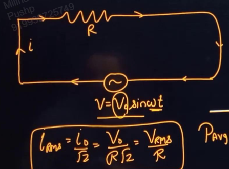
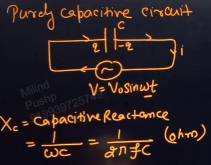
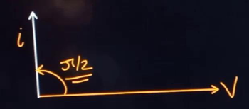
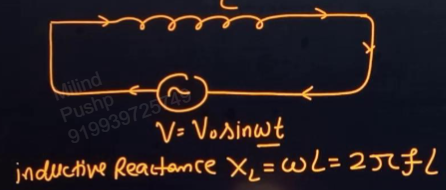
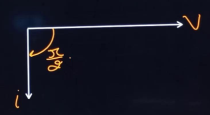

Links: [[00 Alternating Current]], [[01 Ohm's Law]], [[03 Kirchhoff's Laws]]
___
# Individual Circuits
## Purely Resistive Circuit

Applying KVL,
$$
\begin{split}
V_{o}\sin\omega t - iR &= 0 \\
i &= \frac{ V_{o} }{ R } \sin\omega t \\
&= i_{o} \sin\omega t
\end{split}
$$
Thus,
$$i_{o} = \frac{V_{o}}{R}$$

Since voltage and current are in the same phase, we have the phasor diagram,

Here,
$$\theta = 0 \implies \cos \theta = 1$$
i.e. Power Factor = 1

$$
\begin{split}
P_{avg} &= V_\text{rms}. i_\text{rms} \cos 0 \\
&= \frac{ V_{o} }{ \sqrt{ 2 } }. \frac{ i_{o} }{ \sqrt{ 2 } } . 1 \\
&= \frac{V_\text{rms}^{2}}{R} \\
&= \frac{ i_{o}^{2}R }{ 2 } 
\end{split}
$$

## Purely Capacitive Circuit 

At any time, charge on capacitor,
$$q = CV_{o} \sin\omega t$$

Differentiating this, we get current,
$$
\begin{split}
i &= \upomega C V_{o}\cos\omega t \\
i &= \frac{V_{o}}{\frac{1}{\omega C}} \cos\omega t \\
i &= \frac{V_{o}}{X_{C}} \sin(\omega t+90^{\circ})
\end{split}
$$
here, $X_{C}$ is called **capacitive reactance.** It is the effective resistance provided by a capacitor in an ac circuit. Its unit is ohm. 

$$X_{C} = \frac{ 1 }{ \omega C } = \frac{ 1 }{ 2\pi fC }$$

And,
$$
\begin{split}
i_{o} &= \frac{ V_{o} }{ X_{C} } \\
i_{rms} &= \frac{V_{o}}{\sqrt{ 2 }X_{C}}
\end{split}
$$

In a capacitive circuit, current is ahead of voltage by a phase angle of $\frac{\pi}{2}$. 
Thus the power factor is $\cos 90^{\circ} = 0$, and the average power comes out to be zero in a cycle. 

In the first half, the capacitor charged (acting like a load), and in the next half it discharges (acting like a source). Thus making the net energy stored or dissipated in one cycle, zero.

## Purely Inductive Circuit

Using KVL,
$$
\begin{split}
V_{o}\sin\omega t - L \frac{ di }{ dt } &= 0 \\
i &= \frac{ -V_{o} }{ \omega L } \cos\omega t \\
&= \frac{ V_{o} }{ X_{L} } \sin (\omega t - 90^{\circ})
\end{split}
$$
Here, $X_{L}$ is called**inductive reactance.** It is the effective resistance provided by an inductor in an ac circuit. Its unit is ohm. 
$$X_{L} = \omega L = 2\pi fL$$

And,
$$
\begin{split}
i_{o} &= \frac{ V_{o} }{ X_{L} } \\
i_\text{rms} &= \frac{V_{o}}{\sqrt{ 2 }X_{L}}
\end{split}
$$

In an inductive circuit, current is behind voltage by a phase angle of $\frac{\pi}{2}$. 
Thus the power factor is $\cos 90^{\circ} = 0$, and the average power is zero for a cycle. 

For half a cycle current and magnetic energy increases (acting like a source) and for the next half, both will decrease (acting like a source). 

