Links: [[00 Alternating Current]], [[01 Individual Circuits]], [[01 Ohm's Law]], [[03 Kirchhoff's Laws]]
___
# RC, RL & LC Circuits
Impedance is effective resistance (i.e. reactance + resistance) of circuit and is represented by Z.

## RC Circuit
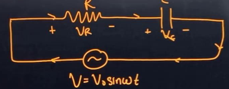

Applying KVL,
$$
\begin{split}
V - V_{R} - V_{C} &= 0 \\
V_{R} + V_{C} &= V
\end{split}
$$

We add the voltages using phasors, taking the current as base. 
$$V = i\sqrt{ R^{2} + X_{C}^{2} }$$

Thus we get impedance,
$$Z = \sqrt{ R^{2} + X_{C}^{2} }$$
And peak current,
$$i_{o} = \frac{ V_{o} }{ Z } = \frac{ V_{o} }{ \sqrt{ R^{2} + X_{C}^{2} } }$$

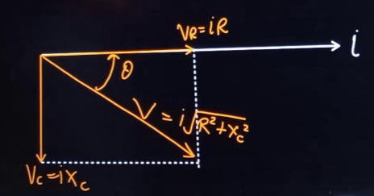

From the phasor, we can see that current is ahead of voltage by a phase of,
$$\theta = \cos ^{-1} \frac{ R }{ Z }$$

Now, power factor,
$$
\begin{split}
\cos \theta &= \frac{ V_{R} }{ V } \\
&= \frac{ iR }{ iZ } \\
&= \frac{ R }{ Z }
\end{split}
$$

And thus, the average power,
$$
\begin{split}
P_{avg} &= i_{rms}V_{rms} \cos \theta \\
&= i_{rms}^{2}R 
\end{split}
$$

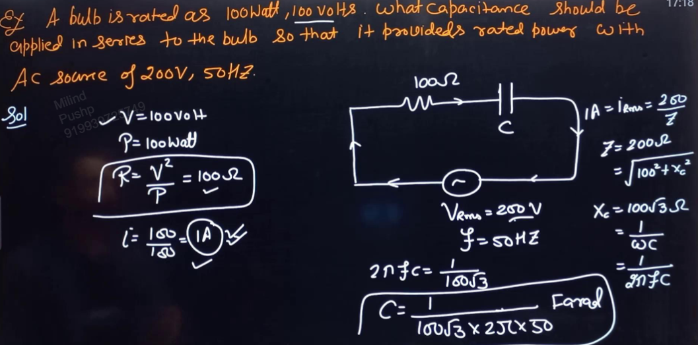

## LR Circuit 

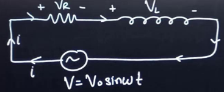

Applying Kirchhoff's Loop Law,
$$V = V_{R} + V_{L}$$

Adding them using phasors, with current as base,

$$V = i\sqrt{ R^{2} + X_{L}^{2} }$$
Thus, impedance,
$$Z = \sqrt{ R^{2} + X_{L}^{2} }$$
And peak current,
$$i_{o} = \frac{ V_{o} }{ Z }$$
RMS current,
$$i_{rms} = \frac{ V_{rms} }{ Z }$$

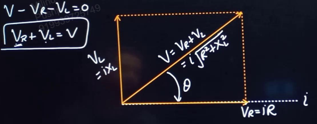

From here, we see that current is lagging voltage by angle,
$$\theta = \cos ^{-1} \frac{ R }{ Z }$$

Now, power factor,
$$
\begin{split}
\cos \theta &= \frac{ V_{R} }{ V } \\
&= \frac{ iR }{ iZ } \\
&= \frac{ R }{ Z }
\end{split}
$$

Thus, we get average power,
$$
\begin{split}
P_{avg} &= i_{rms} V_{rms} \cos \theta \\
&= i^{2}_{rms} R 
\end{split}
$$

 **Choke Coil:** It is a wire with many loops. Thus it is kind of an inductor. 

They have resistance as well as inductance. An ideal choke coil has no resistance. 

Thus, we can consider choke coil to be inductor.

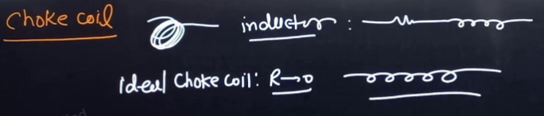

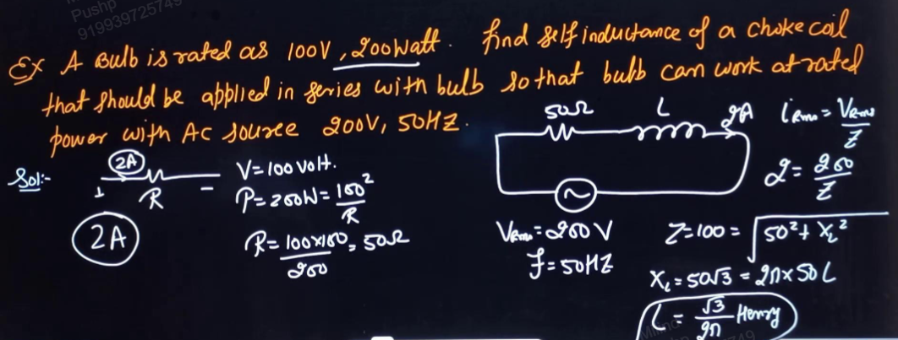

## LC Circuit
[[04 Circuit Solutions of LR Circuit#LC Oscillations]]

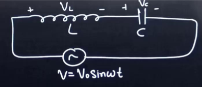

Applying Kirchhoff's Loop Law,
$$V = V_{L} + V_{C}$$

Adding them using phasors, with current as the base,
$$V = i|X_{L} - X_{C}|$$

Thus, impedance,
$$Z = |X_{L} - X_{C}|$$
And peak current,
$$i_{o} = \frac{ V_{o} }{ Z }$$
RMS current,
$$i_{rms} = \frac{ V_{rms} }{ Z }$$

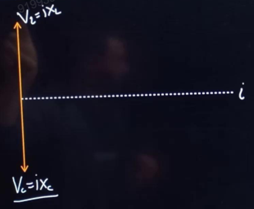

From here we can see that the phase difference between current and voltage in an LC circuit is always 90.

**If $X_{L} > X_{C}$,** the circuit is called **Inductive.**

Thus,
$$
\begin{split}
\omega L &> \frac{ 1 }{ \omega C } \\
\omega &> \frac{ 1 }{ \sqrt{ LC } }
\end{split}
$$
And we get,
$$Z = X_{L} - X_{C}$$

Current is lagging behind voltage by a phase of $\frac{\pi}{2}$.

Since $\cos \theta = 0$, average power comes out to be zero. 

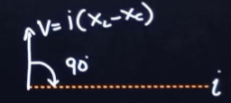

**If $X_{C} > X_{L}$,** the circuit is called Capacitive. 

Thus,
$$
\begin{split}
\omega L &< \frac{ 1 }{ \omega C } \\
\omega &< \frac{ 1 }{ LC }
\end{split}
$$
And we get,
$$Z = X_{C} - X_{L}$$

Current is ahead of the voltage by a phase of $\frac{\pi}{2}$. 

Since power factor is zero, $\cos \theta = 0$, the average power is zero. 

#### Graphs for LC circuit

In Z vs $\omega$ curve,

$$
\begin{split}
Z &= |X_{L} - X_{C}| \\
&= \left| \omega L - \frac{ 1 }{ \omega C } \right| 
\end{split}
$$

Similarly, we have $i_{rms}$ vs $\omega$,
$$
\begin{split}
i_{rms} &= \frac{ V_{rms} }{ Z } \\
&= \frac{ V_{rms} }{ \left| \omega L - \frac{ 1 }{ \omega C }\right| }
\end{split}
$$

And thus we get, $\omega$ resonance, 
$$
\begin{split}
\omega_{r} &= \frac{ 1 }{ \sqrt{ LC } } \\
f_{r} &= \frac{ 1 }{ 2\pi \sqrt{ LC } }
\end{split}
$$

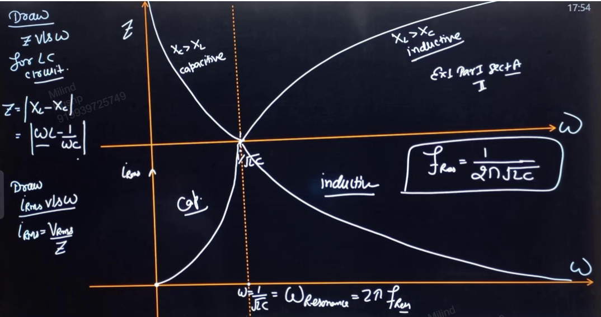

