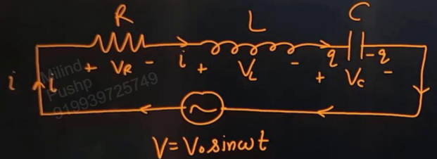
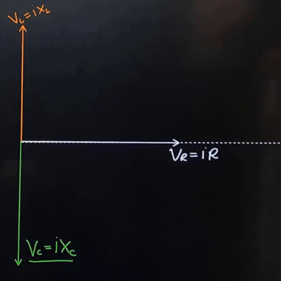
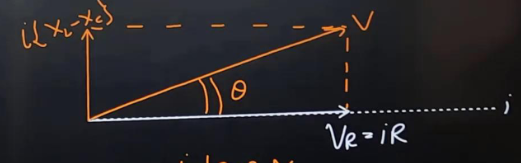
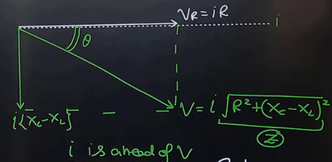
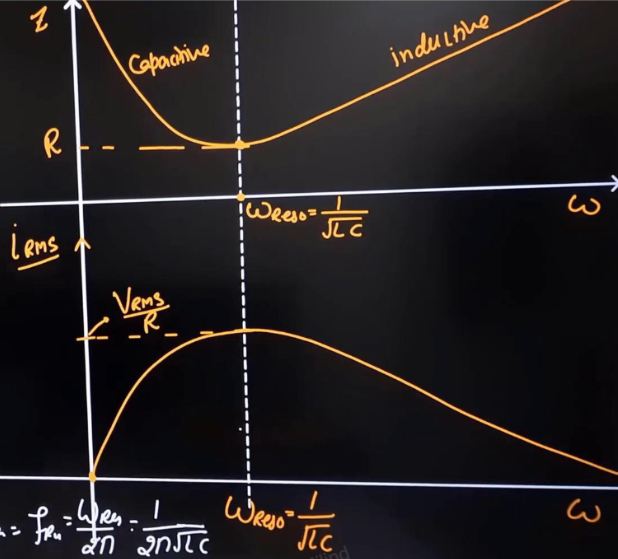
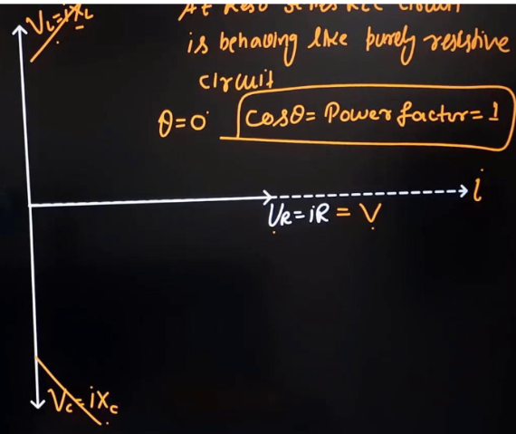
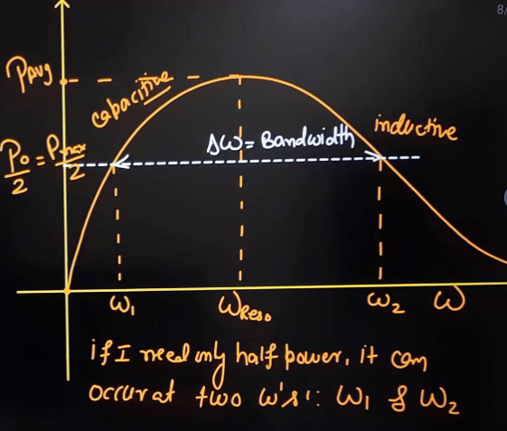

Links: [[00 Alternating Current]], [[02 Dual Circuits]], [[01 Ohm's Law]], [[03 Kirchhoff's Laws]]
___
# LCR Circuit 
#important 

Applying KVL,
$$V = V_{R} + V_{L} + V_{C}$$

Adding them using phasors, taking current as base,
$$V = i\sqrt{ R^{2} + (X_{L} - X_{C})^{2} }$$
$$Z = \sqrt{ R^{2} + (X_{L} - X_{C})^{2} }$$

##### Inductive Circuit 
The current lags voltage. 

Here, $X_{L} > X_{C}$. That is,
$$
\begin{split}
\omega L &> \frac{ 1 }{ \omega C } \\
\omega &> \frac{ 1 }{ \sqrt{ LC } }
\end{split}
$$

The resultant net voltage will be,
$$V = i\sqrt{ R^{2} + (X_{L} - X_{C})^{2} }$$

Thus, impedance is,
$$Z = \sqrt{ R^{2} + (X_{L} - X_{C})^{2} }$$

The phase difference between current and voltage,
$$
\begin{split}
\tan \theta &= \frac{ i(X_{L} - X_{C}) }{ iR } \\
&= \frac{ X_{L} - X_{C} }{ R } \\
\end{split}
$$

And power factor,
$$
\begin{split}
\cos \theta &= \frac{ V_{R} }{ V } \\
&= \frac{ iR }{ iZ } \\
&= \frac{ R }{ Z }
\end{split}
$$

##### Capacitive Circuit 
The current is ahead of voltage. 

Here, $X_{L} > X_{C}$. That is,
$$
\begin{split}
\omega L &< \frac{ 1 }{ \omega C } \\
\omega &< \frac{ 1 }{ \sqrt{ LC } }
\end{split}
$$

The resultant net voltage will be,
$$V = i\sqrt{ R^{2} + (X_{C} - X_{L})^{2} }$$

Thus, impedance is,
$$Z = \sqrt{ R^{2} + (X_{C} - X_{L})^{2} }$$

The phase difference between current and voltage,
$$
\begin{split}
\tan \theta &= \frac{ i(X_{C} - X_{L}) }{ iR } \\
&= \frac{ X_{C} - X_{L} }{ R } \\
\end{split}
$$

And power factor, is the same. 

### Resonance
We have, 
$$i_{rms} = \frac{ V_{rms} }{ Z }$$
Thus, for max. RMS current, Z needs to be smallest. 
I.e.,
$$Z = \sqrt{ R^{2} + \left( \omega L - \frac{ 1 }{ \omega C } \right)^{2} }$$
must be smallest. 

Z will be min, (= R), when,
$$
\begin{split}
\omega L &= \frac{ 1 }{ \omega C } \\
\omega_{r} &= \frac{ 1 }{ \sqrt{ LC } }
\end{split}
$$

This angular frequency is called *resonance angular frequency.* 
And, resonance frequency is thus,
$$f_{r} = \frac{ \omega_{r} }{ 2\pi } = \frac{ 1 }{ 2\pi \sqrt{ LC } }$$

At resonance, $X_{L} = X_{C}$. 

 At resonance, the circuit is neither capacitive nor inductive, and the rms current is max. being,
 $$i_{rms} = \frac{ V_{rms} }{ R }$$

#### Voltage 
Taking current as base, we add the voltages using phaser diagram. 

Here, we see that $V_{L}$ and $V_{C}$ cancel each other out, thus giving, 
$$V = V_{R} = iR$$

Thus, the circuit will behave like a purely resistive circuit at resonance and the current and applied voltage will be in the same phase. 

Power factor = 1. 

### Quality Factor
At resonance, average power,
$$
\begin{split}
P_{avg} &= i_{rms}V_{rms} \cos \theta \\
&= i_{rms} (i_{rms} R) \\
&= i_{rms}^{2}R
\end{split}
$$

Now, as we vary $\omega$, Z varies and thus $i_{rms}$ as well as $V_{rms}$ varies. Thus $P_{avg}$ also varies. 

We can make a curve between P and $\omega$. 

Half of average power can only occur at two angular frequencies, $\omega_{1}, \omega_{2}$. 

They are called *half power points.*

At max. power, $i_{rms}$ is max., and thus Z is R.

Now, at half of max. power, since $P \propto i_{rms}^{2}$, $i_{rms}$ has become $1/\sqrt{ 2 }$ its max. value,
$$i_{rms} = \frac{ i_{rms(max)} }{ \sqrt{ 2 } }$$
Thus, Z becomes,
$$
\begin{split}
Z &= \sqrt{ 2 }R \\
\sqrt{ R^{2} + (X_{L} - X_{C})^{2} } &= \sqrt{ 2 }R \\
(X_{L} - X_{C})^{2} &= R^{2}
\end{split}
$$
This will happen twice,

- **Capacitive,**

	$$
	\begin{split}
	X_{C} - X_{L} &= R \\
	\frac{ 1 }{ \omega C } - \omega L &= R \\
	1 - \omega^{2} LC &= \omega RC \\
	\omega_{1} &= \frac{ -RC + \sqrt{ R^{2} C^{2} + 4LC } }{ 2LC }
	\end{split}
	$$

- **Inductive,**

	$$
	\begin{split}
	X_{L} - X_{C} &= R \\
	\omega L - \frac{ 1 }{ \omega C } &= R \\
	\omega^{2} LC - 1 &= \omega RC \\
	\omega_{2} &= \frac{ RC + \sqrt{ R^{2} C^{2} + 4LC } }{ 2LC }
	\end{split}
	$$

The gap between these $\omega$ is $\Delta\omega$ and is called **Angular Frequency Bandwidth or Bandwidth.**

$$
\begin{split}
\Delta\omega &= \omega_{2} - \omega_{1} \\
&= \frac{ 2RC }{ 2LC } \\
&= \frac{ R }{ L }
\end{split}
$$

**Frequency Bandwidth,**
$$
\begin{split}
\Delta f &= f_{2} - f_{1} \\
&= \frac{ \Delta\omega }{ 2\pi } \\
&= \frac{ 1 }{ 2\pi } \frac{ R }{ L }
\end{split}
$$

Now, we define, **Quality Factor Q,**
$$
\begin{split}
Q &= \frac{\omega_{r}}{\Delta \omega} \\
&= \frac{ L }{ \sqrt{ LC }R } \\
&= \frac{ 1 }{ R } \sqrt{ \frac{ L }{ C } }
\end{split}
$$

Q is a unitless dimensionless quantity. It is just a ratio. 
Q decides the sharpness of $P-\omega$ graph. 

Quality Factor is also define as,
$$Q = \frac{ \text{energy stored} }{ \text{energy dissipated in 1 cycle} } \times 2\pi$$
All the quantities are at resonance. 

At resonance, both the capacitor and inductor will store the same energy, thus we can write,
$$
\begin{split}
Q &= \frac{ \frac{1}{2}Li_{rms}^{2} \times 2 }{ i_{rms}^{2} R \times \frac{2\pi}{\omega} } 2\pi \\
&= \frac{ L\omega }{ R } \\
&= \frac{ L }{ R \sqrt{ LC } } \\
&= \frac{ 1 }{ R } \sqrt{ \frac{ L }{ C } }
\end{split}
$$

