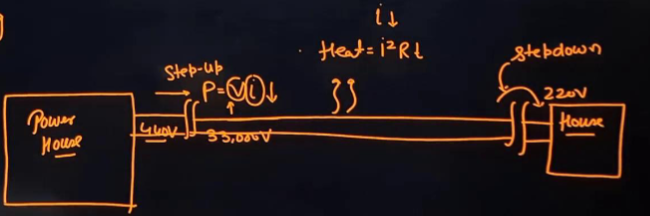
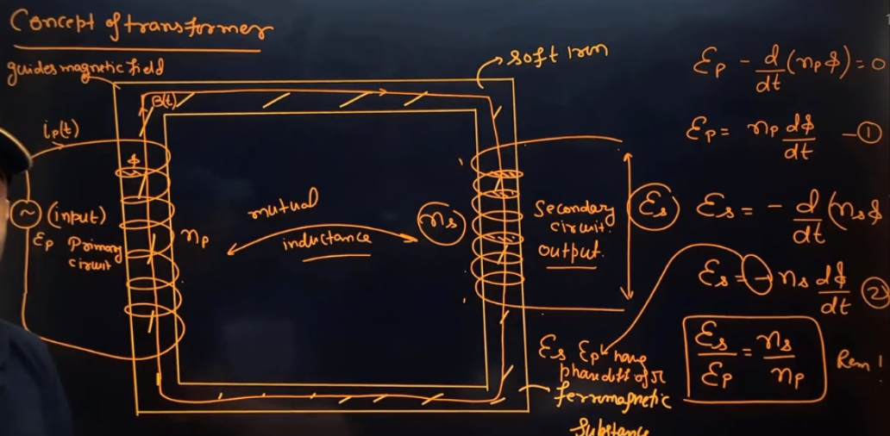
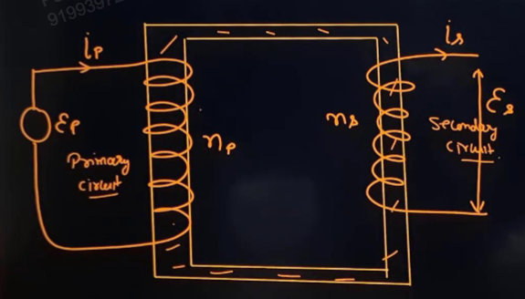
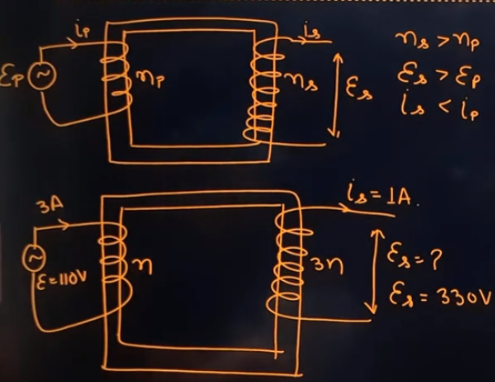
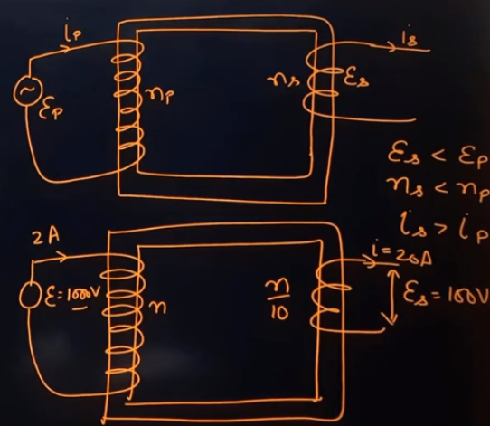

Links: [[00 Alternating Current]], [[03 Mutual Induction]]
___
# Transformer
It is used to increase or decrease the potential of an alternating current. 

It is based on the principle of mutual induction.

##### Use of Transformer 
Transformers are used in long distance transmission of electricity. 

The voltage output of the generator is stepped up and then transmitted through the wires. Since the current is reduced the energy lost in the form of heat is minimum. 

Near the consumer, it is again stepped down at the distributing substations and finally a potential of 220 V reaches our homes.

#### Formation
We take a soft iron core (it has least losses) to guide the magnetic field as it is ferromagnetic. 

We take the input AC source of input emf $\varepsilon_{p}$, and wrap  primary coil of $n_{p}$ turns on one side of the core. 

As the input current is changing with time, there will be a time varying magnetic field in the core. This magnetic field is guided by the core to the secondary coil of $n_{s}$ turns. 

This secondary coil will have output emf $\varepsilon_{s}$ due to the time varying magnetic field. 

Thus the coils will have a mutual inductance.  

Now, applying KVL on the primary circuit,
$$
\begin{split}
\varepsilon_{p} - n_{p} \frac{ d\phi }{ dt } &= 0 \\
\varepsilon_{p} &= n_{p} \frac{ d\phi }{ dt }
\end{split}
$$

emf induced in the secondary coil,
$$
\begin{split}
\varepsilon_{s} &= -n_{s} \frac{ d\phi }{ dt }
\end{split}
$$
The -ve here indicates that the AC of the output and input are out of phase. I.e. $\varepsilon_{s}$ and $\varepsilon_{p}$ have a phase difference of $\pi$. 

Ratio of secondary and primary emfs is thus,
$$\frac{ \varepsilon_{s} }{ \varepsilon_{p} } = \frac{ n_{s} }{ n_{p} }$$

#### Power of Ideal Transformer 
Transformer has no losses. Thus,
$$P_{in} = P_{out}$$

And we define, efficiency,
$$\eta = \frac{ P_{out} }{ P_{in} } \times 100$$
Thus, for an ideal transformer, $\eta = 100\%$

 Now, we have,
 $$
\begin{split}
P_{in} &= P_{out} \\
\varepsilon_{p} i_{p} &= \varepsilon_{s}i_{s} \\
\frac{ \varepsilon_{s} }{ \varepsilon_{p} } &= \frac{ i_{p} }{ i_{s} } \\
\frac{ n_{s} }{ n_{p} } &= \frac{ i_{p} }{ i_{s} }
\end{split} 
$$

Thus, current is inversely proportional to no. of turns. 
And, the product $\varepsilon i$ is constant. 

#### Step-up and Step-down transformer 
In a **step-up transformer,** the no. of turns of secondary circuit is more than that of primary circuit. Thus, the *voltage is stepped up* and *current is stepped down.*

$$
\begin{split}
n_{s} &> n_{p} \\
\varepsilon_{s} &> \varepsilon_{p} \\
i_{s} &< i_{p} 
\end{split}
$$

In a **step-down transformer,** the no. of turns of primary circuit is more than that of secondary circuit. Thus, the *voltage is stepped down* and *current is stepped up.*

$$
\begin{split}
n_{s} &< n_{p} \\
\varepsilon_{s} &< \varepsilon_{p} \\
i_{s} &> i_{p} 
\end{split}
$$

#### Energy Losses
There are two losses in a transformer, **copper (Cu) loss and iron (Fe) loss.** 

The *heat loss* due to resistance of (Cu) wires of the windings is called *Copper Loss.* 

$$H = i_{p}^{2}r_{p} + i_{s}^{2}r_{s}$$

Iron losses are the losses caused by the iron core of transformer. 
1. **Flux Leakage:** Not all the flux due to the first coil passes through to the second due to poor design or air gaps. It can be fixed by winding P and S one over the other. 
2. **[[00 Electromagnetic Induction#Eddy Current|Eddy Currents:]]** Alternating magnetic flux induces eddy currents in the iron core and causes heating, which dissipates energy. This can be reduced by using Laminated Core.
3. **[[07 Ferromagnetism#Hysteresis|Hysteresis:]]** Due to repeated changing of magnetic domains in the soft iron core, there will be hysteresis and thus energy loss. 

Net Power loss is,
$$
\begin{split}
\text{Power Loss} &= P_{in} - P_{out} \\
&= \varepsilon_{p}i_{p} - \varepsilon_{s}i_{s} 
\end{split}
$$

Thus, iron loss can be given as,
$$\text{Iron Loss} = (\varepsilon_{p}i_{p} - \varepsilon_{s}i_{s}) - (i_{p}^{2}r_{p} + i_{s}^{2}r_{s})$$

And efficiency will be,
$$\eta = \frac{ P_{out} }{ P_{in} } \times 100 = \frac{ \varepsilon_{s}i_{s} }{ \varepsilon_{p}i_{p} } \times 100$$
