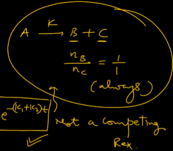
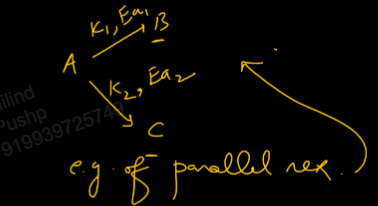
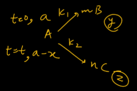
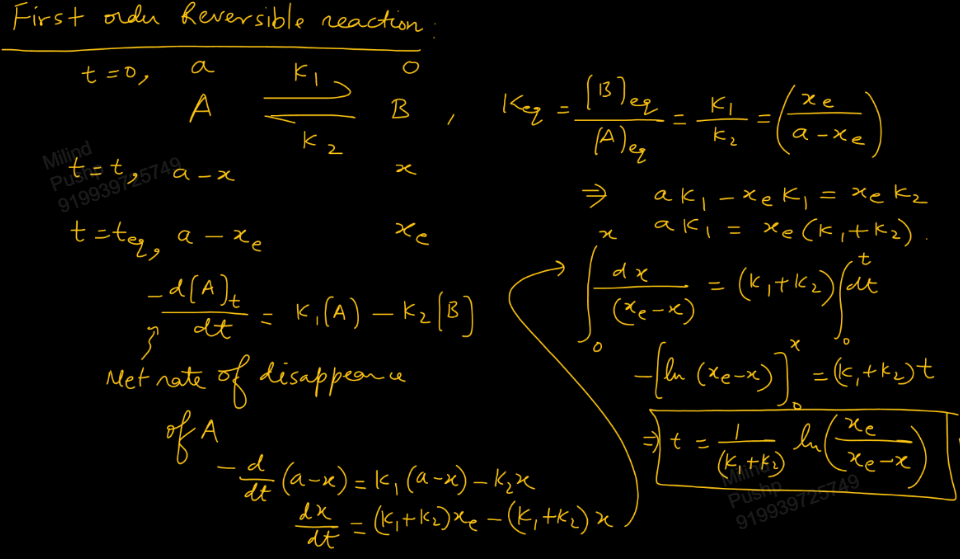
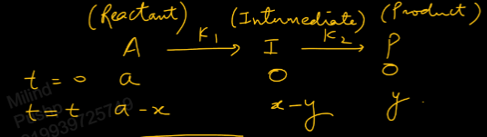

Links: 
___
# Chemical Kinetics
Deals with the rate at which reactants are converted into products and also with the effect of variation of conc., temp. etc. on on rate of reaction. 

It is a microscopic study. Thermodynamics is macroscopic study.

#### Rate of Appearance and Disappearance
 Appearance is for products and Disappearance is for reactants.

$$\ce{ 2A + 3B -> C + 2D }$$

Rate of disappearance of A = no of moles of A reacted per unit time per unit volume.
$$\ce{ = - \frac{ d[A]_{t} }{ dt } or - \frac{ \Delta [A] }{ \Delta t } }$$
-ve because concentration is decreasing and thus d[A] is -ve.

Similarly, we can write, rate of appearance of C,
$$\ce{ = \frac{ d [B]_{t} }{ dt } }$$

##### Relation between RoD and RoA
If all substances are in the same phase. 
For the reaction,
$$\ce{ 2A + 3B -> C + 2D }$$

We can write,
$$
\begin{split}
\ce{ 
\frac{ d[C] }{ dt } &= -\frac{ 1 }{ 2 } \frac{ d[A] }{ dt } \\
\frac{ d[D] }{ dt } &= 2 \frac{ d[C] }{ dt } \\
}
\end{split}
$$
$$
\begin{split}
\frac{ d[C] }{ dt }C &= -\frac{ 1 }{ 2 } \frac{ d[A] }{ dt } \\
\frac{ d[D] }{ dt } &= 2 \frac{ d[C] }{ dt } \\
\end{split}
$$
I.e.,
$$\ce{ - \frac{1}{2} \frac{ d[A] }{ dt } = - \frac{1}{3} \frac{ d[B] }{ dt } = \frac{ 1 }{ 1 } \frac{ d[C] }{ dt } = \frac{1}{2} \frac{ d[D] }{ dt } }$$

For a general reaction,
$$\ce{ aA_{(g)} + bB_{(g)} -> cC_{(g)} + dD_{(g)} }$$
We can write,
$$\ce{ - \frac{ 1 }{ a }\frac{ d[A] }{ dt } = - \frac{ 1 }{ b }\frac{ d[B] }{ dt } = \frac{ 1 }{ c }\frac{ d[C] }{ dt } = \frac{ 1 }{ d }\frac{ d[D] }{ dt } }$$

#### Rate of Reaction 
It is defined as the rate of change of conc. of any substance involved in reaction divided by its stoichiometric coefficient in chemical given chemical equation. 

It can be the same or different than the rate of appearance or disappearance of any substance in the reaction. 

$$\ce{ aA + bB -> cC + dD }$$

$$\ce{ Rate = - \frac{ 1 }{ a }\frac{ d[A] }{ dt } = - \frac{ 1 }{ b }\frac{ d[B] }{ dt } = \frac{ 1 }{ c }\frac{ d[C] }{ dt } = \frac{ 1 }{ d }\frac{ d[D] }{ dt } }$$

**Note:** Is stoichiometry of a reaction is altered by multiplying equation by a factor, then rate of reaction is changed. But, rate of disappearance and rate of appearance of a substance does not change. 

**Major factors affecting Rate of Reaction,** 
1. Concentration or Partial Pressure
2. Temperature
3. Catalyst
4. Surface area if solids are involved

## [[02 Kinetics]]

### [[04 Exp. Det. of Order and k of First Order]]

### Parallel or Competing First Order Reaction 
A reaction where A converts to B and C simultaneously, is not parallel.

A parallel reaction is one where the rate constants are different.

For a general parallel reaction,

We have,
$$
\begin{split}
x &= \frac{ y }{ m } + \frac{ z }{ n } \\
\frac{ dx }{ dt } &= \frac{ 1 }{ m }\frac{ dy }{ dt } + \frac{ 1 }{ n }\frac{ dz }{ dt } \\
-\frac{ d[A] }{ dt } &= \frac{ 1 }{ m }mk_{1}[A] + \frac{ 1 }{ n }nk_{2}[A] \\
-\frac{ d[A] }{ dt } &= (k_{1}+k_{2})[A]
\end{split}
$$
Thus the overall rate constant of parallel reaction is,
$$k = k_{1}+k_{2}$$

And the integrated rate law will be,
$$[A]_{t} = [A]_{o} e^{ -(k_{1}+k_{2})t }$$

We can also write this as,
$$\frac{ \ln 2 }{ t_{1/2}\text{(overall)} } = \frac{ \ln 2 }{ t_{1/2(1)} } + \frac{ \ln 2 }{ t_{1/2(2) } }$$

We can also relate activation energy,
$$
\begin{split}
k &= k_{1} + k_{2} \\
Ae^{ -E_{a}/RT } &= A_{1}e^{ -E_{a 1}/RT } + A_{2}e^{ -E_{a 2}/RT } \\
Ae^{ -E_{a}/RT } \frac{ E_{a} }{ RT^{2} } &= A_{1}e^{ -E_{a 1}/RT } \frac{ E_{a 1} }{ RT^{2} } + A_{2}e^{ -E_{a 2}/RT } \frac{ E_{a 2} }{ RT^{2} } \\
kE_{a} &= k_{1}E_{a 1} + k_{2} E_{a 2} 
\end{split}
$$
Thus we get, overall activation energy of parallel reaction,
$$E_{a} = \frac{ k_{1} E_{a 1} + k_{2} E_{a 2} }{ k_{1} + k_{2} }$$

#### Concentration of Products 
$$
\begin{split}
\frac{ d[B] }{ dt } &= mk_{1}[A]_{t} \\
\int d[B]_{t} &= mk_{1}[A]_{o} \int e^{ -(k_{1}+k_{2})t } \, dt \\
[B]_{t} &= \frac{ mk_{1}[A]_{o} }{ k_{1} + k_{2} } (1 - e^{ -(k_{1}+k_{2})t })  
\end{split}
$$

Similarly, we get, conc. of C,
$$[C]_{t} = \frac{ nk_{2}[A]_{o} }{ k_{1} + k_{2} } (1 - e^{ -(k_{1}+k_{2})t })  $$

Thus, at any time, the ratio of conc. of B and C,
$$\frac{ [B]_{t} }{ [C]_{t} } = \frac{ mk_{1} }{ nk_{2} }$$

### First Order Reactions
#### First Order Reversible Reaction 

$$t = \frac{ 1 }{ k_{1} + k_{2} } \ln \frac{ x_{c} }{ x_{c} - x }$$

#### First Order Sequential Reaction 
aka **Consecutive reaction**

Example is radioactive disintegration series. 
Note than radioactive decay always follows first order kinetics. 

$$\ce{ A -> I -> P }$$

Then,
$$
\begin{split}
[A]_{t} &= [A]_{o}e^{ -k_{1}t } \\
[I]_{t} &= \frac{ k_{1}[A]_{o} }{ k_{2}-k_{1} } (e^{ -k_{1}t } - e^{ -k_{2}t }) \\
[P]_{t} &= \frac{ [A]_{o} }{ k_{2} - k_{1} } [k_{2}(1-e^{ -k_{1}t }) - k_{1}(1-e^{ -k_{1}t })]
\end{split}
$$

The time at which conc. of intermediate is max is,
$$t_{I_{max}} = \frac{ \ln k_{1} /k_{2} }{ k_{1} - k_{2} }$$
