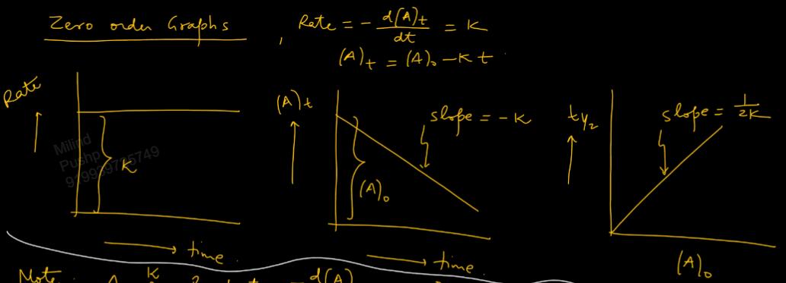
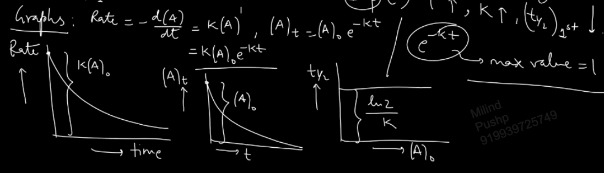
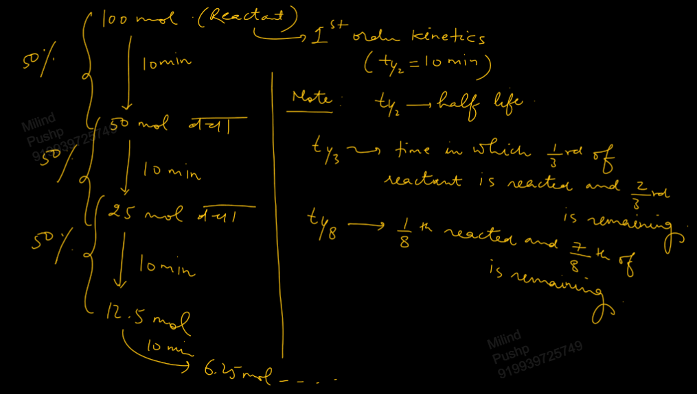
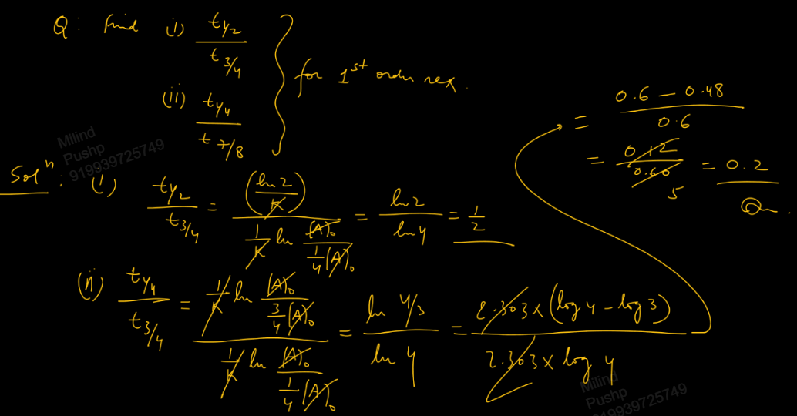
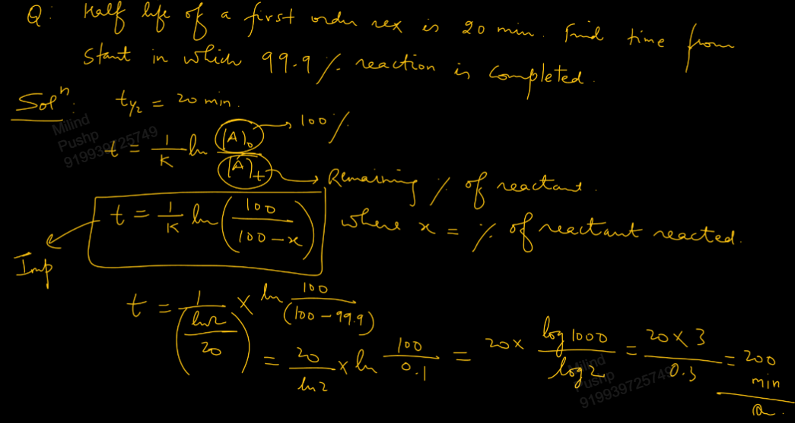

Links: 
___
# Kinetics 
### Zero Order Kinetics 
When order of reaction is zero. 

If the reaction is,
$$\ce{ A -> P }$$
Then the rate will be,
$$\ce{ Rate = - \frac{ d[A] }{ dt } = k[A]^{0} = k }$$
This is called *differential rate law.* 

Using it we can find *integrated rate law,*
$$
\begin{split}
- \frac{ d[A] }{ dt } &= k \\
\int_{[A]_{o}}^{[A]_{t}} d[A] &= -k \int_{0}^{t} dt \\
[A]_{o} - [A]_{t} &= kt 
\end{split}
$$
Thus, we get, the integrated rate law,
$$\ce{ [A]_{t} = [A]_{o} - kt }$$

Now, if in t time, x mol/lit are used up from the initial a mol/lit, we can write,
$$
\begin{split}
a - x &= a - kt \\
x &= kt
\end{split}
$$
Where x is the conc. of A or reactant reacted in t time. 
I.e.,
$$\ce{ x = [A]_{o} - [A]_{t} }$$

##### Half Life 
Time in which half of the reactant gets reacted. 

For zero order reaction, 
$$\ce{ [A]_{t} = [A]_{o} - kt }$$
If $t = t_{1 /2}$, $\ce{ [A]_{t} = [A]_{o}/2 }$,
And thus,
$$\ce{ t_{1 /2} = \frac{ [A]_{o} }{ 2k } }$$

**Time of completion** is when reactants become zero. 
$$\ce{ t_{c} = \frac{ [A]_{o} }{ k } = 2t_{1 /2} }$$

Only zero order reaction completes in a finite time period. 

Equal concentrations of reactants react in equal time periods in zero order reaction.

The conc. of reactant remaining after equal time periods forms AP. 

$$
\begin{split}
[A]_{o} &= [A]_{o} \\
[A]_{10} &= [A]_{o} - 10k \\
[A]_{20} &= [A]_{o} - 20k \\
[A]_{30} &= [A]_{o} - 30k \\
\end{split}
$$

##### Graph

##### Some PTR
Note that if the reaction becomes,
$$\ce{ mA ->[k] P }$$
Then rate of reaction becomes,
$$\ce{ - \frac{ 1 }{ m }\frac{ d[A] }{ dt } = k }$$
Thus the integrated rate law becomes,
$$\ce{ [A]_{t} = [A]_{o} - mkt = [A]_{o} - k_{A}t }$$
And half life becomes,
$$\ce{ t_{1 /2} = \frac{ [A]_{o} }{ 2(mk) } = \frac{ [A]_{o} }{ 2k_{A} } }$$

If the reaction has 2 or more reactants,
$$\ce{ A + 2B ->[k] P }$$
Then,
$$\ce{ [A]_{t} = [A]_{o} - k_{A}t }$$
$$\ce{ [B]_{t} = [B]_{o} - k_{B}t }$$

And half life,
$$\ce{ t_{1 /2(A)} = \frac{ [A]_{o} }{ 2k_{A} } }$$
$$\ce{ t_{1 /2(B)} = \frac{ [B]_{o} }{ 2k_{B} } }$$

Half life of reaction is defined when both the half lives are equal. 
$$
\begin{split}
t_{1 /2(A)} &= t_{1 /2(B)} \\
\frac{ [A]_{o} }{ [B]_{o} } &= \frac{ 1 }{ 2 }
\end{split}
$$

Thus for a reaction involving 2 more reactants, then half lives of all reactants are equal when their initial conc. are taken in their stoichiometric proportions. 

In such case, 
$$t_{1/2(A)} = t_{1 /2(B)} = t_{1 /2(\text{reaction})}$$

### First Order Kinetics 
$$\ce{ A ->[k] P }$$

Differential rate law,
$$\ce{ - \frac{ d[A] }{ dt } = k[A] }$$

Integrated rate law,
$$
\begin{split}
\int_{[A]_{o}}^{[A]_{t}} \frac{ d[A] }{ [A] } &= -k \int_{0}^{t} dt \\
\ln \frac{ [A]_{t} }{ [A]_{o} } &= -kt  \\
[A]_{t} &= [A]_{o} e^{-kt}  
\end{split}
$$

And k can be written as,
$$k = \frac{ 2.303 }{ t } \log_{10} \frac{ [A]_{o} }{ [A]_{t} }$$

Half life is thus,
$$t_{1/2} = \frac{ \ln 2 }{ k } = \frac{ 0.693 }{ k }$$
Which is independent of concentration. 

As we increase temp., k decreases and thus half life decreases. 

Time of completion is infinite. 

For first order, average life,
$$t_{avg} = \frac{ 1 }{ k } \approx 1.44 \times t_{1/2}$$

In n half lives, conc. of reactant remaining,
$$[A]_{t_{1/2}(n)} = \frac{ [A]_{o} }{ 2^{n} }$$

##### Graph

##### Characteristics of First Order Reaction  
Conc. of reactant which reacts in equal time period goes on decreasing. 

Conc. of reactant remaining after equal time period forms GP.
$$
\begin{split}
[A]_{o} &= [A]_{o} \\
[A]_{10} &= [A]_{o}e^{ -10k } \\
[A]_{20} &= [A]_{o}e^{ -20k } \\
[A]_{30} &= [A]_{o}e^{ -30k } \\
\end{split}
$$

Equal conc. of reactant does not react in equal time. But, equal percentage or fraction of reactant reacts in equal time period. 

(in 2nd question it is 3/4 not 7/8)

### [[03 2nd Order Kinetics]]

### nth Order Kinetics
$$\ce{ A ->[k] P }$$
And differential rate law is,
$$\ce{ Rate = -\frac{ d[A] }{ dt } = k[A]^{n} }$$

Integrated rate law,
$$
\begin{split}
-\int_{[A]_{o}}^{[A]_{t}} \frac{ d[A] }{ [A]^{n} } &= k\int_{0}^{t} dt \\
t &= \frac{ 1 }{ k(n-1) } \left( \frac{ 1 }{ [A]_{o}^{n-1} } - \frac{ 1 }{ [A]_{t}^{n-1} } \right)
\end{split}
$$

It is applicable everywhere except first order. 

Half Life,
$$\ce{ t_{1/2} = \frac{ 1 }{ k(n-1) } \left( \frac{ 2^{n-1}-1 }{ [A]_{o}^{n-1} } \right) }$$

Thus, 
$$t_{1/2} \propto \frac{ 1 }{ [A]_{o}^{n-1} }$$
