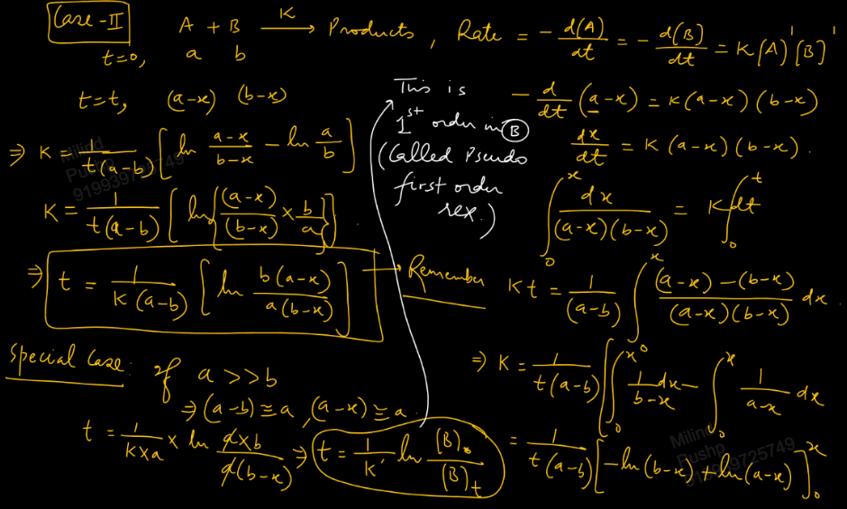

Links: 
___
# Second Order Kinetics 
#### Single Reactant 
$$\ce{ A ->[k] P }$$

Differential rate law,
$$\ce{ Rate = - \frac{ d[A] }{ dt } = k[A]^{2} }$$

Integrated rate law,
$$
\begin{split}
-\int_{[A]_{o}}^{[A]_{t}} \frac{ d[A] }{ [A]_{o}^{2} } &= k \int_{0}^{t} dt \\
\frac{ 1 }{ [A]_{t} } &= \frac{ 1 }{ [A]_{o} } + kt  
\end{split}
$$

Half life,
$$t_{1/2} = \frac{ 1 }{ k[A]_{o} }$$

Thus in 2nd order reaction, 
$$t_{1/2} \propto \frac{ 1 }{ [A]_{o} } $$

And time of completion is infinite. 

Conc. after equal time period form HP. 

**Graph,**

#### Two Reactants 
$$\ce{ A + B ->[k] P }$$

Differential rate law,
$$\ce{ -\frac{ d[A] }{ dt } = -\frac{ d[B] }{ dt } = k[A][B] }$$

Integrated rate law
$$
\begin{split}
\ce{ 
- \frac{ d }{ dt }(a-x) &= k(a-x)(b-x) \\
\frac{ dx }{ dt } &= k(a-x)(b-x) \\
 }
\int_{0}^{x} \frac{ dx }{ (a-x)(b-x) } &= k \int_{0}^{t} dt \\
k &= \frac{ 1 }{ t(a-b) } \ln \left( \frac{ a-x }{ b-x } \frac{ b }{ a } \right) 
\end{split}
$$

Thus, we get,
$$t = \frac{ 1 }{ k(a-b) } \ln \frac{ b(a-x) }{ a(b-x) }$$

##### Special Case
If $a \gg b$, then $a-b \approx a$ and $a-x \approx a$.

Thus we can write,
$$
\begin{split}
t &= \frac{ 1 }{ k a } \ln\frac{ ab }{ a(b-x) } \\
t &= \frac{ 1 }{ k' } \ln \frac{ b }{ b-x } \\
t &= \frac{ 1 }{ k' } \ln \frac{ [B]_{o} }{ [B]_{t} } \\
\end{split}
$$

Which is the same equation as that of first order. 
Thus it is first order in B. And thus is called *pseudo first order reaction.*

##### Pseudo Order Kinetics 
It arises when,
1. Rate law involves catalyst (conc. of catalyst remains constant)
2. Solvent taken in excess 
3. One of the reactant's conc. is taken much higher than the others.

Thus, for reaction,
$$\ce{ A + B ->[k] P }$$
If rate law is,
$$\ce{ Rate = k[A][B] }$$
And $[A]_{o} \gg [B]_{o}$, then $\ce{ [A] }$ is almost constant. And we can write,
$$\ce{ Rate = k'[B] }$$
where $k'$ is called pseudo first order rate constant and thus the reaction becomes effectively first order. 

**Examples of Pseudo First Order Reaction:**
1. Hydrolysis of Alkyl halides. 
	$$\ce{ RCl + H_{2}O ->[k] ROH + HCl }$$
	Here, $\ce{ Rate = k[RCl][H_{2}O] }$. But since water is taken in excess and $\ce{ [H_{2}O] = 55.55 M }$, we get,
	$$\ce{ Rate = k'[RCl], k' = k[H_{2}O] }$$

2. Acid catalysed hydrolysis of sucrose.
	$$\ce{ C_{12}H_{22}O_{11} + H_{2}O ->[H+] \underset{ glucose }{ C_{6}H_{12}O_{6} } + \underset{ fructose }{ C_{6}H_{12}O_{6} } }$$
	
	Experimentally, 
	$$\ce{ Rate = k [C_{12}H_{22}O_{11}][H_{2}O][H+] }$$
	However, $\ce{ H_{2}O }$ is solvent and $\ce{ H+ }$ is catalyst. 
	Thus, the rate law becomes,
	$$\ce{ Rate = k'[C_{12}H_{22}O_{11}] }$$