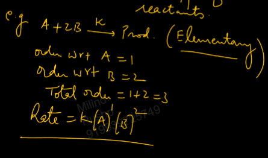
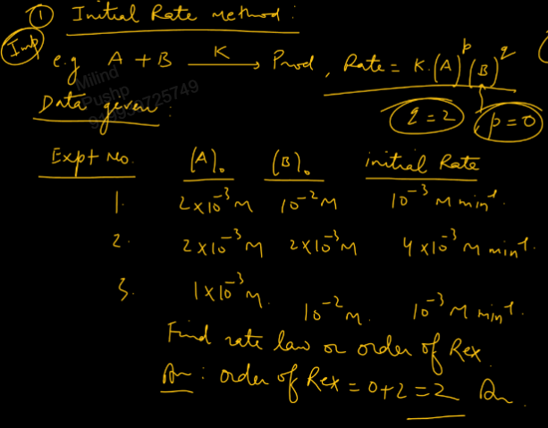
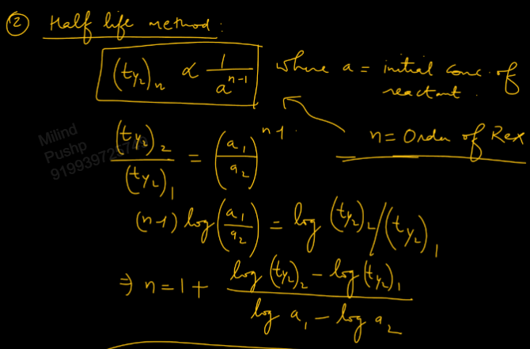
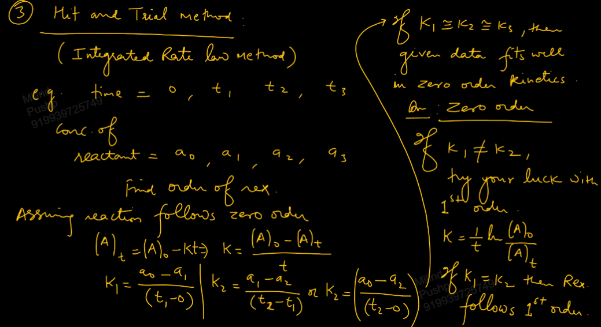
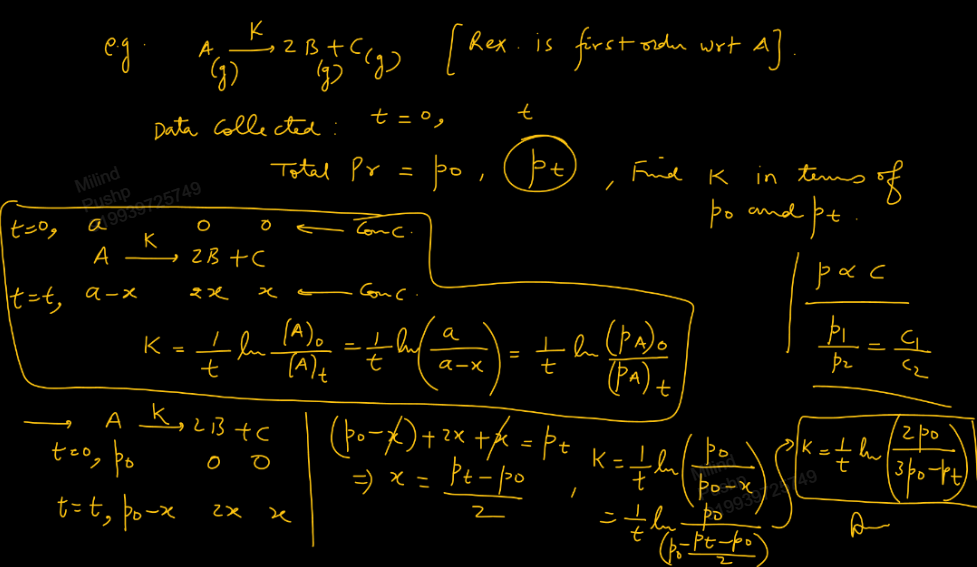
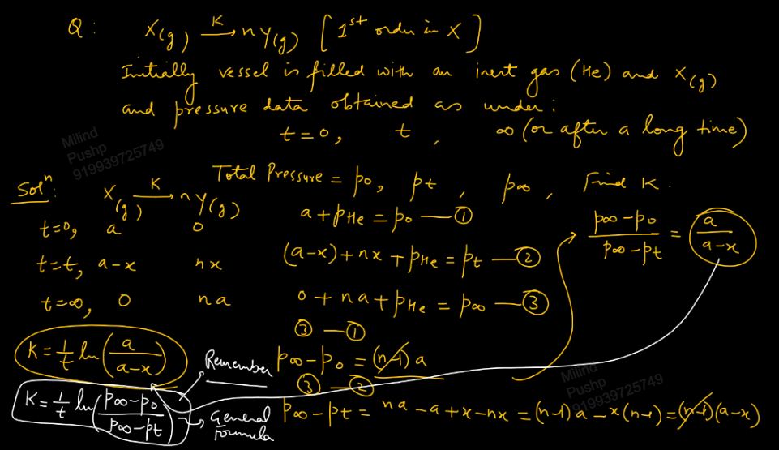
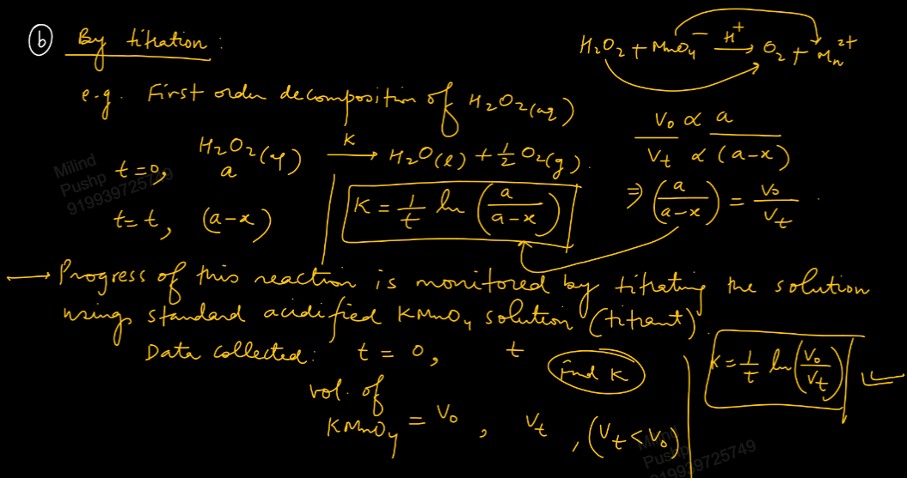
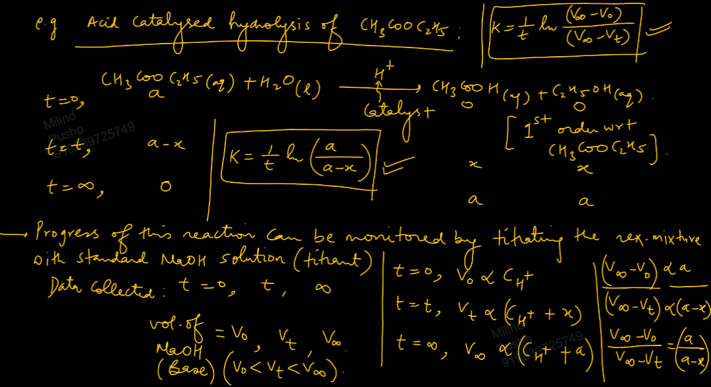
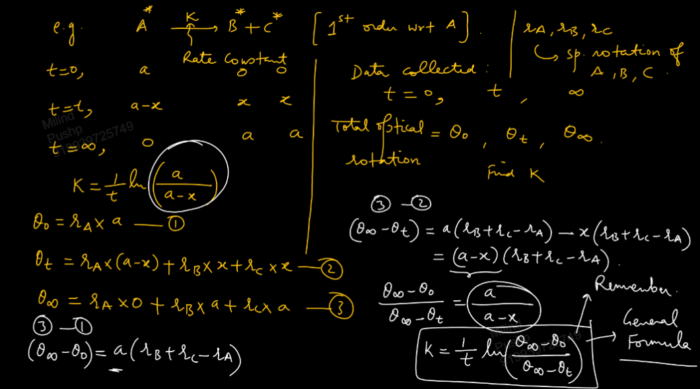
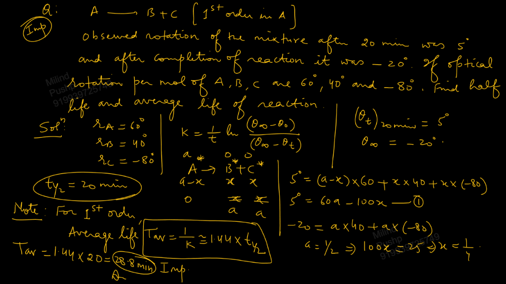

Links: 
___
# Exp. Det. of Order and k of First Order
### Exp. Det. of Order of Reaction 
Order of reaction cannot be determined by seeing the stoichiometric of reaction. 

If reaction is an elementary reaction, or single step reaction, then order of reaction is the sum of stoichiometric coefficients of reactants. 

However, we cannot find if a reaction is elementary or not just by see the reaction. 

#### Initial Rate Method 
We determine rates at various conc. of the reactants. From this we can find the order. 

#### Half Life Method 
We know that, for an nth order reaction,
$$t_{1/2} \propto \frac{ 1 }{ a^{n-1} }$$
where a is initial concentration of  reactant.

n represents the order of reaction and we cannot find partial order from this method. 

#### Hit and Trial Method 
This is also called **Integrated Rate Law Method.**

### Monitoring the Progress of 1st Order Reaction
i.e. Determination of  rate constant, k.

There are 3 methods,
1. Pressure Measurement 
2. Titration 
3. Optical rotation measurement 

#### By Pressure Measurement 
Applicable reaction involving at least one gas. 

For constant V and T,
$$p \propto c$$

Thus we can write,
$$
\begin{split}
k &= \frac{ 1 }{ t } \ln \frac{ [A]_{o} }{ [A]_{t} } \\
&= \frac{ 1 }{ t } \ln \frac{ a }{ a-x } \\
&= \frac{ 1 }{ t } \ln \frac{ p_{o(A)} }{ p_{t(A)} }
\end{split}
$$

A general formula is,
$$k = \frac{ 1 }{ t } \ln \frac{ p_{\infty} - p_{o} }{ p_{\infty} - p_{t} }$$

#### By Titration 
[[02 Equivalent Concept#Law of Chemical Equivalence]]

The rate constant will be found directly in term of volumes of titrant used at various instances of the reaction. 

$$k = \frac{ 1 }{ t } \ln \frac{ V_{o} }{ V_{t} }$$

#### By Measurement of Optical Rotation
[[06 Optical Isomerism#Checking Optical Activity]]

This is applicable only for reaction involving optically active compounds.

Optical rotation $\theta$, 
$$
\begin{split}
\theta &\propto \text{conc.} \\
&\propto \text{thickness of polarimeter tupe (t)}
\end{split}
$$
The thickness t is taken as 1 because it cancels out in the ratio inside log in case of first order kinetics. 

We can write,
$$\theta = r \times c$$
where, 
$r \to$ *specific rotation of compound.* It is constant for an optically active compound.
$c \to$ concentration of solution wrt that compound. 
$\theta \to$ observed rotation. 

The general formula for the rate constant comes out to be,
$$k = \frac{ 1 }{ t } \ln \frac{ \theta_{\infty} - \theta_{o} }{ \theta_{\infty} - \theta_{t} }$$
It is applicable for any first order with optically active compound.

