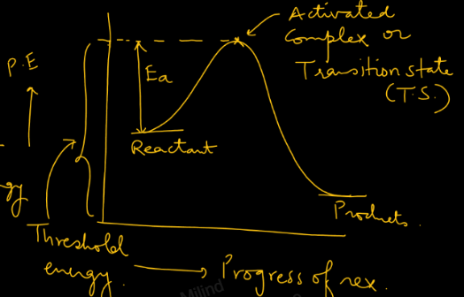
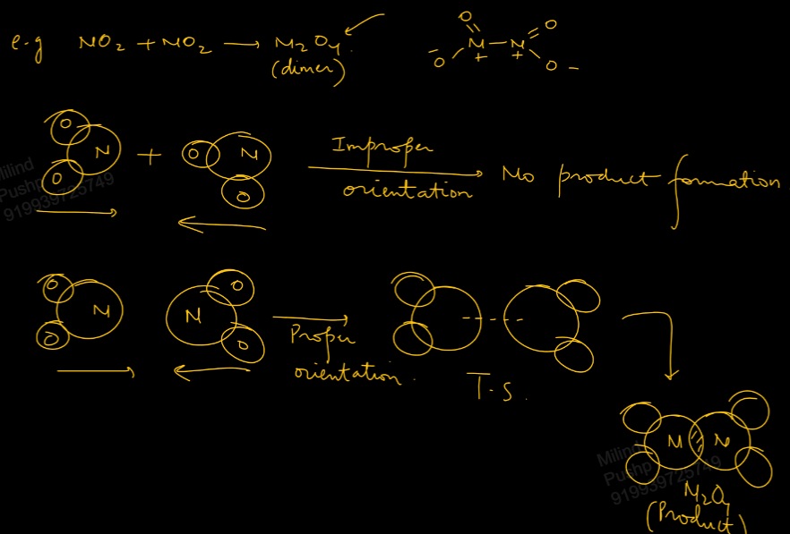
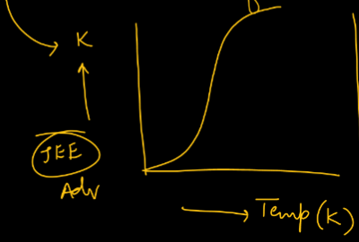
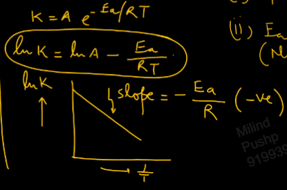
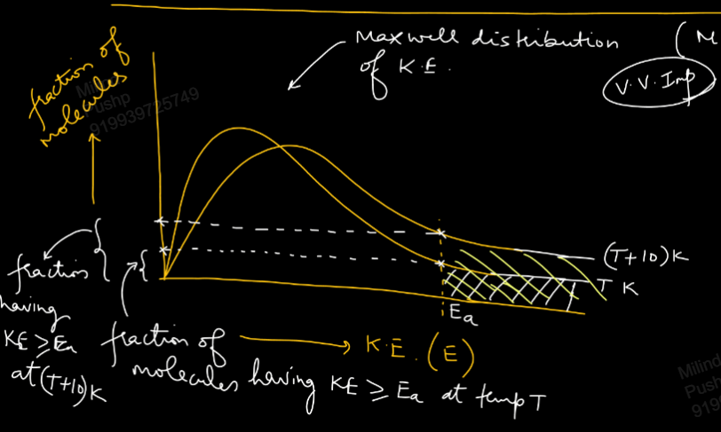
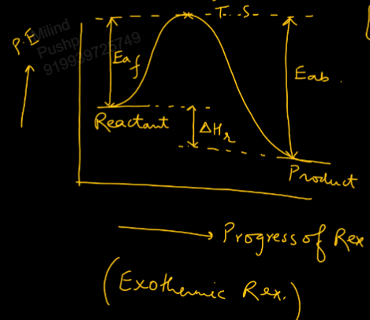

Links: 
___
# Effect of Temperature 
It is observed that rate of reaction becomes double to triple for every 10 K rise in temp. for most chemical reactions.

### Collision Theory
If a reaction has to proceed in the forward direction, the reactants must collide with each other. 

Every collision is not successful.  

For a collision to be successful to form products, reactants must possess a certain min. total energy called **Threshold Energy** and also have proper orientation. 

**Activation Energy** is the additional KE possessed by reactants relative to initial state of reactants to cross energy barrier (TS).

Rate of reaction is given as,
Rate of Reaction = collision frequency $\times$ energy barrier factor $\times$ orientation factor

*Orientation factor* is also known as *steric factor or probability factor.*

*Collision frequency* is no. of collisions per unit volume per unit time.

*Energy barrier factor* is $e^{ -E_{a}/RT }$ and it represents the fraction of reactant molecules that have KE more than or equal to activation energy $E_{a}$.

##### Arrhenius Equation
Finally, the rate of reaction comes out to be,
$$\ce{ Rate = (Ae^{ -E_{a}/RT }) (conc.)^{order} }$$

This is written as,
$$\ce{ Rate = k (conc.)^{order} }$$
where k is rate constant for reaction and,
$$\ce{ k = Ae^{ -E_{a}/RT } }$$
This equation is called **Arrhenius Equation.**
Here,
$E_{a} \to$ activation energy of reaction 
$A \to$ frequency factor or *Arrhenius constant.* 
$T \to$ temp. in kelvin. 

Both $\ce{ E_{a} and A }$ are taken to be independent of temp..

The max. value of k becomes A when,
1. $T \to \infty$
2. $E_{a} = 0$ i.e. no energy barrier. 

A is the product of collision frequency and orientation factor. 
$$A = Z_{11}\times p$$

We have,
$$
\begin{split}
k &= Ae^{ -E_{a}/RT } \\
\ln k &= \ln A - \frac{ E_{a} }{ RT }
\end{split}
$$
And thus the graph will look like,

##### Integral and Differential form of A. Equation 
Applying the log equation at two temp., we can find the integral form of the Arrhenius equation.

At temp. $T_{1}$,
$$\ln k_{1} = \ln A - \frac{ E_{a} }{ RT_{1} }$$
At temp. $T_{2}$,
$$\ln k_{2} = \ln A - \frac{ E_{a} }{ RT_{2} }$$

Subtracting them,
$$
\begin{split}
\ln \frac{ k_{1} }{ k_{2} } &= \frac{ E_{a} }{ R } \left( \frac{ 1 }{ T_{1} } - \frac{ 1 }{ T_{2} } \right) \\
\\
\log_{10} \frac{ k_{1} }{ k_{2} } &= \frac{ E_{a} }{ 2.303R } \left( \frac{ 1 }{ T_{1} } - \frac{ 1 }{ T_{2} } \right)
\end{split}
$$
This is called the integral form of Arrhenius equation.

Now, differentiating the log equation wrt T,
$$
\begin{split}
\ln k &= \ln A - \frac{ E_{a} }{ RT } \\
\frac{ d(\ln k) }{ dT } &= -\frac{ E_{a} }{ R } \left( -\frac{ 1 }{ T^{2} } \right) \\
\frac{ d(\ln k) }{ dT } &= \frac{ E_{a} }{ RT^{2} }
\end{split}
$$

The reaction which has greater $E_{a}$ will be more sensitive towards temp. variation. 

Rate constant of reaction increases more sharply for a reaction at lower temp. than at higher temp. for same temp. rise.

##### Why Rate Constant becomes 2x to 3x for every 10K rise in temp.
[[00 KTG & Thermodynamics#Maxwell Boltzmann Distribution]]

Note that the average KE does not change much, but the fraction of molecules having more energy than $E_{a}$ is increased.

### Reversible Reactions 
$$\ce{ A <=>[E_{af}, k_{f}][E_{ab}, k_{b}] B }$$

At eqilibrium,
$$\ce{ k_{eq} = \frac{ [B]_{eq} }{ [A]_{eq} } = \frac{ k_{f} }{ k_{b} } }$$

From the graph, we can see that,
$$\Delta H_{r} = E_{af} - E_{ab}$$

Now,
$$
\begin{split}
k_{eq} &= \frac{ A_{f}e^{ -E_{af}/RT } }{ A_{b}e^{ -E_{ab}/RT } } \\
&= \frac{ A_{f} }{ A_{b} } e^{ -(E_{af} - E_{ab})/RT } \\
&= \frac{ A_{f} }{ A_{b} } e^{ -\Delta H_{r}/RT } \\
\ln k_{eq} &= \ln \frac{ A_{f} }{ A_{b} } - \frac{ \Delta H_{r} }{ RT } \\
\frac{ d(\ln k_{eq}) }{ dT } &= \frac{ \Delta H_{r} }{ RT^{2} }
\end{split}
$$
This is the differential form of [[02 Characteristics of Equilibrium Constant#Van't Hoff Equation|Von't Hoff Equation.]]

And its integral form will be,
$$
\begin{split}
\ln \frac{ k_{eq 1} }{ k_{eq 2} } &= \frac{ \Delta H_{r} }{ R } \left( \frac{ 1 }{ T_{1}^{2} } - \frac{ 1 }{ T_{2}^{2} } \right) \\
\\
\log_{10} \frac{ k_{eq 1} }{ k_{eq 2} } &= \frac{ \Delta H_{r} }{ 2.303R } \left( \frac{ 1 }{ T_{1}^{2} } - \frac{ 1 }{ T_{2}^{2} } \right) 
\end{split}
$$

As temp. increases Rate constant increases always. Irrespective of whether reaction if endothermic or exothermic. 

But, as temp. increases equilibrium constant increases for endothermic and decreases for exothermic.