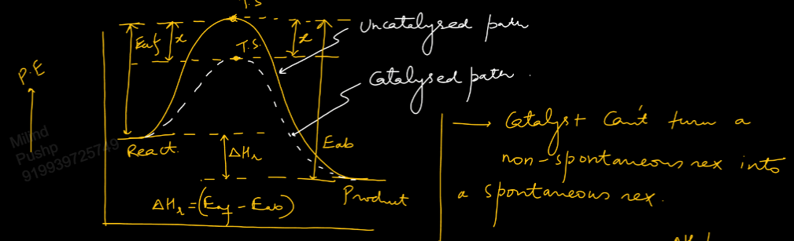

Links: [[05 Effect of Temperature]]
___
# Effect of Catalyst and Surface Area 
### Effect of Catalyst 
Catalyst is added into the reaction mixture in small amount which without being consumed alters the mechanism of reaction and takes the reaction through alternate path involving lower activation energy and hence reaction becomes faster. 

Catalyst does not effect,
- Equilibrium constant 
- Thermodynamic parameters

Catalyst decreases the value of $E_{a}$ both forward and backward reaction by the same amount and hence $k_{f}$ and $k_{b}$ are increased by same factor. 

Catalyst cannot turn a non spontaneous reaction into a spontaneous one.

For catalysed path,
$$
\begin{split}
k_{f}' &= A_{f}e^{ -(E_{af}-x)/RT } \\
k_{b}' &= A_{b}e^{ -(E_{ab}-x)/RT } \\
k_{eq}' &= \frac{ A_{f} }{ A_{b} } e^{ -(E_{ab} - E_{af})/RT } \\
k_{eq}' &= \frac{ A_{f} }{ A_{b} } e^{ -\Delta H_{r}/RT } \\
&= k_{eq}
\end{split}
$$

### Effect of Surface Area 
Only applies to reactions which occur through adsorption on solid surface.

As surface area increases, rate of reaction increases. 

A solid in powdered or porous form has high surface area and hence high rate of reaction.