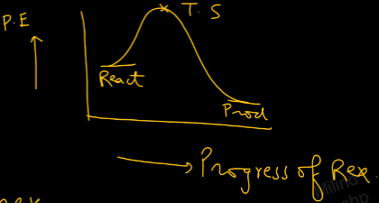
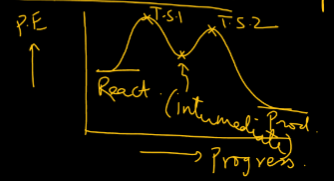
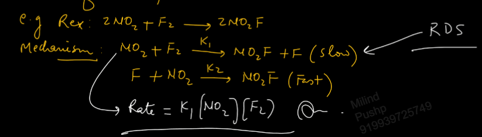
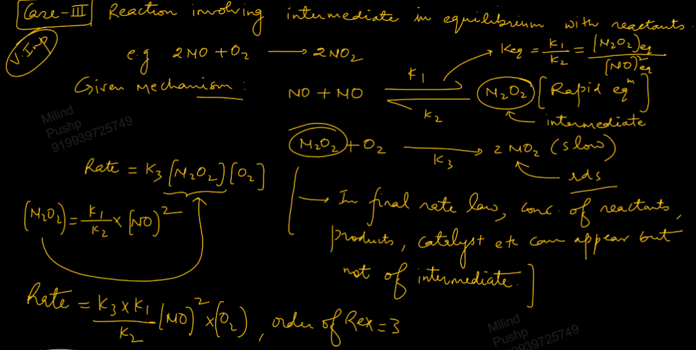
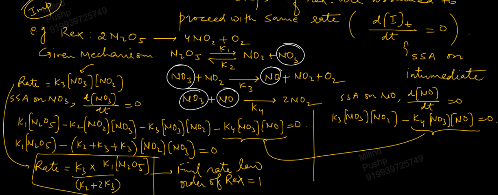
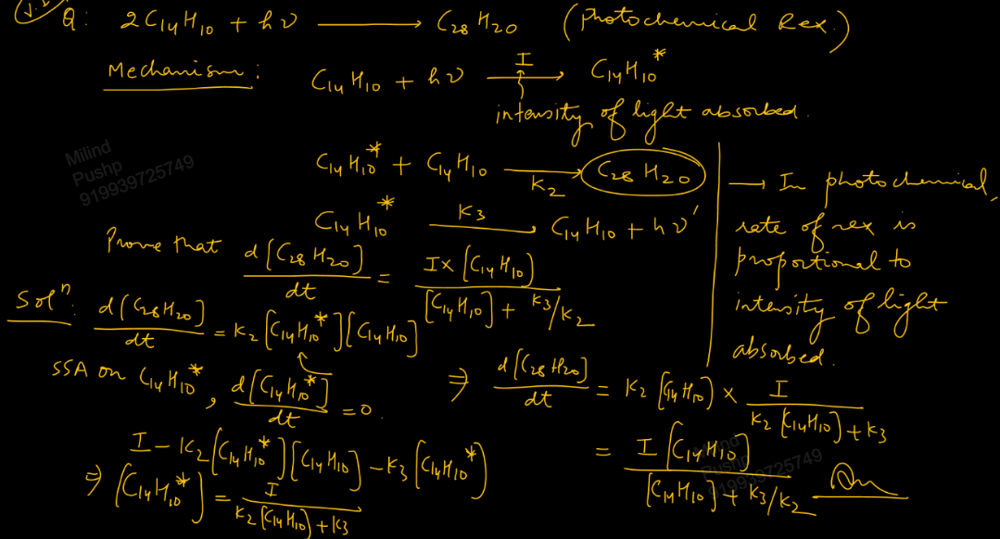

Links: [[02 Kinetics]]
___
# Mechanism and Order from Mechanism
### Mechanism of Reaction 
The various steps involved in conversion of reactants into products in a chemical reaction. 

##### Molecularity 
It is the no. of reactant molecules that form TS and finally convert into product. 
  
It is defined for a step of a complex reaction or defined for an elementary reaction.  

It is usually 1, 2 or rarely 3 but not found to be greater than 3 as probability of 4 or more molecules colliding is very low. 

It cannot be fractional, -ve or zero. 

Molecularity of 1 means *unimolecular* reaction, 2 means *bimolecular* reaction and 3 means *trimolecular* reaction. 

For an elementary reaction, molecularity is equal to order of reaction which is equal to sum of stoichiometric coefficients of reactants. 

This indicates that zero order reaction is a complex reaction.

#### Types of Reaction
There are two types of reaction based on mechanism,
##### Elementary
Which complete in one step. No intermediate is involved. 
   
The given reaction or step is **Rate Determining Step (RDS).** It is the slowest step in a reaction.

 

##### Complex 
Which completes in 2 or more steps. 
Slowest step is RDS.
Involves at least one intermediate. 

### Order from given Mechanism 
##### Elementary Reaction 
Given step (reaction) is RDS. 

$$\ce{ A + 2B -> P }$$
$$\ce{ Rate = k[A][B]^{2} }$$
And thus order is 1 + 2 = 3. 

##### More than one step and one of them is Slow
The slow step is RDS. 

We write rate law of the slow step taking it to be elementary. The order comes from this rate law. 

##### Intermediate in Equilibrium with Reactants 
Equilibrium is always fast. 
Equilibrium involves 2 reactions, forwards and backwards.

We write rate law from the slow step and if there are intermediates involved, we remove that as in final rate law conc. of intermediate cannot come. 

The order is obtained from the final rate law. 

##### Info. of Fast/Slow steps are not given 
We apply steady state approximation (SSA). 
All the steps of the reaction are assumed to proceed with the same rate. 

SSA on intermediate gives,
$$\frac{ d[I]_{t} }{ dt } = 0$$

In photochemical reaction, rate of reaction is proportional to intensity of light absorbed. 

