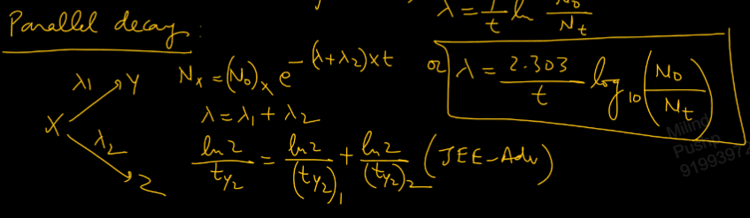
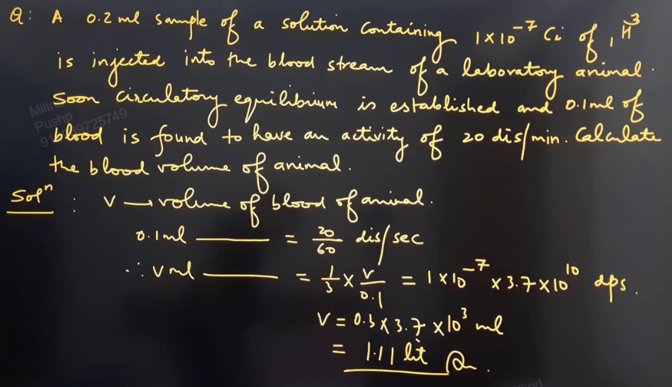
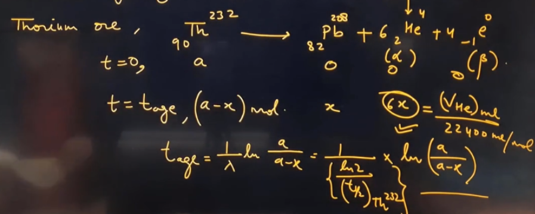

Links: [[00 Chemical Kinetics]]
___
# Nuclear Chemistry 
aka **Radioactivity**

Radioactivity is the spontaneous decay of nuclei of some isotopes of elements to emit $\alpha,\beta,\upgamma$ rays. 

Radioactive decay follows first order kinetics but Arrhenius equation is not applicable as rate of radioactive decay is independent of temp., free or combined form (e.g. U or $\ce{ UF_{6} }$)

In nuclear reaction the reacting element is changed. It does not involve e but rather nuclei. 

Rate of radioactive decay,
$$\ce{ Rate \propto N_{t} }$$
where $N_{t}$ is the no. of nuclei present at time t. 

$$
\begin{split}
-\frac{ dN_{t} }{ dt } &\propto N_{t} \\
-\frac{ dN_{t} }{ dt } &= \lambda N_{t} \\
\end{split}
$$

$\lambda$ is called **decay constant** and it has unit $s ^{-1}$,
$- dN_{t} /dt$ is called **rate of decay or radioactivity or activity.**

Since no. of nuclei is equal to the no. of atoms, we can write,
$$- \frac{ dN_{t} }{ dt } = \lambda N_{t} = \lambda \frac{ W }{ M }N_{A}$$
where,
$W \to$ mass of radioactive substance
$M \to$ molar mass
$N_{A} \to$ Avogadro no.

The SI unit of rate of decay or activity is **dps i.e. disintegration per second.**
But the most commonly used unit is **Curie.**
$$\ce{ 1 Ci = 3.7 \times 10^{10} dps }$$

**Specific Activity** is the activity per unit mass. 

No. of nuclei after time t,
$$
\begin{split}
- \frac{ dN }{ dt } &= \lambda N \\
\int \frac{ dN }{ N } &= \lambda \int dt \\
N_{t} &= N_{o} e^{ -\lambda t }  
\end{split}
$$

Decay constant,
$$\lambda = \frac{ 1 }{ t } \ln \frac{ N_{o} }{ N_{t} }$$

Half life,
$$t_{1/2} = \frac{ \ln 2 }{ \lambda } = \frac{ 0.693 }{ \lambda }$$
Average life,
$$t_{avg} = \frac{ 1 }{ \Lambda }$$

No. of nucleoids remaining after x half lives,
$$= \frac{ N_{o} }{ 2^{x} }$$

**Parallel Decay:** [[00 Chemical Kinetics#Parallel or Competing First Order Reaction|Parallel First Order Reaction]]

#### Radioactive Equilibrium 
Observed in sequential decay. 

$$\ce{ A ->[\lambda_{1}] B ->[\lambda_{2}] C ->[\lambda_{3}] D \dots  }$$

A is the parent element which is radioactive. 
B, C and D are intermediates.

At radioactive equilibrium, rate of formation of B is equal to rate of decay of B. This is SSA. 

$$\ce{ \lambda_{1}N_{A} = \lambda_{2}N_{B} }$$
This is the equation for radioactive equilibrium. 

#### Symbols of Some Important Nuclear Particles 

$$
\begin{split}
\ce{ 
{}_{2}He^{4} &: \alpha-particle \\
\\
{}_{-1}e^{0} &: \beta-particle \\
{}_{+1}e^{0} &: Positron \\
\\
{}_{1}H^{1} &: Proton \\
{}_{1}H^{2} &: Deutron \\
{}_{1}H^{3} &: Triton \\
\\
\upgamma\ or h\nu &: \upgamma-radiation
 }
\end{split}
$$

**$\alpha$ decay:**
$$\ce{ {}_{Z}X^{A} -> {}_{Z-2}Y^{A-4} + {}_{2}He^{4} }$$

**$\beta$ decay:**
$$\ce{ {}_{Z}X^{A} -> {}_{Z+1}P^{A} + {}_{-1}e^{0} }$$

#### Applications of Radioactivity 
##### Rock dating (or Helium dating)
To determine age of rocks/minerals/ores. 

The basis is $\alpha$ particle decay. 

He dating assumes that all $\alpha$ particles produced in the decay are trapped in the ore as He gas.

##### Carbon dating 
To determine age of fossils, wood, artefacts. 
Mainly used to determine age of dead trees/animals. 

The N in the upper atmosphere captures neutron and forms radioactive carbon, $\ce{ {}_{6}C^{14} }$. This C has half life of its decay of nearly 5770 years. 

This radioactive C is diffused into the lower atmosphere and then goes into the bodies of living organisms. 

A radioactive equilibrium is established in the body. 
Rate of absorption of $\ce{ C^{14} }$ = Rate of decay of $\ce{ C^{14} }$.

There is a constant conc. of $\ce{ C^{14} }$ in the body of alive body. 
After the death of the body, the absorption stops and the decay continues.

$$\ce{ {}_{6}C^{14} -> {}_{7}N^{14} + {}_{-1}e^{0} }$$

The age comes out to be,
$$t_{age} = \frac{ 1 }{ \lambda } \ln \frac{ [C^{14}]_{o} }{ [C^{14}]_{t} }$$
where $\ce{ [C^{14}]_{t} }$ is the conc. in dead animal and $\ce{ [C^{14}]_{o} }$ is the conc. in the alive animal which is approximated on the basis of currently living animals.