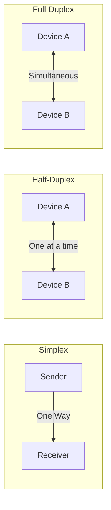

Links: [[01 Types of Networks]]
___
# Computer Networks

## Basic Concepts
A **Computer Network** is a set of devices (nodes) connected by communication links.

- **Node:** Any device capable of sending, receiving, or processing data (e.g., Computer, Printer, Router).
- **Communication Medium:** The path over which information travels (e.g., Copper wire, Fiber optics, Radio waves).

> [!NOTE] Why networks?
> A network allows distributed processing, meaning tasks are divided among multiple computers.

### Applications of Networks
- **Resource Sharing:** Sharing printers, storage devices.
- **Information Sharing:** File exchange, database access.
- **Communication:** Email, Video conferencing.
- **Remote Access:** Accessing systems from different locations.

> [!TIP] AE2 Analogy: The ME Network
> 
> - **Computer Network:** The entire ME System.
> - **Node:** Any machine connected to the cable (e.g., ME Drive, Terminal, Controller).
> - **Medium:** The ME Glass/Smart Cable connecting them.

## Network Performance
Parameters used to measure the "quality" of a network.

- **Transit Time:** The time required for a message to travel from one device to another.
- **Response Time:** The time elapsed between an inquiry and a response.
- **Reliability:** Measured by frequency of failure and the time it takes to recover from a link failure.
- **Security:** Protecting data from unauthorized access or damage.
- **Scalability:** Ability to accommodate more users/nodes without significant performance degradation.
- **Flexibility:** Ease of connecting (or removing) devices.

## Modes of Communication
Data transmission occurs in one of three modes:

> [!TIP] Analogy for Modes
> 
> - **Simplex:** One-way street.
> - **Half-Duplex:** One-lane bridge with traffic lights (cars take turns).
> - **Full-Duplex:** Two-lane highway (cars move both ways at once).

### Simplex
Unidirectional communication. Data flows in only **one direction**.

- **Example:** Mainframe to Monitor, Keyboard to CPU, Radio broadcasting.
- **Capacity:** The entire capacity of the channel is used for one direction.

### Half-Duplex
Bidirectional communication, but **not simultaneously**.

- **Example:** Walkie-Talkie. Both parties can speak, but one at a time.
- **Mechanism:** The entire capacity is used for each direction, but they must take turns.

### Full-Duplex
Bidirectional communication **simultaneously**.

- **Example:** Telephone network, Mobile phones.
- **Mechanism:** Signals can go in both directions at the same time (often by using two channels).

> [!TIP] AE2 Analogy: Buses vs Interfaces
> 
> - **Simplex:** **Export Bus**. It can *only* send items out of the network to a chest. It cannot pull them back.
> - **Full-Duplex:** **Pattern Provider**. It can push patterns out to a Molecular Assembler AND pull the finished result back simultaneously.