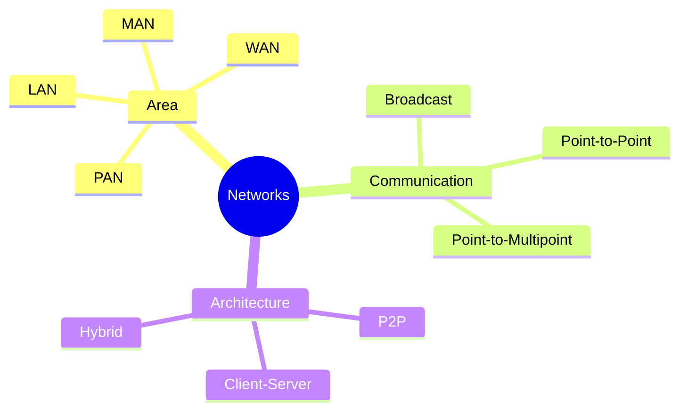
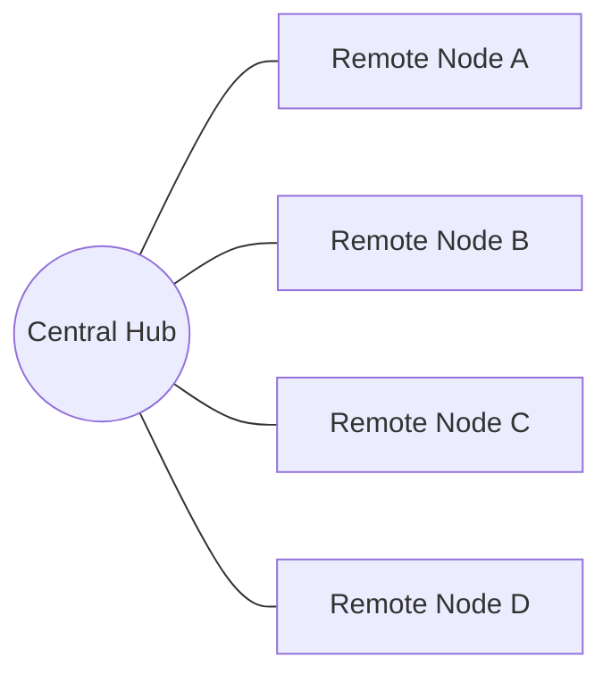
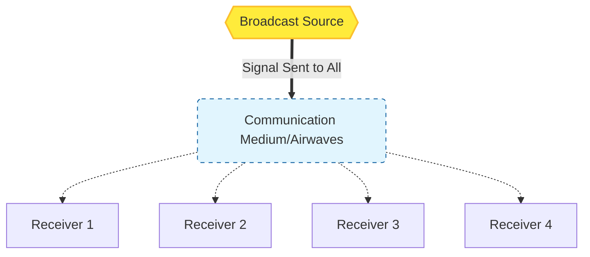

Links: [[02 Network Architectures]]
___
# Types of Networks

Networks can be classified based on geographical coverage, communication type, and architecture.

> [!TIP] Remember these terms for comparison:
> - Scalable 
> - Flexible 
> - Cost 
> - Scalable 
> - Latency
> - Efficiency

## Classification by Area
Based on the geographical area they cover:

> [!TIP] Comparison Summary
> | Type | Range | Ownership | Error Rate |
> | :--- | :--- | :--- | :--- |
> | **LAN** | Small (< 1km) | Private | Lowest |
> | **MAN** | Medium (< 50km) | Public/Private | Moderate |
> | **WAN** | Large (Worldwide) | Distributed | Highest |

> [!TIP] AE2 Analogy: Distance
> - **LAN:** Your **Main Base Wiring**. Cables running room-to-room. High speed (dense cables), instant access.
> - **WAN:** **Quantum Network Bridge**. Connecting your Overworld base to your Nether lava pump. It spans "Dimensions" (huge distances) but requires special infinite-range infrastructure.

##### Personal Area Network (PAN)
- **Scope:** Smallest network, covering an individual's workspace (approx. 10 meters).
- **Ownership:** Personal/Private.
- **Example:** Bluetooth connecting headphones to phone, USB connection.
- **Use Case:** Transferring files between personal devices.

##### Local Area Network (LAN)
- **Scope:** Covers a small geographical area such as a building, office, or home.
- **Ownership:** Private (owned by an organization or individual).
- **Speed:** High data transfer rates (100 Mbps to 10 Gbps).
- **Technology:** Ethernet (wired), Wi-Fi (wireless).
- **Example:** Home Wi-Fi network connecting phone, laptop, and TV.

##### Metropolitan Area Network (MAN)
- **Scope:** Covers a larger area like a city or heavy campus.
- **Ownership:** Can be private or public (ISP).
- **Mechanism:** Interconnects multiple LANs.
- **Example:** Cable TV network, City-wide Wi-Fi.

##### Wide Area Network (WAN)
- **Scope:** Spans a large physical distance (Country, Continent, Globe).
- **Ownership:** Distributed (no single owner).
- **Mechanism:** Interconnects LANs and MANs using public networks (telephone lines, satellites).
- **Example:** The Internet (collection of networks).

## Classification by Communication
Based on how data is transmitted between nodes.

### Point-to-Point
A direct, dedicated link between two devices.

- **Mechanism:** The entire capacity of the link is reserved for these two devices.
- **Pros:** High Security, Dedicated Bandwidth, Low Latency.
- **Cons:** Not Scalable (Need n-1 lines for 1 device to connect to n others).
- **Example:** Leased line between two bank branches, Microwave link between two towers.

### Point-to-Multipoint
A single link is shared by multiple devices.

- **Mechanism:** Bandwidth is shared either spatially (channels) or temporally (time slots).
- **Example:** College Wi-Fi, Mainframe connecting to terminals.
- **Pros:** Flexible, Scalable, Cost-effective.
- **Cons:** Security risks (shared medium), Lower efficiency (shared bandwidth).

### Broadcast
One sender transmits data to **all** connected receivers simultaneously.

- **Mechanism:** Uses a single communication channel shared by all.
- **Example:** TV, Radio, Ethernet (in some configs).
- **Pros:** Low Latency, Multiple user connectivity.
- **Cons:**
    - **No privacy:** Everyone receives the message.
    - **Bandwidth Wastage:** If a message is intended for only *one* person but sent via broadcast, the channel is occupied (blocking others) for data that is irrelevant to most.
    - **Processing Overhead:** Every node must process the packet to decide whether to keep or discard it.

> [!TIP] AE2 Analogy: Wireless Access Point
> The **Wireless Access Point** blasts the network signal to a defined radius. Any **Wireless Terminal** in range receives the signal. It doesn't target a specific player; it just covers the area.

