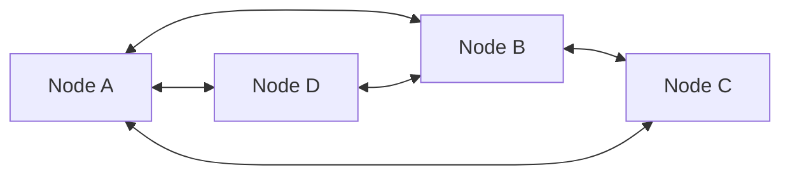
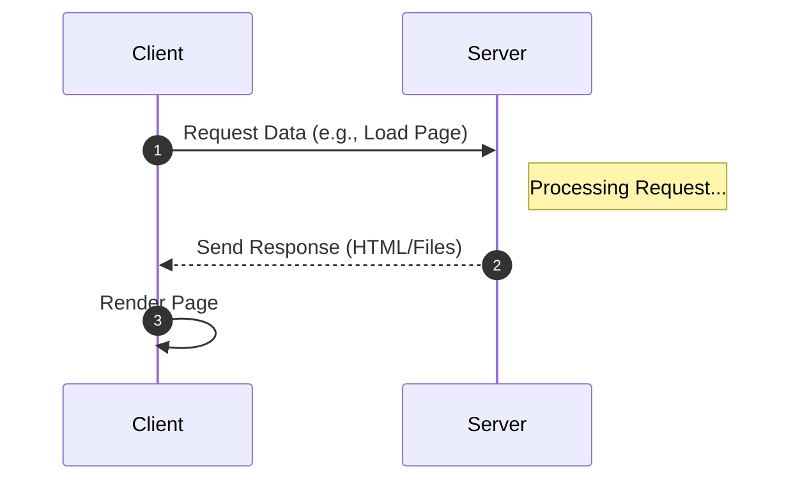
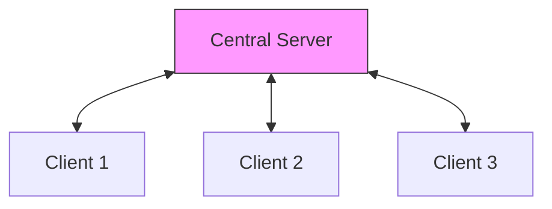
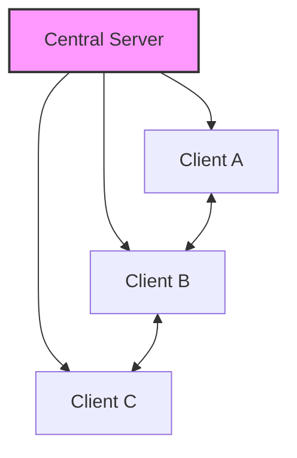

Links: [[01 Types of Networks]]
___
# Network Architectures

Based on logical design and functional roles.

> [!CAUTION] Common Pitfall
> Don't confuse **Architecture** (Logical design) with **Topology** (Physical layout). Client-Server is an architecture; Star or Bus is a topology.

## Peer-to-Peer (P2P)

A decentralized architecture where every node has equal status.

- **Roles:** Each node acts as both **Client** and **Server**.
- **Pros:** Easy to set up, No single point of failure, Low cost.
- **Cons:** Difficult to manage security and backups (decentralized).
- **Example:** Bitcoin (Blockchain nodes), Napster (File sharing).

> [!TIP] AE2 Analogy: P2P Tunnels
> **ME P2P Tunnels** create a direct 1-to-1 connection between two points using an existing network purely as a carrier. Just like a P2P network overlay, the two endpoints talk "directly" to each other, ignoring the rest of the cabling in between.

## Client-Server
A centralized architecture with distinct roles.

- **Roles:**
- **Server:** Provides resources (files, compute).
    - **Client:** Requests resources.
- **Pros:** Centralized control, Better security, Easier backups.
- **Cons:** Single point of failure (if Server goes down), Expensive hardware.
- **Example:** Web Browsing (Browser = Client, Website = Server), Email (Outlook = Client, GMail Server).

> [!TIP] AE2 Analogy: Controller & Terminals
> - **Server:** The **ME Controller + Drive Array**. It holds all the storage and manages power/channels. If the Controller breaks, everything goes offline (Single Point of Failure).
> - **Client:** The **Crafting Terminal**. It has no storage itself; it just "requests" items from the Drives (Server).

## Hybrid
Combines features of both P2P and Client-Server.

- **Goal:** To leverage the scalability of P2P and the control of Client-Server.
- **Mechanism:** Some nodes act as clients accessing a central server for authentication or indexing, while data transfer happens directly between peers.
- **Example:** BitTorrent (Tracker server + Peer download), Skype (Login server + P2P call).
- **Pros:** Scalable (P2P), Controlled (CS), Efficient.
- **Pros:** Scalable (P2P), Controlled (CS), Efficient.
- **Cons:** Complex implementation.

> [!TIP] AE2 Analogy: Sub-Networks
> You have your **Main Base Network** (Server) handling all storage. You also have a small, independent **Ore Processing Sub-Network** (Peer). It does its own work but connects to the Main Network via an **Interface + Storage Bus** to share the final ingots. It's independent (P2P-ish) but integrated (Client-Server).

