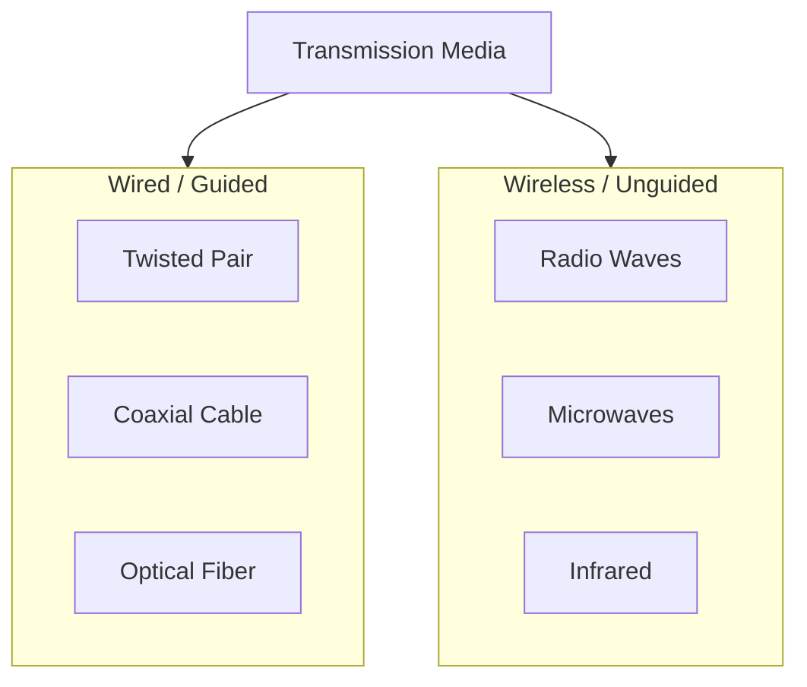
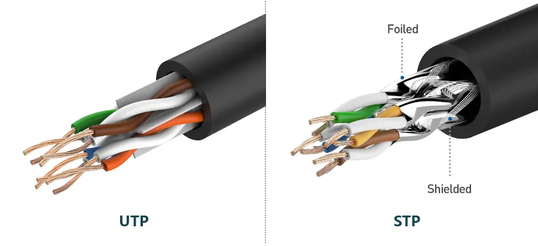
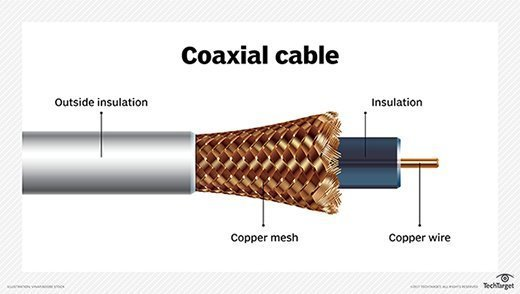
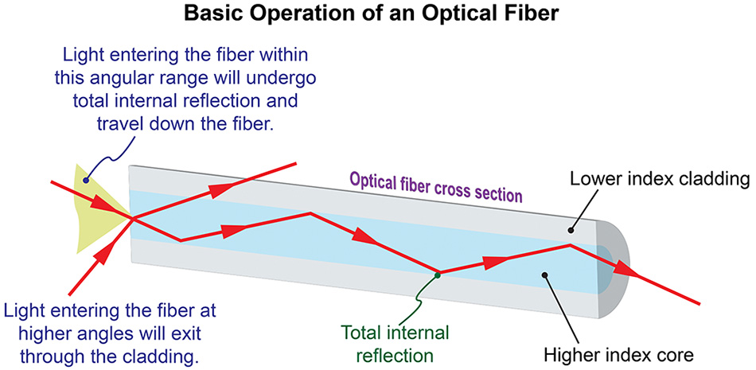
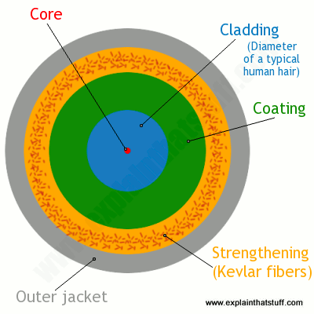
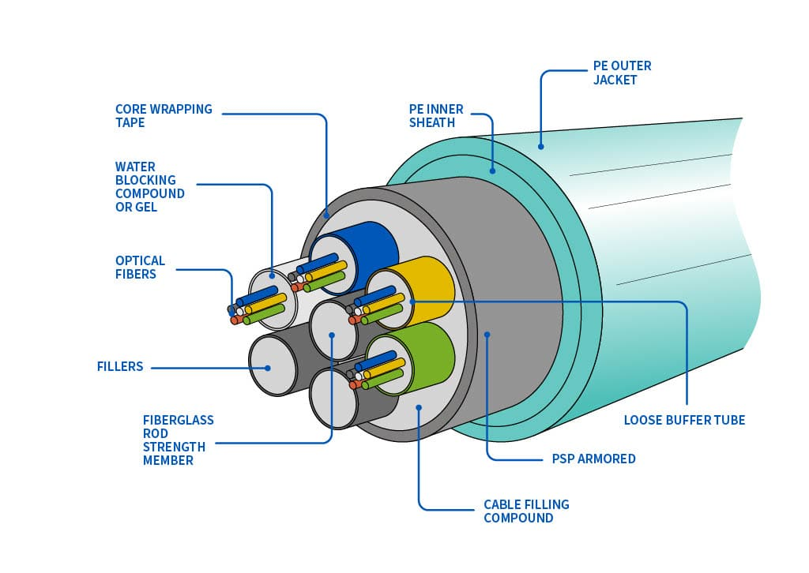
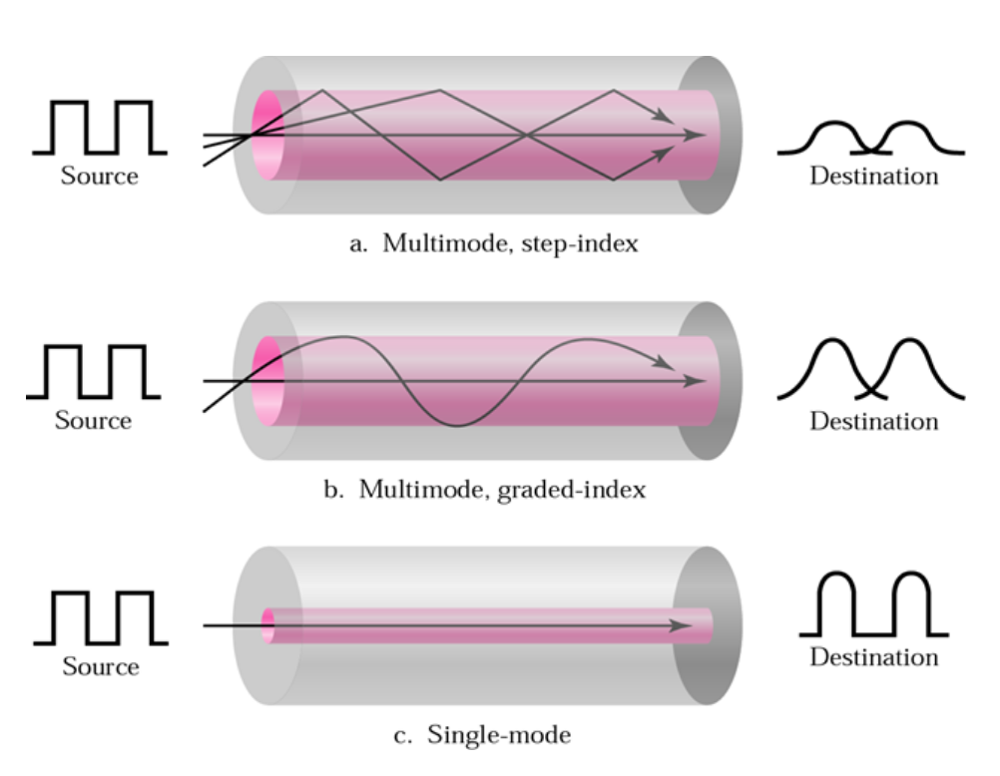

Links: 
___
# Transmission Media

**Transmission Media** is the physical path between the transmitter and the receiver. It is broadly classified into **Guided** (Wired) and **Unguided** (Wireless).

## Wired Media (Guided)
The signal travels along a physical medium.

### Twisted Pair Cable
Consists of two conductors (copper), one carries the signal and the other is a ground reference. They are twisted to reduce noise (electromagnetic interference).

- **Shielded (STP):** Has metal foil protection. Prevents penetration of noise or cross-talk.
- **Unshielded (UTP):** Common, cheaper, used in LANs (Ethernet).

**Common Categories:**

| Category | Bandwidth | Application |
| :--- | :--- | :--- |
| **Cat 5e** | 100 MHz | Gigabit Ethernet (1 Gbps) |
| **Cat 6** | 250 MHz | Gigabit Ethernet (up to 10 Gbps < 55m) |
| **Cat 6a** | 500 MHz | 10 Gigabit Ethernet (10 Gbps) |
| **Cat 7** | 600 MHz | 10 Gbps (Shielded) |

#### RJ45 Cabling Standards
To create an Ethernet cable using a crimping tool and RJ45 connector, specific color codes are followed.

| Pin | T568A (Green) | T568B (Orange) |
| :-- | :--- | :--- |
| 1 | **White Green** | **White Orange** |
| 2 | **Green** | **Orange** |
| 3 | **White Orange** | **White Green** |
| 4 | Blue | Blue |
| 5 | White Blue | White Blue |
| 6 | **Orange** | **Green** |
| 7 | White Brown | White Brown |
| 8 | Brown | Brown |

**Cable Types:**
- **Straight-Through:** Used for connecting **dissimilar** devices (e.g., PC to Switch). Both ends use the same standard (T568B to T568B).
- **Crossover:** Used for connecting **same** devices (e.g., PC to PC, Switch to Switch). One end is T568A, the other is T568B.

### Coaxial Cable
Carries higher frequency ranges than twisted pair.

**Structure:** Central core conductor (solid wire), enclosed in an insulating shield, surrounded by an outer conductor of metal foil.

**Connectors:**
- **BNC:** Bayonet Neill Concelman (Standard).
- **BNC-T:** T-shaped connector.
- **BNC Terminator:** Placed at ends of the cable to prevent signal reflection.

**Commercial Types:**
- **RG-59:** TV Cable.
- **RG-58:** Thin Ethernet (10Base2).
- **RG-8 / RG-11:** Thick Ethernet (10Base5).

#### Baseband vs Broadband
Transmission categories for Coaxial cables.

| Feature | Baseband | Broadband |
| :--- | :--- | :--- |
| **Signal** | Digital (bi-directional) | Analog (uni-directional) |
| **Channels** | Send 1 signal at a time | Send multiple signals (FDM) |
| **Example** | Ethernet LAN | Cable TV |

**Ethernet Standards:**
- **10BaseT:** 10 Mbps, Baseband, Twisted Pair, 100m.
- **10Base2:** 10 Mbps, Baseband, Coax (Thin), 185m.
- **10Base5:** 10 Mbps, Baseband, Coax (Thick), 500m.

> [!NOTE] Thick vs Thin Ethernet
> **Thick Ethernet (10Base5)** can travel longer distances (500m) due to its heavy shielding but is rigid and hard to install. 
> 
> **Thin Ethernet (10Base2)** is flexible and cheaper but limited to ~185m.

### Optical Fiber
Uses light pulses to transmit data through glass or plastic strands. Based on the principle of **Total Internal Reflection**.

**Structure:**
- **Core:** Thin glass center where light travels.
- **Cladding:** Outer optical material surrounding the core that reflects light back into it.
- **Buffer Coating:** Plastic coating that protects the fiber from moisture/damage.

> [!TIP] Fiber vs Copper
> | Feature | Fiber Optics | Copper Cable |
> | :--- | :--- | :--- |
> | **Speed** | Very High (Gbps/Tbps) | Moderate |
> | **Distance** | Long (Km) | Short (100m - 500m) |
> | **Interference** | Immune to EMI | Susceptible to EMI |
> | **Cost** | Expensive | Cheap |
> |**Noise**| Low | High |

**Modes of Propagation:**
Based on the number of light beams (modes) and the refractive index of the core.

A *mode* is essentially a *path* the light can take inside the optical fiber. 

#### Single-Mode Fiber (SMF)
- **Core Size:** Very small diameter (~9 microns).
- **Mechanism:** Allows only **one** mode of light to propagate straight through the center.
- **Propagation:** Minimal dispersion (signal spreading), meaning less data loss.
- **Use Case:** Long-distance communication (ISPs, Undersea cables).

#### Multi-Mode Fiber (MMF)
- **Core Size:** Larger diameter (~50-62.5 microns).
- **Mechanism:** Allows **multiple** beams of light to travel simultaneously at different angles.
- **Types:**
    - **Step-Index:** The core has a uniform density. Light bounces in sharp zig-zags (Total Internal Reflection). *High distortion.*
    - **Graded-Index:** The core density decreases from the center to transmission. Light travels in **curves** (Helical). *Lower distortion.*

> [!HELP] Why Graded Index?
> In Step-Index, rays taking longer paths arrive later, causing signal overlap (Modal Dispersion). **Graded-Index** fixes this: light travels faster in the lower-density outer edges, so all rays arrive at roughly the same time.

#### Standards in Optical Fibers (Gigabit Ethernet)

| Standard        | Bandwidth | Cable Type  | Wavelength     | Max Distance            |
|:--------------- |:--------- |:----------- |:-------------- |:----------------------- |
| **1000Base-FX** | 1 Gbps    | Single-Mode | ~1310 nm       | -                       |
| **1000Base-SX** | 1 Gbps    | Multi-Mode  | 850 nm (Short) | 220m - 550m             |
| **1000Base-LX** | 1 Gbps    | SMF / MMF   | 1310 nm (Long) | 10km (SMF) / 550m (MMF) |
| **1000Base-EX** | 1 Gbps    | Single-Mode | ~1310 nm       | ~40 km                  |
| **1000Base-ZX** | 1 Gbps    | Single-Mode | 1550 nm (Long) | ~70 km                  |
| **10GBASE-SR**  | 10 Gbps   | Multi-Mode  | 850 nm         | ~300m                   |
| **10GBASE-LR**  | 10 Gbps   | Single-Mode | 1310 nm        | 10 km                   |

#### Connectors 
- **SC (Subscriber Connector):** Square-shaped, push-pull mechanism. Used in Cable TV/Datacoms.
- **ST (Straight Tip):** Round, bayonet mount (twist-lock). Older style, similar to BNC.

## Wireless Media (Unguided)
Transmits electromagnetic waves without a physical conductor. Signals travel through the air or vacuum.

#### Propagation Modes of Wireless 
- **Ground:** Waves travel through lowest portion of atmosphere
- **Sky:** Higher frequency waves travel upward into the ionosphere. Then reflect back to earth. 
- **Line of Sight (LoS):** Higher frequency waves transmitted in straight lines directly from antenna to antenna. 

### Types of Wireless Transmission 

#### Radio Waves
- **Frequency:** 3 KHz - 1 GHz.
- **Propagation:** **Omni-directional** (Travels in all directions).
- **Properties:**
    - Can penetrate walls and obstacles (due to high wavelength).
    - Suitable for multicasting (one sender, many receivers).
    - Susceptible to interference from other motors/equipment.
- **Applications:** FM/AM Radio, Television.

#### Microwaves
- **Frequency:** 1 GHz - 300 GHz.
- **Propagation:** **Uni-directional** (Line-of-Sight).
- **Properties:**
    - Cannot penetrate solid objects (walls/mountains).
    - Requires precise alignment of transmitting and receiving antennas.
    - Affected by environmental factors (Rain attenuation).
- **Applications:** Cellular Phones, Satellite Networks, Wireless LAN (Wi-Fi).

#### Infrared
- **Frequency:** 300 GHz - 400 THz.
- **Propagation:** Line-of-sight.
- **Properties:**
    - Very short range.
    - Cannot pass through walls (secure from eavesdropping in other rooms).
    - Affected by strong light sources (Sunlight).
- **Applications:** TV Remotes, IrDA (Data transfer), Intrusion detectors, Fire Sensors, Modem.
