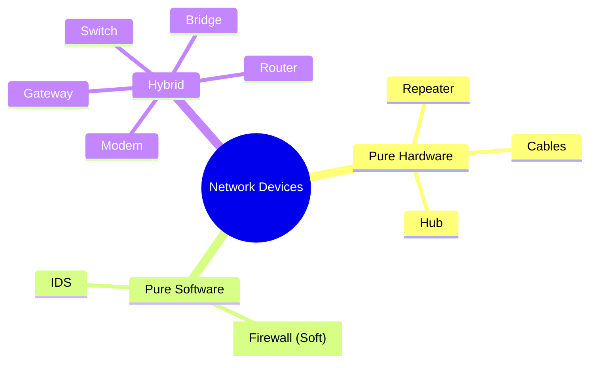

Links: 
___
# Network Devices

Network devices (intermediary nodes) connect end devices to ensure data communication.

## Physical Layer Devices (Layer 1)

### Repeater
An electronic device that receives a signal and regenerates it to extend its range.
- **Function:** Boosts signal strength to travel longer distances.
- **Intelligence:** dumb (No filtering capability).

### Hub
A "Multi-port Repeater".
- **Function:** Connects multiple wires coming from different branches.
- **Mechanism:** When a packet arrives at one port, it is copied to **all** other ports (Broadcasting).
- **Drawback:** High traffic and security risk.

## Data Link Layer Devices (Layer 2)

### Bridge
Connects two network segments (LANs).
- **Function:** Filters traffic based on MAC address. Unlike a Hub, it does not broadcast if it knows where the destination is.

### Switch
A "Multi-port Bridge".
- **Function:** Connects devices in a LAN.
- **Mechanism:** Stores the MAC address of connected devices in a table. Sends data **only** to the specific destination port.
- **Advantage:** Dedicated bandwidth per port, better security than Hub.

## Network Layer Devices (Layer 3)

### Router
Connects **different** networks (e.g., your LAN to the Internet).
- **Function:** Routes data packets based on IP address.
- **Intelligence:** Uses routing tables/algorithms to find the best path.

## Other Devices

### Gateway
A "Protocol Converter".
- **Function:** Connects two networks using different protocols (e.g., connecting a TCP/IP network to a legacy SNA network).
- **Layer:** Can operate at any layer (commonly Transport/Application).

### Modem (Modulator-Demodulator)
- **Function:** Converts digital signals (Computer) to analog signals (Phone/Cable line) and vice-versa.

## Software Security Devices

### Firewall
A security system that monitors and controls incoming/outgoing traffic based on security rules.
- **Types:** Can be Hardware (Router) or Software (running on a server).
- **Action:** Blocks unauthorized access.

### IDS (Intrusion Detection System)
- **Function:** Monitors network traffic for suspicious activity or policy violations.
- **Action:** Alerts the admin (Passive) or takes action (Active/IPS).
