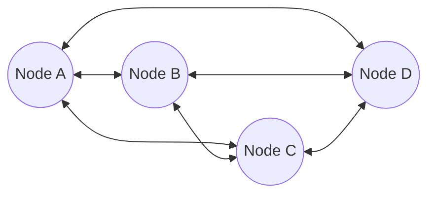
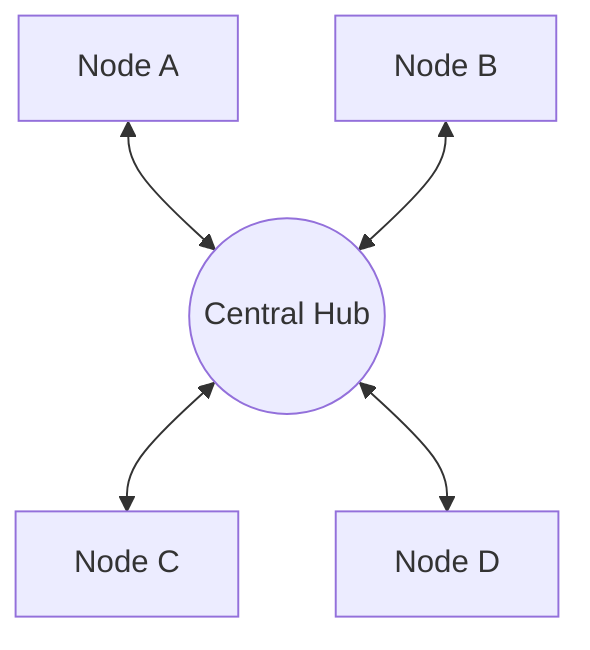
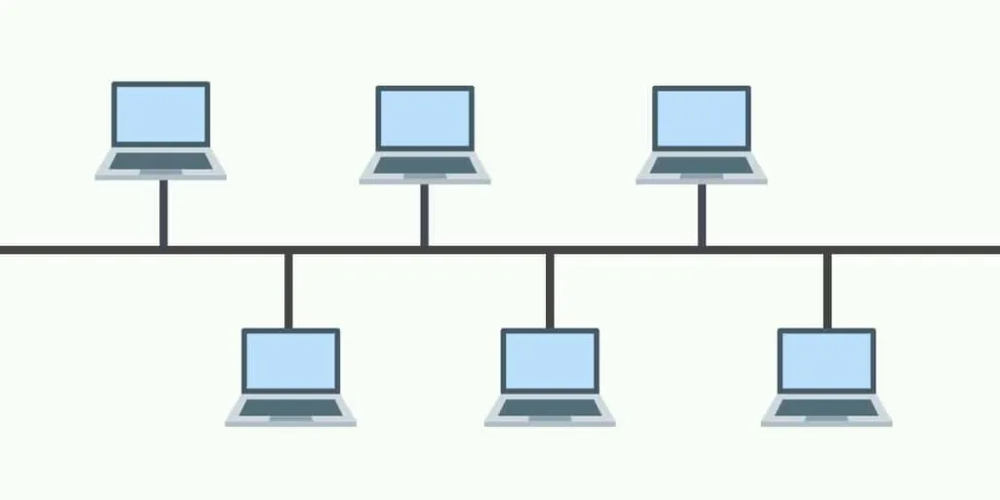
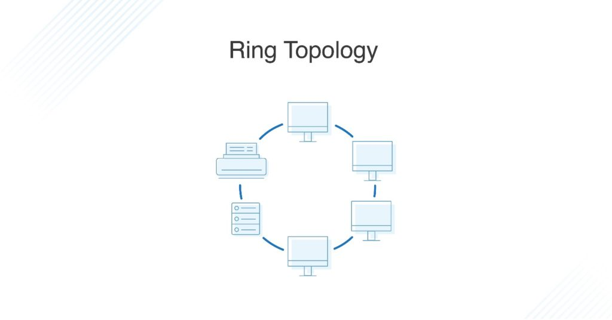
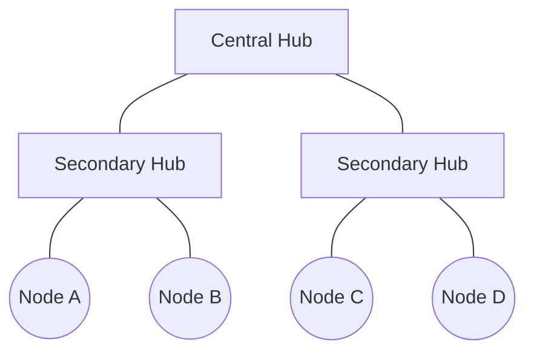
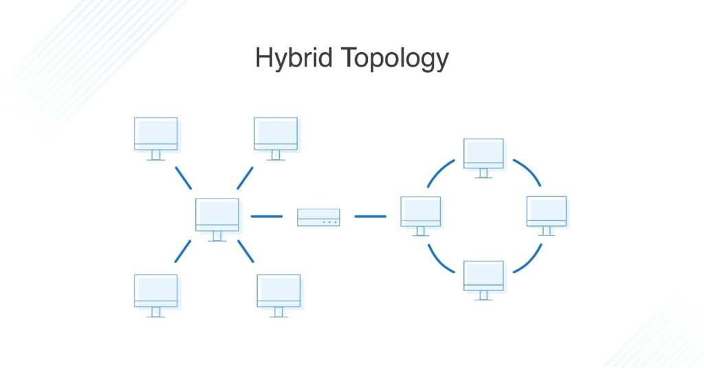

Links: [[04 Network Devices]]
___
# Network Topologies

**Network Topology** refers to the physical or logical layout of a network. It defines how different nodes are placed and interconnected.

## Mesh Topology
Every device has a dedicated point-to-point link to every other device.

- **Formula for cables:** $n(n-1)/2$
- **Formula for ports per device:** $n-1$

| Feature             | Description                                   |
|:------------------- |:--------------------------------------------- |
| **Robustness**      | If one link fails, it does not affect others. |
| **Security**        | Dedicated links ensure privacy.               |
| **Fault Isolation** | Easy to identify faults.                      |
| **Cost**            | Very expensive due to cabling and I/O ports.  |

## Star Topology
All devices connect to a central controller called a **Hub** or **Switch**.

| Feature         | Description                                                |
|:--------------- |:---------------------------------------------------------- |
| **Centralized** | Easy to install and manage.                                |
| **Robustness**  | If one link fails, only that device is affected.           |
| **Dependency**  | If the Hub fails, the whole network goes down.             |
| **Cost**        | Less expensive than Mesh but requires more cable than Bus. |

## Bus Topology
A multipoint configuration where one long cable (backbone) acts as a shared communication path.

| Feature               | Description                                                       |
|:--------------------- |:----------------------------------------------------------------- |
| **Ease of Install**   | Uses less cable, easy to lay out.                                 |
| **Redundancy**        | None. If the backbone breaks, the entire network splits or stops. |
| **Maintenance**       | Difficult to isolate faults.                                      |
| **Signal Reflection** | Requires terminators at both ends to absorb signals.              |

## Ring Topology
Each device has a dedicated point-to-point connection with only the two devices on either side of it.

| Feature          | Description                                                         |
|:---------------- |:------------------------------------------------------------------- |
| **Mechanism**    | Unidirectional token passing.                                       |
| **Installation** | Easy to install and reconfigure.                                    |
| **Failure**      | A break in the ring disables the entire network (in a simple ring). |

## Tree Topology
A variation of Star topology. Nodes are connected to a central hub that controls the traffic to the network. It has a parent-child hierarchy.

- **Usage:** Used in Wide Area Networks (WANs).
- **Expansion:** Easy to extend.
- **Dependency:** Root node failure cripples the sub-trees.

## Hybrid Topology
A combination of two or more different topologies.

- **Example:** A Star-Bus topology (Several Star networks linked by a Bus backbone).
- **Pros:** Scalable, flexible.
- **Cons:** Complex design, expensive.

