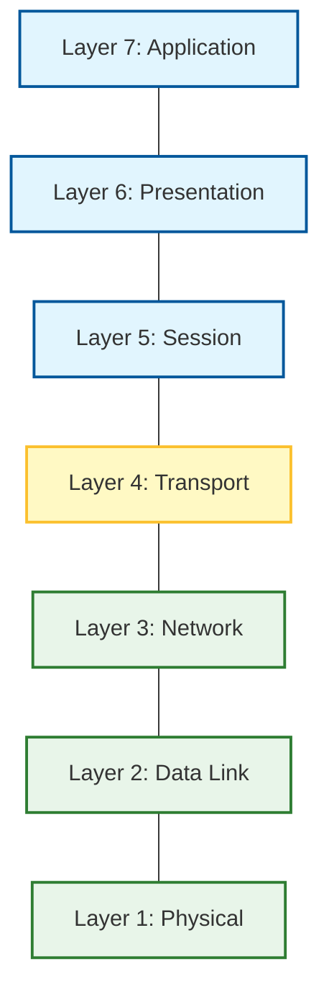

Links: [[00 Computer Networks]]
___
# OSI Model

**Open Systems Interconnection (OSI)** is a conceptual model created by the **ISO** (International Organization for Standardization) in 1984. It defines a common way to connect computers via a standard architecture.

> [!HELP] Theory vs Practice
> The OSI model is a **Reference Model** (Theoretical). It helps understand how networks work, but the actual protocol suite used in the real world is **TCP/IP**.

## Why is OSI Theoretical?
While OSI is the perfect *Reference Model* for teaching, it lost the implementation war to TCP/IP.

1.  **Timing:** TCP/IP protocols were already working and widely adopted (via ARPANET) before the OSI model was even finalized.
2.  **Complexity:** The OSI model is considered overly complex. Layers like **Session** and **Presentation** are often not strictly necessary for every application.
3.  **Implementation:** In TCP/IP, these "missing" layers are just handled by the **Application Layer** itself if needed, making the stack lighter and more efficient.

## Overview of 7 Layers

The model is divided into two groups:

1.  **User Support Layers:** (Application, Presentation, Session). Deal with software and user interaction.
2.  **Network Support Layers:** (Physical, Data Link, Network). Deal with data transmission.

**Transport Layer** links the two groups.

| Layer | Name             | Data Unit | Key Function                               |
|:----- |:---------------- |:--------- |:------------------------------------------ |
| **7** | **Application**  | Data      | User Interface & Network Services.         |
| **6** | **Presentation** | Data      | Encryption, Compression, Translation.      |
| **5** | **Session**      | Data      | Dialog Control, Synchronization.           |
| **4** | **Transport**    | Segment   | End-to-End Delivery, Reliability.          |
| **3** | **Network**      | Packet    | Rational Routing, Logical Addressing (IP). |
| **2** | **Data Link**    | Frame     | Physical Addressing (MAC), Framing.        |
| **1** | **Physical**     | Bit       | Transmission over physical medium.         |

## Layer 7: Application Layer
**"User Interaction"**

It is the only layer that directly interacts with the user. It enables the user (human or software) to access the network.

- **Protocols:** HTTP, FTP, SMTP, DNS, Telnet.

### Functions

- **File Transfer, Access, and Management (FTAM):** Allows specific access to files on remote computers.
- **Mail Services:** Provides email forwarding and storage.
- **Directory Services:** Distributed database sources and access for global information.

## Layer 6: Presentation Layer
**"Translation & Syntax"**

Concerned with the **syntax** and **semantics** of the information exchanged between two systems.

- **Protocols:** SSL/TLS, JPEG, MPEG, ASCII.

### Functions

- **Translation:** Interoperability between different encoding methods (e.g., ASCII to EBCDIC).
- **Encryption/Decryption:** Ensures privacy by transforming original information into unreadable format.
- **Compression:** Reduces the number of bits to be transmitted (Important for multimedia).

## Layer 5: Session Layer
**"Dialog Control"**

It establishes, manages, and terminates connections (sessions) between applications.

- **Protocols:** RPC, SQL, NFS.

### Functions
- **Dialog Control:** Allows two systems to enter into a dialog (half-duplex or full-duplex).
- **Synchronization:** Adds checkpoints (synchronization points) to a stream of data. If a crash happens, re-transmission starts from the last checkpoint.
- **Token Management:** Prevents two parties from attempting the same critical operation at the same time.

## Layer 4: Transport Layer
**"Process-to-Process Delivery"**

Responsible for the delivery of the entire message from the **source process** to the **destination process**. It ensures the message arrives **in order** and **error-free**.

- **Protocols:** TCP, UDP, SCTP.

### Functions 
- **Service Point Addressing:** Header includes a port number to ensure delivery to the specific process.
- **Segmentation and Reassembly:** Message is divided into transmittable segments, each containing a sequence number.
- **Connection Control:** 
	- **Connection-oriented:** Handshake established (TCP).
	- **Connection-less:** No handshake (UDP).
- **Flow Control:** End-to-end flow control rather than across a single link.
- **Error Control:** Process-to-process error checking using checksums.

## Layer 3: Network Layer
**"Source-to-Destination Delivery"**

Responsible for the delivery of individual packets from the **original source** to the **final destination** across multiple networks.

- **Unit of Data:** **Packet**.
- **Devices:** Routers, Layer 3 Switches.
- **Protocols:** IP, ICMP, IGMP, OSPF, ARP (sometimes considered L2/L3).

### Functions 
- **Logical Addressing:** Adds the Logical Address (IP Address) of the sender and receiver.
- **Routing:** Determining the optimal path for the packet to reach the destination.
- **Fragmentation:** Splitting packets if they are too large for the network (MTU).

## Layer 2: Data Link Layer (DLL)
**"Node-to-Node Delivery"**

Responsible for moving frames from one node (hop) to the next node.

- **Unit of Data:** **Frame**.
- **Devices:** Switches, Bridges, NIC (Network Interface Card).

### Functions 
- **Framing:** Divides the stream of bits into manageable data units called frames.
- **Physical Addressing:** Adds the Physical Address (MAC Address) of the sender and *local* receiver.
- **Flow Control:** Mechanism to avoid overwhelming the receiver (Stop-and-Wait, Sliding Window).
- **Error Control:** Detects and retransmits damaged frames (CRC).
- **Access Control:** Determines which device has control over the link (CSMA/CD).

## Layer 1: Physical Layer
**"Bit Transmission"**

Responsible for transmitting individual **bits** from one node to the next over a physical medium.

- **Unit of Data:** **Bit**.
- **Devices:** Hubs, Repeaters, Cables, Modems.

### Functions 
- **Physical Characteristics:** Defines interfaces and transmission medium.
- **Representation of Bits:** Encoding (signals to bits).
- **Data Rate:** Number of bits sent per second.
- **Synchronization:** Sender and receiver clocks must be synchronized.
- **Line Configuration:** Point-to-point or Multipoint.
- **Physical Topology:** Mesh, Star, Ring, Bus.
- **Transmission Mode:** Simplex, Half-duplex, Full-duplex.
