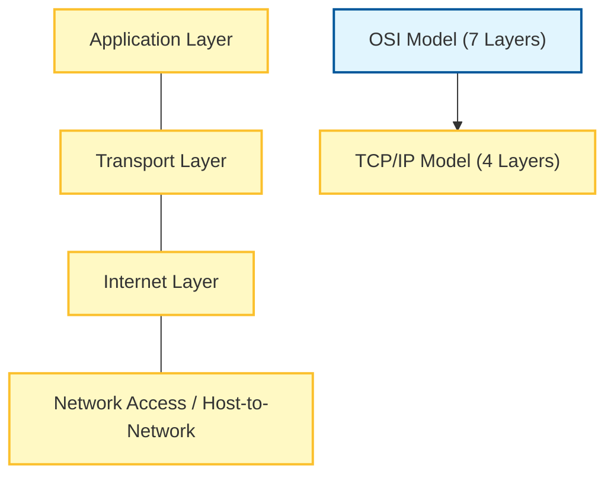

Links: [[06 OSI Model]]
___
# TCP/IP Model

**TCP/IP (Transmission Control Protocol / Internet Protocol)** is a suite of communication protocols used to interconnect network devices on the internet.

- **History:** Developed by the **DoD** (Department of Defense) in 1974 to connect remote machines (ARPANET).
- **Practicality:** Unlike the theoretical OSI model, TCP/IP is the actual model implemented in real-world networking.

## What is a Protocol?
A set of rules responsible for establishing data communication. It defines **what**, **how**, and **when** data is communicated.

**Key Elements:**
1.  **Syntax:** Structure and format of data.
2.  **Semantics:** Meaning of each section of bits.
3.  **Timing:** When data should be sent and how fast.

## 4 Layers of TCP/IP
It condenses the 7 OSI layers into 4 broad layers.

> [!NOTE] Layer Mapping
> - **Application (TCP/IP)** = Application + Presentation + Session (OSI).
> - **Transport (TCP/IP)** = Transport (OSI).
> - **Internet (TCP/IP)** = Network (OSI).
> - **Network Access (TCP/IP)** = Data Link + Physical (OSI).

### Layer 4: Application Layer
Handles high-level protocols, representation, and session management.

**Key Protocols:**
- **HTTP (HyperText Transfer Protocol):** Transfers webpages from server to client.
- **FTP (File Transfer Protocol):** Transfers files from sender to receiver.
- **SMTP (Simple Mail Transfer Protocol):** Transfers email from sender to server.
    - **POP (Post Office Protocol):** Transfers mail from server to user.
- **Telnet:** Allows remote access to devices.
- **DNS (Domain Name System):** Resolves domain names to IP addresses.
- **SNMP (Simple Network Management Protocol):** Used for monitoring, managing, and configuring IP network devices (e.g., Routers).

### Layer 3: Transport Layer
Responsible for end-to-end communication and reliability.

**Key Protocols:**
- **TCP (Transmission Control Protocol):** Connection-oriented. Manages the reliable transmission of data.
- **UDP (User Datagram Protocol):** Connection-less. Transfers datagrams (packets) without guaranteeing delivery. Faster but unreliable.
- **SCTP (Stream Control Transmission Protocol):** Combines features of TCP and UDP. Transfers multiple streams of data between two points.

### Layer 2: Internet Layer
Handles logical addressing and routing.

**Key Protocols:**
- **IP (Internet Protocol):** Delivers packets from source to destination based on IP addresses.
- **ICMP (Internet Control Message Protocol):** Used by routers to diagnose, report errors, and manage IP network communication.
- **ARP (Address Resolution Protocol):** Converts **Logical Address** (IP) to **Physical Address** (MAC).
- **RARP (Reverse ARP):** Converts **Physical Address** (MAC) to **Logical Address** (IP).
- **IGMP (Internet Group Management Protocol):** Allows host and adjacent routers to manage multicasting.

### Layer 1: Network Access Layer

Also called **Host-to-Network**. Defines physical transmission and MAC addressing. No specific software protocols often listed here, as it depends on the hardware (Ethernet, Wi-Fi).
