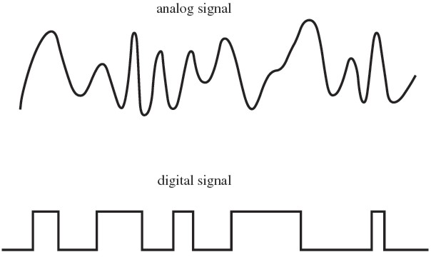

Links: [[04 Network Devices]]
___
# Physical Layer

The **Physical Layer** is the lowest layer of the OSI model. It deals with the physical connection between devices and the transmission of raw bits.

## Signals
Data transmission occurs via signals.

- **Analog Signal:** Continuous wave that changes over time (e.g., Human voice, Radio waves).
- **Digital Signal:** Discrete signal representing data as a sequence of 0s and 1s (e.g., Computer data).

## Devices
Devices at the Physical Layer are considered "dumb" because they do not understand IP addresses or frames; they only deal with electrical signals.

### Repeater
An electronic device that receives a signal and regenerates it.

- **Function:** Extends the range of a network by overcoming signal attenuation.
- **Application:** Extending Wi-Fi range or long cable runs.

### Hub
A multi-port repeater.

- **Function:** Takes an incoming signal on one port and **blindly broadcasts** it to all other connected ports.
- **Disadvantage:** High security risk (everyone sees everything) and collision prone.

### Modem (Modulator-Demodulator)
A device that converts between digital and analog signals.

1.  **Modulation:** Converting **Digital** signals (from computer) into **Analog** signals (for transmission over phone/cable lines).
2.  **Demodulation:** Converting **Analog** signals back into **Digital** signals.
