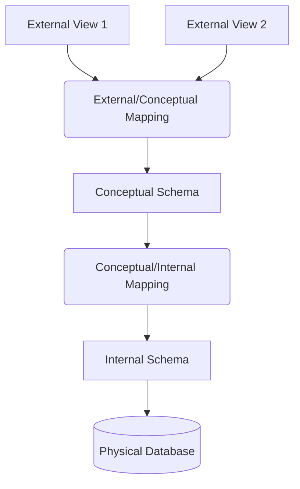

Links: [[04 SQL]]
___
# DBMS: Introduction & Architecture

## Fundamental Concepts
### Data vs. Information

- **Data**: Raw, unprocessed facts and figures without context.
  - _Example_: `100`, `Red`, `John`.
- **Information**: Processed data that has meaning and context.
  - _Example_: "John scored 100 marks in the Red team."

### Database Management System (DBMS)

A **DBMS** is a general-purpose software system that facilitates the process of defining, constructing, manipulating, and sharing databases among various users and applications.

> [!TIP] > **Analogy:** Think of a **Database** as a library full of books (data). The **DBMS** is the librarian who manages the catalog, organizes the books, ensures security, and helps you find exactly what you need. You don't go to the shelf yourself; you ask the librarian.

### Database System vs. File System

Before DBMS, data was stored in OS files (File Processing System).

| Feature         | File System                                                                                               | DBMS                                                    |
| :-------------- | :-------------------------------------------------------------------------------------------------------- | :------------------------------------------------------ |
| **Structure**   | Unstructured or ad-hoc formats.                                                                           | Structured (Schema-defined).                            |
| **Redundancy**  | **High:** Same data repeated in multiple files (e.g., Student address in 'Library' and 'Accounts' files). | **Controlled:** Normalization minimizes duplication.    |
| **Consistency** | **Low:** Updating address in 'Library' might leave 'Accounts' with old data (Data Inconsistency).         | **High:** Changes are propagated or shared.             |
| **Isolation**   | **Low:** Data is scattered; formats vary. Hard to write new apps.                                         | **High:** Data Independence separates app from storage. |
| **Atomicity**   | **No:** If a transfer fails halfway, money is lost.                                                       | **Yes:** Transactions are all-or-nothing (ACID).        |
| **Security**    | OS-level (File permissions).                                                                              | Granular (Table/Row/Column level).                      |
| **Concurrency** | **Poor:** OS locks entire files.                                                                          | **High:** Fine-grained locking (Row-level).             |

## Database Architecture

### Three-Schema Architecture

Proposed by ANSI/SPARC to achieve **Data Independence**. It separates the user view from the physical storage.

1.  **External Level (View Level)**:
    - Describes **part** of the database relevant to a specific user.
    - _Example_: A Student sees `Grades`, but not `FacultySalary`.
2.  **Conceptual Level (Logical Level)**:
    - Describes **what** data is stored and relationships. Hides physical details.
    - _Example_: `Student(ID, Name, Age)` table definition.
3.  **Internal Level (Physical Level)**:
    - Describes **how** data is stored (block size, compression, indexes, hashing).
    - _Example_: "Stored as a B+ Tree on Drive D:".

### Data Independence

The capacity to change the schema at one level of a database system without having to change the schema at the next higher level.

#### Logical Data Independence

- **Definition**: Ability to change the **Conceptual Schema** without affecting **External Schemas** (Application Programs).
- **Scenario**: Adding a new column `DateOfBirth` to the `Student` table.
- **Result**: Existing apps that only read `Name` and `ID` **do not crash**. They simply ignore the new column.
- **Analogy**: A restaurant changes its kitchen layout (Conceptual). The menu (External) remains the same for the customer.

#### Physical Data Independence

- **Definition**: Ability to change the **Internal Schema** without affecting the **Conceptual Schema**.
- **Scenario**: Creating a new **Index** on `Student(ID)` for faster search, or moving data from HDD to SSD.
- **Result**: The logical table structure (`CREATE TABLE`) remains exactly the same. The query runs faster, but the query _code_ doesn't change.
- **Analogy**: The library moves books from wooden shelves to metal shelves (Physical). The catalog numbers (Conceptual) and how you search for books (External) remain unchanged.

## DBMS Architecture Styles

### 2-Tier Architecture (Client-Server)

- **Client**: Runs the application and UI. Communicates directly with the DB.
- **Server**: Runs the DBMS.
- **Drawback**: Security risk (direct DB access), poor scalability.
- **Use Case**: JDBC/ODBC applications.

### 3-Tier Architecture (Web Applications)

- **Client**: Web Browser (Presentation Layer).
- **Application Server**: Business Logic (Java/Spring, Node.js).
- **Database Server**: DBMS (Data Layer).
- **Flow**: Client $\leftrightarrow$ App Server $\leftrightarrow$ DB Server.
- **Benefit**: Enhanced security (Client never touches DB directly), scalability.

## Database Users & Administrators

| Role                             | Responsibilities                                                                      |
| :------------------------------- | :------------------------------------------------------------------------------------ |
| **Database Administrator (DBA)** | Superuser. Manages schema, security, backups, performance tuning, and user access.    |
| **Application Programmer**       | Writes code (Java, Python) to interact with the DB using DML queries.                 |
| **Sophisticated User**           | Analysts/Scientists who write complex SQL queries/scripts for data mining.            |
| **Naive User**                   | End-users accessing DB via GUI (e.g., Bank teller using a form). They don't know SQL. |

## Data Models

A collection of conceptual tools for describing data, relationships, semantics, and constraints.

1.  **Relational Model**: Uses **Tables** (Relations). Current standard. (SQL).
2.  **Entity-Relationship (ER) Model**: High-level design model using **Entities** and **Relationships**. (Diagrams).
3.  **Object-Based Model**: Extends ER with OOP concepts (Encapsulation, Methods).
4.  **Semistructured Model**: Data with flexible structure (XML, JSON).
