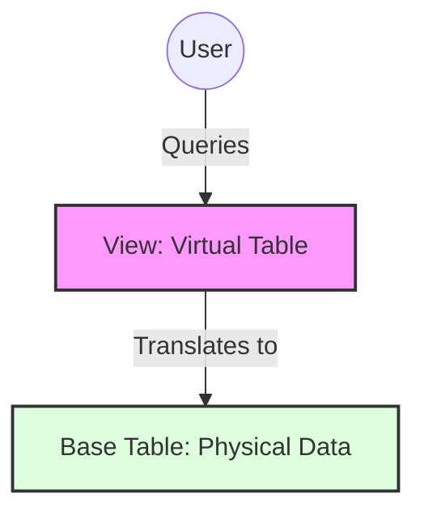

Links: [[04 SQL]]
___
# Views

Views are virtual tables. They do not store any data themselves but are based on the result-set of an SQL query.

We create views for several reasons:

1. **Security:** To restrict access to data. We can hide sensitive columns or rows from certain users by only granting them access to a view.
2. **Simplicity:** To hide the complexity of queries. A complex join or a query with many subqueries can be saved as a view, allowing users to query it like a simple table.
3. **Consistency:** To provide a stable interface. The base tables can be restructured, but the view can be maintained to provide a consistent schema to applications.

> [!TIP] > Analogy: The Tinted Window
> Imagine a house (Database) with many rooms (Tables).
>
> - **Table**: The actual room with all its furniture (Data).
> - **View**: A tinted window that lets you see only _specific_ parts of the room (e.g., only the sofa, not the messy bed). You can't "touch" the furniture directly through the window (in complex views), but you can see it.



One table can have any number of views.

To create views we have the following SQL command:

```sql
CREATE VIEW <viewname> AS SELECT <columns> FROM <table_name>;
```

E.g.

```sql
CREATE VIEW V1 AS SELECT rno, sname, dept FROM STUDENT where dept = 'CSIT';

CREATE VIEW Student_Course AS
SELECT s.rno, s.sname, c.cid, c.cname
FROM STUDENT s INNER JOIN COURSE c ON s.roll = c.roll;
```

Views' schemas (their definitions, not their data) are stored in the data dictionary.

At runtime, when a view is queried, the database executes the view's underlying SELECT statement, creates the virtual table, and then runs the query against it.

### Updating the View

```sql
CREATE OR REPLACE VIEW <viewname> AS SELECT <column> FROM <table>;
```

If view already exists, it will update it (replace its definition), if not, then it will create one.

### Dropping the View

If we want to drop the view,

```sql
DROP VIEW <viewname>;
```

This drops the view's definition only. It has no effect on the data in the underlying base tables.

If we drop the base table, then all the views connected to the table will become invalid and will be dropped as well.

### Insertion, Updation and Deletion in View

This is also known as "updatability". Whether a view is updatable (allows `INSERT`, `UPDATE`, `DELETE`) depends on its definition.

- **Simple Views:** Are generally updatable. A view is simple if it:
  - Refers to only one table.
  - Does _not_ use `GROUP BY` or aggregate functions (`COUNT()`, `SUM()`, etc.).
  - Does _not_ use `DISTINCT`.
- **Complex Views:** Are generally _not_ updatable. This includes:
  - Views with `JOIN`s (like `Student_Course` above).
  - Views with `GROUP BY` or aggregate functions.
  - Views using `UNION`, `INTERSECT`, or `MINUS`.

While performing DML operations on a view, all the constraints of the base table must be fulfilled (e.g., `PRIMARY KEY`, `UNIQUE`, `CHECK`).

**INSERT Example:**

```sql
INSERT INTO V1 (rno, sname, dept) VALUES (120, 'Alex', 'CSIT');
```

This will work. The row will be added to the `STUDENT` base table.

**DML Restrictions:**
If we try to INSERT into a view, what about the attributes not in the view?

- The base table's attributes which are not in the view will be given `NULL` value.
- If any of those attributes has a `NOT NULL` constraint (and no `DEFAULT` value), the `INSERT` operation will fail.

### WITH CHECK OPTION

This is a constraint that can be added to a view. It forces all `INSERT` and `UPDATE` operations on the view to conform to the `WHERE` clause in the view's definition.

```sql
CREATE VIEW V1 AS
SELECT rno, sname, dept FROM STUDENT
WHERE dept = 'CSIT'
WITH CHECK OPTION;
```

Now, consider these two operations:

> [!EXAMPLE] > Example
> **Operation 1: Success**
>
> ```sql
> UPDATE V1 SET sname = 'Alex B.' WHERE rno = 120;
> ```
>
> _Result:_ **Allowed**. The row still belongs to 'CSIT' after the name change.
>
> **Operation 2: Failure**
>
> ```sql
> UPDATE V1 SET dept = 'MECH' WHERE rno = 120;
> ```
>
> _Result:_ **Blocked**. Changing Dept to 'MECH' would make the row vanish from the view `V1` (since `V1` only shows 'CSIT'). `WITH CHECK OPTION` prevents this "disappearing act".

Without `WITH CHECK OPTION`, Operation 2 would succeed, and the row would silently disappear from the view.
