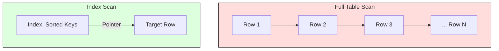

Links: [[04 SQL]]
___
# Indexes

### Sequences (Auto-number)

In oracle, we can create an auto-number field by using using sequences. A sequence is an object in Oracle that is used to generate a number sequence. This can be used when we need to create a unique number to act as a primary.

```sql
CREATE SEQUENCE sequence_name
    MINVALUE value
    MAXVALUE value
    START WITH value
    INCREMENT BY value
    CACHE value;
```

Once a sequence is created, you can access its values in SQL statements with

1. `CURRVAL` pseudo column which returns the current value of the sequence _for your session_, and,
2. `NEXTVAL` pseudo column, which increments the sequence and returns the new value.

#### Index Modifiers

`NOMAXVALUE` to denote a max value of $10^{27}$ for ascending sequence and -1 for descending sequence. Oracle uses this by default.

`CYCLE` to allow the sequence to generate value after it reaches the limit, min value for a descending sequence and max value for an ascending sequence.

When an ascending sequence reaches its max value, it generates min value.

On the other hand, when a descending sequence reaches its min value, it generates max value.

`NOCYCLE` is default.

`CACHE` specifies the no of sequence values oracle pre-allocates and holds in memory for faster access.

`ORDER` ensures that oracle will generate the sequence numbers in order of request.

This is useful if you are using Oracle in Real Application Clusters. When you are using exclusive mode, then oracle will always generate sequence numbers in order.

`NOORDER` if we do not want to ensure oracle to generate sequence numbers in order of request. This option is default.

Example,

```sql
CREATE SEQUENCE emp_id_seq
    INCREMENT BY 1
    START WITH 1001
    NOMAXVALUE
    NOCYCLE
    CACHE 20;
```

### How to Use a Sequence

You typically use `NEXTVAL` within an `INSERT` statement to populate a primary key column.

```sql
INSERT INTO employees (employee_id, first_name, last_name)
VALUES (emp_id_seq.NEXTVAL, 'Jane', 'Doe');
```

To retrieve the value you just inserted within your current session, you can use `CURRVAL`.

```sql
SELECT emp_id_seq.CURRVAL FROM DUAL;
```

### Index

When the user executes a select statement to search for a particular record, the oracle engine is first required to locate the table on the hard disk. The oracle engine reads system information and starts searching the location of the table in storage media.

Oracle engine then performs a sequential search (also called a **Full Table Scan**) to locate the record that matches the user's criteria. Indexing a table is an access strategy to sort and search records in the table, which avoids this slow sequential search.

> [!TIP] > Analogy: The Textbook Index
>
> - **No Index (Full Table Scan)**: To find "Deadlock" in a book, you read _every single page_ from start to finish. Slow!
> - **Index (Index Scan)**: You go to the back of the book, find "Deadlock" in the sorted list, and jump straight to Page 142. Fast!



Indexes are essential to improve the speed with which records can be located and retrieved from the table. It involves creating a **data structure (commonly a B-tree)** that is stored separately from the table.

Index consists of,

- **Index Key:** A sorted copy of the data from the indexed column(s).
  $\\$
- **ROWID:** An address pointer that identifies the exact physical location of the corresponding record in the table's data blocks.
  $\\$
- Whenever data is inserted, updated, or deleted in the original table, a related record automatically gets updated in all the index tables. This adds overhead to DML operations, which is why indexes should be used judiciously.
  $\\$
- Whenever a `SELECT` command is executed with a `WHERE` clause on an indexed column, the index table is automatically activated, and the database uses the index to find the ROWID, then directly fetches the row. This is much faster than a full table scan.

A table's **ROWID** identifies a row's physical address. The format you may see (`BBBBBB.RRRR.FFFF`) is the older _Restricted ROWID_. Modern Oracle databases use an _Extended ROWID_ which is more complex (using a Base64-encoded string) and includes the Data Object Number, allowing it to uniquely identify rows in different objects.

### Creating an Index

```sql
CREATE INDEX index_name
ON table_name(column1, column2, ...);
```

This syntax creates a **composite (or concatenated) index**. The index is built using _all_ listed columns, in that specific order (e.g., `column1`, then `column2`). This is **not a fallback**; it's used to speed up queries that filter on `column1`, or on `column1` _and_ `column2`.

```sql
CREATE UNIQUE INDEX index_name
ON table_name(column1, column2, ...);
```

This syntax creates a **unique index**. It enforces a constraint that no two rows in the table can have the same value (or combination of values) in the indexed column(s). `NULL` values are permitted (unless a `NOT NULL` constraint also exists). **Primary Key constraints automatically create a unique index.**

### Types of Indexes

| Index Type           | Best For                                  | Pros                              | Cons                                   |
| :------------------- | :---------------------------------------- | :-------------------------------- | :------------------------------------- |
| **B-Tree** (Default) | High Cardinality (IDs, Names, Dates)      | Fast lookups, good for ranges.    | Not good for low cardinality.          |
| **Bitmap**           | Low Cardinality (Gender, Status, Boolean) | Fast for `AND`/`OR` combinations. | Slow updates (Locking issues).         |
| **Function-Based**   | Expressions (e.g., `UPPER(name)`)         | Speeds up specific calculations.  | Only works for that specific function. |

- **B-Tree Index:** The default, standard index. Good for high-cardinality data (e.g., `employee_id`, `username`).
- **Bitmap Index:** Good for low-cardinality data (e.g., `gender`, `is_active`). Very fast for `OR` and `AND` queries on these columns, but slow to update (high DML overhead).
- **Function-Based Index:** An index built on the result of a function or expression (e.g., `CREATE INDEX idx_emp_name ON employees (UPPER(last_name))` to speed up case-insensitive searches).

### When _Not_ to Use an Index

- **On very small tables:** A full table scan is often faster because reading the index is an extra step.
- **On columns with very low cardinality (B-Tree):** A standard B-Tree index on a column like `gender` (M/F) is inefficient. A bitmap index is better here.
- **On tables with very frequent DML:** Heavy `INSERT`, `UPDATE`, and `DELETE` operations require constant index updates, which can slow down these operations.

### Managing Indexes

You can drop an index that is no longer needed:

```sql
DROP INDEX index_name;
```

You can see all indexes on a table by querying the data dictionary:

```sql
SELECT index_name, column_name
FROM USER_IND_COLUMNS
WHERE table_name = 'EMPLOYEES';
```
