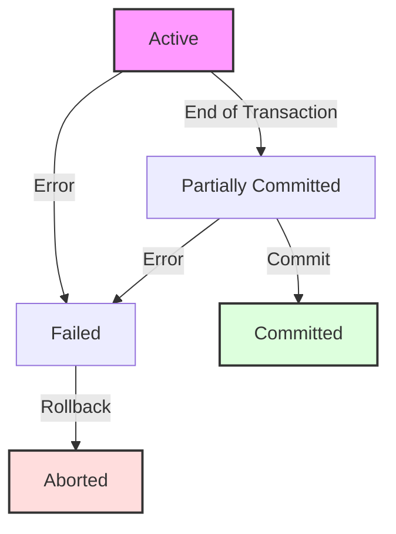

Links: [[08 Normalization]]

---

# Transaction Processing & Concurrency Control

A **Transaction** is a single logical unit of work (a sequence of operations) that accesses and possibly modifies the database.

## ACID Properties

To ensure data integrity, every transaction must satisfy:

| Property        | Description                                                                                | Responsibility                             |
| :-------------- | :----------------------------------------------------------------------------------------- | :----------------------------------------- |
| **A**tomicity   | **"All or Nothing"**. Either all operations execute, or none do.                           | **Transaction Manager** (Undo Logs)        |
| **C**onsistency | Database must move from one valid state to another (Constraints preserved).                | **Programmer** & **Integrity Constraints** |
| **I**solation   | Concurrent transactions should not interfere. T1 should not see T2's intermediate updates. | **Concurrency Control Manager** (Locks)    |
| **D**urability  | Committed changes are permanent, even after a crash.                                       | **Recovery Manager** (Redo Logs)           |

### Transaction States

1.  **Active**: Executing.
2.  **Partially Committed**: Last statement executed.
3.  **Committed**: Successfully saved.
4.  **Failed**: Error occurred.
5.  **Aborted**: Rolled back.

## Schedules & Serializability

A **Schedule** is the execution order of instructions from multiple transactions.

### Serial vs. Concurrent

- **Serial Schedule**: T1 finishes, then T2 starts. (Slow, Consistent).
- **Concurrent Schedule**: T1 and T2 interleaved. (Fast, Potential Inconsistency).

> [!EXAMPLE] >
> **Serial Schedule (T1 then T2)**
>
> | Time | Transaction T1 | Transaction T2 |
> | :--- | :------------- | :------------- |
> | 1    | Read(A)        |                |
> | 2    | Write(A)       |                |
> | 3    | Commit         |                |
> | 4    |                | Read(A)        |
> | 5    |                | Write(A)       |
> | 6    |                | Commit         |
>
> **Concurrent Schedule (Interleaved)**
>
> | Time | Transaction T1 | Transaction T2 |
> | :--- | :------------- | :------------- |
> | 1    | Read(A)        |                |
> | 2    | Write(A)       |                |
> | 3    |                | Read(A)        |
> | 4    |                | Write(A)       |
> | 5    | Commit         |                |
> | 6    |                | Commit         |

### Conflict Serializability

A schedule is **Conflict Serializable** if it is equivalent to a Serial Schedule.

- **Conflict**: Two operations conflict if they are from different transactions, access the same item, and at least one is a **WRITE**.
  - $R(X), W(X)$ $\rightarrow$ Conflict.
  - $W(X), W(X)$ $\rightarrow$ Conflict.
- **Precedence Graph Algorithm:**
  1.  Nodes: Transactions.
  2.  Edge $T_i \rightarrow T_j$: If $T_i$ executes a conflicting operation _before_ $T_j$.
  3.  **Result**: If Graph has a **Cycle** $\rightarrow$ NOT Serializable. No Cycle $\rightarrow$ Serializable.

> [!EXAMPLE] > **Schedule S:** > $R_1(A), R_2(A), W_1(A), W_2(A)$
>
> **Conflicts:**
>
> 1. $R_2(A)$ vs $W_1(A)$ (No, R2 is before W1? No, in schedule order: R1, R2, W1, W2. $R_2$ is before $W_1$? Yes. $R_2 \rightarrow W_1$? No, $W_1$ is after $R_2$. Wait. $R_2$ executes, then $W_1$. Conflict is $R_2 \rightarrow W_1$. Edge $T_2 \rightarrow T_1$.)
> 2. $W_1(A)$ vs $W_2(A)$ (W1 is before W2. Edge $T_1 \rightarrow T_2$.)
>
> **Graph:** $T_2 \rightarrow T_1$ and $T_1 \rightarrow T_2$.
> **Result:** Cycle exists ($T_1 \leftrightarrow T_2$). **NOT Conflict Serializable.**

### View Serializability

Less strict than Conflict Serializability. Handles **Blind Writes** (Write without Read).

- Two schedules are **View Equivalent** if:
  1.  **Initial Read**: Same transaction reads the initial value.
  2.  **Read-From**: If $T_j$ reads value written by $T_i$ in $S_1$, it must do so in $S_2$.
  3.  **Final Write**: Same transaction performs the final write.

> [!EXAMPLE] > **Schedule S (Blind Write):** > $T_1: R(A), W(A)$ > $T_2: W(A)$ > $T_3: W(A)$
> Order: $R_1(A), W_2(A), W_1(A), W_3(A)$.
>
> **View Equivalence Check (vs Serial $T_1, T_2, T_3$):**
>
> 1.  **Initial Read:** $T_1$ reads initial A in both. (Pass)
> 2.  **Read-From:** No transaction reads from another. (Pass)
> 3.  **Final Write:** $T_3$ writes the final A in both. (Pass)
>
> **Result:** S is **View Serializable** (equivalent to $T_1 \rightarrow T_2 \rightarrow T_3$).
> _Note:_ This schedule is also Conflict Serializable ($T_2 \rightarrow T_1 \rightarrow T_3$), but View Serializability is often used to justify schedules with blind writes that might fail stricter conflict checks in more complex scenarios.

## Recoverability of Schedules

Even if a schedule is Serializable, it might not be **Recoverable**. If a transaction fails, we must ensure we can rollback without affecting committed transactions.

### Recoverable Schedule

A schedule is **Recoverable** if for every pair of transactions $T_i$ and $T_j$ such that $T_j$ reads a value written by $T_i$, $T_i$ must **commit before** $T_j$ commits.

- **Rule:** If $T_2$ reads from $T_1$, then $C_1 < C_2$.
- **Why?** If $T_2$ commits first and then $T_1$ aborts, $T_2$ has read invalid data but cannot be rolled back (Durability property). This is an unrecoverable state.

> [!EXAMPLE] > Unrecoverable vs Recoverable
>
> - **Unrecoverable:** $W_1(A), R_2(A), C_2, C_1$ (If T1 fails, T2 is already committed with dirty data).
> - **Recoverable:** $W_1(A), R_2(A), C_1, C_2$ (If T1 fails, T2 can still be aborted).

### Cascadeless Schedule (ACA - Avoid Cascading Aborts)

A schedule is **Cascadeless** if it avoids the "Domino Effect" of rollbacks.

- **Rule:** $T_j$ can only read data written by $T_i$ **after** $T_i$ has committed.
- **Benefit:** No cascading rollbacks. If $T_1$ fails, no other transaction needs to be rolled back because no one read its dirty data.

> [!EXAMPLE] > Cascading vs Cascadeless
>
> - **Cascading:** $W_1(A), R_2(A), R_3(A), Abort_1$ (T2 and T3 must also abort).
> - **Cascadeless:** $W_1(A), C_1, R_2(A), C_2$ (T2 reads only committed data).

### Strict Schedule

The most restrictive and practical level.

- **Rule:** A transaction can neither **Read nor Write** a data item $X$ until the last transaction that wrote $X$ has committed (or aborted).
- **Benefit:** Simplifies recovery (Undo involves simply restoring the "Before Image").

### Hierarchy
> Strict $\subset$ Cascadeless $\subset$ Recoverable $\subset$ All Schedules
