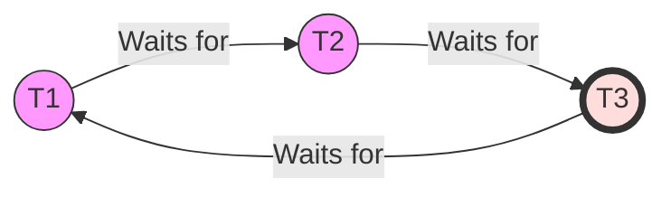

Links: [[09 Transactions]]
___
# Concurrency Control
Concurrency Control is the procedure used by the Database Management System (DBMS) to allow multiple transactions to run simultaneously (concurrently) without violating the consistency of data.

If transactions are executed serially (one after another), consistency is guaranteed, but system throughput (efficiency) is very low. Concurrency improves throughput but introduces several problems.

### Problems due to Concurrency

| Problem                           | Description                                                                                                                                     | Example                                                                                   |
|:--------------------------------- |:----------------------------------------------------------------------------------------------------------------------------------------------- |:----------------------------------------------------------------------------------------- |
| **Lost Update**                   | Two transactions access the same data item and have their operations interleaved in a way that makes the value of some database item incorrect. | T1 and T2 update the same record; T2's write overwrites T1's write.                       |
| **Dirty Read (Temporary Update)** | A transaction reads a value written by another transaction that has not yet committed.                                                          | T2 reads a value updated by T1. T1 fails and rolls back. T2 has read invalid data.        |
| **Unrepeatable Read**             | A transaction reads the same item twice and gets different values because another transaction modified it in between.                           | T1 reads X, T2 modifies X and commits, T1 reads X again and gets a different value.       |
| **Phantom Read**                  | A transaction executes a query twice and gets a different set of rows because another transaction inserted or deleted rows.                     | T1 counts employees. T2 adds a new employee. T1 counts again and gets a different number. |

#### Lost Update Problem (Write-Write Conflict)
This occurs when two transactions update the same data item, but the second update overwrites the first update because it didn't know about it.

**Example:**
Suppose A = 100.

| Time | T1         | T2         | Value of A in DB |
|:---- |:---------- |:---------- |:---------------- |
| t1   | Read(A)    |            | 100              |
| t2   |            | Read(A)    | 100              |
| t3   | A = A - 50 |            | 100              |
| t4   |            | A = A + 20 | 100              |
| t5   | Write(A)   |            | **50**           |
| t6   |            | Write(A)   | **120**          |

**Result:** The update from T1 (subtracting 50) is completely lost. The final value should be 70, but it is 120.

#### Dirty Read Problem (Write-Read Conflict)
This occurs when a transaction reads data that has been updated by another transaction that has *not yet committed*. If the other transaction rolls back, the first transaction has read data that technically never existed.

**Example:**

| Time | T1           | T2      |
|:---- |:------------ |:------- |
| t1   | Read(A)      |         |
| t2   | A = A + 100  |         |
| t3   | Write(A)     |         |
| t4   |              | Read(A) |
| t5   | ...Error...  |         |
| t6   | **Rollback** |         |

**Result:** T2 has read the updated value of A. But T1 failed and rolled back A to its original value. T2 is now working with "dirty" (incorrect) data.

#### Unrepeatable Read Problem (Read-Write Conflict)
This occurs when a transaction reads the same variable twice during its execution. Between the two reads, another transaction updates the value.

**Example:**

| Time | T1      | T2          |
|:---- |:------- |:----------- |
| t1   | Read(A) |             |
| t2   |         | Read(A)     |
| t3   |         | A = A + 100 |
| t4   |         | Write(A)    |
| t5   | Read(A) |             |

**Result:** T1 reads A at t1 (say 100) and at t5 (say 200). The data has changed unexpectedly during the transaction.

## 
## Deadlock Handling in Concurrency
Deadlocks occur when two or more transactions are waiting indefinitely for one another to release locks.

**Example:**
```sql
T1: Lock(A) ... waiting for B ...
T2: Lock(B) ... waiting for A ...
```

### Necessary Conditions (Coffman Conditions)

Deadlock can occur only if **ALL** four conditions hold simultaneously:

1.  **Mutual Exclusion**: At least one resource is non-sharable (only one transaction can use it at a time).
2.  **Hold and Wait**: A transaction holding at least one resource is waiting to acquire additional resources held by others.
3.  **No Preemption**: Resources cannot be forcibly taken from a transaction; they must be released voluntarily.
4.  **Circular Wait**: A set of transactions $\{T_0, T_1, ..., T_n\}$ exists such that $T_0$ waits for $T_1$, $T_1$ waits for $T_2$, ..., and $T_n$ waits for $T_0$.

### Handling Deadlocks

#### Deadlock Prevention
We ensure that one of the necessary conditions for deadlock (Mutual Exclusion, Hold and Wait, No Preemption, Circular Wait) never holds.
- **Wait-Die Scheme:** (Based on timestamps)
    - If older T1 requests lock held by younger T2: T1 waits.
    - If younger T2 requests lock held by older T1: T2 dies (rolls back).
- **Wound-Wait Scheme:**
    - If older T1 requests lock held by younger T2: T1 wounds T2 (T2 rolls back).
    - If younger T2 requests lock held by older T1: T2 waits.

#### Deadlock Detection & Recovery

Allow deadlocks to occur, detect them, and recover.

- **Wait-For Graph**: A directed graph where nodes are transactions and edge $T_i \rightarrow T_j$ means $T_i$ is waiting for $T_j$.
- **Cycle Detection**: If the graph has a cycle, a deadlock exists.



- **Recovery**: Select a **Victim** to rollback based on:
  - Cost (least progress).
  - Number of items locked.
  - Number of rollbacks already occurred (to avoid starvation).
