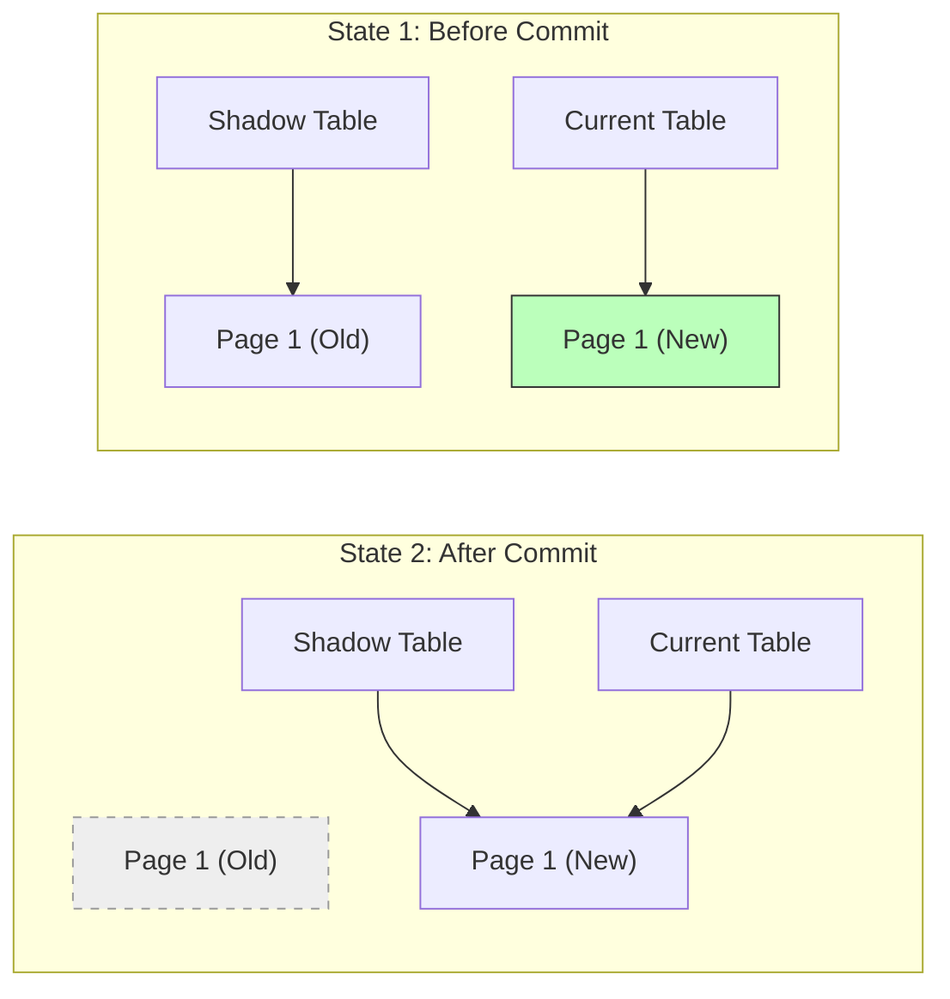

Links: [[05 Transactions]]
___
# Database Recovery Techniques

Recovery ensures **Atomicity** and **Durability** by restoring the database to a consistent state after a failure.

## Failure Classification

1.  **Transaction Failure**: Logical error (Divide by Zero) or System error (Deadlock).
2.  **System Crash**: Hardware/Software freeze. Volatile memory (RAM) lost.
3.  **Disk Failure**: Head crash. Non-volatile storage lost. Requires backups.

## Log-Based Recovery

The system maintains a **Log** (Journal) on stable storage recording all updates.
**Write-Ahead Logging (WAL)**:

1.  Log record must be written to stable storage _before_ the database item is updated on disk.
2.  Log must be saved _before_ commit.

### Deferred Database Modification

No updates are made to the database on disk until the transaction **Commits.**

- **During Execution:** All writes are kept in buffers/logs.
- **Recovery:**
  - **Crash before Commit:** Ignore transaction (Nothing was written to disk).
  - **Crash after Commit:** **Redo** the updates from the log.
  - **Undo** is NEVER needed.

> [!EXAMPLE] > Deferred Modification
>
> - **Log:** `[Start T1]`, `[Write T1, A, 100]`, `[Commit T1]`, `[Crash]`
> - **Recovery:** Since T1 committed, the system **Redoes** `[Write T1, A, 100]` to ensure A=100 is on disk.
> - If crash happened _before_ `[Commit T1]`, the system would simply **Ignore** T1.

### Immediate Database Modification

Updates can be written to the database on disk **any time** (even before commit).

- **Recovery:**
  - **Crash before Commit:** **Undo** the changes (Restore old values).
  - **Crash after Commit:** **Redo** the changes (Ensure new values are persisted).

> [!EXAMPLE] > Immediate Modification
>
> - **Log:** `[Start T1]`, `[Write T1, A, 50, 100]`, `[Crash]` (No Commit)
> - **Recovery**: T1 was active but didn't commit. The system **Undoes** the write, restoring A to 50.
> - If `[Commit T1]` was present, the system would **Redo** to ensure A=100.

## Checkpoints

To avoid replaying the _entire_ log during recovery, **Checkpoints** are used.

**Process:**

1.  Output all log records to disk.
2.  Output all dirty database pages to disk.
3.  Write `<CHECKPOINT>` to log.

**Recovery Algorithm:**

1.  Scan backwards to find the last `<CHECKPOINT>`.
2.  Transactions committed _before_ checkpoint: **Ignore** (Already saved).
3.  Transactions active _during/after_ checkpoint: **Redo** or **Undo** based on status.

## Shadow Paging

A non-log-based technique.

Maintain two Page Tables: **Current** and **Shadow.**

- **Operation:**
  - **Read**: Use Current Page Table.
  - **Write**: Copy page to a new block, modify it, and update Current Page Table to point to new block. Shadow Page Table still points to old block.
  - **Commit**: Atomically switch Shadow Page Table to point to Current Page Table.
- **Cons**: Data fragmentation. Garbage collection overhead.

> [!TIP] > Analogy: Shadow Paging
> Think of editing a document:
>
> - **Current Page Table:** The "Draft" you are working on.
> - **Shadow Page Table:** The "Saved" version on disk.
> - **Commit**: You hit "Save As" and overwrite the old file with the new one. If the power goes out _before_ you save, you just open the old file (Shadow) and nothing is corrupted.

## ARIES Algorithm

**Algorithms for Recovery and Isolation Exploiting Semantics.** The industry standard (used by IBM DB2, SQL Server).

**Phases:**
1.  **Analysis:** Scan log forward from last checkpoint to identify "Dirty Pages" and "Active Transactions".
2.  **Redo:** Replay _all_ updates (even for failed transactions) to bring DB to the state at the moment of crash. ("Repeating History").
3.  **Undo:** Scan log backward to rollback uncommitted transactions.

> [!EXAMPLE] > ARIES Recovery Scenario
>
> - **Log**: `[Start T1]`, `[Write T1, A, 10, 20]`, `[Start T2]`, `[Write T2, B, 5, 15]`, `[Commit T1]`, `[Crash]`
>
> **1. Analysis Phase:**
>
> - Determines that at the time of crash, **T2 was active** and **T1 was committed**.
> - Identifies Dirty Pages (A and B might be in memory but not disk).
>
> **2. Redo Phase *(Repeating History)*:**
>
> - Reapplies `[Write T1, A]` and `[Write T2, B]`.
> - Now the database state matches exactly what was in memory before the crash.
>
> **3. Undo Phase:**
>
> - Since **T2** was active (not committed), it must be rolled back.
> - Undoes `[Write T2, B]` (Restores B to 5).
> - Writes `[Abort T2]` to log.
