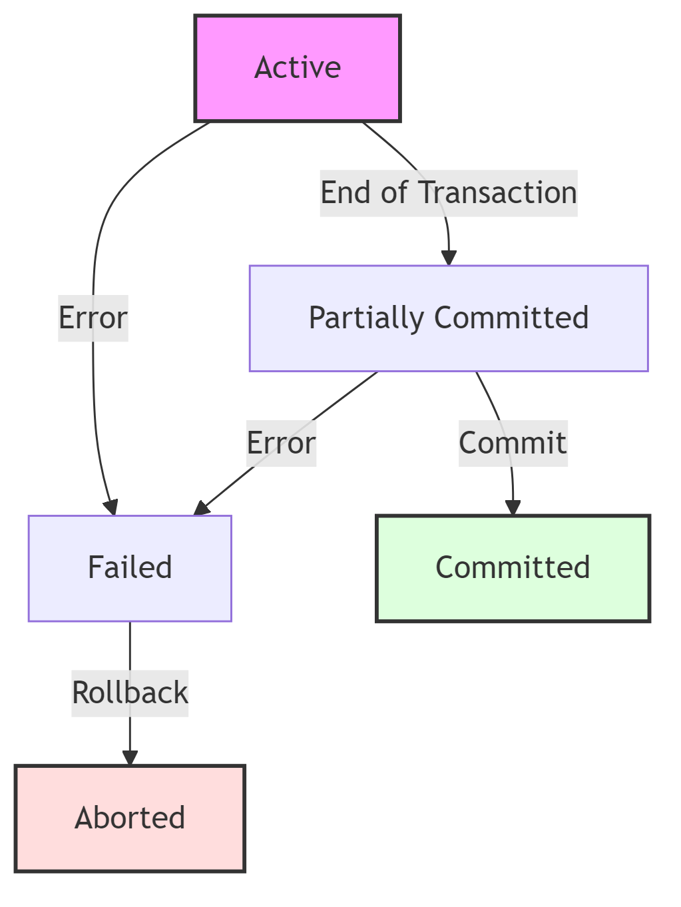
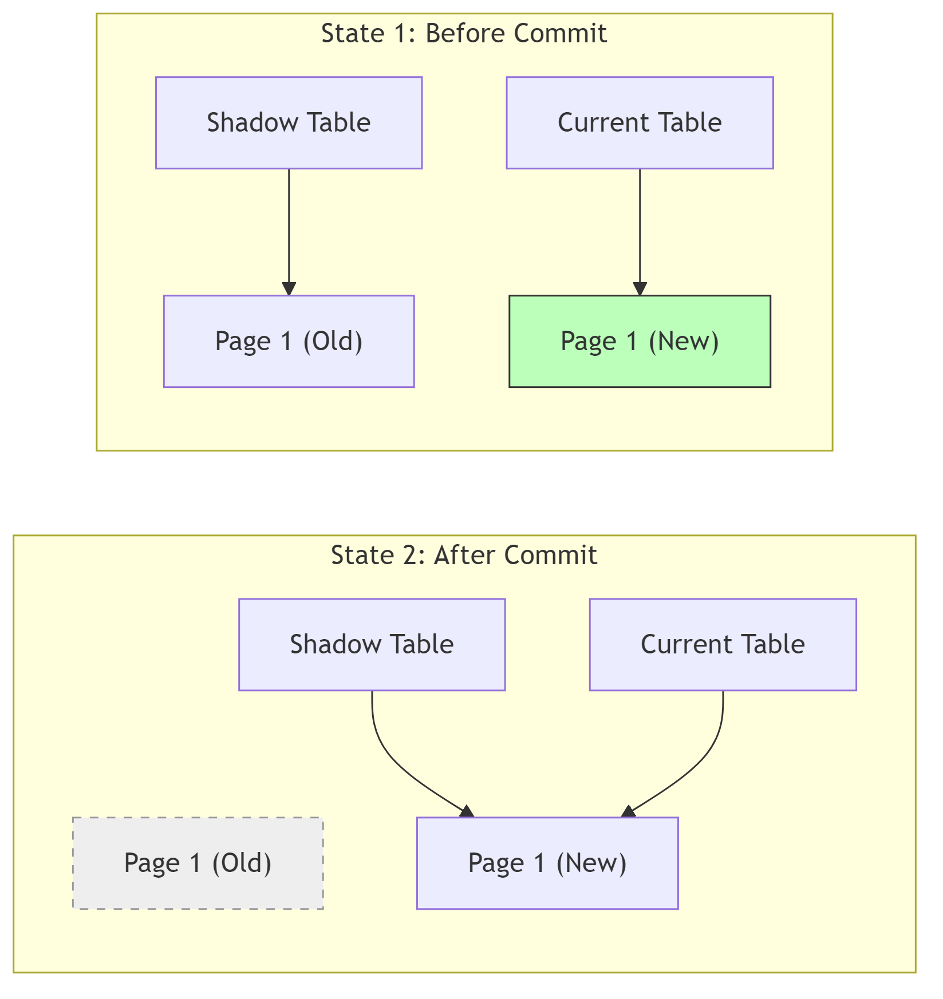

---
include-before:
  - \dominitoc
  - \setcounter{minitocdepth}{4}
---


# Normalization {#normalization}

\minitoc

Normalization is the process of organizing data to minimize redundancy and dependency.

### Functional Dependencies (FD)
An FD is a constraint between two sets of attributes in a relation.
Notation: $X \rightarrow Y$ ("X determines Y").

- **Determinant**: $X$ (Left side).
- **Dependent**: $Y$ (Right side).
- **Meaning**: For every unique value of $X$, there is exactly one corresponding value of $Y$.
  - _Analogy_: `SSN -> Name`. If you know the SSN, you know the Name.

#### Types of FDs

1.  **Trivial FD**: $Y \subseteq X$ (e.g., $AB \rightarrow A$). Always true.
2.  **Non-Trivial FD**: $Y \not\subseteq X$ (e.g., $A \rightarrow B$).
3.  **Full FD**: $Y$ depends on the _entire_ $X$, not a subset.
4.  **Partial FD**: $Y$ depends on a _part_ of $X$ (e.g., $AB \rightarrow C$, but $A \rightarrow C$ is also true).
5.  **Transitive FD**: $X \rightarrow Y$ and $Y \rightarrow Z$, so $X \rightarrow Z$.

#### Armstrong's Axioms (Inference Rules)

Used to derive all implied FDs.

1.  **Reflexivity**: If $Y \subseteq X$, then $X \rightarrow Y$.
2.  **Augmentation**: If $X \rightarrow Y$, then $XZ \rightarrow YZ$.
3.  **Transitivity**: If $X \rightarrow Y$ and $Y \rightarrow Z$, then $X \rightarrow Z$.

### Algorithms

#### Closure of Attributes ($X^+$)

The set of all attributes that can be determined by $X$.

**Algorithm:**

1.  Start with $Result = X$.
2.  Loop through FDs ($A \rightarrow B$).
3.  If $A \subseteq Result$, add $B$ to $Result$.
4.  Repeat until no change.

> [!EXAMPLE] > $R(A, B, C, D, E)$ > $FDs: \{ A \rightarrow B, BC \rightarrow D, E \rightarrow C \}$
> Find $(AE)^+$:
>
> 1.  Start: $\{A, E\}$
> 2.  Use $A \rightarrow B$: Add $B$. Now $\{A, E, B\}$.
> 3.  Use $E \rightarrow C$: Add $C$. Now $\{A, E, B, C\}$.
> 4.  Use $BC \rightarrow D$: We have $B$ and $C$, so add $D$. Now $\{A, E, B, C, D\}$.
> 5.  Result: All attributes. So, $AE$ is a **Super Key**.

#### Canonical Cover (Minimal Cover)

A simplified set of FDs that is equivalent to the original set but has no redundancy.

**Steps:**

1.  **Singleton RHS**: Split $A \rightarrow BC$ into $A \rightarrow B$ and $A \rightarrow C$.
2.  **Remove Extraneous LHS**: If $AB \rightarrow C$ and $A \rightarrow C$, then $B$ is extraneous. Remove it.
3.  **Remove Redundant FDs**: If an FD can be derived from others (Transitivity), remove it.

> [!EXAMPLE] > $F = \{ A \rightarrow B, B \rightarrow C, A \rightarrow C \}$
>
> - $A \rightarrow C$ is redundant because $A \rightarrow B \rightarrow C$.
> - Minimal Cover: $\{ A \rightarrow B, B \rightarrow C \}$.

##### Complex Example 1: Extraneous Attributes

**Given F:** $\{ AB \rightarrow C, A \rightarrow C, B \rightarrow D \}$

1.  **Singleton RHS:** Already singleton.
2.  **Extraneous LHS:**
    - Look at $AB \rightarrow C$.
    - Check if $A$ is extraneous: Compute $(B)^+$ using remaining FDs $\{ A \rightarrow C, B \rightarrow D \}$. $(B)^+ = \{B, D\}$. Does it contain $C$? No.
    - Check if $B$ is extraneous: Compute $(A)^+$ using remaining FDs $\{ A \rightarrow C, B \rightarrow D \}$. $(A)^+ = \{A, C\}$. Does it contain $C$? **Yes**.
    - So, $B$ is extraneous in $AB \rightarrow C$. Replace $AB \rightarrow C$ with $A \rightarrow C$.
    - New Set: $\{ A \rightarrow C, A \rightarrow C, B \rightarrow D \}$.
3.  **Remove Duplicates:** $\{ A \rightarrow C, B \rightarrow D \}$.

##### Complex Example 2: Full Reduction

**Given F:** $\{ A \rightarrow BC, B \rightarrow C, A \rightarrow B, AB \rightarrow C \}$

**Step 1: Singleton RHS**

- $A \rightarrow B$
- $A \rightarrow C$
- $B \rightarrow C$
- $AB \rightarrow C$

Current Set: $\{ A \rightarrow B, A \rightarrow C, B \rightarrow C, AB \rightarrow C \}$

**Step 2: Extraneous LHS**

- Check $AB \rightarrow C$.
- Is $B$ extraneous? $(A)^+$ using $\{ A \rightarrow B, A \rightarrow C, B \rightarrow C \}$. $(A)^+ = \{A, B, C\}$. Contains $C$? **Yes**.
- So $AB \rightarrow C$ becomes $A \rightarrow C$.

Current Set: $\{ A \rightarrow B, A \rightarrow C, B \rightarrow C, A \rightarrow C \}$

- Remove duplicates: $\{ A \rightarrow B, A \rightarrow C, B \rightarrow C \}$

**Step 3: Redundant FDs**

- Check $A \rightarrow C$. Can we derive $A \rightarrow C$ from $\{ A \rightarrow B, B \rightarrow C \}$?
- $(A)^+$ using $\{ A \rightarrow B, B \rightarrow C \}$ is $\{A, B, C\}$. Contains $C$? **Yes**.
- So $A \rightarrow C$ is redundant. Remove it.

**Final Minimal Cover:** $\{ A \rightarrow B, B \rightarrow C \}$

### Normal Forms

A series of steps to reduce redundancy.

#### 1NF (First Normal Form)

- **Rule**: Atomic values only. No multi-valued attributes or repeating groups.
- **Fix**: Create a new row for each value.

> [!EXAMPLE] > 
> **Bad (Not 1NF):**
> 
> | Student | Courses |
> | :--- | :--- |
> | John | Math, Physics |
>
> **Good (1NF):**
> 
> | Student | Course |
> | :--- | :--- |
> | John | Math |
> | John | Physics |


#### 2NF (Second Normal Form)

- **Rule**: Must be in 1NF **AND** No **Partial Dependency**.
- **Partial Dependency**: A non-prime attribute depends on _part_ of a composite Primary Key.
- _Analogy_: In a race, your "Finish Time" depends on (RaceID, RunnerID). But "RunnerName" depends ONLY on RunnerID. That's a partial dependency.
- **Fix**: Move the partial dependency to a new table.

> [!EXAMPLE] > 
> **Bad (Not 2NF):**
> Key: `(RaceID, RunnerID)`
> 
> | RaceID | RunnerID | FinishTime | RunnerName |
> | :--- | :--- | :--- | :--- |
> | 101 | 5 | 10:00 | Bolt |
>
> _Problem:_ `RunnerName` depends only on `RunnerID`, not `RaceID`.
>
> **Good (2NF):**
> Table 1: `(RaceID, RunnerID, FinishTime)`
> Table 2: `(RunnerID, RunnerName)`

#### 3NF (Third Normal Form)

- **Rule**: Must be in 2NF **AND** No **Transitive Dependency**.
- **Transitive Dependency**: Non-Prime $\rightarrow$ Non-Prime.
- _Analogy_: `Student -> ZipCode -> City`. City depends on ZipCode, not directly on Student.
- **Fix**: Move `ZipCode -> City` to a separate "Locations" table.

> [!EXAMPLE] > 
> **Bad (Not 3NF):**
> Key: `StudentID`
> 
> | StudentID | ZipCode | City |
> | :--- | :--- | :--- |
> | 1 | 90210 | Beverly Hills |
>
> _Problem:_ `City` depends on `ZipCode`, which depends on `StudentID`.
>
> **Good (3NF):**
> Table 1: `(StudentID, ZipCode)`
> Table 2: `(ZipCode, City)`

#### BCNF (Boyce-Codd Normal Form)

- **Rule**: For every FD $X \rightarrow Y$, $X$ must be a **Super Key**.
- **Stricter than 3NF**: Handles cases where a Prime attribute depends on a Non-Prime attribute.

> [!EXAMPLE] > 
> **Bad (3NF but not BCNF):**
> Table: `(Student, Course, Professor)`
> Key: `(Student, Course)`
> FDs:
>
> 1. `(Student, Course) -> Professor` (OK)
> 2. `Professor -> Course` (Problem: Professor is not a Super Key)
>
> **Good (BCNF):**
> Decompose into:
> Table 1: `(Professor, Course)`
> Table 2: `(Student, Professor)`

#### 4NF (Fourth Normal Form)

- **Rule**: No **Multi-valued Dependencies (MVD)**.
- **MVD ($X \twoheadrightarrow Y$)**: $X$ determines a _set_ of values for $Y$, independent of other attributes.
- _Example_: A `Course` has multiple `Books` and multiple `Lecturers`. These are independent. Storing them in one table causes Cartesian product redundancy.

> [!EXAMPLE] > 
> **Bad (Not 4NF):**
> 
> | Course | Book | Lecturer |
> | :--- | :--- | :--- |
> | Math | Algebra | Prof. A |
> | Math | Geometry | Prof. A |
> | Math | Algebra | Prof. B |
> | Math | Geometry | Prof. B |
>
> _Problem:_ Every time you add a Lecturer, you must repeat all Books for that Course.
>
> **Good (4NF):**
> Table 1: `(Course, Book)`
> Table 2: `(Course, Lecturer)`

#### 5NF (Project-Join Normal Form)

- **Rule**: No **Join Dependency**.
- **Concept**: A table that can only be losslessly decomposed into 3 or more tables (not 2). Very rare.

> [!EXAMPLE] > **Scenario:**
> Three entities: `Supplier`, `Product`, `Consumer`.
> Rule: A Supplier sells a Product to a Consumer ONLY IF:
>
> 1. Supplier sells that Product.
> 2. Consumer buys that Product.
> 3. Supplier deals with that Consumer.
>
> If you store `(Supplier, Product, Consumer)` in one table, you might have redundancy that 4NF can't catch. You must split it into three tables: `(Supplier, Product)`, `(Product, Consumer)`, `(Supplier, Consumer)`.

### Decomposition Properties

#### Lossless Join

When decomposing $R$ into $R_1$ and $R_2$, the join $R_1 \bowtie R_2$ must yield exactly $R$ (no spurious tuples).

- **Condition**: $R_1 \cap R_2$ (common attributes) must be a **Key** for either $R_1$ or $R_2$.

#### Dependency Preservation

All original FDs should be enforceable within the individual decomposed tables without joining.

- **Note**: BCNF is always Lossless, but **not always** Dependency Preserving. 3NF is always both.


\newpage


# Transactions {#transactions}

\minitoc


A **Transaction** is a single logical unit of work (a sequence of operations) that accesses and possibly modifies the database.

### ACID Properties

To ensure data integrity, every transaction must satisfy:

| Property        | Description                                                                                | Responsibility                             |
| :-------------- | :----------------------------------------------------------------------------------------- | :----------------------------------------- |
| **A**tomicity   | **"All or Nothing"**. Either all operations execute, or none do.                           | **Transaction Manager** (Undo Logs)        |
| **C**onsistency | Database must move from one valid state to another (Constraints preserved).                | **Programmer** & **Integrity Constraints** |
| **I**solation   | Concurrent transactions should not interfere. T1 should not see T2's intermediate updates. | **Concurrency Control Manager** (Locks)    |
| **D**urability  | Committed changes are permanent, even after a crash.                                       | **Recovery Manager** (Redo Logs)           |

#### Transaction States

1.  **Active**: Executing.
2.  **Partially Committed**: Last statement executed.
3.  **Committed**: Successfully saved.
4.  **Failed**: Error occurred.
5.  **Aborted**: Rolled back.

{height=11cm}

### Schedules & Serializability

A **Schedule** is the execution order of instructions from multiple transactions.

#### Serial vs. Concurrent

- **Serial Schedule**: T1 finishes, then T2 starts. (Slow, Consistent).
- **Concurrent Schedule**: T1 and T2 interleaved. (Fast, Potential Inconsistency).

> [!EXAMPLE] >
> **Serial Schedule (T1 then T2)**
>
> | Time | Transaction T1 | Transaction T2 |
> | :--- | :------------- | :------------- |
> | 1    | Read(A)        |                |
> | 2    | Write(A)       |                |
> | 3    | Commit         |                |
> | 4    |                | Read(A)        |
> | 5    |                | Write(A)       |
> | 6    |                | Commit         |
>
> **Concurrent Schedule (Interleaved)**
>
> | Time | Transaction T1 | Transaction T2 |
> | :--- | :------------- | :------------- |
> | 1    | Read(A)        |                |
> | 2    | Write(A)       |                |
> | 3    |                | Read(A)        |
> | 4    |                | Write(A)       |
> | 5    | Commit         |                |
> | 6    |                | Commit         |

#### Conflict Serializability

A schedule is **Conflict Serializable** if it is equivalent to a Serial Schedule.

- **Conflict**: Two operations conflict if they are from different transactions, access the same item, and at least one is a **WRITE**.
  - $R(X), W(X)$ $\rightarrow$ Conflict.
  - $W(X), W(X)$ $\rightarrow$ Conflict.
- **Precedence Graph Algorithm:**
  1.  Nodes: Transactions.
  2.  Edge $T_i \rightarrow T_j$: If $T_i$ executes a conflicting operation _before_ $T_j$.
  3.  **Result**: If Graph has a **Cycle** $\rightarrow$ NOT Serializable. No Cycle $\rightarrow$ Serializable.

> [!EXAMPLE] > **Schedule S:** > $R_1(A), R_2(A), W_1(A), W_2(A)$
>
> **Conflicts:**
>
> 1. $R_2(A)$ vs $W_1(A)$ (No, R2 is before W1? No, in schedule order: R1, R2, W1, W2. $R_2$ is before $W_1$? Yes. $R_2 \rightarrow W_1$? No, $W_1$ is after $R_2$. Wait. $R_2$ executes, then $W_1$. Conflict is $R_2 \rightarrow W_1$. Edge $T_2 \rightarrow T_1$.)
> 2. $W_1(A)$ vs $W_2(A)$ (W1 is before W2. Edge $T_1 \rightarrow T_2$.)
>
> **Graph:** $T_2 \rightarrow T_1$ and $T_1 \rightarrow T_2$.
> **Result:** Cycle exists ($T_1 \leftrightarrow T_2$). **NOT Conflict Serializable.**

#### View Serializability

Less strict than Conflict Serializability. Handles **Blind Writes** (Write without Read).

- Two schedules are **View Equivalent** if:
  1.  **Initial Read**: Same transaction reads the initial value.
  2.  **Read-From**: If $T_j$ reads value written by $T_i$ in $S_1$, it must do so in $S_2$.
  3.  **Final Write**: Same transaction performs the final write.

> [!EXAMPLE] > **Schedule S (Blind Write):** > $T_1: R(A), W(A)$ > $T_2: W(A)$ > $T_3: W(A)$
> Order: $R_1(A), W_2(A), W_1(A), W_3(A)$.
>
> **View Equivalence Check (vs Serial $T_1, T_2, T_3$):**
>
> 1.  **Initial Read:** $T_1$ reads initial A in both. (Pass)
> 2.  **Read-From:** No transaction reads from another. (Pass)
> 3.  **Final Write:** $T_3$ writes the final A in both. (Pass)
>
> **Result:** S is **View Serializable** (equivalent to $T_1 \rightarrow T_2 \rightarrow T_3$).
> _Note:_ This schedule is also Conflict Serializable ($T_2 \rightarrow T_1 \rightarrow T_3$), but View Serializability is often used to justify schedules with blind writes that might fail stricter conflict checks in more complex scenarios.

### Recoverability of Schedules

Even if a schedule is Serializable, it might not be **Recoverable**. If a transaction fails, we must ensure we can rollback without affecting committed transactions.

#### Recoverable Schedule

A schedule is **Recoverable** if for every pair of transactions $T_i$ and $T_j$ such that $T_j$ reads a value written by $T_i$, $T_i$ must **commit before** $T_j$ commits.

- **Rule:** If $T_2$ reads from $T_1$, then $C_1 < C_2$.
- **Why?** If $T_2$ commits first and then $T_1$ aborts, $T_2$ has read invalid data but cannot be rolled back (Durability property). This is an unrecoverable state.

> [!EXAMPLE] > Unrecoverable vs Recoverable
>
> - **Unrecoverable:** $W_1(A), R_2(A), C_2, C_1$ (If T1 fails, T2 is already committed with dirty data).
> - **Recoverable:** $W_1(A), R_2(A), C_1, C_2$ (If T1 fails, T2 can still be aborted).

#### Cascadeless Schedule (ACA - Avoid Cascading Aborts)

A schedule is **Cascadeless** if it avoids the "Domino Effect" of rollbacks.

- **Rule:** $T_j$ can only read data written by $T_i$ **after** $T_i$ has committed.
- **Benefit:** No cascading rollbacks. If $T_1$ fails, no other transaction needs to be rolled back because no one read its dirty data.

> [!EXAMPLE] > Cascading vs Cascadeless
>
> - **Cascading:** $W_1(A), R_2(A), R_3(A), Abort_1$ (T2 and T3 must also abort).
> - **Cascadeless:** $W_1(A), C_1, R_2(A), C_2$ (T2 reads only committed data).

#### Strict Schedule

The most restrictive and practical level.

- **Rule:** A transaction can neither **Read nor Write** a data item $X$ until the last transaction that wrote $X$ has committed (or aborted).
- **Benefit:** Simplifies recovery (Undo involves simply restoring the "Before Image").

#### Hierarchy
> Strict $\subset$ Cascadeless $\subset$ Recoverable $\subset$ All Schedules


\newpage


# Concurrency {#concurrency}

\minitoc

Concurrency Control is the procedure used by the Database Management System (DBMS) to allow multiple transactions to run simultaneously (concurrently) without violating the consistency of data.

If transactions are executed serially (one after another), consistency is guaranteed, but system throughput (efficiency) is very low. Concurrency improves throughput but introduces several problems.

#### Problems due to Concurrency

| Problem                           | Description                                                                                                                                     | Example                                                                                   |
|:--------------------------------- |:----------------------------------------------------------------------------------------------------------------------------------------------- |:----------------------------------------------------------------------------------------- |
| **Lost Update**                   | Two transactions access the same data item and have their operations interleaved in a way that makes the value of some database item incorrect. | T1 and T2 update the same record; T2's write overwrites T1's write.                       |
| **Dirty Read (Temporary Update)** | A transaction reads a value written by another transaction that has not yet committed.                                                          | T2 reads a value updated by T1. T1 fails and rolls back. T2 has read invalid data.        |
| **Unrepeatable Read**             | A transaction reads the same item twice and gets different values because another transaction modified it in between.                           | T1 reads X, T2 modifies X and commits, T1 reads X again and gets a different value.       |
| **Phantom Read**                  | A transaction executes a query twice and gets a different set of rows because another transaction inserted or deleted rows.                     | T1 counts employees. T2 adds a new employee. T1 counts again and gets a different number. |

##### Lost Update Problem (Write-Write Conflict)
This occurs when two transactions update the same data item, but the second update overwrites the first update because it didn't know about it.

**Example:**
Suppose A = 100.

| Time | T1         | T2         | Value of A in DB |
|:---- |:---------- |:---------- |:---------------- |
| t1   | Read(A)    |            | 100              |
| t2   |            | Read(A)    | 100              |
| t3   | A = A - 50 |            | 100              |
| t4   |            | A = A + 20 | 100              |
| t5   | Write(A)   |            | **50**           |
| t6   |            | Write(A)   | **120**          |

**Result:** The update from T1 (subtracting 50) is completely lost. The final value should be 70, but it is 120.

##### Dirty Read Problem (Write-Read Conflict)
This occurs when a transaction reads data that has been updated by another transaction that has *not yet committed*. If the other transaction rolls back, the first transaction has read data that technically never existed.

**Example:**

| Time | T1           | T2      |
|:---- |:------------ |:------- |
| t1   | Read(A)      |         |
| t2   | A = A + 100  |         |
| t3   | Write(A)     |         |
| t4   |              | Read(A) |
| t5   | ...Error...  |         |
| t6   | **Rollback** |         |

**Result:** T2 has read the updated value of A. But T1 failed and rolled back A to its original value. T2 is now working with "dirty" (incorrect) data.

##### Unrepeatable Read Problem (Read-Write Conflict)
This occurs when a transaction reads the same variable twice during its execution. Between the two reads, another transaction updates the value.

**Example:**

| Time | T1      | T2          |
|:---- |:------- |:----------- |
| t1   | Read(A) |             |
| t2   |         | Read(A)     |
| t3   |         | A = A + 100 |
| t4   |         | Write(A)    |
| t5   | Read(A) |             |

**Result:** T1 reads A at t1 (say 100) and at t5 (say 200). The data has changed unexpectedly during the transaction.

### 
### Deadlock Handling in Concurrency
Deadlocks occur when two or more transactions are waiting indefinitely for one another to release locks.

**Example:**
```sql
T1: Lock(A) ... waiting for B ...
T2: Lock(B) ... waiting for A ...
```

#### Necessary Conditions (Coffman Conditions)

Deadlock can occur only if **ALL** four conditions hold simultaneously:

1.  **Mutual Exclusion**: At least one resource is non-sharable (only one transaction can use it at a time).
2.  **Hold and Wait**: A transaction holding at least one resource is waiting to acquire additional resources held by others.
3.  **No Preemption**: Resources cannot be forcibly taken from a transaction; they must be released voluntarily.
4.  **Circular Wait**: A set of transactions $\{T_0, T_1, ..., T_n\}$ exists such that $T_0$ waits for $T_1$, $T_1$ waits for $T_2$, ..., and $T_n$ waits for $T_0$.

#### Handling Deadlocks

##### Deadlock Prevention
We ensure that one of the necessary conditions for deadlock (Mutual Exclusion, Hold and Wait, No Preemption, Circular Wait) never holds.
- **Wait-Die Scheme:** (Based on timestamps)
    - If older T1 requests lock held by younger T2: T1 waits.
    - If younger T2 requests lock held by older T1: T2 dies (rolls back).
- **Wound-Wait Scheme:**
    - If older T1 requests lock held by younger T2: T1 wounds T2 (T2 rolls back).
    - If younger T2 requests lock held by older T1: T2 waits.

##### Deadlock Detection & Recovery

Allow deadlocks to occur, detect them, and recover.

- **Wait-For Graph**: A directed graph where nodes are transactions and edge $T_i \rightarrow T_j$ means $T_i$ is waiting for $T_j$.
- **Cycle Detection**: If the graph has a cycle, a deadlock exists.

{height=11cm}

- **Recovery**: Select a **Victim** to rollback based on:
  - Cost (least progress).
  - Number of items locked.
  - Number of rollbacks already occurred (to avoid starvation).


\newpage


# Concurrency Control {#concurrency-control}

\minitoc

These are the rules the DBMS follows to ensure that concurrent transactions do not cause inconsistency.

#### Lock-Based Protocols
A **lock** is a variable associated with a data item that describes the status of that item with respect to possible operations that can be applied to it.

**Types of Locks:**
1.  **Shared Lock (S-lock):** Also called a Read Lock. If T1 has an S-lock on item A, T1 can read A but cannot write A. Any other transaction T2 can also acquire an S-lock on A (multiple transactions can read simultaneously).
2.  **Exclusive Lock (X-lock):** Also called a Write Lock. If T1 has an X-lock on item A, T1 can both read and write A. No other transaction can acquire *any* lock (S or X) on A.

**Lock Compatibility Matrix:**

| Current Lock      | Request Shared (S) | Request Exclusive (X) |
|:----------------- |:------------------ |:--------------------- |
| **None**          | Grant              | Grant                 |
| **Shared (S)**    | Grant              | Wait                  |
| **Exclusive (X)** | Wait               | Wait                  |

##### Two-Phase Locking (2PL) Protocol
This protocol ensures serializability. It requires that each transaction issues lock and unlock requests in two phases.

1.  **Growing Phase:** A transaction may obtain locks, but may not release any lock.
2.  **Shrinking Phase:** A transaction may release locks, but may not obtain any new locks.

**Example:**
```sql
T1:
	Lock-X(A) // Growing
	Lock-S(B) // Growing
	Read(B)
	Write(A)
	Unlock(A) // Shrinking starts - Cannot acquire any more locks
	Unlock(B)
```
- **Advantage:** Guarantees conflict serializability.
- **Disadvantage:** Does *not* prevent deadlocks. Cascading rollbacks are possible (if strict 2PL is not used).

##### Strict Two-Phase Locking (Strict 2PL)
This is the most widely used variation.
- **Rule:** Same as 2PL, but a transaction must hold all its **Exclusive locks** until it commits or aborts.
- **Advantage:** Prevents cascading rollbacks. Prevents dirty reads.

##### Rigorous Two-Phase Locking (Rigorous 2PL)
- **Rule:** Same as 2PL, but a transaction must hold **ALL locks** (Shared and Exclusive) until it commits or aborts.
- **Advantage:** Easier to implement, but less concurrency than Strict 2PL.

#### Timestamp-Ordering Protocols
This protocol ensures serializability by selecting an order for transactions in advance.
- **Timestamp (TS):** A unique identifier assigned to each transaction. If T1 starts before T2, then `TS(T1) < TS(T2)`.
- **Data Item Timestamps:** Every data item `Q` has two values:
    - **W-timestamp(Q):** The largest timestamp of any transaction that successfully executed `write(Q)`.
    - **R-timestamp(Q):** The largest timestamp of any transaction that successfully executed `read(Q)`.

**The Protocol Rules:**
Suppose transaction `Ti` wants to issue `read(Q)` or `write(Q)`.

1.  **Ti issues Read(Q):**
    - If `TS(Ti) < W-timestamp(Q)`: `Ti` needs a value that was already overwritten by a younger transaction. **Reject** `Ti` and rollback.
    - Otherwise: Execute `read(Q)` and update `R-timestamp(Q) = max(R-timestamp(Q), TS(Ti))`.

2.  **Ti issues Write(Q):**
    - If `TS(Ti) < R-timestamp(Q)`: A younger transaction has already read the value `Ti` wants to update. **Reject** and rollback (to prevent invalidating the read).
    - If `TS(Ti) < W-timestamp(Q)`: A younger transaction has already written a new value. **Reject** and rollback (Thomas' Write Rule is an exception here).
    - Otherwise: Execute `write(Q)` and update `W-timestamp(Q) = TS(Ti)`.

- **Advantages:** Guarantees serializability; Ensures freedom from deadlock.
- **Disadvantages:** High overhead; Possibility of starvation (long transactions might keep getting restarted).

#### Validation-Based Protocols (Optimistic Concurrency Control)
This protocol assumes conflicts are rare. It allows transactions to execute without locking, and checks for conflicts only at the end.

**Three Phases:**
1.  **Read Phase:** Transaction executes and reads data into local variables. It performs writes on temporary local variables, not the database.
2.  **Validation Phase:** The transaction checks if committing its changes would violate serializability (checks for overlaps with other active transactions).
3.  **Write Phase:** If validation succeeds, the updates are applied to the database. If it fails, the transaction is rolled back.


\newpage


# Recovery {#recovery}

\minitoc


Recovery ensures **Atomicity** and **Durability** by restoring the database to a consistent state after a failure.

### Failure Classification

1.  **Transaction Failure**: Logical error (Divide by Zero) or System error (Deadlock).
2.  **System Crash**: Hardware/Software freeze. Volatile memory (RAM) lost.
3.  **Disk Failure**: Head crash. Non-volatile storage lost. Requires backups.

### Log-Based Recovery

The system maintains a **Log** (Journal) on stable storage recording all updates.
**Write-Ahead Logging (WAL)**:

1.  Log record must be written to stable storage _before_ the database item is updated on disk.
2.  Log must be saved _before_ commit.

#### Deferred Database Modification

No updates are made to the database on disk until the transaction **Commits.**

- **During Execution:** All writes are kept in buffers/logs.
- **Recovery:**
  - **Crash before Commit:** Ignore transaction (Nothing was written to disk).
  - **Crash after Commit:** **Redo** the updates from the log.
  - **Undo** is NEVER needed.

> [!EXAMPLE] > Deferred Modification
>
> - **Log:** `[Start T1]`, `[Write T1, A, 100]`, `[Commit T1]`, `[Crash]`
> - **Recovery:** Since T1 committed, the system **Redoes** `[Write T1, A, 100]` to ensure A=100 is on disk.
> - If crash happened _before_ `[Commit T1]`, the system would simply **Ignore** T1.

#### Immediate Database Modification

Updates can be written to the database on disk **any time** (even before commit).

- **Recovery:**
  - **Crash before Commit:** **Undo** the changes (Restore old values).
  - **Crash after Commit:** **Redo** the changes (Ensure new values are persisted).

> [!EXAMPLE] > Immediate Modification
>
> - **Log:** `[Start T1]`, `[Write T1, A, 50, 100]`, `[Crash]` (No Commit)
> - **Recovery**: T1 was active but didn't commit. The system **Undoes** the write, restoring A to 50.
> - If `[Commit T1]` was present, the system would **Redo** to ensure A=100.

### Checkpoints

To avoid replaying the _entire_ log during recovery, **Checkpoints** are used.

**Process:**

1.  Output all log records to disk.
2.  Output all dirty database pages to disk.
3.  Write `<CHECKPOINT>` to log.

**Recovery Algorithm:**

1.  Scan backwards to find the last `<CHECKPOINT>`.
2.  Transactions committed _before_ checkpoint: **Ignore** (Already saved).
3.  Transactions active _during/after_ checkpoint: **Redo** or **Undo** based on status.

### Shadow Paging

A non-log-based technique.

Maintain two Page Tables: **Current** and **Shadow.**

- **Operation:**
  - **Read**: Use Current Page Table.
  - **Write**: Copy page to a new block, modify it, and update Current Page Table to point to new block. Shadow Page Table still points to old block.
  - **Commit**: Atomically switch Shadow Page Table to point to Current Page Table.
- **Cons**: Data fragmentation. Garbage collection overhead.

> [!TIP] > Analogy: Shadow Paging
> Think of editing a document:
>
> - **Current Page Table:** The "Draft" you are working on.
> - **Shadow Page Table:** The "Saved" version on disk.
> - **Commit**: You hit "Save As" and overwrite the old file with the new one. If the power goes out _before_ you save, you just open the old file (Shadow) and nothing is corrupted.

{height=11cm}

### ARIES Algorithm

**Algorithms for Recovery and Isolation Exploiting Semantics.** The industry standard (used by IBM DB2, SQL Server).

**Phases:**
1.  **Analysis:** Scan log forward from last checkpoint to identify "Dirty Pages" and "Active Transactions".
2.  **Redo:** Replay _all_ updates (even for failed transactions) to bring DB to the state at the moment of crash. ("Repeating History").
3.  **Undo:** Scan log backward to rollback uncommitted transactions.

> [!EXAMPLE] > ARIES Recovery Scenario
>
> - **Log**: `[Start T1]`, `[Write T1, A, 10, 20]`, `[Start T2]`, `[Write T2, B, 5, 15]`, `[Commit T1]`, `[Crash]`
>
> **1. Analysis Phase:**
>
> - Determines that at the time of crash, **T2 was active** and **T1 was committed**.
> - Identifies Dirty Pages (A and B might be in memory but not disk).
>
> **2. Redo Phase *(Repeating History)*:**
>
> - Reapplies `[Write T1, A]` and `[Write T2, B]`.
> - Now the database state matches exactly what was in memory before the crash.
>
> **3. Undo Phase:**
>
> - Since **T2** was active (not committed), it must be rolled back.
> - Undoes `[Write T2, B]` (Restores B to 5).
> - Writes `[Abort T2]` to log.


\newpage


# Microsoft Azure SQL {#microsoft-azure-sql}

\minitoc

#case_study

**Azure SQL Database** is a fully managed Platform as a Service (PaaS) database engine that handles most of the database management functions such as upgrading, patching, backups, and monitoring without user involvement.

### Architecture (Control Plane vs Data Plane)

Azure SQL separates the management layer from the data layer to ensure high availability and scalability.

- **Control Plane**: Manages deployment, health monitoring, failover, and billing. It acts as the "Brain".
- **Data Plane**: Handles the actual user queries and data storage. It consists of the SQL Server engine nodes.

### Deployment Models

Choose the right level of isolation and resource sharing.

| Model                | Description                                                                                      | Best For                                                               |
| :------------------- | :----------------------------------------------------------------------------------------------- | :--------------------------------------------------------------------- |
| **Single Database**  | A fully isolated database with its own set of resources (CPU, Memory).                           | New apps, microservices, predictable workloads.                        |
| **Elastic Pool**     | A collection of databases sharing a _pool_ of resources. Cost-effective for unpredictable usage. | SaaS apps with many tenants (e.g., 1000 databases with low avg usage). |
| **Managed Instance** | A nearly 100% compatible SQL Server instance. Supports cross-database queries, SQL Agent, CLR.   | Lift-and-shift migrations from on-premise SQL Server.                  |

### Purchasing Models & Service Tiers

#### Purchasing Models

1.  **DTU (Database Transaction Unit):** A bundled measure of CPU, Memory, and IO. Simple, pre-configured performance.
2.  **vCore (Virtual Core):** Independent scaling of Compute and Storage. More flexibility and control (like choosing your own server specs).

#### Service Tiers

| Tier                  | Description                                                           | Storage                          | HA/DR                    |
| :-------------------- | :-------------------------------------------------------------------- | :------------------------------- | :----------------------- |
| **General Purpose**   | Budget-friendly. Separates compute from storage (Azure Blob Storage). | Remote Storage (Higher Latency)  | 1 Replica                |
| **Business Critical** | High performance. Local SSD storage attached to the compute node.     | Local SSD (Low Latency)          | 3 Replicas + 1 Read-Only |
| **Hyperscale**        | Limitless scale. Storage grows automatically up to 100TB.             | Distributed Storage Architecture | Rapid Scale-out          |

### High Availability & Disaster Recovery

Azure SQL guarantees 99.99% to 99.995% availability.

- **Active Geo-Replication:** Creates readable secondary databases in different Azure regions. If the primary region fails, you can failover to a secondary.
- **Auto-Failover Groups:** Automatically manages replication and failover of a group of databases to another region.
- **Point-in-Time Restore (PITR):** Restore the database to _any second_ in the past (up to 35 days) to recover from accidental data deletion.

### Security Features (The "Defense in Depth" Strategy)

1.  **Network Security:**
    - **Firewall Rules:** Allow traffic only from specific IPs.
    - **VNET Integration:** Private connection within Azure.
2.  **Access Management:**
    - **Azure Active Directory (AAD):** Centralized identity management (MFA, SSO).
3.  **Data Protection:**
    - **TDE (Transparent Data Encryption):** Encrypts data _at rest_ (on disk).
    - **TLS:** Encrypts data _in transit_.
    - **Always Encrypted:** Encrypts sensitive data (like credit cards) _in use_ (client-side encryption). The DB engine never sees the plaintext.
4.  **Advanced Threat Protection:**
    - Detects SQL Injection, anomalous login attempts, and potential vulnerabilities.

### Intelligent Features

- **Automatic Tuning:** The AI analyzes your queries and automatically:
  - Creates missing indexes.
  - Drops unused indexes.
  - Fixes query plan regressions.
- **Intelligent Query Processing:** Optimizes query execution plans based on runtime data.

### Comparison: Azure SQL vs SQL Server (On-Premises)

| Feature           | Azure SQL (PaaS)                                 | SQL Server (On-Premises)                     |
| :---------------- | :----------------------------------------------- | :--------------------------------------- |
| **Management**    | Fully Managed (Auto-patching, Backups)           | Manual (You manage OS, patches, backups) |
| **CapEx vs OpEx** | OpEx (Pay-as-you-go)                             | CapEx (Buy hardware/licenses upfront)    |
| **Version**       | Always the latest stable version ("Versionless") | Specific versions (2019, 2022)           |
| **OS Access**     | No OS access                                     | Full OS control                          |


\newpage


# Joins {#joins}

\minitoc


Combines rows from two or more tables based on a related column.

We need to join tables when we do not have the desired data in one table.

| Join Type      | Description                                                                  | Venn Diagram Analogy      |
| :------------- | :--------------------------------------------------------------------------- | :------------------------ |
| **INNER JOIN** | Returns records that have matching values in **both** tables.                | Intersection ($A \cap B$) |
| **LEFT JOIN**  | Returns all records from the left table, and matched records from the right. | $A$ (entire circle)       |
| **RIGHT JOIN** | Returns all records from the right table, and matched records from the left. | $B$ (entire circle)       |
| **FULL JOIN**  | Returns all records when there is a match in either left or right table.     | Union ($A \cup B$)        |

```sql
SELECT S.Name, C.CourseName
FROM Student S
INNER JOIN Enrollments E ON S.ID = E.StudentID
INNER JOIN Courses C ON E.CourseID = C.ID;
```

##### Inner Join

Fetches common tuples (rows that have matching values in both tables).

```sql
SELECT supplier.supplier_id, supplier.supplier_name, orders.order_date 
FROM supplier INNER JOIN orders
ON supplier.supplier_id = orders.supplier_id;
```

##### Outer Join

Fetches all tuples from one table and the common ones from the other.

- **Left Outer Join:** All tuples from A (the "left" table) and the common ones from B.
- **Right Outer Join:** All tuples from B (the "right" table) and the common ones from A.
- **Full Outer Join:** All tuples from both tables.

```sql
SELECT supplier.supplier_id, supplier.supplier_name, orders.order_date 
FROM supplier RIGHT JOIN orders
ON supplier.supplier_id = orders.supplier_id;
```

```sql
SELECT supplier.supplier_id, supplier.supplier_name, orders.order_date 
FROM supplier FULL JOIN orders
ON supplier.supplier_id = orders.supplier_id;
```

##### Equi Join

This is a join that only uses an equality operator (=) in its condition.

The "Inner Join" example above is an Equi Join. The older ANSI-89 syntax also performs an Equi Join:

```sql
SELECT columns 
FROM table1, table2, table3 .... 
WHERE table1.column_name = table2.column_name; 
```

It is better practice to use the `INNER JOIN...ON` syntax to separate the join logic from the `WHERE` clause filtering logic.

##### Self Join

When one table is joined with itself. We _must_ use table aliases (like `a` and `b`) to distinguish the two instances of the table.

```sql
-- Find employees who earn less than other employees
SELECT a.name, a.salary, b.name, b.salary
FROM Customers a, Customers b
WHERE a.salary < b.salary;
```

\newpage

