Links: [[01 Coulomb's Law]], [[02 Electric Field]], [[04 Electrostatic Potential]]
___
# Electrostatics
Part of physics which deals with study of charge. 

### Charge
Property of object due to which it can create electric and magnetic effects around it. 

It is property of an object due to which it can experience electric and magnetic effects. 

Its unit is Coulomb (C). The CGS unit is esu (electrostatic unit). $1\ C = 3 \times 10^{9}\ esu$. 
It has dimensions $\ce{ [IT] }$.

#### Properties of Charge 
It is a scalar quantity and is of two types, +ve and -ve.
-ve charge means excess of e. 
+ve charge means deficiency of e.

**Charge on electron:** $e^{-} = -1.6 \times 10^{-19}$ C
**Charge on proton:** $p^{+} = 1.6 \times 10^{-19}$ C

Charge is quantised and not continuous. I.e., it can only exist as integral multiples of fundamental charge, $e^{-}$. 
$$Q = ne$$

Like point charges repel and unlike attract. These forces are called *electrostatic forces.*

Charge is conserved. Net charge cannot be created or destroyed.

If a charge is at rest, it can create electric effects around itself and can experience electric forces. It cannot create or experience magnetic forces. 

If a charge is moving with constant velocity, then it will create and experience electric and magnetic effects. 

If a charge is moving with variable velocity, then it will emit electromagnetic waves (radiations). 

Charge is relativistically invariant, i.e. value of charge doesn't depend on its velocity.

### Materials 
##### Conductor
Which transfer electricity/energy with less resistance.
Free e are responsible for the transfer.

Charge on conductor stays on surface.

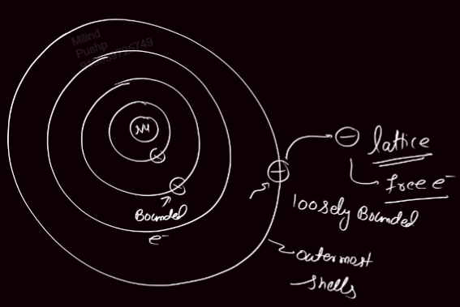

##### Non-conductors 
aka **Insulators or Dielectric.**
[[14 Dielectrics]]

They do not have free e as to remove the outermost e a lot of E is required. 

They are bad conductors of energy and electricity. It creates a very high resistance. 

The charge in conductor stays in its volume.

### Charging
##### Thermionic Effect
The KE of e is directly proportional to temp..

As we increase temp. KE increases the e get removed and the metal gets +vely charged. 

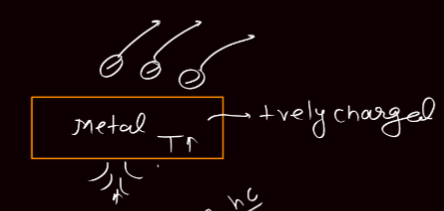

##### Photoelectric Effect
A high E photon transfers its E to the outer e of the metal and removed it thus +vely charging it.

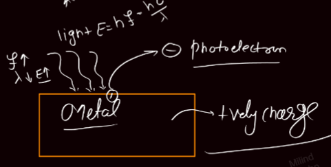

##### Field Emission
We bring a highly +vely charged object near the metal which attracts the -vely charged e and thus charge the metal +vely. 

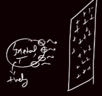

##### Friction
Rubbing two materials together transfers e to the material which has more [[03 Electron Affinity|e affinity.]] 

It will charge both of the materials. 

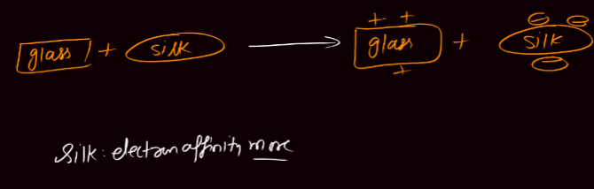

##### Conduction 
If we connect two conductors one of which has charge, the charge gets evenly distributed and the neutral also gets charged. 

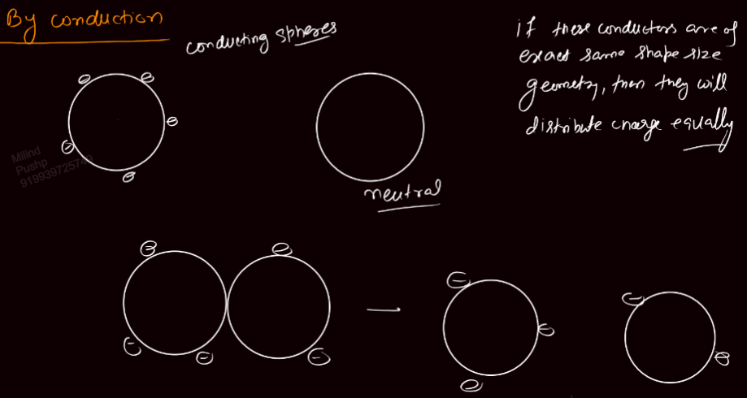

##### Induction 
Due to presence of charges near a conductor, charge on conductor may redistribute itself. This phenomenon is known as induction.

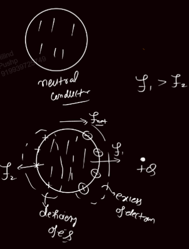

To charge using induction,

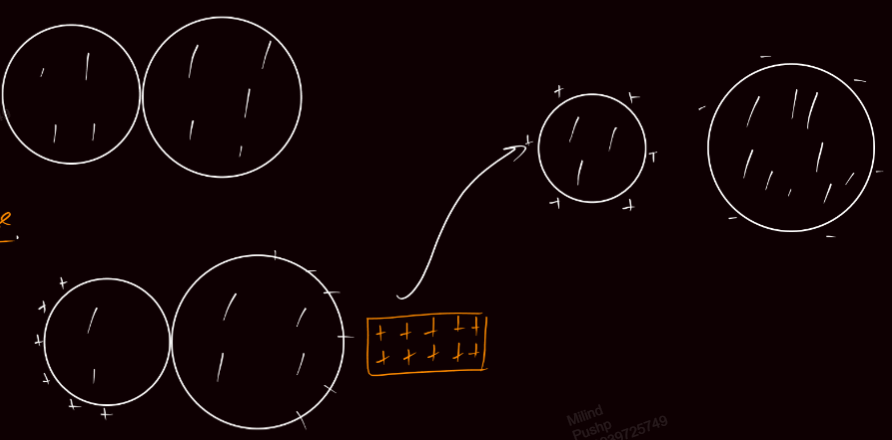

## Solid Angle
We know that angle is defined as,
$$\theta = \frac{ \text{Arc} }{ R }$$

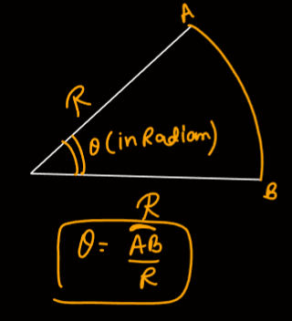

Similarly, in 3D, solid angle is defined as,
$$\ohm = \frac{ \text{Area} }{ R^{2} }$$
where area is the section of spherical surface which is intersected by the cone whose apex solid angle is $\Omega$.

Solid angle has unit **steradian.** 

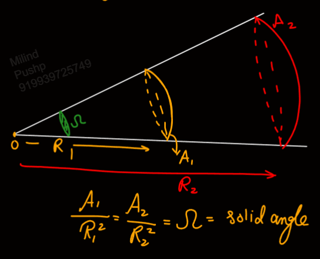

For complete sphere,
$$\ohm = \frac{ 4\pi R^{2} }{ R^{2} } = 4\pi \ \text{steradian}$$

Like complete circle, for which angle is $2\pi$.

**Flux per unit solid angle/steradian,**
$$\frac{ \phi }{ 4 \pi \varepsilon_{o} } = kQ$$
It has unit $\ce{ N m^{2} steradian^{-1} }$. The dimensions will remain the same because steradian, like radian does not have dimensions.

#### Relation Between Solid and Plane Angle
Relation between Radian and Steradian. 

$$\ohm = \frac{ A }{ R^{2} } = 2\pi(1-\cos \theta)$$
where $\theta$ is semi apex angle.

Solid angle or flux per unit solid angle is useful in calculating the flux through a disc.

Flux through a solid angle $\Omega$,
$$\phi = \frac{ Q \Omega }{ 4\pi \varepsilon_{o} } = kQ \Omega = kQ\ 2\pi (1 - \cos \theta)$$

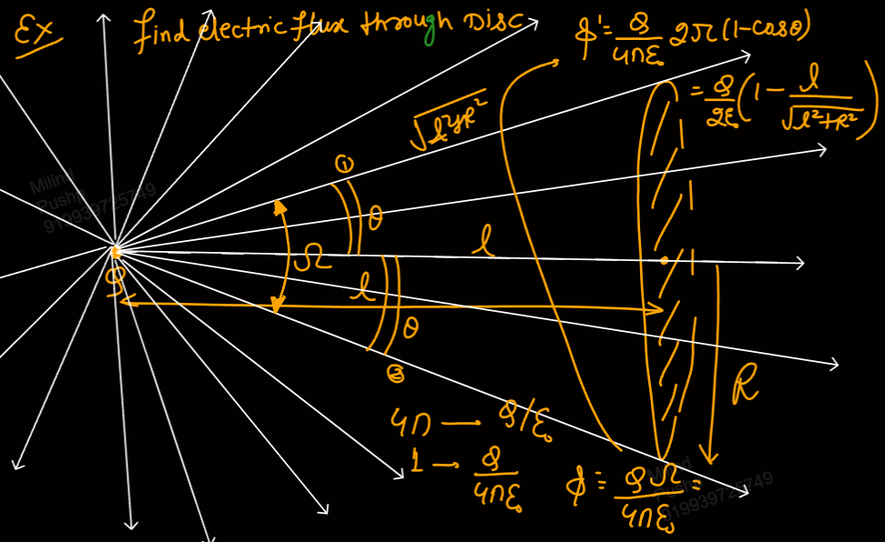