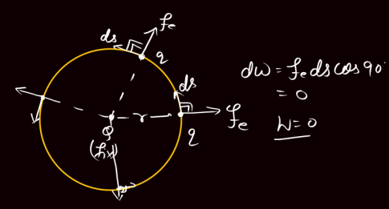
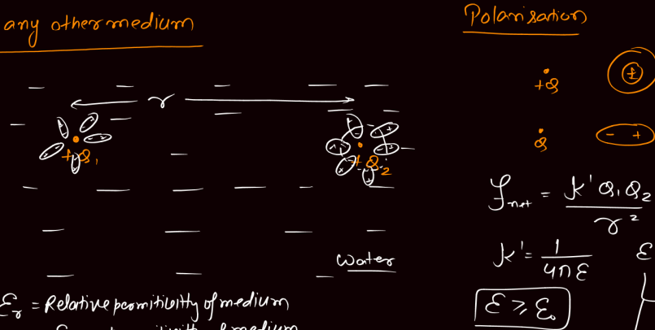
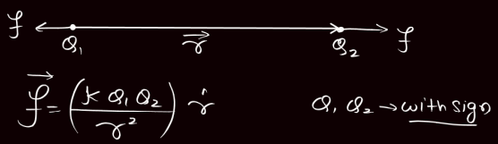
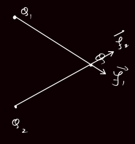
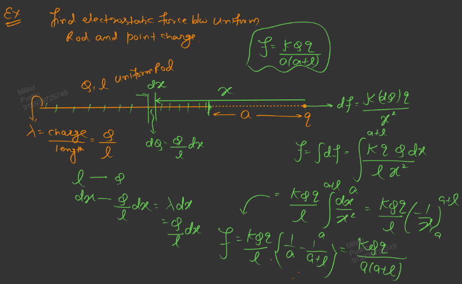
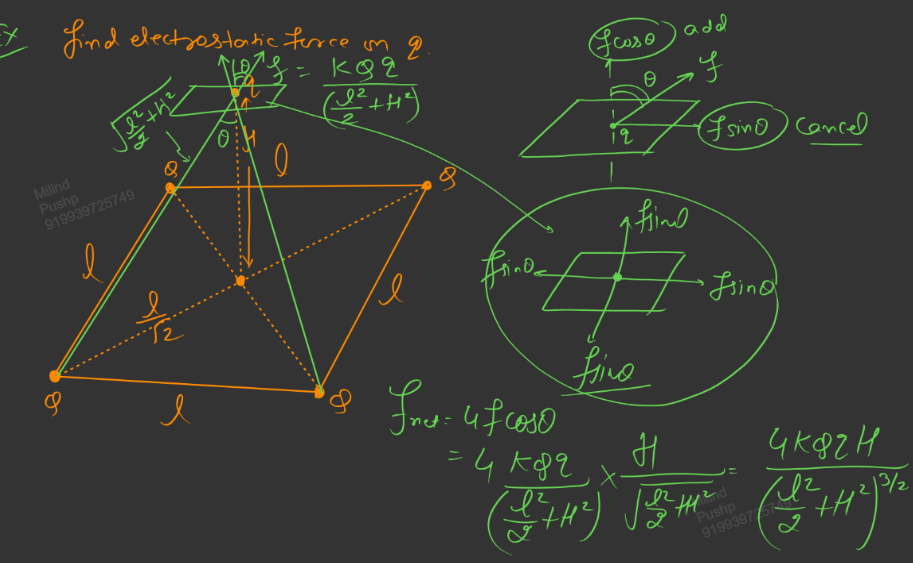
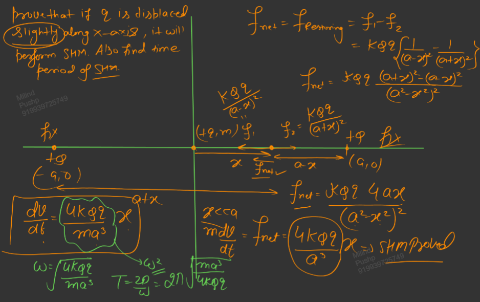
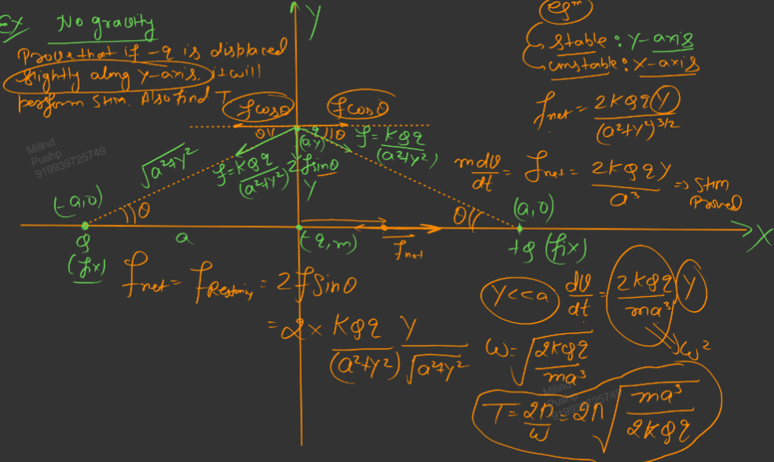
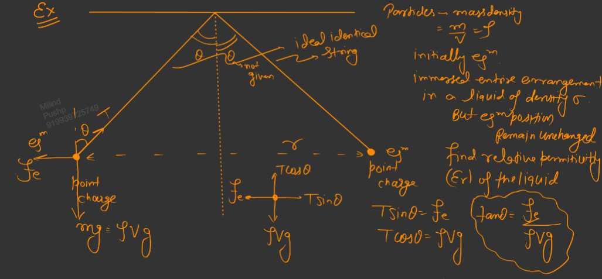
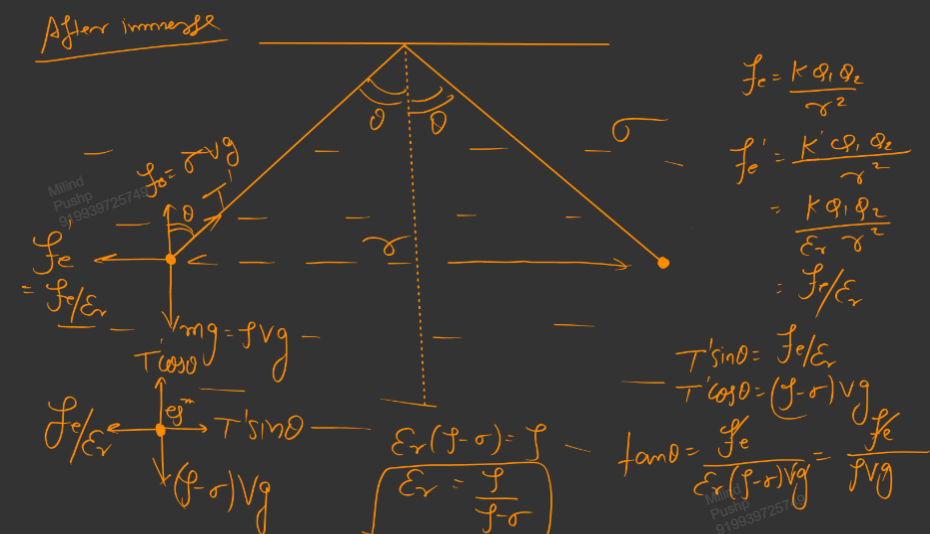

Links: [[00 Electrostatics]]
___
# Coulomb's Law
It is an experimental law and it tells the electrostatic force between two point charges. It follows inverse square law. 

*The force of attraction or repulsion between 2 charges is directly proportional to the product of their magnitudes and inversely proportional to the square of distance between them.* 

$$f = \frac{ kq_{1}q_{2} }{ r^{2} } = \frac{ 1 }{ 4\pi\varepsilon_{o} } \frac{ q_{1}q_{2} }{ r^{2} }$$
where, $\varepsilon_{o}$ is the permittivity of free space.

$$\frac{1}{4\pi\varepsilon_{o}} = k = 9 \times 10^{9} \ce{\ N m^{2} C^{-2} }$$

This force acts along the line joining the two charges (central force) and is conservative and thus we can de fine potential energy for it.

#### Permittivity
$\varepsilon_{o}$ is the permittivity of free space/vacuum/air.
$$\varepsilon_{o} = \frac{ 1 }{ 4\pi k } = 8.85 \times 10^{-12} \ce{ \ \frac{C^{2}}{N-m^{2}} }$$

$\varepsilon$ is the permittivity of a medium and it equal to or more than $\varepsilon_{o}$. 
The more $\varepsilon$ is the less is the force applied. 

This is because when a charge is placed in a medium, the molecules around the charge are polarised which decrease the effective charge and thus the force between the charged particles. 

The media which are easily polarised have high value of $\varepsilon$. 

##### Relative Permittivity 
$\varepsilon_{r}$ is the relative permittivity of medium wrt free space and is a unitless and dimensionless quantity.

$$\varepsilon_{r} = \frac{ \varepsilon  }{ \varepsilon_{o} }$$

Relative permittivity is always greater than or equal to 1. 

For air, $\varepsilon_{r} = 1$
For water, $\varepsilon_{r} = 81$
For metal, $\varepsilon_{r} \to \infty$

The value of k for any other medium,
$$k_{m} = \frac{ k }{ \varepsilon_{r} }$$
And thus the force in any other medium becomes $1 /\varepsilon_{r}$ times its value in vacuum.
$$F_{m} = \frac{ F }{ \varepsilon_{r} }$$

### Vector Form 
$$\vec{f} = \frac{ kq_{1}q_{2} }{ r^{2} }\ \hat{r}$$
$$\vec{f} = \frac{ kq_{1}q_{2} }{ r^{3} }\ \vec{r}$$
Here $q_{1},q_{2}$ are with sign and $\vec{r}$ is vector whose tail is at the charge due to  which force is to be found. 

### Principle of Superposition
The net force on a charge due to multiple charges is the vector sum of all the individual forces. 

$$\vec{f}_{net} = \vec{f}_{1} + \vec{f}_{2}$$

### Charge Densities

- Linear: $\lambda = \displaystyle \frac{Q}{l}$
- Areal: $\sigma = \displaystyle \frac{Q}{A}$
- Volumetric: $\rho = \displaystyle \frac{Q}{V}$

For extended object, 
- Make a small element and consider it a point charge. 
- Find this charge in terms of l, A or V. 
- Find the force using coulomb's law on this element. 
- Now integrate it over the whole body to find the net force. 

## Examples 

3 Charge Systems, [[00 Simple Harmonic Motion]]

