Links: [[01 Coulomb's Law]]
___
# Electric Field
It is the region of space in which a charge particle or system of charges have their electric effects. 

**Electric Field Intensity ($\vec{E}$)** represents just how much the electric effects are. It quantifies the electric effect at a point and is a vector quantity. 

Popularly instead of "electric field intensity" we simply say "Electric Field."

E at a point P due to a system of charges is defined as electrostatic force experienced by test charge placed at point P, per unit test charge. Thus, E does not depend on test charge.

E is also defined as the amount of force experienced by unit +ve charge (+1 C) at a point.

That is,
$$\vec{E} = \frac{ \vec{f}_{e} }{ q_{o} }$$
If $q_{o}$ is +ve then $E \parallel f_{e}$.
If $q_{o}$ is -ve then $E \upharpoonleft \! \downharpoonright  f_{e}$.

E has Unit is N/C or V/m (Volt per meter). 

To change the electric field, we can alter charge distribution or medium.

The principle of superposition applied to electric field also.

## Electric Fields due to Various Objects
The density of field lines dictate the strength of electric field. 

Constant electric field means that the direction and distance between the field lines does not change. 

### E due to Point Charge
$$\vec{E} = \frac{ \vec{f}_{e} }{ q_{o} } = \frac{ kQ }{ r^{3} } \vec{r}$$
Here $Q$ is with sign.

And magnitude is,
$$E = \frac{ kQ }{ r^{2} }$$
Due to +ve charge, E is radially outwards and due to -ve charge, it is radially inwards. 

E is inversely proportional to (distance from charge)$^{2}$

##### Examples
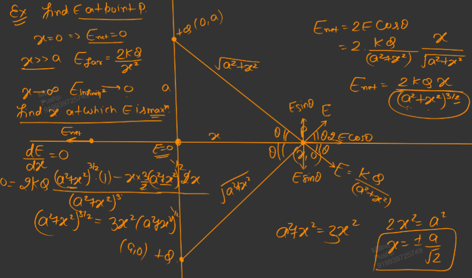

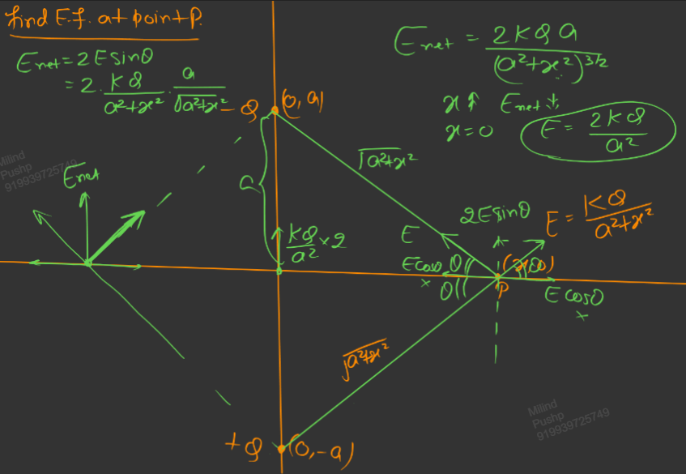
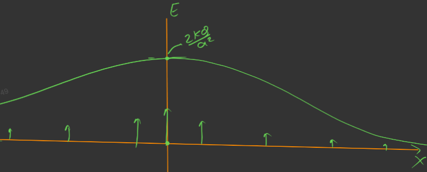

### [[02.1 Ring and Disk|Field due to Ring & Disk]]

### [[03.2 Wire|Field due to Wire]]

### [[03.3 Sphere|Field due to Sphere]]

## Electric Lines of Force (ELOF)
They are imaginary lines or curves, the tangent to which at a point provides direction of electric field at that point.

They gives pictorial representation of electric field. 

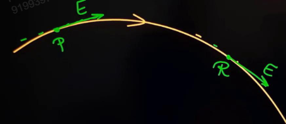

**Line Density:** No. of ELOF per unit cross sectional area. 

#### Properties of ELOF
1. They are imaginary lines.

1. Electric field will be tangential to ELOF. 

1. ELOF can only originate form +ve charge or infinity.

1. ELOF can only terminate at -ve charge or infinity. 

2. Two ELOF will never intersect. 
   
   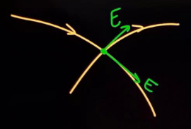

6. ELOF due to stationary charges will never make a closed loop. 
   
   This is because the line originates from a +ve charge and it cannot terminate at it.
   
   This can also be explained by the fact that if it made loops, then to travel a +ve charge on the loop, the work done will be +ve. This cannot happen as electric force is conservative and the work done should be 0 for 0 displacement.

	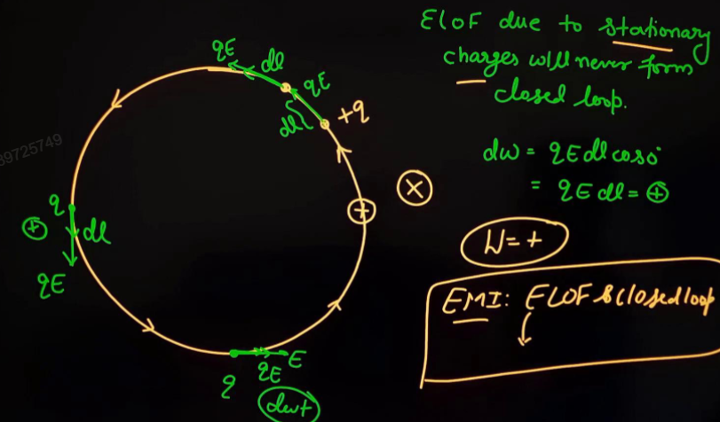

   
7. ELOF are always from high to low potential. 

8. Line density at any point is proportional to electric field intensity. Thus it is proportional to magnitude of electric field intensity at that point.

#### ELOF due to Various Objects 
**ELOF due to +ve point charge is radially outwards.** 

Here we can see that ratio of line density is the same as ratio of electric field. 

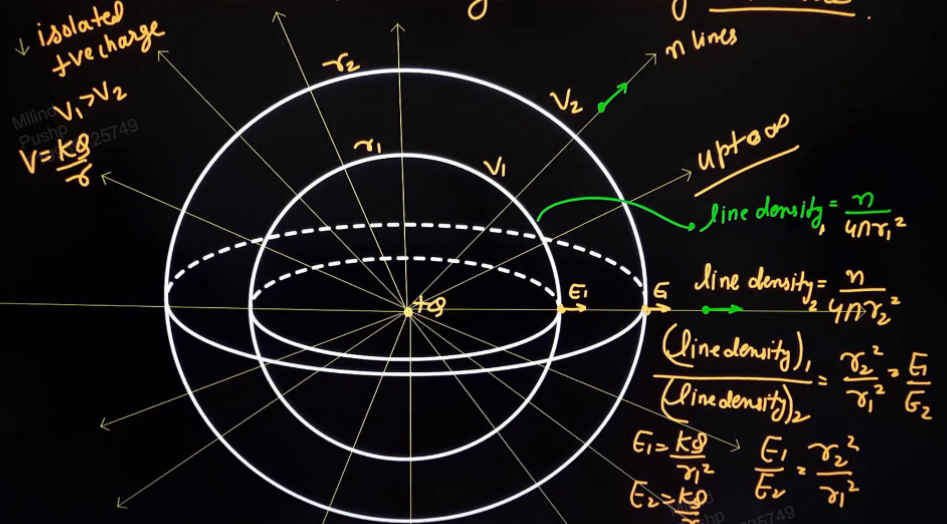

**ELOF due to -ve point charge is radially inwards.** 

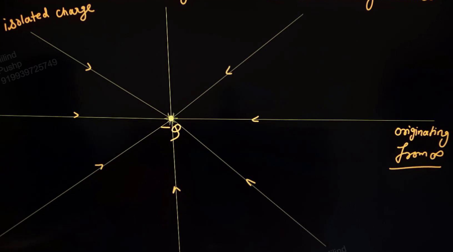

No of ELOF is directly proportional to charge. In the diagram below, there are 8 ELOF for 5 $\mu$C and 16 for -10 $\mu$C.

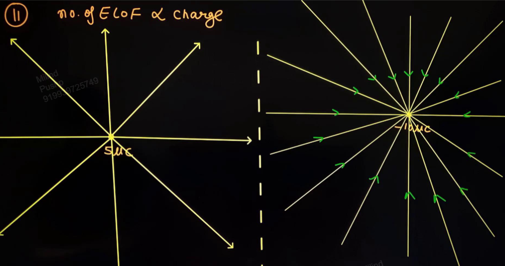

**ELOF for dipole,**
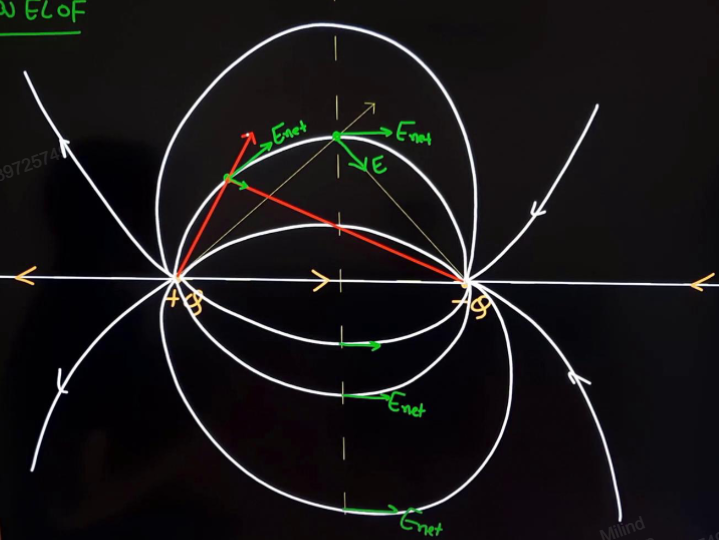

**ELOF for two +ve point charges,**
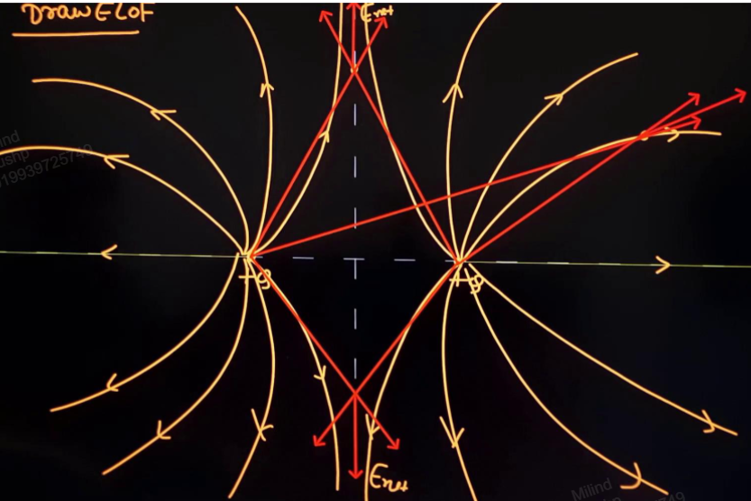
