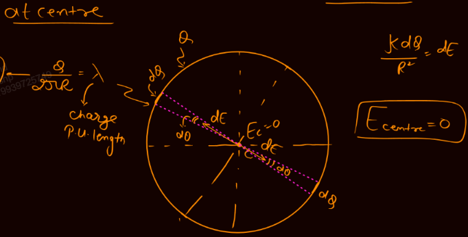
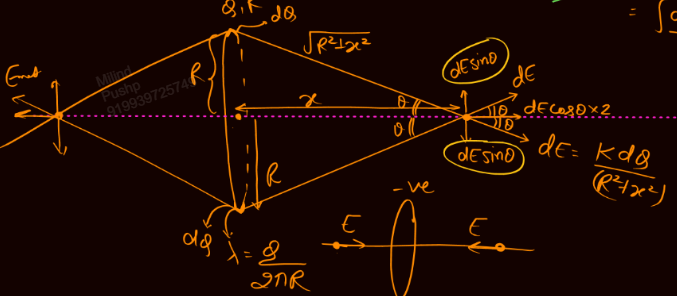
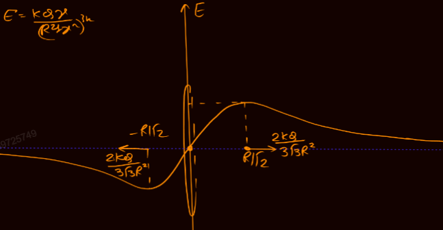
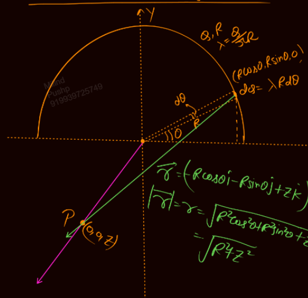
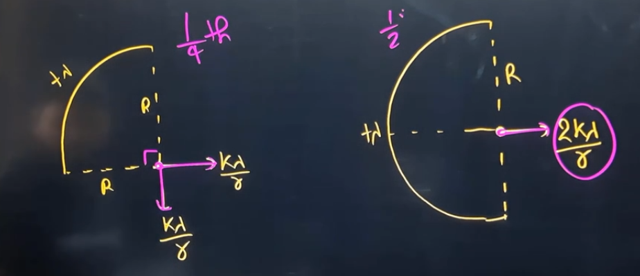
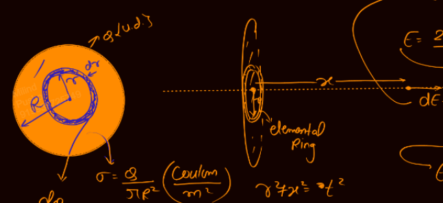
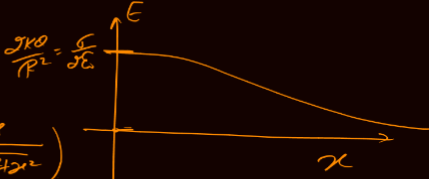
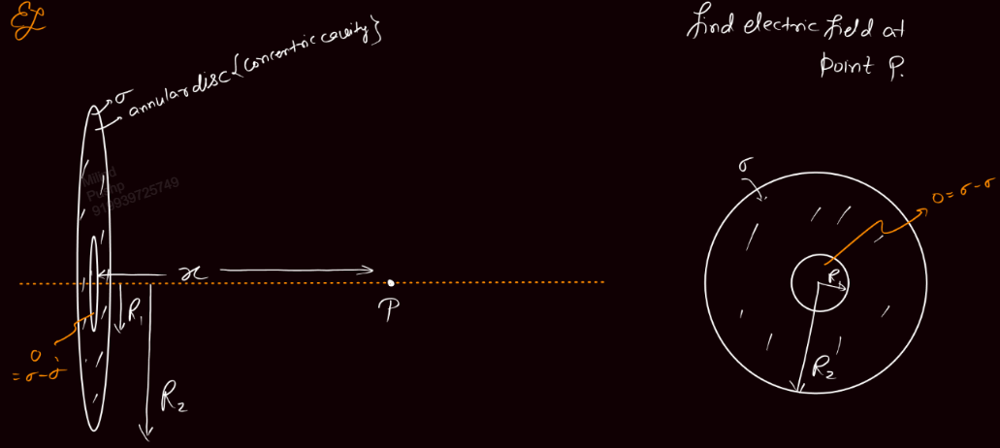
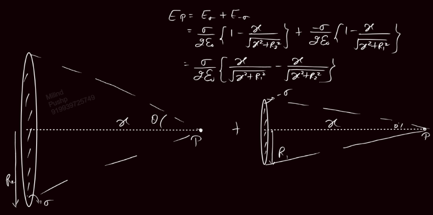

Links: [[02 Electric Field]]
___
# E due to a Ring
Ring is uniform, i.e. equal lengths have equal charge.

We define a $\lambda$ here,
$$\lambda = \frac{ Q }{ 2\pi R }$$

#### At Centre 

We take a small element subtending an angle $d\theta$ at the centre. 

We can see that the field by one element is cancelled out by the element diametrically opposite to it. Thus the E at centre will be zero.

$$E_{C} = 0$$

#### On Axis
We take a small charge $dQ$, due to which we have $dE$,
$$dE = \frac{ kdQ }{ (R^{2} + x^{2}) }$$
Now this has a vertical and horizontal component. The vertical is cancelled by the small charge $dQ$ diametrically opposite to the first $dQ$. 

Thus, E on axis is along it.

That is,
$$
\begin{split}
E &= \int dE \cos \theta \\
&= \int \frac{ kdQ }{ (R^{2} + x^{2}) } . \frac{ x }{ \sqrt{ R^{2} + x^{2} } } \, dx \\
&= \frac{ kx }{ (R^{2} + x^{2})^{3/2} } \int_{0}^{Q} dQ \\
&= \frac{ kQx }{ (R^{2} + x^{2})^{3/2} } 
\end{split}
$$

Thus finally,
$$E = \frac{ kQx }{ (R^{2} + x^{2})^{3/2} }$$

Now, if $x \gg R$, i.e. very far,
$$E_{far} = \frac{kQ}{x^{2}}$$

Again, if $x \ll R$, i.e. very near but not at centre,
$$E_{near} = \frac{ kQx }{ R^{3} }$$

#### Graph of E vs x for +vely charged Ring
E is max at $\displaystyle \frac{R}{\sqrt{ 2 }}$ and is,
$$E = \frac{ 2kQ }{ 3\sqrt{ 3 }R^{2} }$$

## E due to Half Ring
Here, 
$$\lambda = \frac{ Q }{ \pi R }$$

#### At Centre
We take an element subtending an angle $d\theta$, $\theta$ from the diameter. 
This has charge,
$$dQ = \frac{ Q }{ \pi }d\theta$$

Due to this electric field is,
$$dE = \frac{ kQd\theta }{ \pi R^{2} }$$
Which has two components,
$$dE_{x} = dE\cos \theta$$
$$dE_{y} = dE\sin \theta$$

Now the x components cancel each other out. 
Thus,
$$
\begin{split}
E &= \int_{0}^{\pi} \frac{ kQ }{ \pi R^{2} } \sin \theta \, d\theta \\
&= \frac{ 2kQ }{ \pi R^{2} }
\end{split}
$$

In terms of $\lambda$,
$$E = \frac{ 2k\lambda }{ R }$$

#### On Axis
Here too we take elements as before. This element is at $(R\cos \theta, R\sin \theta, 0)$

We have to find E at point $(0,0,z)$, i.e.
$$\vec{r} = -R\cos \theta \hat{i} - R\sin \theta \hat{j} + z\hat{k}$$
$$r = \sqrt{ R^{2} + z^{2} }$$

Now, dE due to dQ is,
$$d\vec{E} = \frac{ k(\lambda Rd\theta)(-R\cos \theta \hat{i} - R\sin \theta \hat{j} + z\hat{k}) }{ (R^{2} + z^{2})^{3/2} }$$
The net E will be,
$$
\begin{split}
d\vec{E} &= \int dE_{x} + \int dE_{y} + \int dE_{z} \\
\\
\int dE_{x} &= \frac{ -k\lambda R^{2} }{ (R^{2} + z^{2})^{3/2} } \int_{0}^{\pi} \cos \theta \, d\theta = 0 \\
\\
\int dE_{y} &= \frac{ -k\lambda R^{2} }{ (R^{2} + z^{2})^{3/2} } \int_{0}^{\pi} \sin \theta \, d\theta = \frac{ -2k\lambda R^{2} }{ (R^{2} + z^{2})^{3/2} } \\
\\
\int dE_{y} &= \frac{ -k\lambda Rz }{ (R^{2} + z^{2})^{3/2} } \int_{0}^{\pi} \, d\theta = \frac{ -k\lambda z R \pi }{ (R^{2} + z^{2})^{3/2} } \\
\end{split}
$$
Thus the net E comes out to be,
$$\vec{E} = \frac{ -2k\lambda R^{2} }{ (R^{2} + z^{2})^{3/2} } \hat{j} + \frac{ k\lambda Rz\pi }{ (R^{2} + z^{2})^{3/2} } \hat{k}$$

Similarly we can find for quarter ring.

### E due to Arc

1/4th:
$$E = \frac{ k\lambda }{ r }\sqrt{ 2 }$$

Half:
$$E = \frac{ 2k\lambda }{ r }$$

## E due to Disk
Here we define $\sigma$,
$$\sigma = \frac{ Q }{ \pi R^{2} }$$

We will take elemental rings of width dr, r distance from the centre. 
This elemental ring has charge,
$$dQ = \frac{ 2Qrdr }{ R^{2} }$$

Due to this dE is,
$$dE = \frac{ kdQx }{ (r^{2} + x^{2})^{3/2} }$$
The net E is,
$$
\begin{split}
E &= \int_{0}^{R} \frac{ k_{2}Qrdr }{ R^{2}(r^{2} + x^{2})^{3/2} } \\
&= \frac{ 2kQx }{ R^{2} } \int_{0}^{R} \frac{ rdr }{ (r^{2} + x^{2})^{3/2} } \\
&= \frac{ 2kQ }{ R^{2} } \left( 1 - \frac{ x }{ \sqrt{ R^{2} + x^{2} } } \right)
\end{split}
$$
Thus finally,
$$E = \frac{ 2kQ }{ R^{2} } \left( 1 - \frac{ x }{ \sqrt{ R^{2} + x^{2} } } \right)$$
$$E = \frac{ \sigma }{ 2\varepsilon_{o} } \left( 1 - \frac{ x }{ \sqrt{ R^{2} + x^{2} } } \right)$$

We can also write this as,
$$E = \frac{ 2kQ }{ R^{2} } (1 - \cos \theta)$$
$$E = \frac{ \sigma }{ 2\varepsilon_{o} } (1 - \cos \theta)$$

Now, if $x \to 0$,
$$E_{C} = \frac{\sigma}{2\varepsilon_{o}}$$
And if $x \to \infty$,
$$E_{\infty} \to 0$$

#### Graph of E vs x

### Examples 
For cavity questions, we will use the same method as in [[01 Centre of Mass#COM of Objects with Cavity]]

