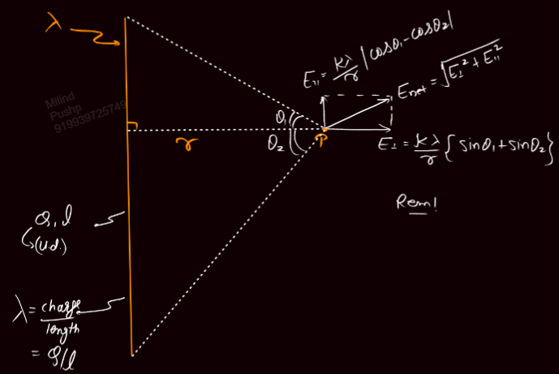
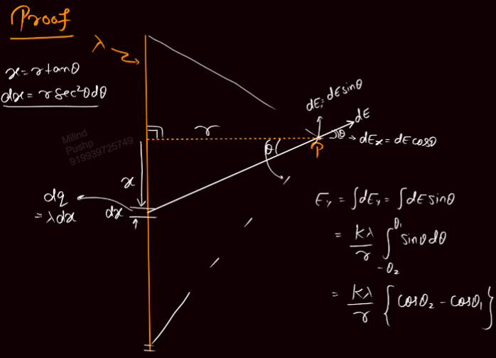
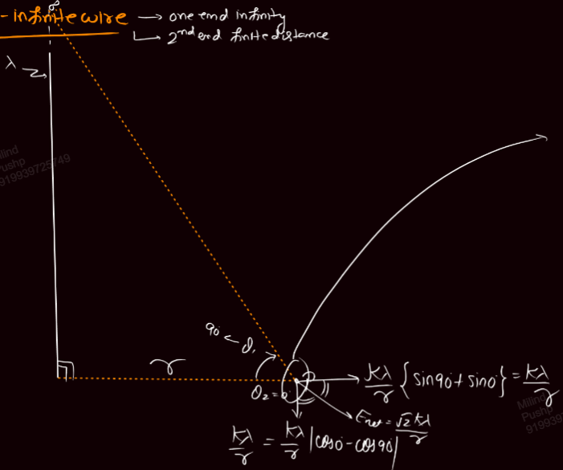
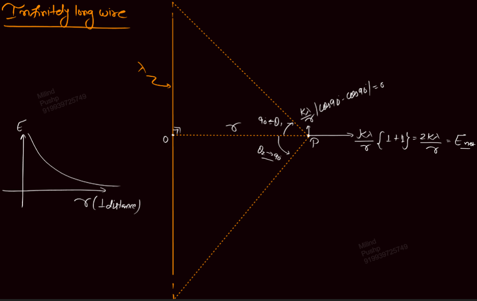
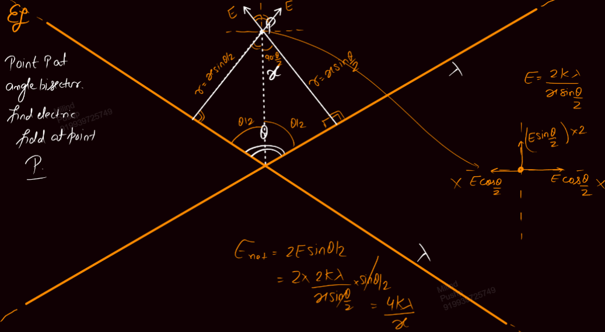
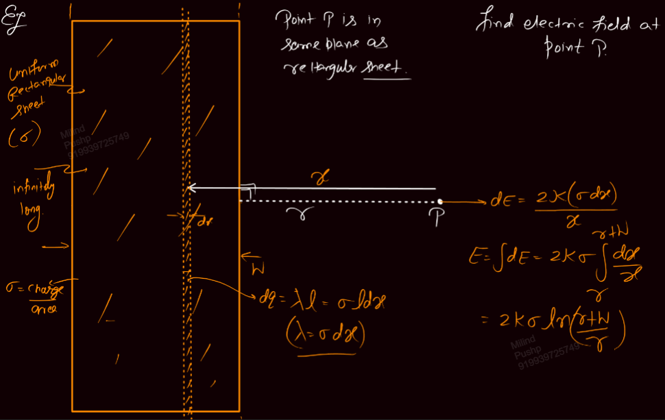
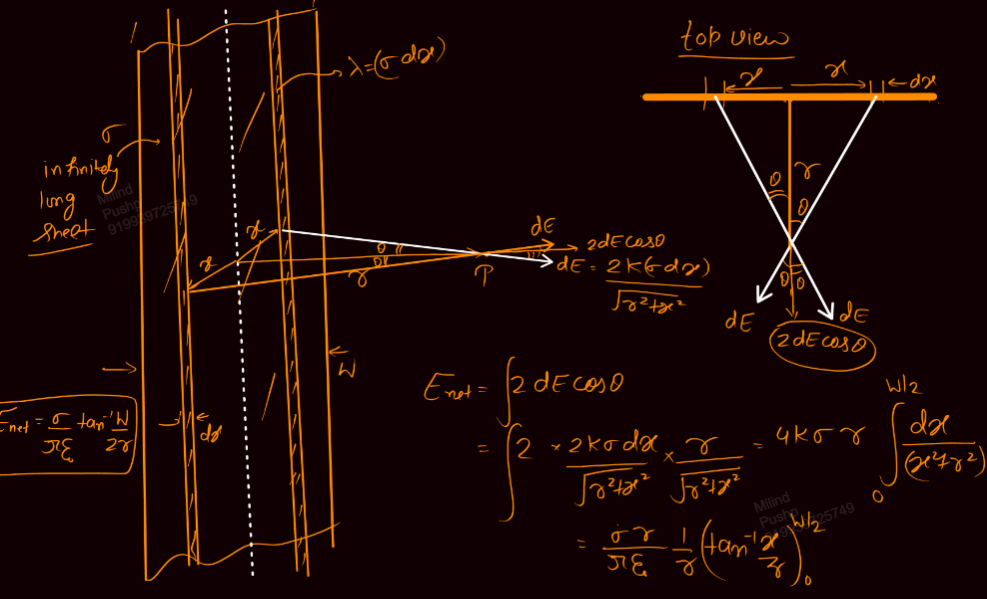
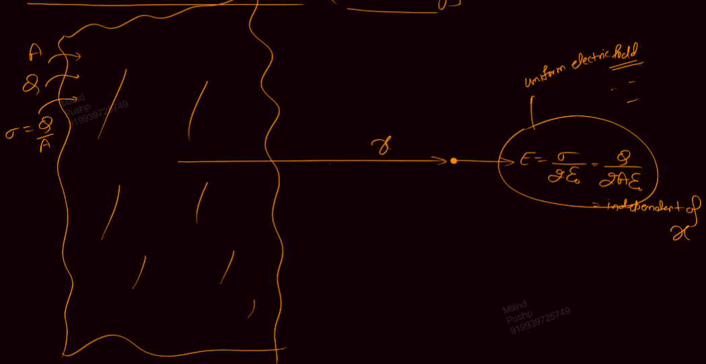

Links: [[02 Electric Field]]
___
# E due to Wire
Here,
$$\lambda = \frac{ Q }{ l }$$

#### Finitely Long Wire
The top end makes angle $\theta_{1}$ and the bottom makes $\theta_{2}$.

$$
\begin{split}
E_{\perp} &= \frac{ k\lambda }{ r }(\sin \theta_{2} + \sin \theta_{2}) \\
E_{\parallel} &= \frac{ k\lambda }{ r }|\cos \theta_{2} - \cos \theta_{2}|
\end{split}
$$
The direction of parallel one is towards the part which is smaller because the other larger part will have more E than the smaller part. 

##### Derivation 
We take an element of length dx, x distance from the foot of perpendicular. This is at an angle $\theta$ from the perpendicular.
This has charge,
$$dQ = \lambda dx$$

Also,
$$
\begin{split}
x &= r \tan \theta \\
dx &= r\sec^{2}\theta d\theta 
\end{split}
$$

Now, due to dQ, the dE at P is,
$$dE = \frac{ k\lambda dx }{ (r\sec \theta)^{2} }$$

Along x axis,
$$
\begin{split}
E_{x} &= \int dE\cos \theta \\
&= \int \frac{ k\lambda r\sec^{2}\theta d\theta \cos \theta }{ r^{2} \sec^{2} \theta } \\
&= \frac{ k\lambda }{ r } \int_{-\theta_{2}}^{\theta_{1}} \cos \theta \, d\theta \\
&= \frac{ k\lambda }{ r } (\sin \theta_{1} + \sin \theta_{2}) 
\end{split}
$$

Along y axis, similarly,
$$
\begin{split}
E_{y} &= \int dE\sin \theta \\
&= \frac{ k\lambda }{ r } |\cos \theta_{1} - \cos \theta_{2}|
\end{split}
$$

#### Semi Infinite Wire
When one end is at $\infty$ but the other is not. 

We will find E at perpendicular point from the finite end point.

Here, since the wire if infinite, $\theta_{1} \to 90^{\circ}$ and $\theta_{2} = 0$.
Thus,
$$
\begin{split}
E_{\perp} &= \frac{ k\lambda }{ r } \\
E_{\parallel} &= \frac{ k\lambda }{ r } \\
E_{net} &= \frac{ \sqrt{ 2 }k\lambda }{ r } 
\end{split}
$$

#### Infinitely Long Wire
Both the ends are at $\infty$ and hence $\theta_{1}, \theta_{2} \to 90$

Thus,
$$E_{\perp} = \frac{ 2k \lambda }{ r } = E_{net}$$
$$E_{\parallel} = 0$$

E is directed perpendicularly outward from the wire.

$$\vec{E} = \frac{ 2k\lambda }{ r^{2} } (\overline{OP})$$

#### Examples

#important 

#### Infinitely Large Sheet
$W \to \infty$ and $l \to \infty$. 

$$E = \frac{ \sigma }{ 2 \varepsilon_{o} }$$
which is independent of x and thus unirform.

