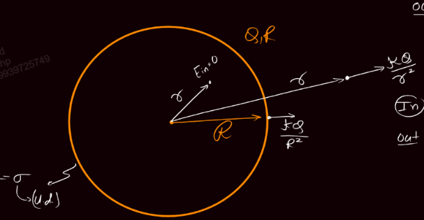
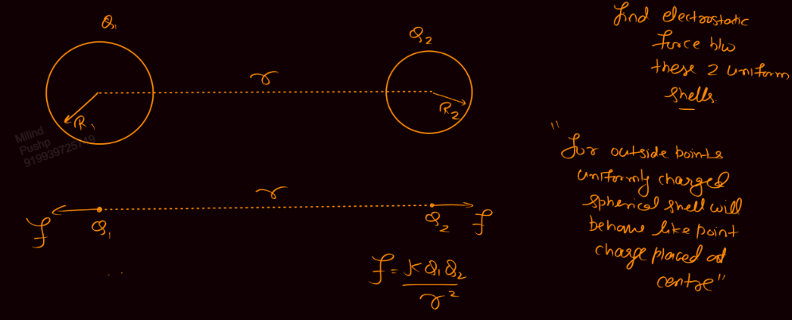
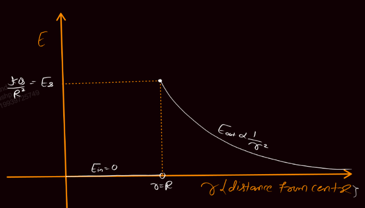
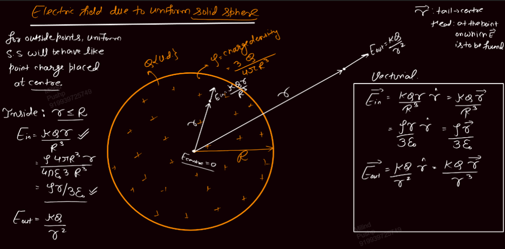
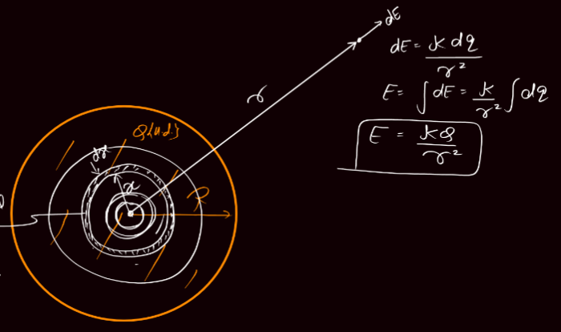
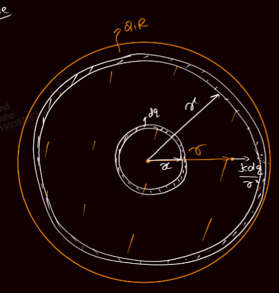
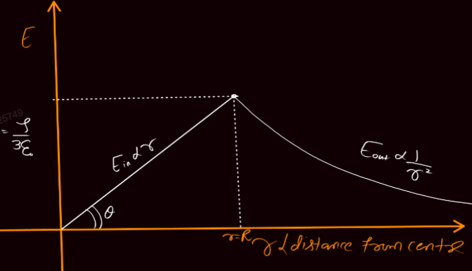
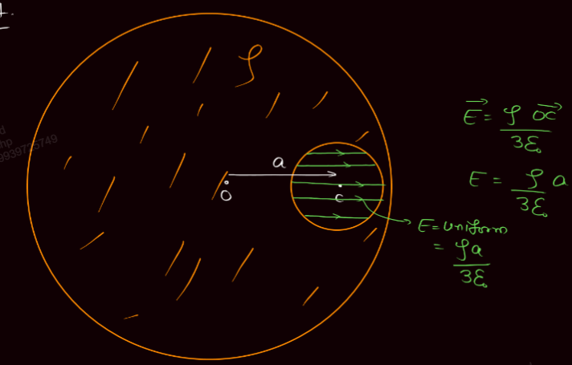
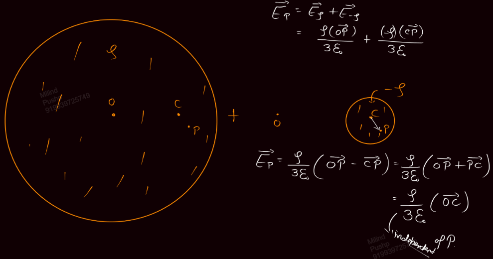

Links: [[02 Electric Field]]
___
# E due to Sphere
### Uniformly Charged Hollow Sphere
$$
\begin{split}
E_{in} &= 0 \\
E_\text{surface} &= \frac{ kQ }{ R^{2} } \\
E_{out} &= \frac{ kQ }{ r^{2} } \\
\end{split}
$$

Thus for a point outside the shell, it behaves like a point charge,

##### Graph

## Uniformly Charged Solid Sphere
$$
\begin{split}
E_{in} &= \frac{ kQr }{ R^{3} } = \frac{ \rho r }{ 3\varepsilon_{o} } \\
E_\text{surface} &= \frac{ kQ }{ R^{2} } \\
E_{out} &= \frac{ kQ }{ r^{2} } \\
\end{split}
$$

Here too, for outside points, uniform solid sphere behaves like a point charge placed at its centre.

#### Derivation
Here,
$$\rho = \frac{ 3Q }{ 4\pi R^{3} }$$

##### Outside 
Here we take elemental shells of dx thickness and of radius x. 
This shell has charge,
$$dQ = \frac{ 2Qx^{2}dx }{ R^{2} }$$

Now this elemental shell has field at P,
$$dE = \frac{ kdQ }{ r^{2} }$$
The net field is,
$$E = \int \frac{ kdQ }{ r^{2} } = \frac{ kQ }{ r^{2} }$$

##### Inside 
We take an elemental shell of radius x and thickness dx. 

Now we find that the E at P is only due to a solid sphere of radius r as the outside shells don't contribute to the field.

$$E = \int_{0}^{R} dE = \int_{0}^{r} dE + \cancelto{ 0 }{ \int_{r}^{R} dE }$$

Now this inside sphere has charge,
$$
\begin{split}
Q &= \rho V \\
&= \frac{ 3Q }{ 4\pi R^{3} } . \frac{ 4\pi r^{3} }{ 3 } \\
&= \frac{ Qr^{3} }{ R^{3} }
\end{split}
$$

Thus the field is,
$$E_{in} = \frac{ kQ_{in} }{ r^{2} } = \frac{ kQr }{ R^{3} } = \frac{ \rho r }{ 3\varepsilon_{o} }$$

#### Graph

#### Inside a Cavity
The E is constant inside a cavity if it is not concentric. 

If the cavity is concentric then the field is zero.

$$E_{cav} = \frac{ \rho }{ 3\varepsilon_{o} } (\overline{OC})$$
Since this is independent of P, the field inside the cavity is uniform.

