Links: [[00 Work]], [[03.2 Potential Energy]], [[02 Electric Field]], [[05 Potential Difference]]
___
# Electrostatic Potential
Work done by external force in bringing a unit +ve charge very slowly from infinity to a point P is called the Potential at point P.
$$or$$
Negative of work done by electric field to bring unit +ve charge from $\infty$ to point P.

$$\frac{ (W_{ext})_{\infty \to P} }{ q_{o} } = \frac{ -(W_{ele})_{\infty \to P} }{ q_{o} } = V_{P}$$

$$V_{p} = \frac{ (W_{ele})_{P \to \infty} }{ q_{o} }$$

It is a scalar quantity and can be +ve, -ve or zero.
Unit is J C$^{-1}$ = V. 

We consider electric potential to be zero at infinity.

Now,
$$
\begin{split}
V &= \frac{ -W_{ele} }{ q_{o} } \\
&= \frac{ - \int_{\infty}^{P} q_{o}\vec{E} \, d\vec{r} }{ q_{o} } \\
&= \int_{P}^{\infty} \vec{E} \, d\vec{r} \\
\end{split}
$$
This integral is called *line integral of electric field.*

## Electric Potentials due to Various Objects
### V due to Point Charge
$$
\begin{split}
V &= \frac{ (W_{ele})_{P \to \infty} }{ q_{o} } \\
&= \frac{ \int_{P}^{\infty} q_{o}E \, dr }{ q_{o} } \\
&= \int_{r}^{\infty} \frac{ kQ }{ x^{2} } \, dx \\
&= \frac{ kQ }{ r }
\end{split}
$$
Thus,
$$V = \frac{ kQ }{ r }$$

Here, Q should be put with sign. And thus for +ve Q, V will be +ve, -ve for -ve and 0 for 0. 

#### Graph 

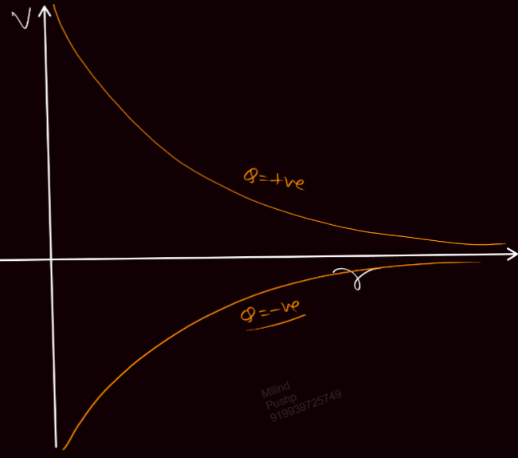

### Potential due to Ring
[[02.1 Ring and Disk|E due to Ring and Disk]]

##### At Centre 
We take a small charge dQ on the ring. 
Due to this we have potential,
$$dV = \frac{ kdQ }{ R }$$

Thus,
$$V_{C} = \frac{ kQ }{ R }$$
This is valid even if the ring has non uniformly distributed charge. 

This kQ/R is the potential for the centre of any arc as well. 

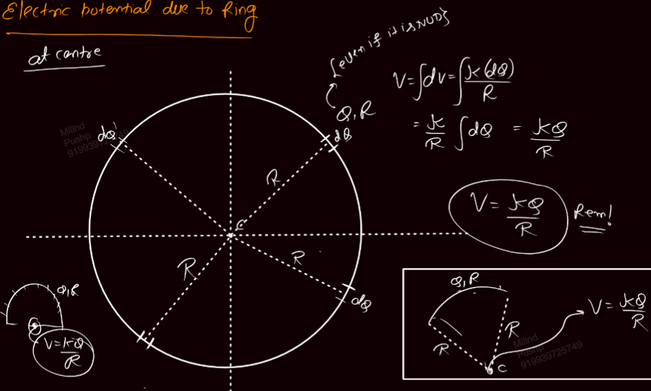

#### On axis
We again take a small charge dQ on the ring. 
Due to this the potential will be,
$$dV = \frac{ kdQ }{ \sqrt{ R^{2} + x^{2} } }$$

Now every charge on the ring has equal distance from the point and thus,
$$V = \frac{ kQ }{ \sqrt{ R^{2} + x^{2} } }$$

This is valid even if the charge is non uniformly distributed. 

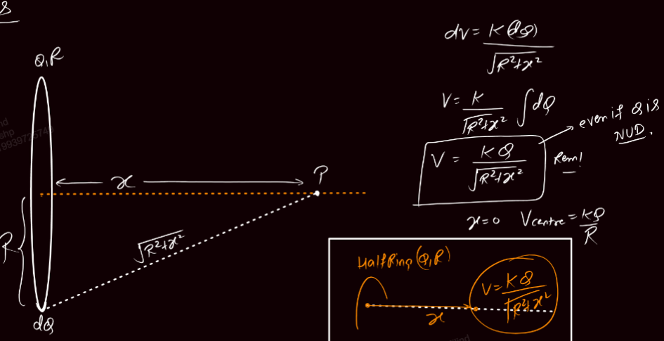

#### Graph 
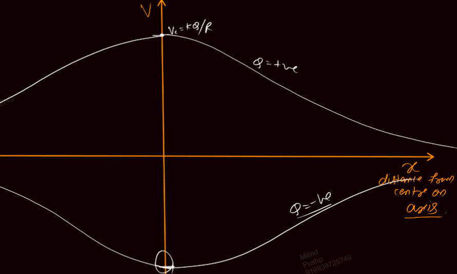

### Potential due to Uniform Disk
Here,
$$\sigma = \frac{ Q }{ \pi R^{2} }$$

We take elemental rings of radius r and thickness dr. This ring has charge,
$$dQ = 2\sigma \pi r dr = \frac{ 2Qrdr }{ R^{2} }$$

The potential due to this ring will be,
$$
\begin{split}
dV &= \frac{ kdQ }{ \sqrt{ r^{2} + x^{2} } } \\
&= \frac{ 2k Q }{ R^{2} }\frac{ rdr }{ \sqrt{ r^{2} + x^{2} } }
\end{split}
$$

The net potential is,
$$
\begin{split}
V &= \frac{ 2kQ }{ R^{2} } \int_{0}^{R} \frac{ rdr }{ \sqrt{ r^{2} + x^{2} } } \\
&= \frac{ 2kQ }{ R^{2} } (\sqrt{ R^{2} + x^{2} } - x) 
\end{split}
$$
After rationalisation,
$$V = \frac{ 2kQ }{ \sqrt{ R^{2} + x^{2} } + x }$$

In terms of $\sigma$
$$V_{P} = \frac{ \sigma }{ 2\varepsilon_{o} }(\sqrt{ R^{2}+x^{2} } - x)$$

For a very near point,
$$V_{near} = \frac{ 2kQ }{ R }$$
For a very far point,
$$V_{far} \to 0$$

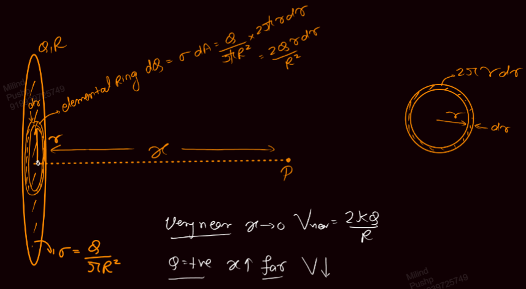

#### Graph 
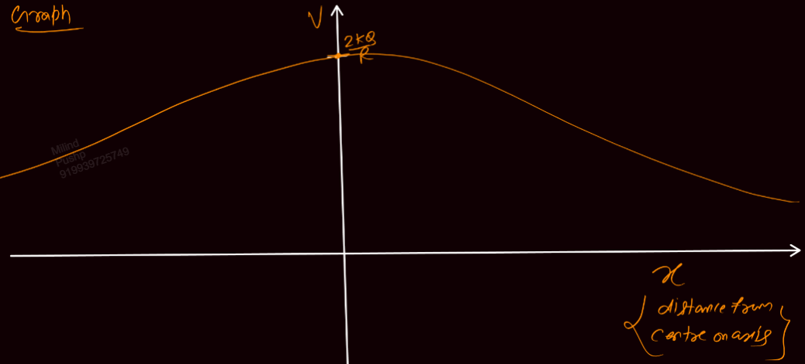

### Potential Due to Sphere
For an outside point, sphere behaves like a point charge with all the charge at its centre. 

#### Hollow Sphere
Here,
$$\sigma = \frac{ Q }{ 4\pi R^{2} }$$

Potentials will be,
$$
\begin{split}
V_{in} &= \frac{ kQ }{ R } = V_\text{centre} \\
V_\text{surface} &= \frac{ kQ }{ R } \\
V_\text{out} &= \frac{ kQ }{ r } \\
\end{split}
$$
Since there is no electric field inside, $V_\text{surface} = V_{in}$

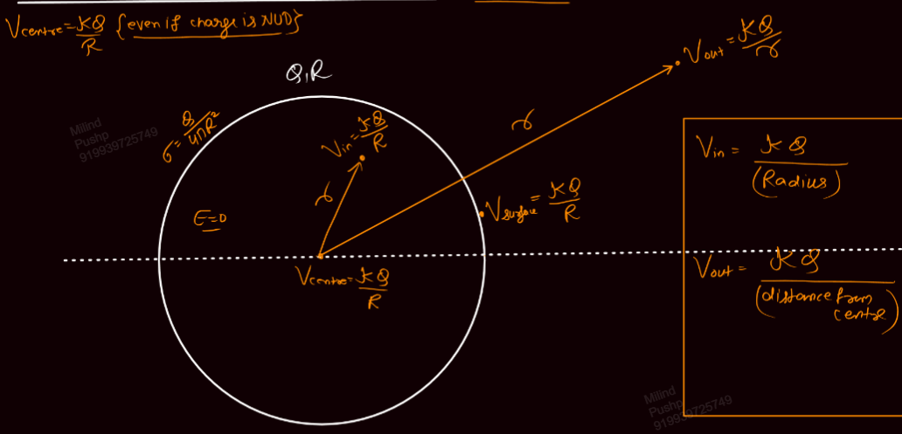

$V_\text{centre} = kQ /R$ even if the charge is non uniformly distributed. 

##### Graph 
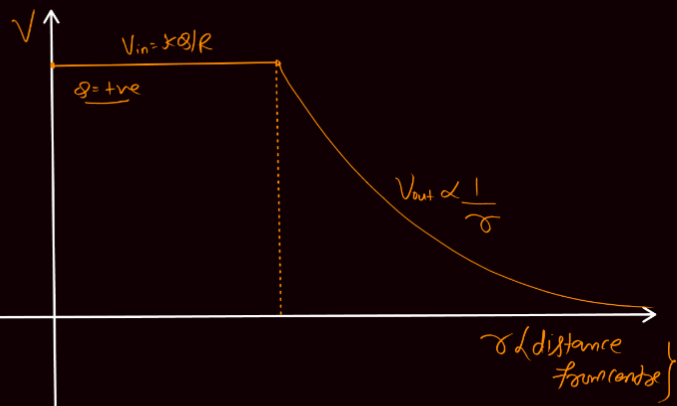

#### Solid Sphere

$$
\begin{split}
V_{in} &= \frac{ kQ }{ 2R^{3} } (3R^{2} - r^{2}) \\
V_\text{centre} &= \frac{3}{2} \frac{ KQ }{ R } \\
V_\text{surface} &= \frac{ kQ }{ R } \\
V_\text{out} &= \frac{ kQ }{ r } 
\end{split}
$$

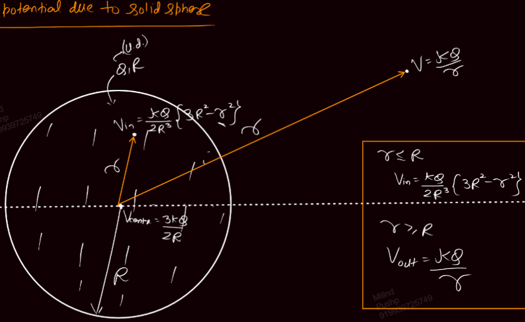

##### Derivation for Inside 
We take two elemental shells of thickness dx and radius, one when x < r and one when x > r. 

These shells will have charge,
$$dQ = \frac{ 3Qx^{2}dx }{ R^{3} }$$

Thus potential,
$$
\begin{split}
V &= \int_{0}^{R} dV = \int_{0}^{r} dV + \int_{r}^{R} dV \\
&= \int \frac{ kdQ }{ r } + \int \frac{ kdQ }{ x } \\
&= \frac{ k 3Q }{ R^{3}r } \int_{0}^{r} x^{2} \, dx + \frac{ k 3Q }{ R^{2} } \int_{r}^{R} x \, dx \\
&= \frac{ kQr^{2} }{ R^{3} } + \frac{ 3kQ }{ 2R } - \frac{ 3kQr^{2} }{ 2R^{3} } 
\end{split}
$$

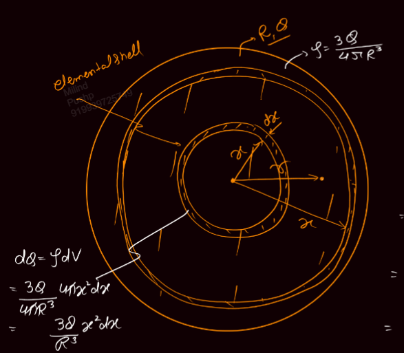

##### Graph 
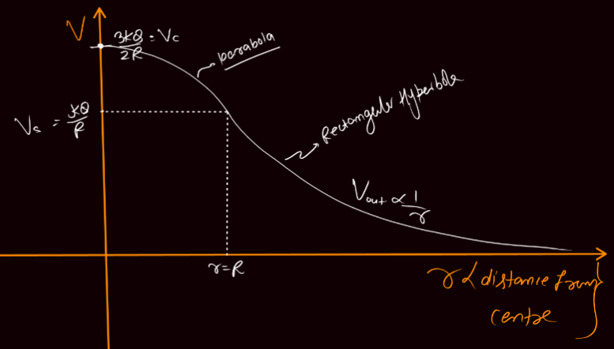

