Links: [[04 Electrostatic Potential]]
___
# Electric Potential Difference
$$
\begin{split}
V_{BA} &= V_{B} - V_{A} \\
&= \frac{ (W_{ext})_{A \to B} }{q_{o}} \\
&= \frac{ -(W_{ele})_{A \to B} }{ q_{o} } \\
&= \frac{ (W_{ele})_{B \to A} }{ q_{o} }
\end{split}
$$

Potential difference between points B and A is defined as work done by external agent against electrostatic forces to bring unit +ve charge from A to B, slowly.

Thus,
$$
\begin{split}
\Delta V &= - \int_{A}^{B} \vec{E} \, d\vec{r}\\
&= \int_{B}^{A} \vec{E} \, d\vec{r} \\
\end{split}
$$

Or,
$$dV = -\vec{E}.d\vec{r}$$

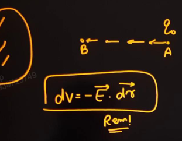

#### Relation between Field and Potential 
[[03.2 Potential Energy#PE and Force Relation]]

From the above result, we can write,
$$\Delta V = -\int_{x_{i}}^{x_{f}} E_{x} \, dx - \int_{y_{i}}^{y_{f}} E_{y} \, dy - \int_{z_{i}}^{z_{f}} E_{z} \, dz$$

And to find field,
$$E = -\frac{ \partial V }{ \partial x } \hat{i} - \frac{ \partial V }{ \partial y } \hat{j} - \frac{ \partial V }{ \partial z }\hat{k}$$
This can be written as,
$$E = - \left( \frac{ \partial  }{ \partial x } \hat{i} + \frac{ \partial  }{ \partial y } \hat{j} + \frac{ \partial  }{ \partial z } \hat{k} \right) V$$
$$E = - \nabla V$$

Similar to [[03 Energy#Potential Energy from Force]]

### PD in Uniform Field
##### Perpendicular to the Field 
If displacement is perpendicular to the field, then the PD will be zero. 

In a perpendicular plane to the electric field, the potentials at every point is the same and thus the PD is zero. This plane is thus called **Equipotential Surface.** And there is no work done in moving a charge on this plane. 

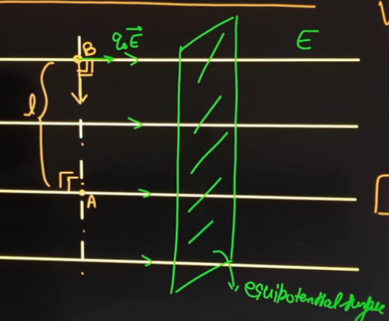

##### Along the Field 
If displacement is along the field, the potential decreases.
$$V_{B} - V_{A} = \frac{ q_{o}E d\cos 0 }{ q_{o} }$$
$$V_{B} - V_{A} = Ed$$
Thus field is from lower to higher potential. 

Thus,
$$E = \frac{ \Delta V }{ d }$$

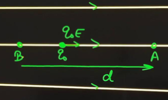

##### Any Direction 
$$
\begin{split}
V_{B} - V_{A} &= \frac{ q_{o}E d \cos \theta }{ q_{o} } \\
&= Ed\cos \theta \\
&= \vec{E} . \vec{d} \\
&= \vec{E} d_{\parallel}
\end{split}
$$

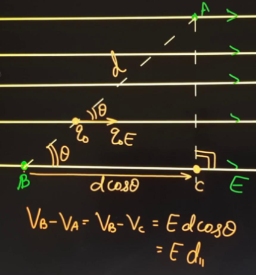   
   

## PD due to Various Objects
#### Point Charge 
$$V_{B} - V_{A} = kQ \left( \frac{ 1 }{ r_{B} } - \frac{ 1 }{ r_{A} } \right)$$

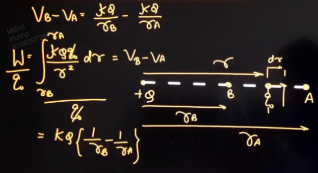

#### Infinite Non Conducting Sheet
[[03.2 Wire#Infinitely Large Sheet]]

$$V_{A} - V_{C} = \frac{ \sigma d }{ 2 \varepsilon_{o} }$$

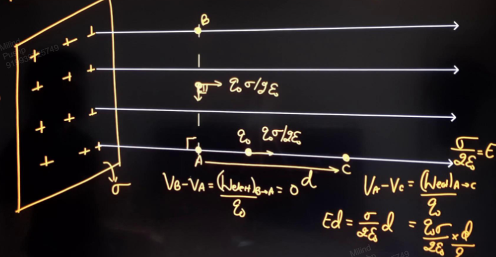

If the direction is not parallel to the field,
$$V_{A} - V_{D} = \frac{ \sigma x\cos \theta }{ 2 \varepsilon_{o} }$$

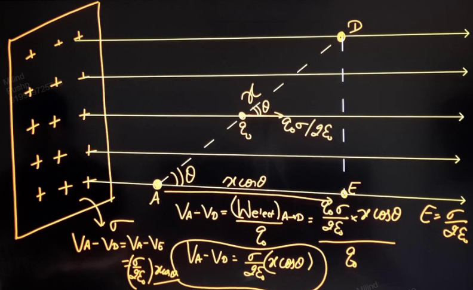

#### Infinitely Long Wire (Line Charge)

If displacement is perpendicular to the field, i.e. parallel to the wire, the potential difference will be zero. 

If charge is displaced perpendicular to the wire,
$$
\begin{split}
dW &= \frac{ 2k\lambda q_{o} }{ r } dr \cos 0^{\circ} \\
W &= 2k\lambda q_{o} \int_{r_{A}}^{r_{B}} \frac{ 1 }{ r } \, dr
\end{split}
$$
Thus giving,
$$V_{A} - V_{B} = 2k\lambda \log\frac{ r_{B} }{ r_{A} }$$

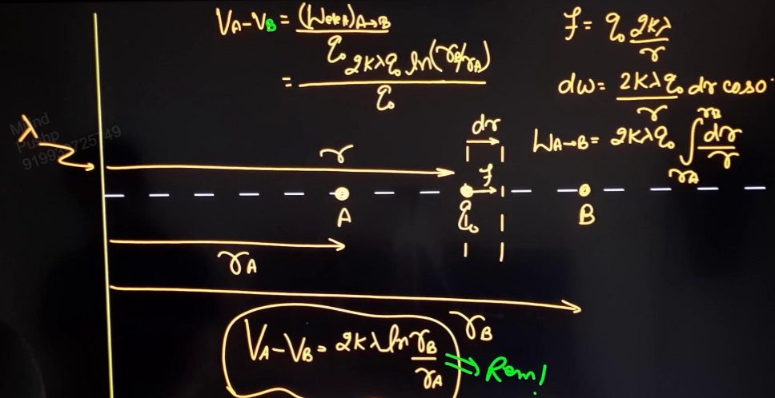

## Equipotential Surface 
Surface, real or imaginary, on which all points have the same potential. 

The potential difference between any two points will be zero. Thus, work done by electric field to move charge on equipotential surface is zero. 

If we move the charge slowly, the work done by external agent will also be zero. 

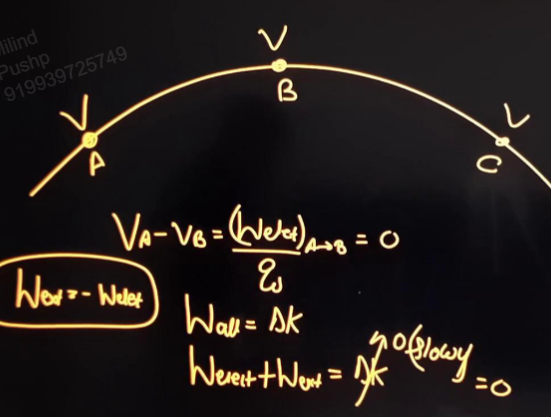

If work done is zero, there are two possibilities,
1. Electric field may be zero at equipotential surface.
2. Electric field may be perpendicular to the equipotential surface.
   
   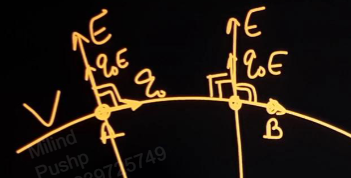

*Two distinct equipotential surfaces can never intersect.* 
This is because,
1. We cannot define two potentials at the same point.
2. Electric field cannot have two directions at the same point. 
   
   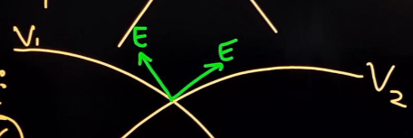
   
   Note that if the equipotential surface is the same, it can intersect itself. At the point of intersection, the field is zero. 
   
   

#### Eq. Surface due to Point Charge 
For a point charge equipotential surface is a spherical shell centred at the charge of radius r. 

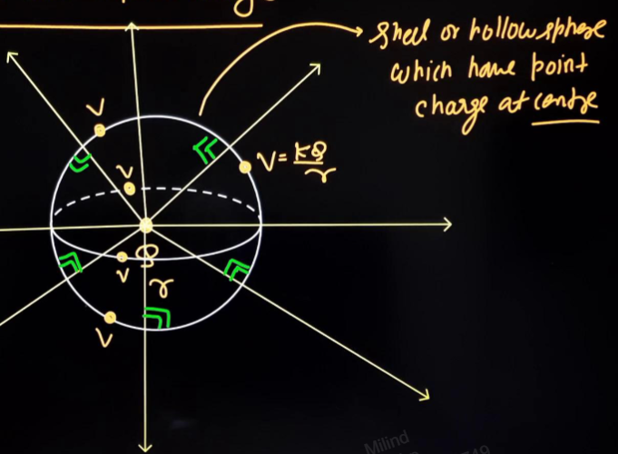

The equipotential surfaces are concentric spherical shells. 

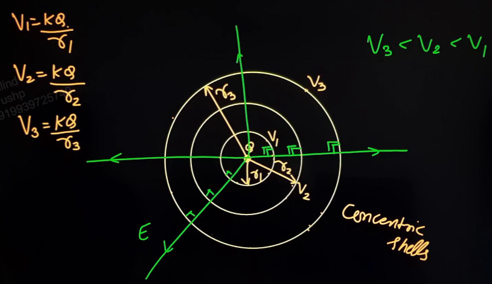

#### Eq. Surface due to Infinitely Large Sheet 
Equipotential surface is plane parallel to the sheet. 

If electric field is uniform, the equipotential surfaces are planar.

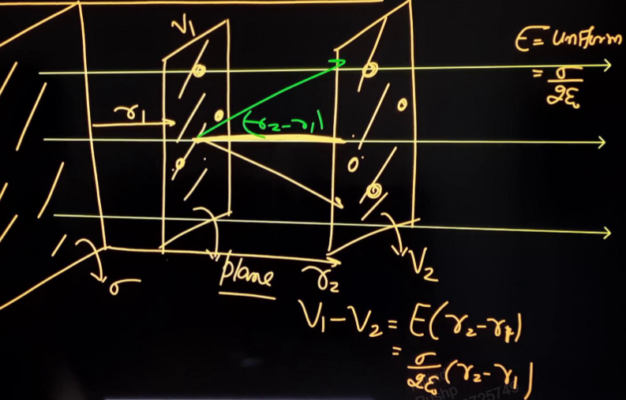

An example,
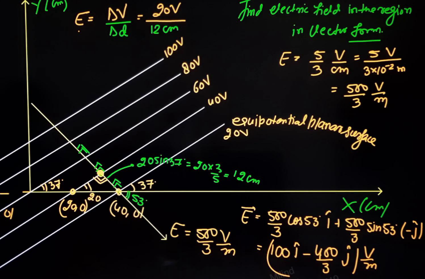

#### Eq. Surface due to Infinitely Long Wire
Here the equipotential surface is hollow cylinder with the wire as axis. 

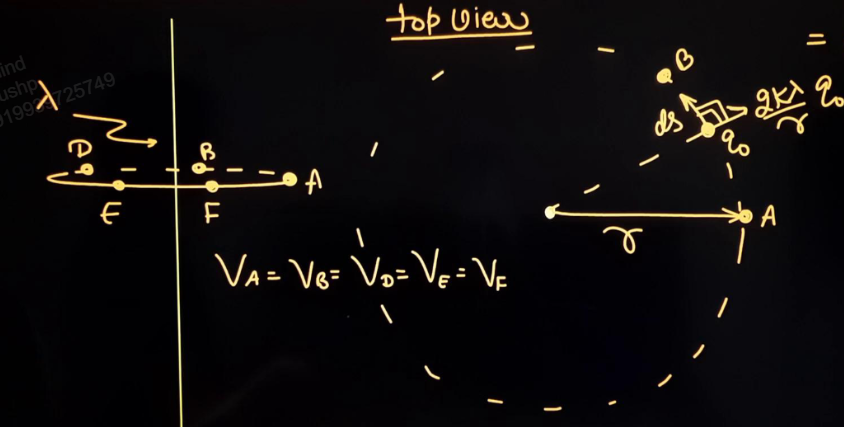
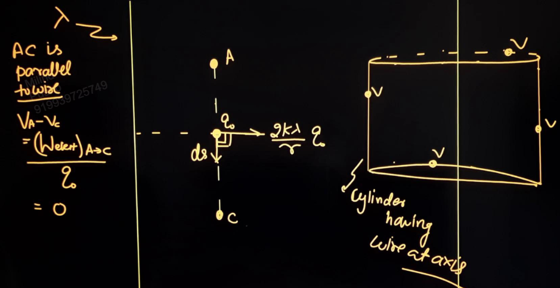

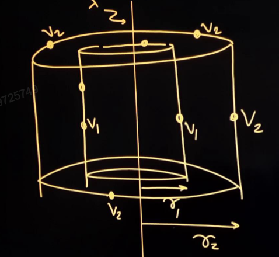

Also, here,
$$V_{2} - V_{1} = 2k\lambda \log \frac{ r_{2} }{ r_{1} } $$

