Links: [[04 Electrostatic Potential]], [[03 Energy]]
___
# Electric Potential Energy 
It is the work done by external agent, or -ve of work done by electric field to bring the charges slowly from infinity to form the system. 

$$U = [W_{ext}(\infty \to P)]_{\Delta K = 0}$$
$$U = V_{sys} . q$$

Multiplying potential with charge gives potential energy. Similar to force and field. 
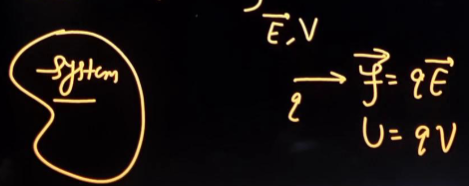

It is a scalar and its SI unit is Joule. 
Another unit is eV called *Electron Volt,* which is,
$$1\ eV = 1.6 \times 10^{-19}\ J$$

We consider potential energy at infinity to be zero. 

Electric potential energy can be used by any of, or all of, the charges in the system. 

We can write V due to any of the charges and q of any of the charges. 

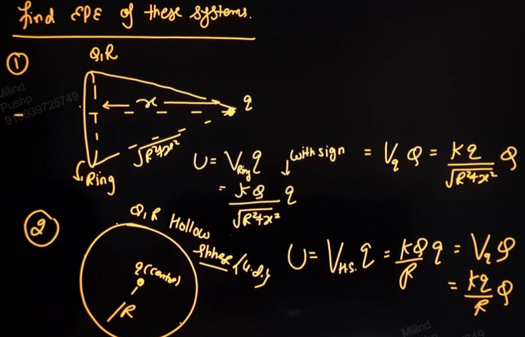

## EPE of Various Systems 
One interaction between two charges will have one potential energy.

#### EPE of 2 Point Charges 
$$U = \frac{ kQ_{1}Q_{2} }{ r }$$
where $Q_{1},Q_{2}$ are with signs. 

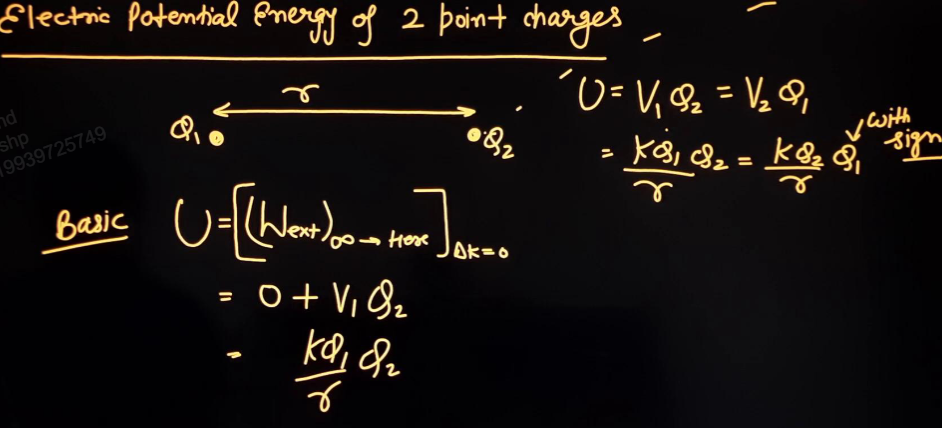

#### EPE due to System of Charges 
Charges here are considered point charges. 

$$
\begin{split}
U_{sys} &= [W_{ext}(\infty \to \text{Here})]_{\Delta K = 0} \\
&= (U_{12} + U_{13} + U_{14} + \dots + U_{1n}) \\
&\ + (U_{23} + U_{24} + \dots + U_{2n}) \\
&\ + (U_{34} + \dots + U_{4n}) \\
&\ \ \ \vdots\\
&\ + U_{(n-1)n} 
\end{split}
$$
This has $(n-1) + (n-2) + (n-3) + \dots + 1$ terms, i.e. 
$$\ce{ no. of terms } = \frac{ n(n-1) }{ 2 }$$

Each interaction between two charges contributes a term. Thus n charges will have ${}^{n}C_{2}$ terms.

If there are 3 point charges, then there will be 3 terms. 
$$U = U_{12} + U_{13} + U_{23}$$

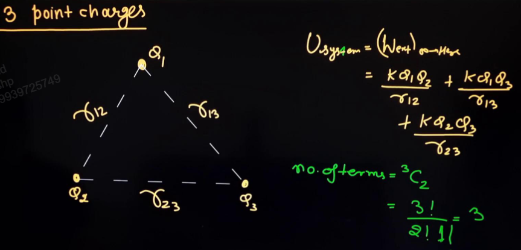

##### 3 Point Charge System
EPE for an equilateral triangle made of equal point charges will be,
$$U = \frac{ 2kQ^{2} }{ l }$$

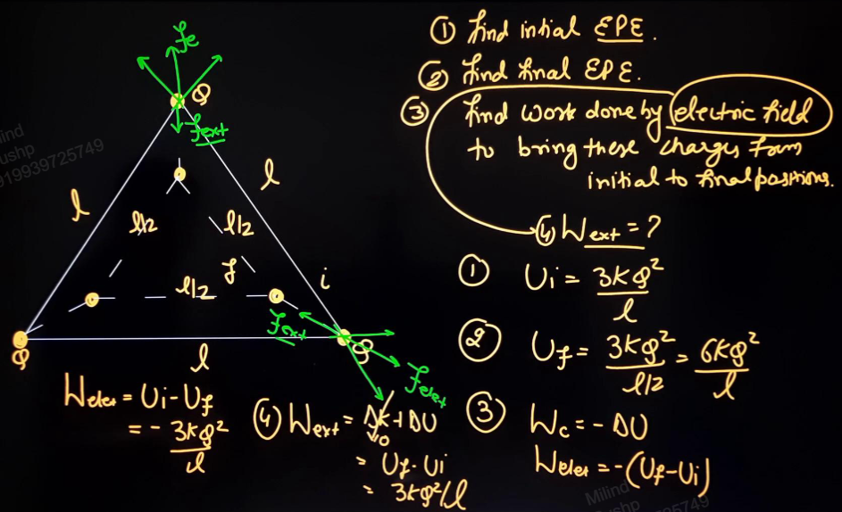

#### Symmetric Systems
For a symmetric system,
$$U = \frac{ n }{ 2 } \times \text{PE of any one charge with all other charges}$$
where n is the number of charges.

Division by 2 is to remove repetitions. 

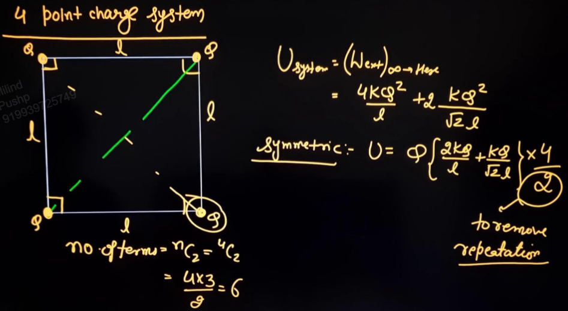
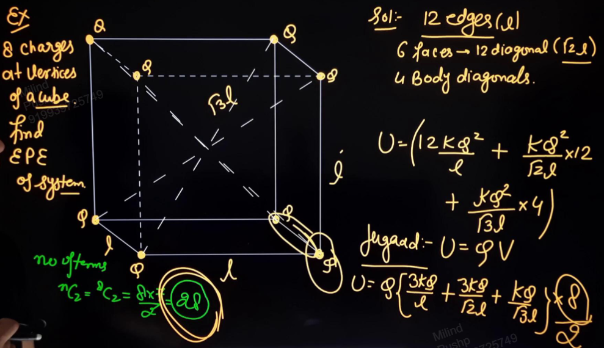

### Examples
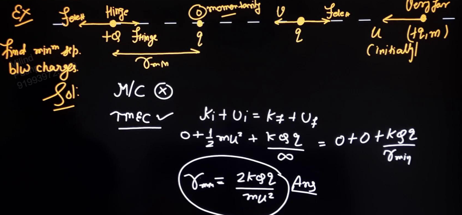

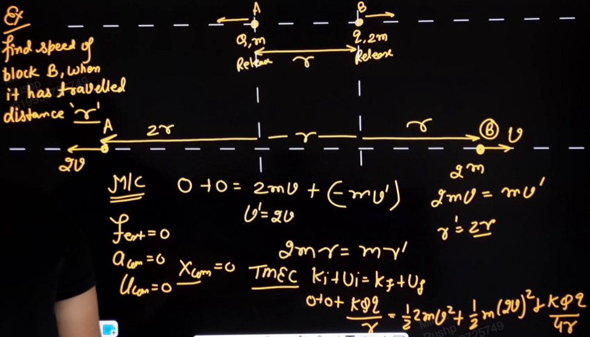

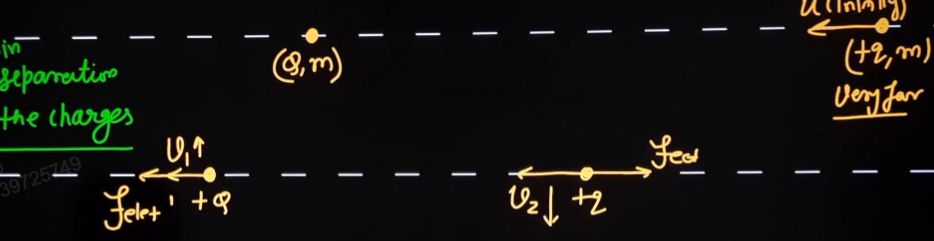

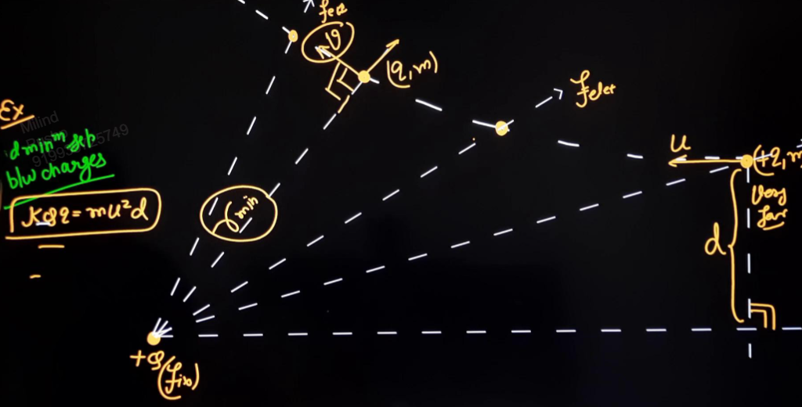
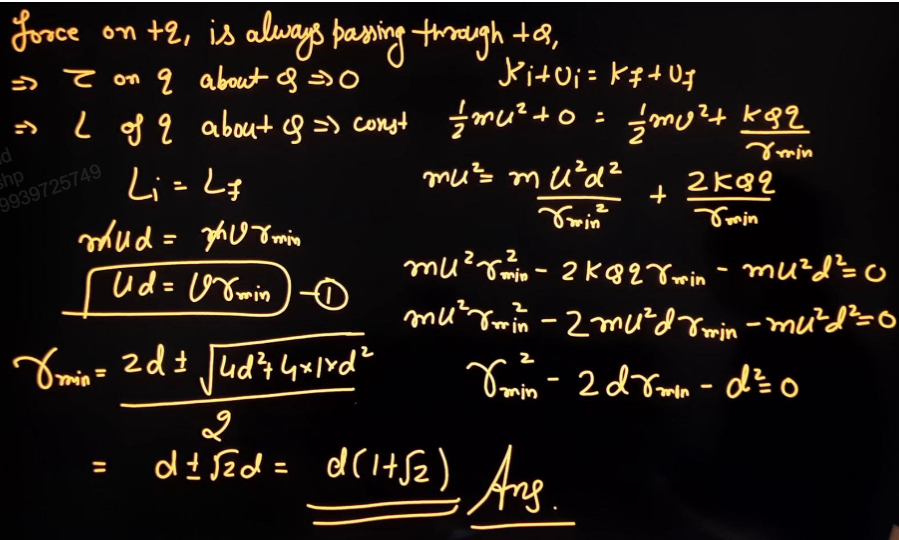

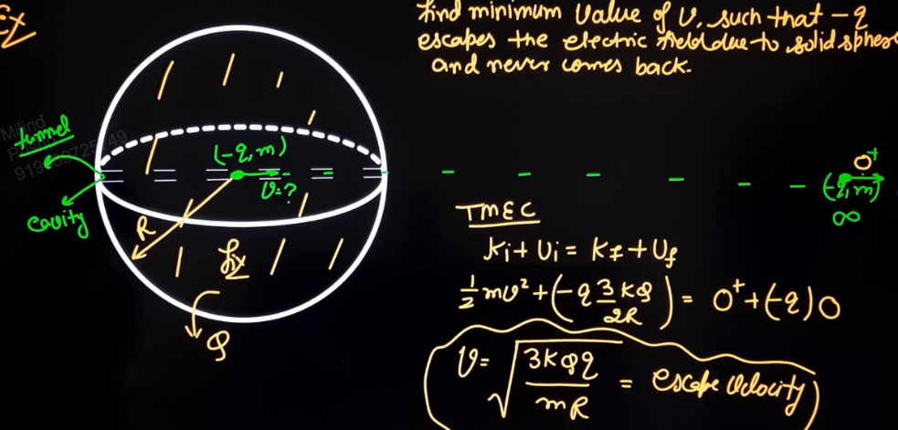

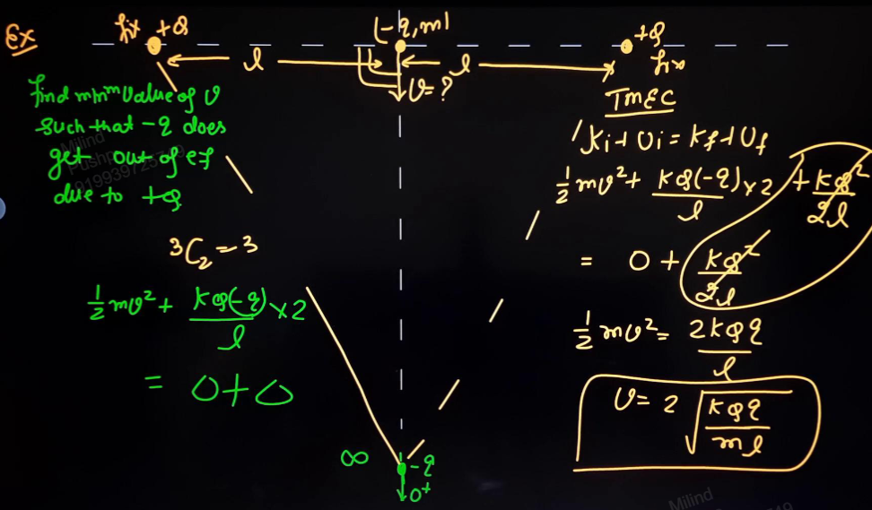

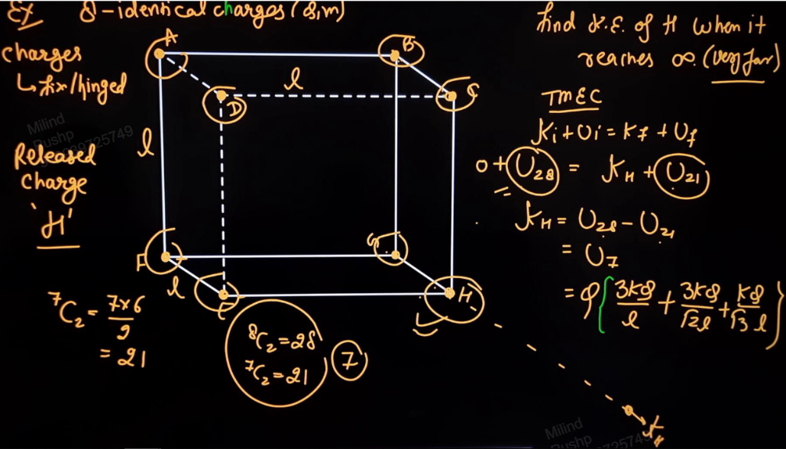
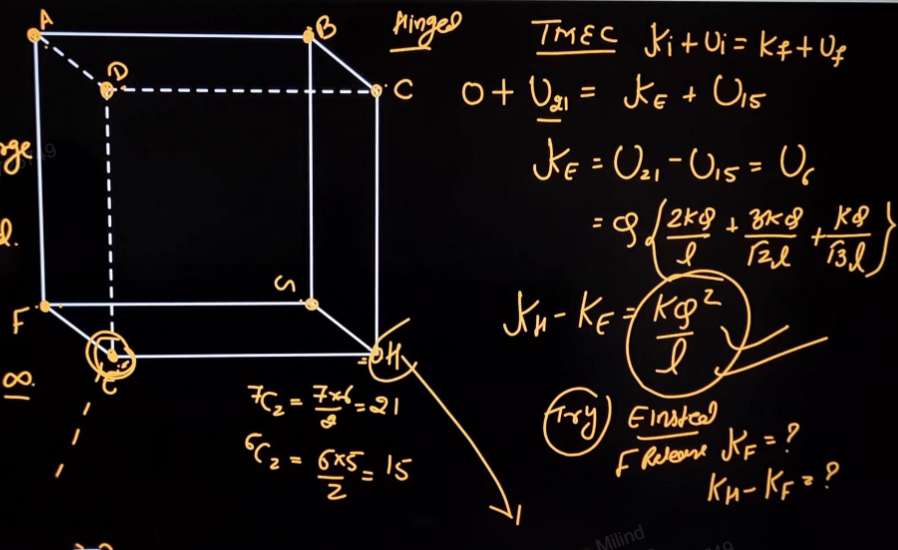