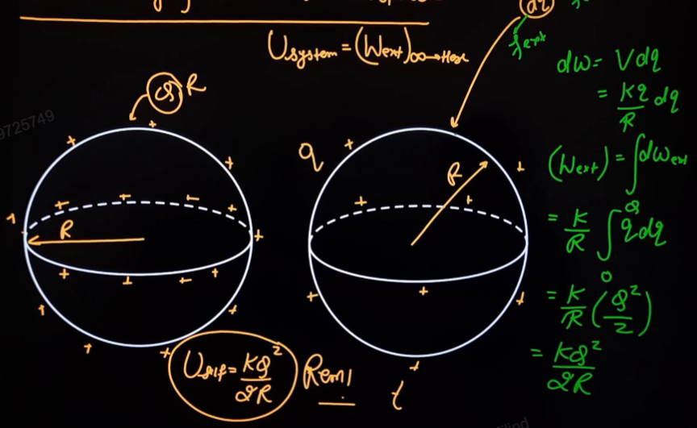
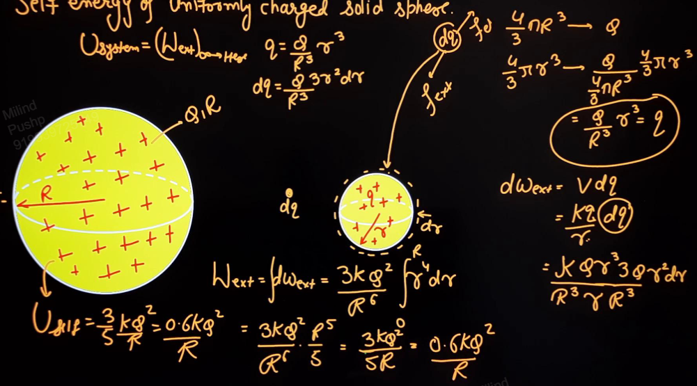
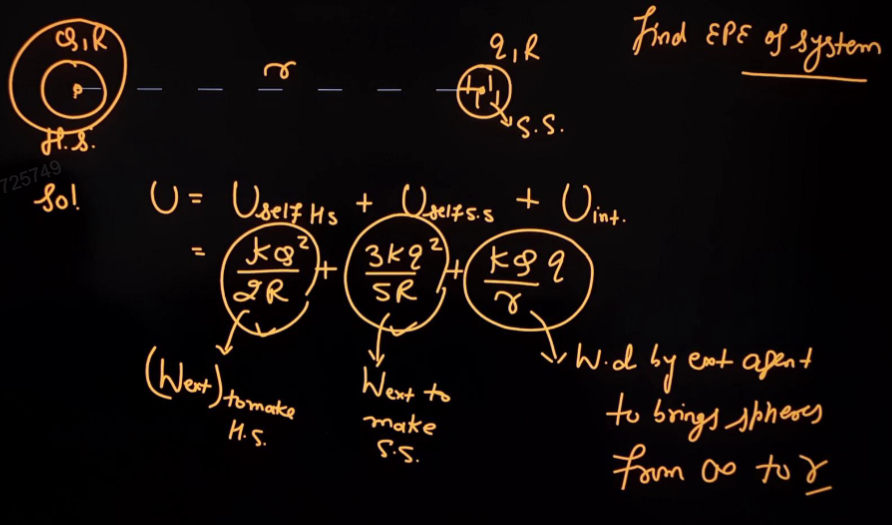
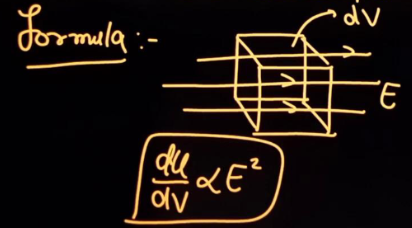
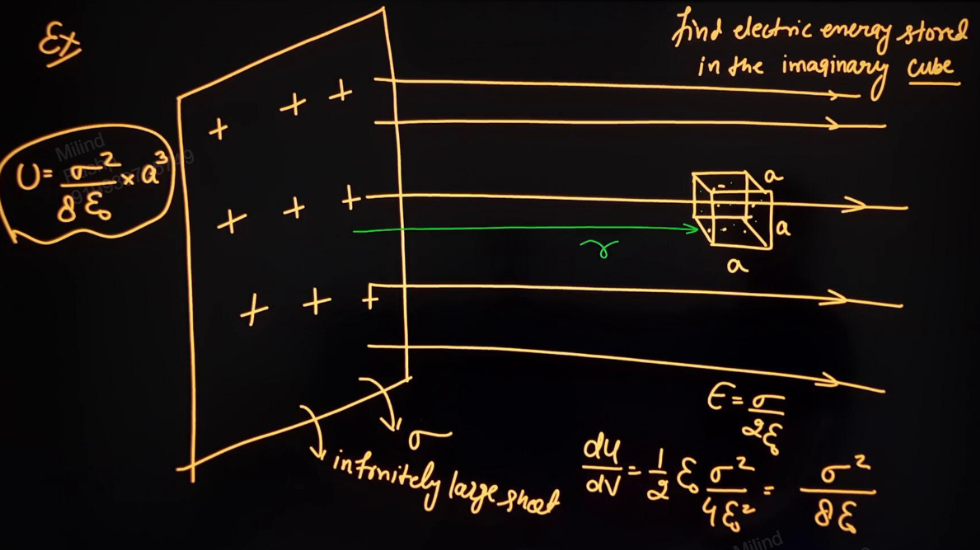
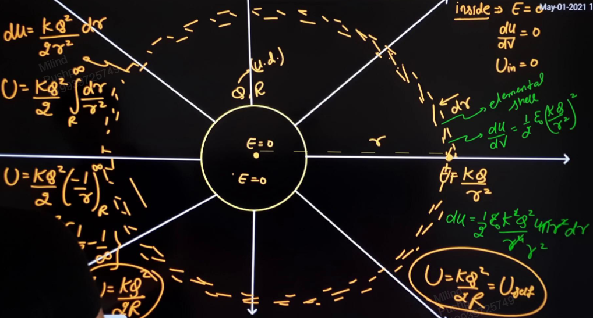
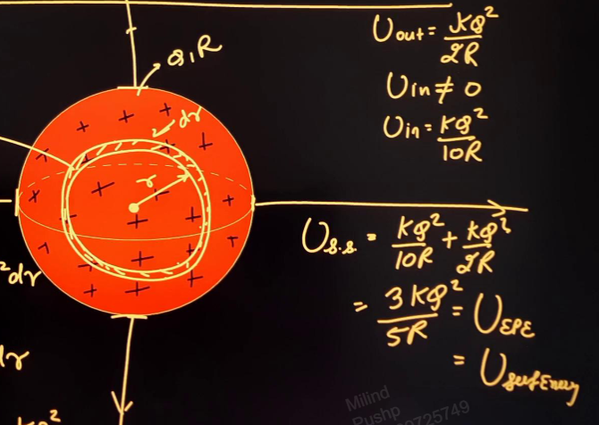

Links: [[06 Electric Potential Energy]]
___
# Self Energy
It is the potential energy stored in a body by virtue of interaction between various charge particles inside the body. 

It is a kind of electrostatic potential energy. 

Total electrostatic potential energy of a system is given by,
$$U_\text{total} = U_\text{self energy} + U_\text{interaction}$$
$U_\text{self}$ is to be written of all charges.

#### Point Charge
Since there is no other charge and hence no other interaction,
$$U_\text{self energy} = 0$$

### Hollow Sphere
Uniformly Charged 

$$
\begin{split}
U_\text{system} &= W_{ext}(\infty \to \text{here}) \\
dW &= Vdq \\
&= \frac{ kq }{ R }dq \\
W &= \int_{0}^{Q} \frac{ kq }{ R } \, dq \\
&= \frac{ kQ^{2} }{ 2R }  
\end{split}
$$
This is the self energy of hollow sphere. 
$$U_\text{self} = \frac{ kQ^{2} }{ 2R }$$
Thus increasing the radius decreases self energy. 

### Solid Sphere
Uniformly charged.

We will bring charges from $\infty$ to their place and form the sphere. 

Now, while making the big sphere, a smaller sphere of radius of r is formed.
This sphere has charge,
$$q = \frac{ Q }{ R^{3} }r^{3}$$
where Q is the charge to be of the big sphere. 

Now, a small charge dq will be,
$$dq = \frac{ Q }{ R^{3} } 3r^{2}dr$$

To bring this small charge dq from $\infty$ to the sphere and spreading it uniformly, increasing the radius by dr, work done will be,
$$
\begin{split}
dW &= Vdq \\
&= \frac{ kq }{ r }dq \\
&= \frac{ kQr^{3} }{ R^{3}r }. \frac{ Q }{ R^{3} }. 3r^{2}dr \\
&= \frac{ 3kQ^{2} }{ R^{6} } r^{4}dr
\end{split}
$$

This gives,
$$
\begin{split}
W_{ext} &= \int_{0}^{R}  \, dW \\
&= \frac{ 3kQ^{2} }{ R^{6} } \int_{0}^{R} r^{4} \, dr \\
&= \frac{ 3kQ^{2} }{ 5R } 
\end{split}
$$

Which is the self energy of solid sphere,
$$U_\text{self} = \frac{ 3kQ^{2} }{ 5R } = \frac{ 0.6kQ^{2} }{ R }$$

For example,

## Energy Density
Wherever there is a conservative field, there will be energy corresponding to that field. This energy per unit volume is Energy Density. 

We can define gravitational, electrical and magnetic ED. 

$$u = \frac{ dU }{ dV }$$
And its unit will be $\ce{ J m^{-3} }$.

Electric energy density is, in any medium,
$$\frac{ dU }{ dV } = \frac{1}{2} \varepsilon E^{2}$$
And in air/vacuum,
$$\frac{ dU }{ dV } = \frac{1}{2} \varepsilon_{o} E^{2}$$

Here we can see that,
$$\frac{ dU }{ dV } \propto E^{2}$$

For a system,
$$\int \frac{1}{2} \varepsilon_{o}E^{2}  \, dV = U_\text{epe}$$
This energy due to electric field is the same as electric potential energy (epe or self energy) of the system. 

#### Energy due to Field of Hollow Sphere 

Since there is no field inside the sphere, there is no energy density. Thus no energy is present inside the sphere. 

For outside, we make an elemental shell of thickness dr and radius r. This elemental shell has the same magnitude of field at every point. Thus it will have same energy density,
$$\frac{ dU }{ dV } = \frac{ 1 }{ 2 }\varepsilon_{o} \frac{ k^{2}Q^{2} }{ r^{4} }$$
Giving,
$$
\begin{split}
dU &= \frac{ 1 }{ 2 }\varepsilon_{o} \frac{ k^{2}Q^{2} }{ r^{4} } 4\pi r^{2} dr \\
dU &= \frac{ kQ^{2} }{ 2r^{2} } dr 
\end{split}
$$

Integrating this will give energy due to hollow sphere,
$$
\begin{split}
U &= \frac{ kQ^{2} }{ 2 } \int_{R}^{\infty} \frac{ 1 }{ r^{2} } \, dr \\
&= \frac{ kQ^{2} }{ 2R } 
\end{split}
$$
This is same as the self energy of hollow sphere. 

This means that self energy is the energy which is stored in the electric field due to an object. 
I.e. electric potential is stored in the form of electric field. 

#### Energy due to Field of Solid Sphere 
Outside the sphere, since the field is the same, the energy will also be the same as that of hollow sphere. 
$$U_\text{out} = \frac{ kQ^{2} }{ 2R }$$

Now for inside, we take an elemental sphere of radius r and thickness dr. This will have energy density,
$$\frac{ dU }{ dV } = \frac{ 1 }{ 2 }\frac{ \varepsilon_{o} k^{2} Q^{2} r^{2} }{ R^{6} }$$
Giving,
$$
\begin{split}
dU &= \frac{ \varepsilon_{o} k^{2} Q^{2} r^{2} }{ 2R^{6} }. 4\pi r^{2} dr \\
U &= \frac{ kQ^{2} }{ 2R^{6} } \int_{0}^{R} r^{4}dr \\
&= \frac{ kQ^{2} }{ 10R }
\end{split}
$$
Thus we get,
$$U_{in} = \frac{ kQ^{2} }{ 10R }$$

The total energy will be,
$$U = \frac{ kQ^{2} }{ 10R } + \frac{ kQ^{2} }{ 2R } = \frac{ 3kQ^{2} }{ 5R }$$
Which is the same as the self energy of solid sphere. 

