Links: [[02 Electric Field]], [[04 Electrostatic Potential]]
___
# Electric Dipole
Electric dipole is an electrically neutral system consisting of two equal an opposite charges placed at a very small separation. 

Separation between charges should be small in relation to the separation between dipole and the point of interest. 

#### Electric Dipole Moment 
The vector joining -q to +q is $\vec{l}$. 

Dipole moment is represented by $\vec{p}$ and is defined as,
$$\vec{p} = q . \vec{l}$$
Its unit is $\ce{ C m }$ or debye and dimensions are $\ce{ [ITL] }$
Also, $1 \text{debye} = 3.3 \times 10^{-30} \ce{\ C m }$

Its direction is opposite to that of electric field, i.e. from the -ve to the +ve charge. 

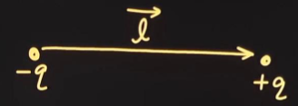

We can divide a charge to form dipole. 

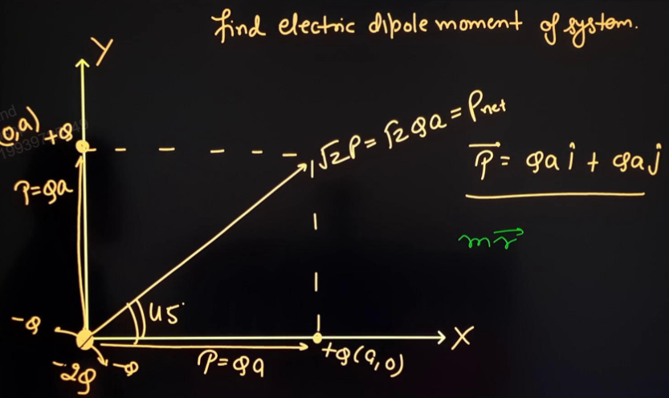

We can use "centre of charge" similar to [[01 Centre of Mass]] to club charges together. #important 

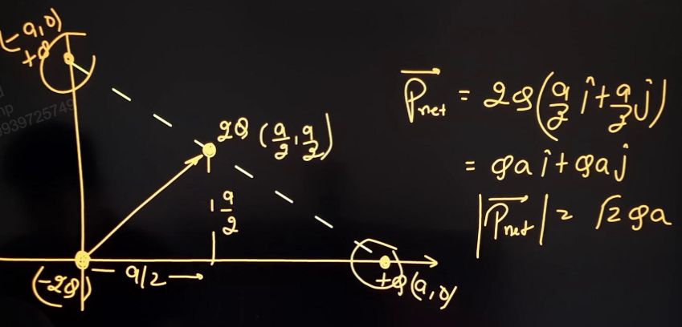

But this clubbing, i.e. "centre of charge" can only be done in calculation of dipole moment. This is because both dipole moment and mass moment are defined in a similar way. 

#### Finding dipole moment 
To find dipole moment of continuous bodies,
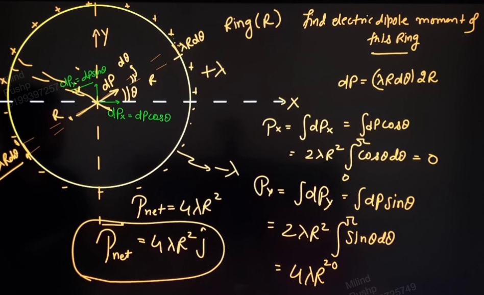

Using the concept of "centre of charge",
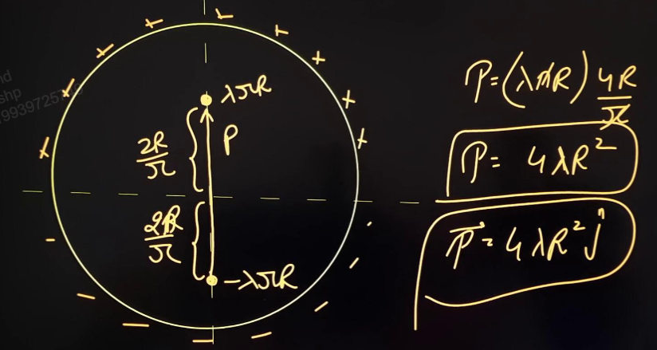

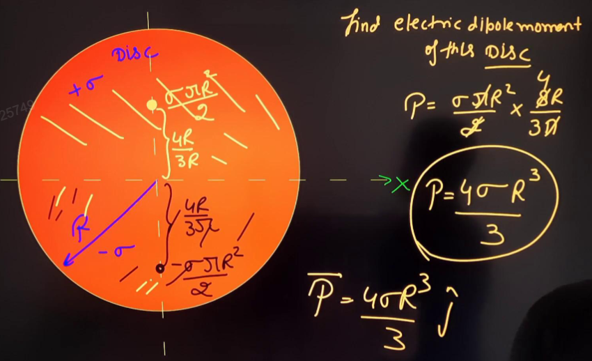

## Electric Field due to Dipole
The line along which dipole is placed is called axis of dipole.

The perpendicular line to axis is called equatorial line and it passes through the middle of the dipole. 

#### Axis
Electric field on axis is along dipole moment. 
I.e. 
$$\vec{E}_\text{axial} \parallel \vec{p}$$

This electric field is,
$$
\begin{split}
E_{net} &= E_{+} - E_{-} \\
&= \frac{ kq }{ (r-a)^{2} } - \frac{ kq }{ (r-a)^{2} }\\
&= \frac{ 4arkq }{ (r^{2} - a^{2})^{2} } \\
&= \frac{ 2kpr }{ (r^{2} - a^{2})^{2} } 
\end{split}
$$
Using assumption, $2a \ll r$,
$$E_\text{axis} = \frac{ 2kp }{ r^{3} }$$

In vector form,
$$E_\text{axis} = \frac{ 2k\vec{p} }{ r^{3} }$$

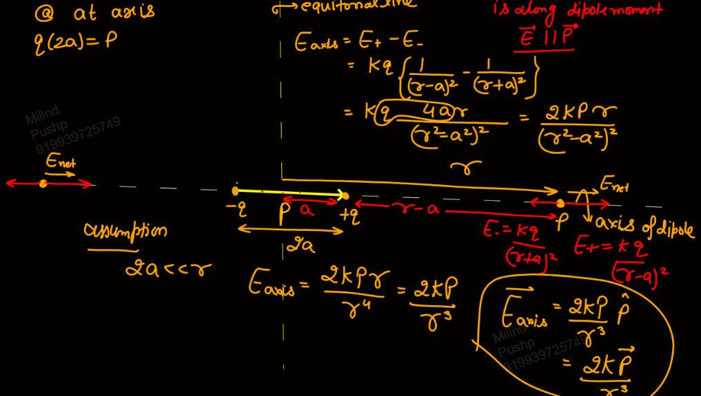

#### Equatorial Plane 
From the diagram, we can see that the perpendicular components of field cancel and thus the electric field is anti parallel to dipole moment.
I.e.
$$\vec{E}_\text{equa} \upharpoonleft \! \downharpoonright \vec{p}$$

Now,
$$E = \frac{ kq }{ (r^{2} + a^{2}) }$$
Thus,
$$
\begin{split}
E_{net} &= 2E\cos \theta \\
&= \frac{ 2kq }{ (r^{2} + a^{2}) } \frac{ q }{ \sqrt{ r^{2} + a^{2} } } \\
&= \frac{ kp }{ (r^{2} + a^{2})^{3/2} } 
\end{split}
$$
Using assumption $2a \ll r$,
$$E_\text{equa} = \frac{ kp }{ r^{3} }$$

In vector form,
$$\vec{E}_\text{equa} = - \frac{ k\vec{p} }{ r^{3} }$$
The -ve indicates direction opposite to that of $\vec{p}$.

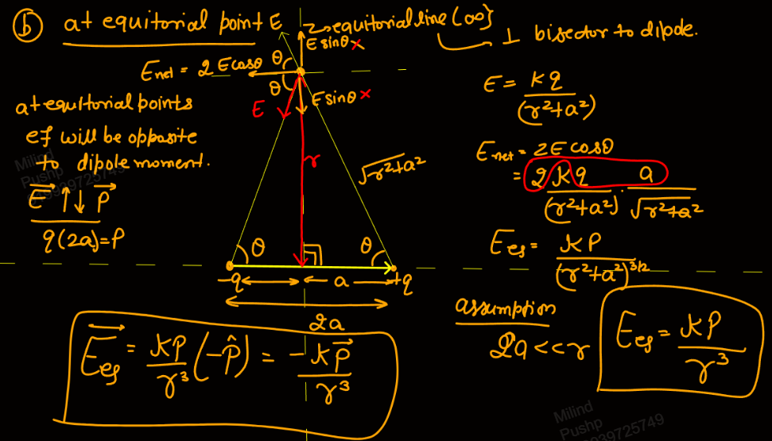

Also,
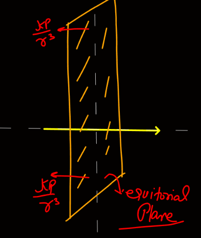

#### Any General Point 

This point is r distance from the centre of the dipole and makes an angle $\theta$ with the direction of dipole moment. 

We will break the dipole moment into two rectangular components. One parallel and one perpendicular to the line joining the point and centre. 

For $p\cos \theta$, the electric field is,
$$E_{\parallel} = \frac{ 2kp\cos \theta }{ r^{3} }$$
For $p\sin \theta$, the electric field is,
$$E_{\perp} = \frac{ kp\sin \theta }{ r^{3} }$$

Thus the net electric field is,
$$
\begin{split}
E_{net} &= \sqrt{ E_{\parallel}^{2} + E_{\perp}^{2} } \\
&= \frac{ kp }{ r^{3} } \sqrt{ \sin ^{2}\theta + 4\cos ^{2}\theta } \\
&= \frac{ kp }{ r^{3} } \sqrt{ 1 + 3\cos ^{2}\theta } 
\end{split}
$$

Now, $\phi$ is angle between $\vec{r}$ and $\vec{E}_{net}$. 
$$
\begin{split}
\tan \phi &= \frac{ E_{\perp} }{ E_{\parallel} } \\
&= \frac{ \tan \theta }{ 2 }
\end{split}
$$

And, the angle between $\vec{p}$ and $\vec{E}_{net}$ will be,
$$\angle = \theta + \phi = \theta + \tan ^{-1}\left( \frac{ \tan \theta }{ 2 } \right)$$

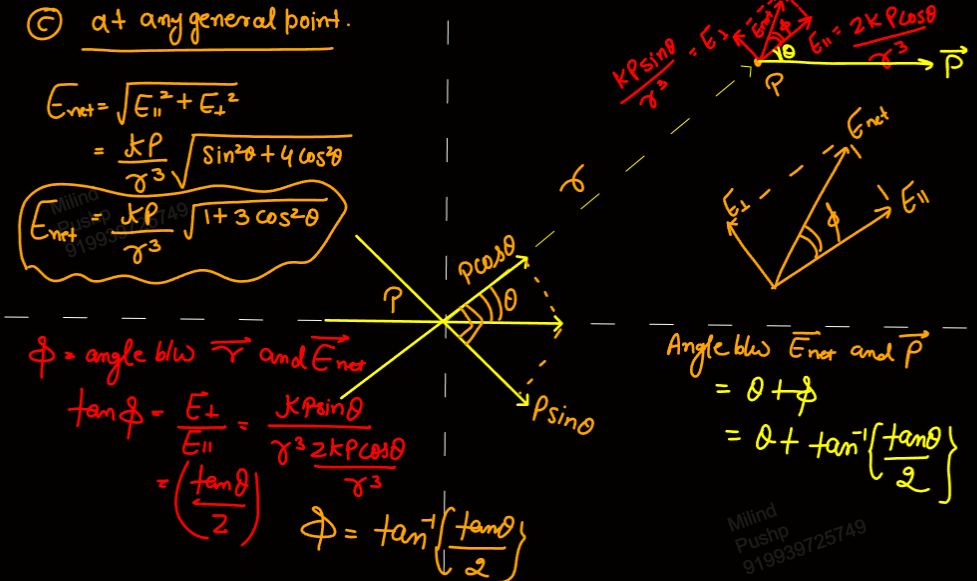

For example,
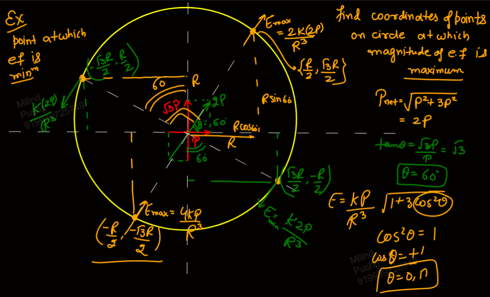

## Potential due to Small Dipole
Close to the +ve charge, or on the side of +ve charge, the potential will be +ve. Similarly for the -ve charge.

On the equatorial plane, the potential will be zero as it is equidistant from both charges. 
Thus the equatorial plane is an Equipotential Surface. 

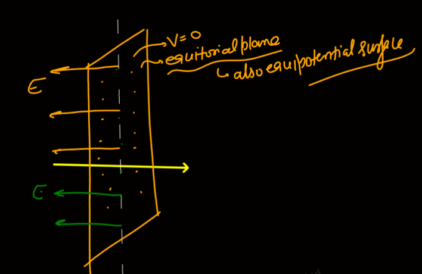

#### At axis
$$
\begin{split}
V_{p} &= V_{+} + V_{-} \\
&= \frac{ kq }{ (r-a) } + \frac{ k(-q) }{ (r+a) } \\
&= \frac{ kq(2a) }{ r^{2} - a^{2} } \\
&= \frac{ kp }{ r^{2} - a^{2} }
\end{split}
$$

Using the assumption, $a \ll r$,
$$V = \frac{ kp }{ r^{2} }$$

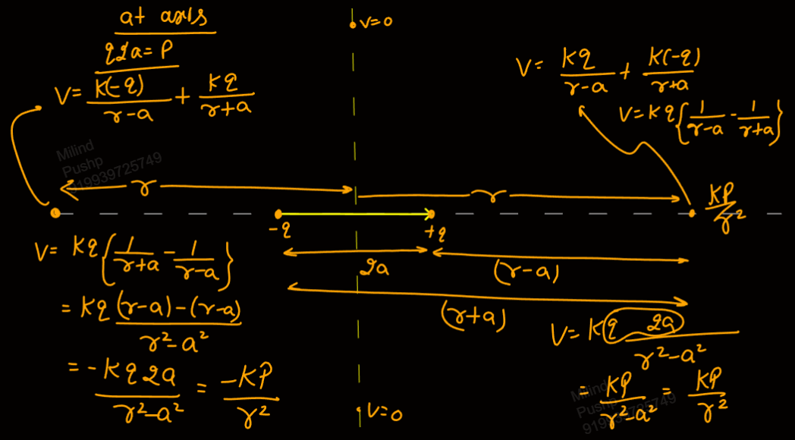

#### Any General Point
Dividing $\vec{p}$ into two components like before, we see that point P is equatorial for $p\sin \theta$ and axial for $p\cos \theta$. 

Thus,
$$V_{p} = \frac{ kp\cos \theta }{ r^{2} }$$

In vector form,
$$V = \frac{ k\ \vec{p} . \vec{r} }{ r^{3} }$$

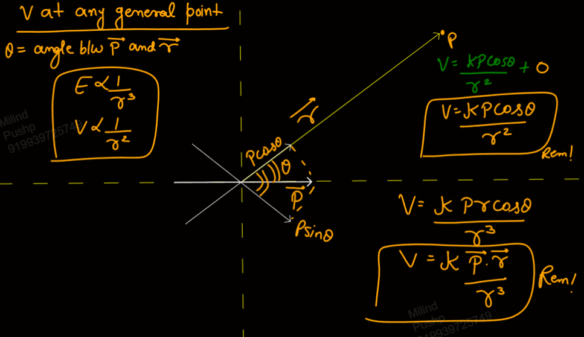

For example,
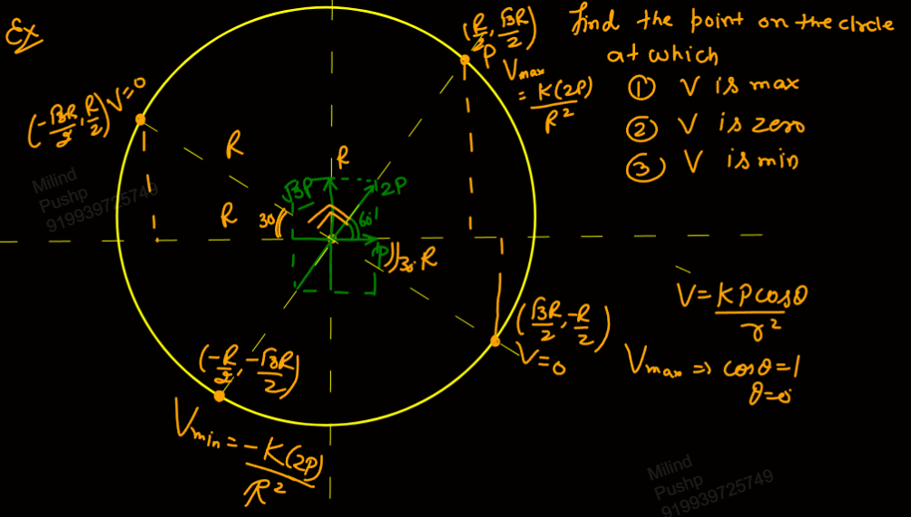
