Links: [[08 Electric Dipole]]
___
# Dipole placed in Uniform field
There is no external force on the dipole and thus $a_{com} = 0$.

But due to [[05 ME, force Couple and POAF#Force Couple|force couple,]] there will be torque on the dipole. 

This torque will be,
$$
\begin{split}
\uptau &= QE(l \sin \theta) \\
&= pE\sin \theta
\end{split}
$$

In vector form,
$$
\begin{split}
\vec{\tau} &= \vec{p} \times \vec{E}
\end{split}
$$

For angular acceleration,
$$
\begin{split}
\uptau &= I\alpha \\
&= I_\text{hinge} \alpha \\
&= I_\text{com} \alpha
\end{split}
$$

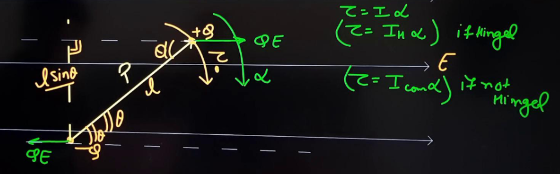

#### Equilibrium Positions 

The one when $\theta = 0^{\circ}$ is stable and the one when $\theta = 180^{\circ}$ is unstable. 

This can be found by slightly rotating the dipole and then checking if it rotates further or comes back to initial position. 

Oscillatory motion of dipole is possible about $\theta = 0$ because it is stable equilibrium position. 

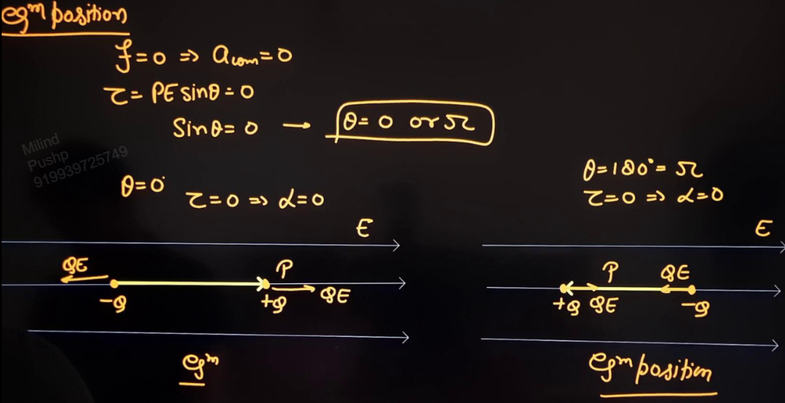

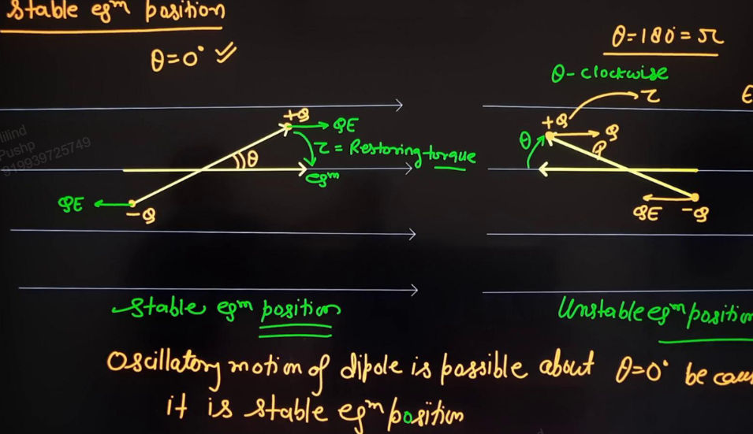

#### Angular SHM
[[05 Angular SHM]]

When dipole is rotated from the equilibrium position by an angle $\theta$, it experiences a restoring torque,
$$\uptau = pE\sin \theta$$

Now for small angles, $\sin \theta \sim \theta$,
$$\uptau = pE \theta$$
I.e. $\uptau \propto \theta$ and thus it is performing angular SHM. 

For time period,
$$
\begin{split}
\uptau &= pE \theta \\
I\alpha &= pE \\
\alpha &= \frac{ pE }{ I } \theta \\
\omega &= \sqrt{ \frac{ pE }{ I } } \\
T &= 2\pi \sqrt{ \frac{ I }{ pE } }
\end{split}
$$

If the dipole is hinged, 
$$T = 2\pi \sqrt{ \frac{ I_{H} }{ pE } }$$
If the dipole is not hinged, 
$$T = 2\pi \sqrt{ \frac{ I_{com} }{ pE } }$$

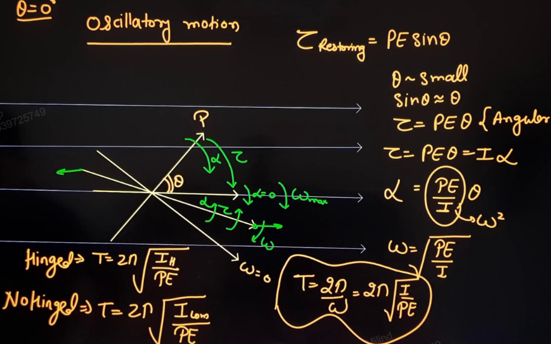

Take care to write the correct moment of inertia of the system.
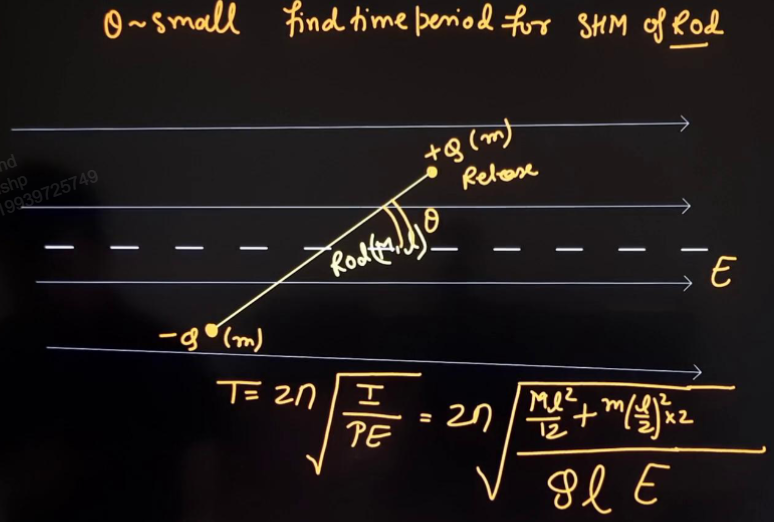

### Potential Energy 
of dipole placed in uniform electric field. 

The PE of dipole will be the same as the PE of the two charges of the dipole in the electric field. 

$$
\begin{split}
U &= QV_{1} + (-Q)V_{2} \\
&= Q(V_{1} - V_{2}) \\
&= -QEl\cos \theta \\
&= -pE\cos \theta 
\end{split}
$$

In terms of vectors,
$$U = -\vec{p} . \vec{E}$$

#### Graph 

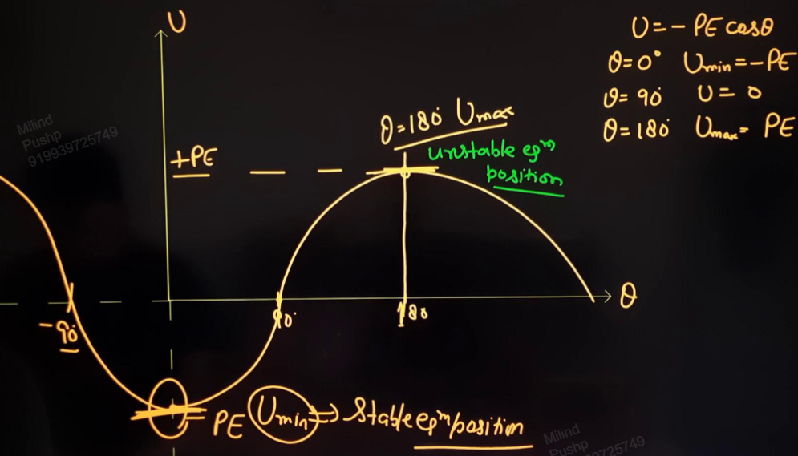

#### Example
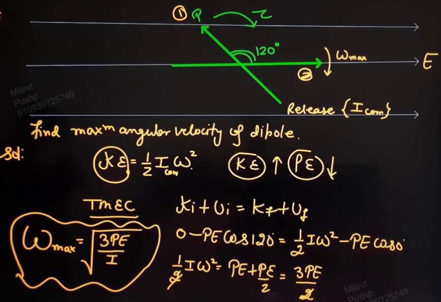

## Dipole in Non Uniform Field

Dipole is placed along electric field. 

The dipole is of length dx.

Now, force on this dipole,
$$
\begin{split}
f &= Q(E + dE) - QE \\
&= QdE \\
&= Qdx \frac{ dE }{ dx } \\
&= p \frac{ dE }{ dx } 
\end{split}
$$

Thus,
$$f = p \frac{ dE }{ dx } $$

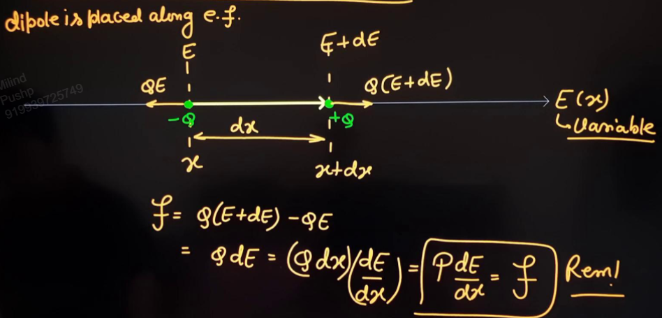

#### Examples 

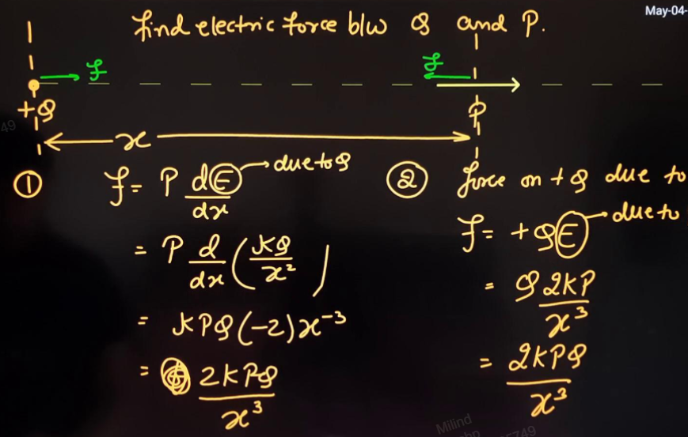

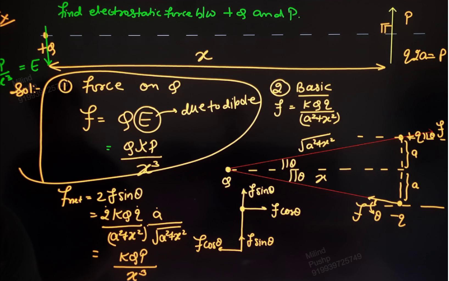

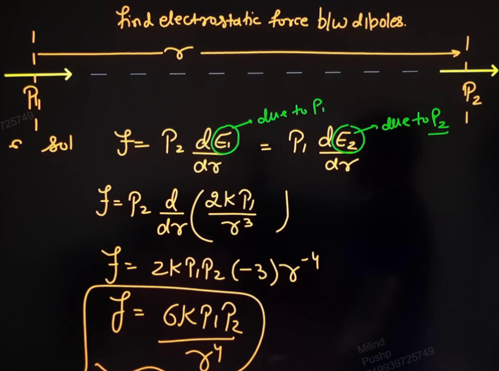
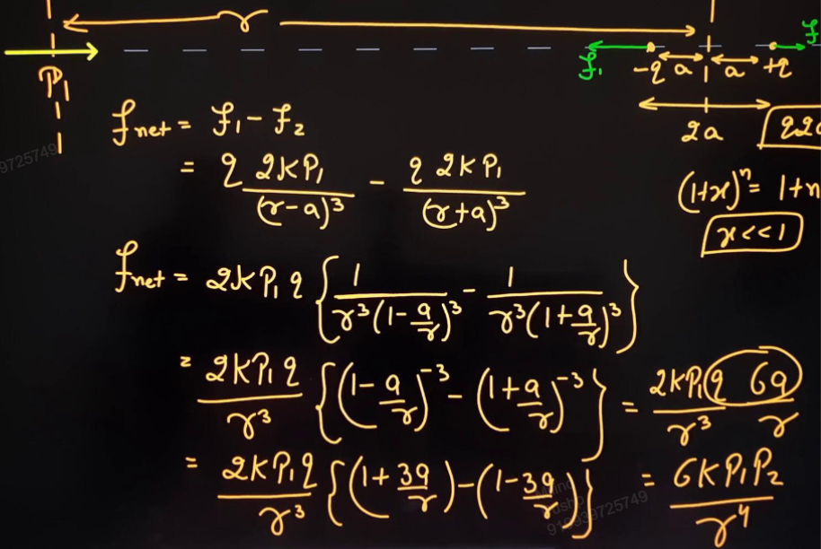

