Links: [[02 Electric Field]]
___
# Electric Flux
[[02 Electric Field#Electric Lines of Force (ELOF)]]

It is a physical quantity which represents no. of ELOF passing through a surface area. 

The more ELOF are passing though a surface, the more flux there is.

Consider a small area, whose area vector is $d\vec{s}$. An electric field which makes an angle $\theta$ with the area vector. 

Now, the component of this E which is perpendicular to the area vector is tangential to the surface and thus does not pass through it.

The component of E along ds is contributing to the no. of ELOF and thus the flux. 

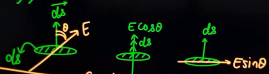

Thus we get, small flux through this small surface,
$$
\begin{split}
d\phi &= E\cos \theta. ds \\
&= \vec{E} . d\vec{s} \\
&= \vec{E}_{\parallel} ds
\end{split}
$$

For an extended surface,
$$\phi = \int \vec{E} . d\vec{s} $$
This is called **Surface integral of Electric Field.**

If E is uniform,
$$\phi = \vec{E}.\vec{S} = ES\cos \theta$$
where $\vec{ S }$ is the area vector.

Unit of flux is $\ce{ N C^{-1} m^{2} }$ or $\ce{ Vm }$ and it has dimensions $\ce{ [ML^{3}T^{-3}I^{-1}] }$.

Since it is a scalar product of two vectors, flux is a scalar quantity. 

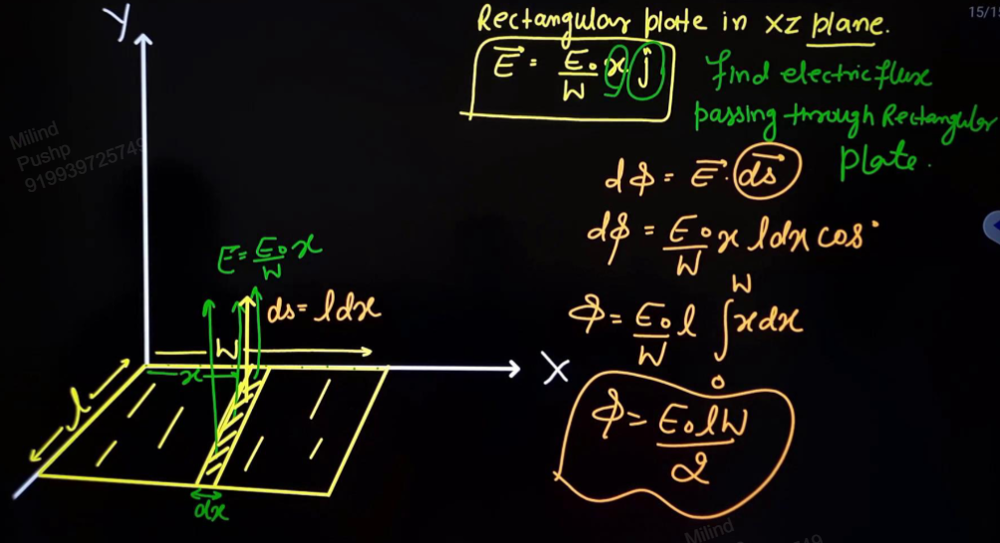

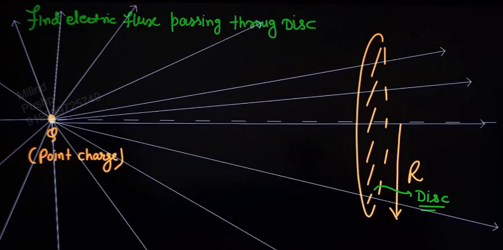
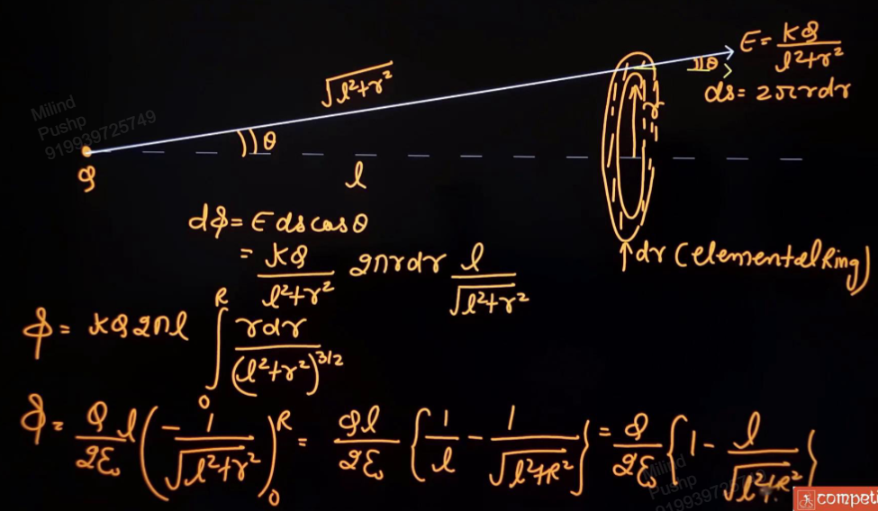

For a 3D curved surface, we will use projection of the surface (cross sectional area),
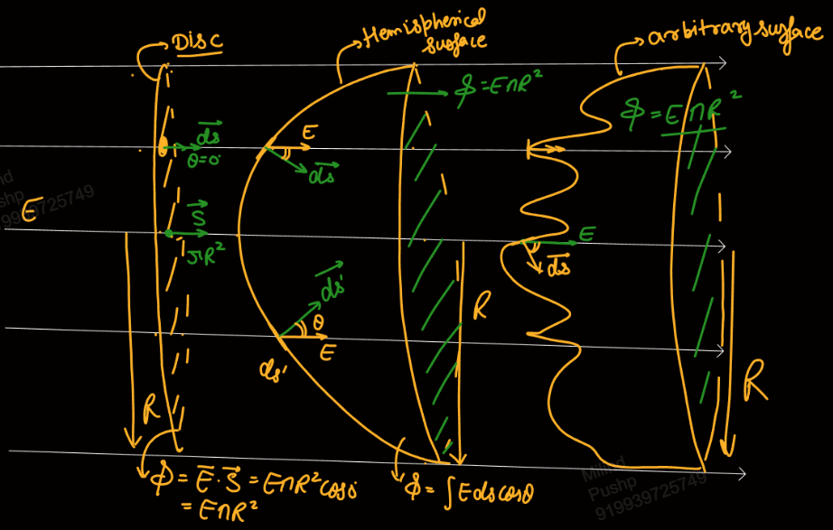

### Flux due to Point Charge
$\oint$ represents closed surface, i.e. closed integral.

$$
\begin{split}
\phi &= \oint \vec{E} . \, d\vec{s} \\
&= \oint Eds \cos \theta \\
&= \oint Eds \\
&= E \oint ds in\\
&= E 4\pi R^{2} \\
&= \frac{ kQ }{ R^{2} } 4\pi R^{2} \\
&= 4\pi kQ 
\end{split}
$$

Thus, for a point charge,
$$\phi = \frac{ Q }{ \varepsilon_{o} }$$
where Q is with sign. This is independent of radius of sphere, R.

Flux going out of a surface is +ve and going into it is -ve. 

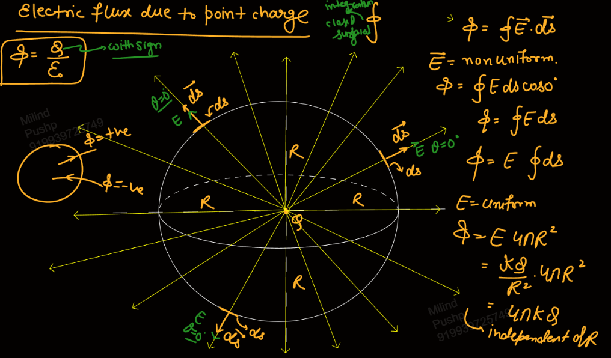

##### Some PTR
The ELOF which pass through smaller sphere, also pass through the bigger sphere and thus the amount of flux through them is the same. 

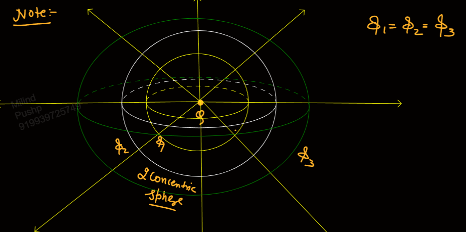

This also works for non concentric spheres as no ELOF disappears as we move from the smaller to the bigger sphere.

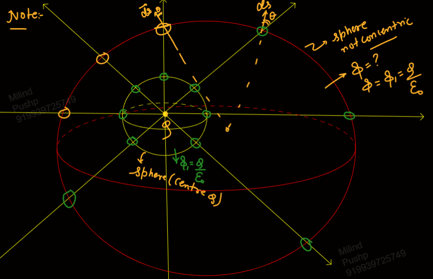

Thus, for any closed surface, if there is a charge inside the surface, the flux passing through it will be $\phi = Q /\varepsilon_{o}$.

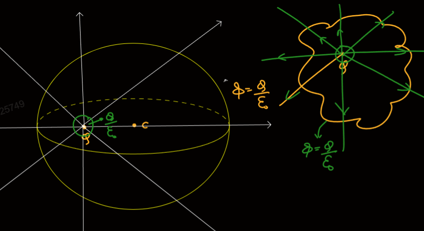

If charge is not inside the closed surface, the flux through the surface will be zero as the lines which enter will also leave. 

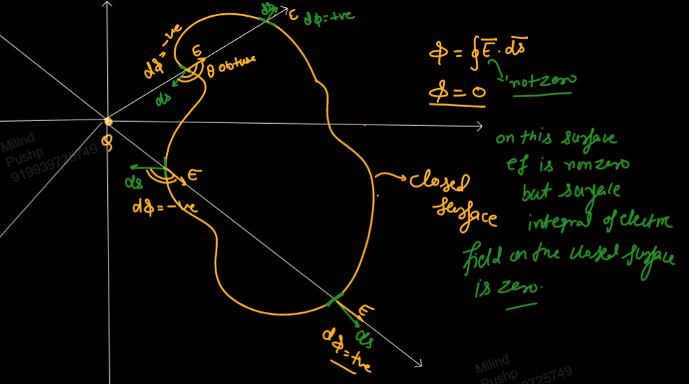

## Gauss Law
aka **Gauss Theorem**

Flux emitted by a charge Q is equal to $\displaystyle \frac{Q}{\varepsilon_{o}}$. 

Closed surface is called **Gaussian Surface.**

If there is no charge inside a gaussian surface, the flux through it is zero. 

*Surface integral of electric field on a closed surface is always equal to charge enclosed per unit permittivity of free space.*

That is, the total flux through a gaussian surface is equal to the total charge inside divided by $\varepsilon_{o}$.

$$\phi = \frac{ Q_{in} }{ \varepsilon_{o} }$$
where $Q_{in}$ is with sign.

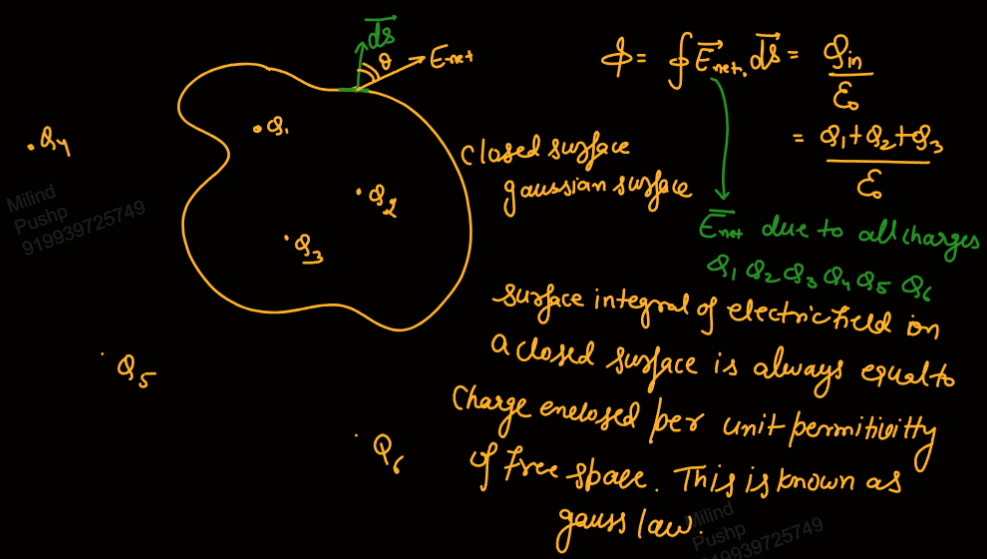

If flux is zero, it does not mean that electric field is zero. However, if E is zero, flux must be zero.

The total flux is equally distributed through all the faces of a 3D shape if charge is placed at the centre.

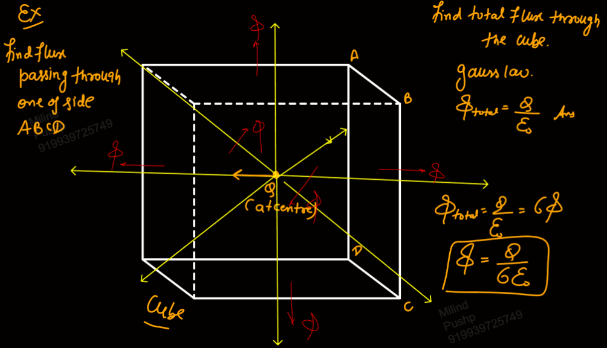

To use symmetry, the shapes we are dividing the flux among must be the same for the charge (i.e. same E through them, same distance from charge).

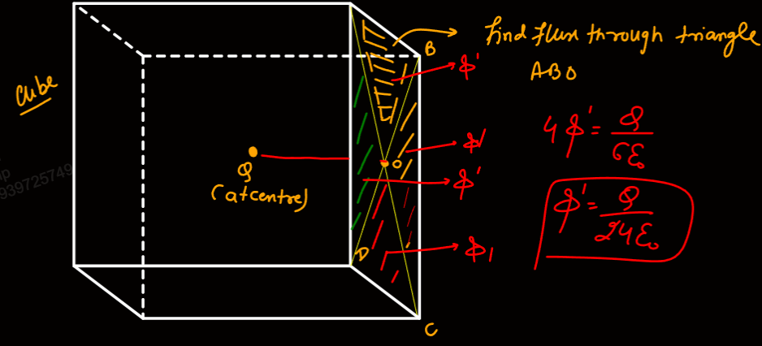

If charge is placed at surface or vertex or edge, we will consider the point charge as a small sphere. 

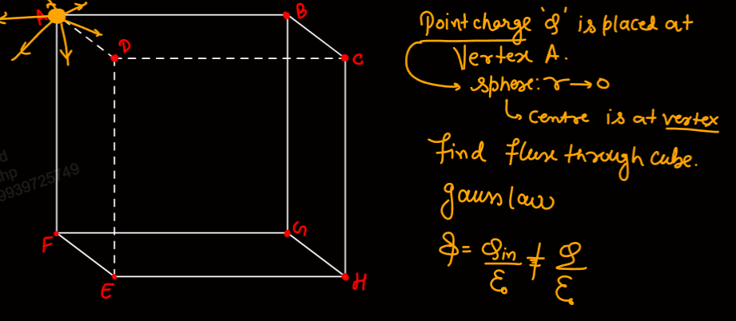
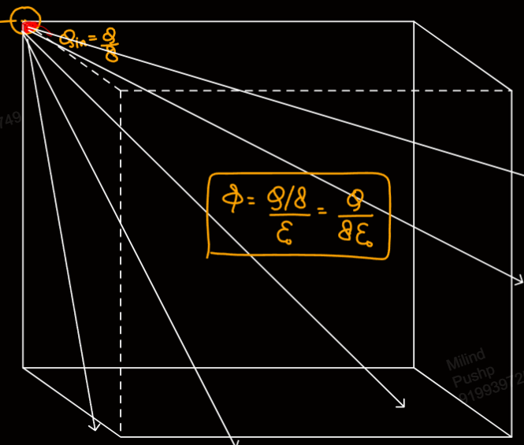
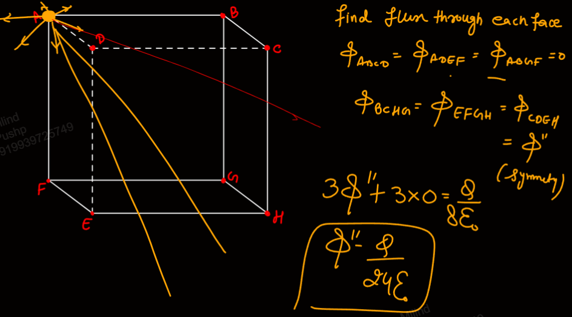
