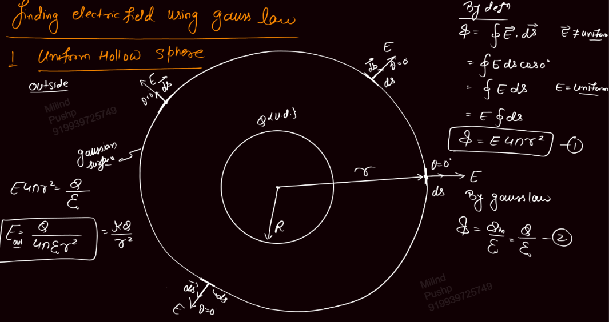
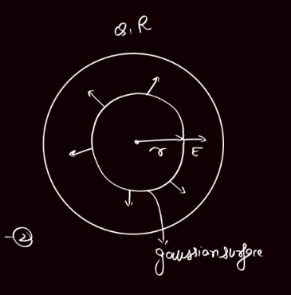
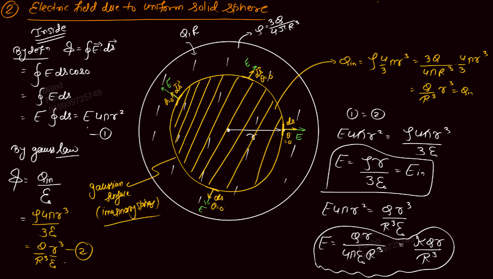
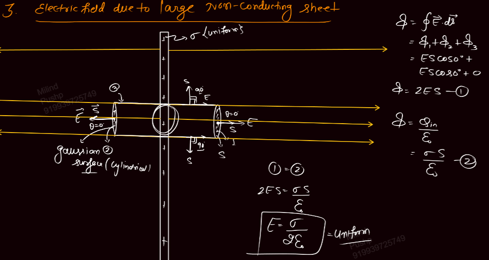
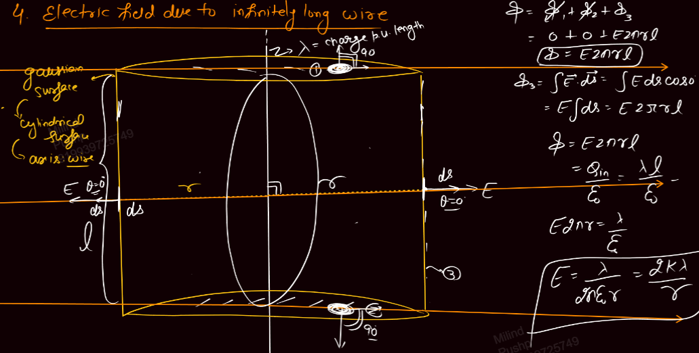
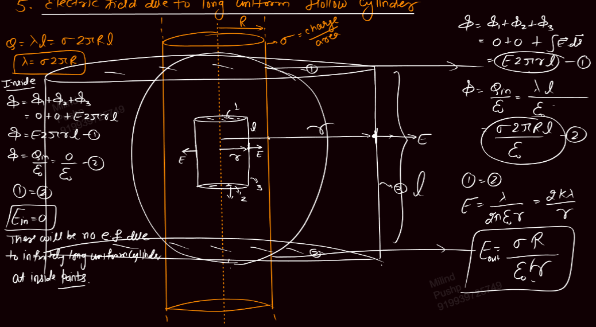
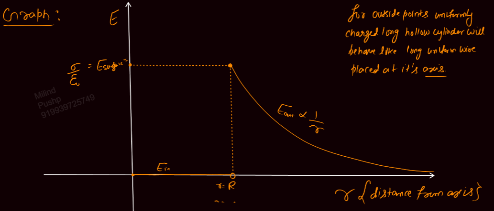
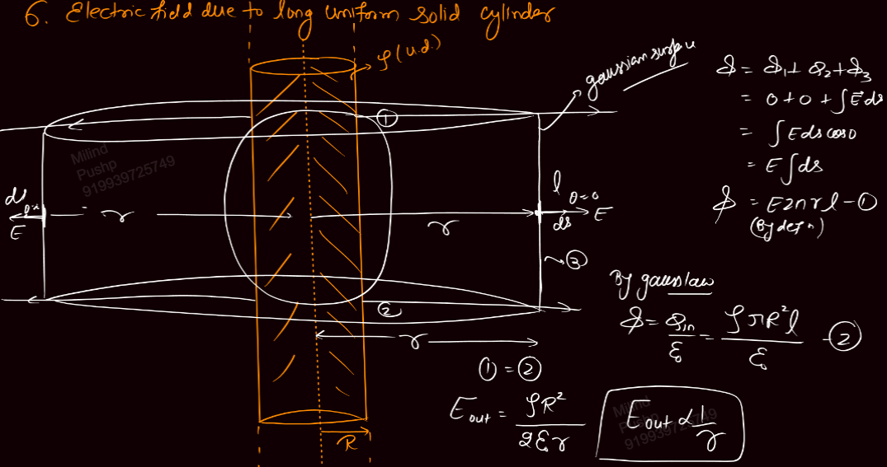
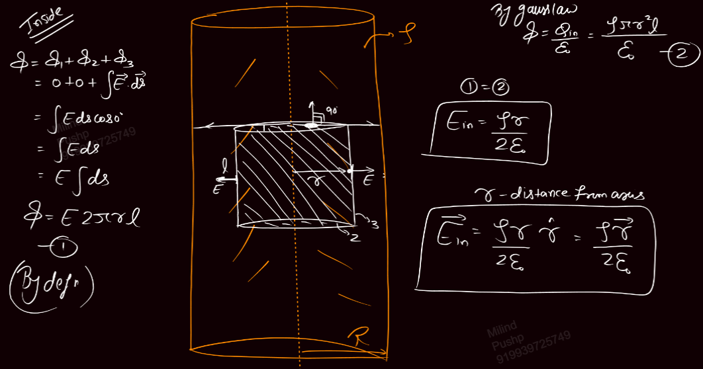
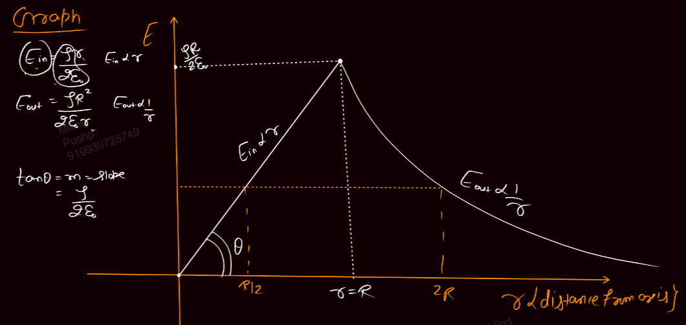

Links: [[10 Electric Flux & Gauss Law]]
___
# Finding Field Using Gauss Law
#### Uniform Hollow Sphere
[[03.3 Sphere#Uniformly Charged Hollow Sphere]]

##### Outside 
We consider a gaussian surface of radius r.

Now, flux is
$$
\begin{split}
\phi &= \oint \vec{E}. d\vec{s} \\
&= \oint Eds.\cos 0\\
&= E \oint ds \\
&= E. 4\pi r^{2} 
\end{split}
$$
Using gauss law,
$$
\begin{split}
\phi &= \frac{ Q }{ \varepsilon_{o} } \\
E. 4 \pi r^{2} &= \frac{ Q }{ \varepsilon_{o} } \\
E &= \frac{ 1 }{ 4\pi\varepsilon_{o} } \frac{ Q }{ r^{2} } \\
&= \frac{ kQ }{ r^{2} }
\end{split}
$$

##### Inside 
Like before, we make a gaussian surface of radius r. 

Now, flux can be written as,
$$\phi = E 4\pi r^{2}$$
Using gauss law,
$$\phi = 0$$

Thus giving,
$$E_{in} = 0$$

#### Uniform Solid Sphere 
[[03.3 Sphere#Uniformly Charged Hollow Sphere]]

Outside will be the same as that of hollow sphere.

Here, charge density,
$$\rho = \frac{ 3Q }{ 4\pi R^{3} }$$

##### Inside 
We make a gaussian surface of radius r.

Now, flux through this surface,
$$
\begin{split}
\phi &= \oint \vec{E}. d\vec{s} \\
&= E \oint ds \\
&= E. 4 \pi r^{2}
\end{split}
$$

Charge inside the gaussian surface will be,
$$
\begin{split}
Q_{in} &= \rho \frac{ 4 }{ 3 } \pi r^{3} \\
&= \frac{ Qr^{3} }{ R^{3} }
\end{split}
$$

Using gauss law,
$$
\begin{split}
\phi &= \frac{ Q_{in} }{ \varepsilon_{o} } \\
&= \frac{ \rho 4\pi r^{3} }{ 3\varepsilon_{o} } \\
&= \frac{ Qr^{3} }{ R^{3} \varepsilon_{o} } \\
E. 4\pi r^{2} &= \frac{ \rho 4\pi r^{3} }{ 3 } \\
E. 4\pi r^{2} &= \frac{ Qr^{3} }{ R^{3} \varepsilon_{o} }
\end{split} 
$$

Thus giving,
$$E = \frac{ \rho r }{ 3 \varepsilon_{o} } = \frac{ 1 }{ 4\pi\varepsilon_{o} } \frac{ Qr }{ R^{3} }$$

#### Large Non Conducting Sheet
[[03.2 Wire#Infinitely Large Sheet]]

We make a cylindrical and symmetrical gaussian surface.

Flux can be given as,
$$
\begin{split}
\phi &= \oint \vec{E} . d\vec{s}\\
&= \phi_{1} + \phi_{2} + \phi_{3} \\
&= ES \cos 0 + ES \cos 0 + 0 \\
&= 2ES
\end{split}
$$

Using gauss law,
$$
\begin{split}
\phi &= \frac{ \sigma S }{ \varepsilon_{o} } \\
2ES &= \frac{ \sigma S }{ \varepsilon_{o} } \\
E &= \frac{ \sigma }{ 2 \varepsilon_{o} }
\end{split}
$$

Which is uniform E.

#### Infinitely Long Wire
[[03.2 Wire#Infinitely Long Wire]]

We will make a cylindrical gaussian surface, axis of which is the wire. 

Flux is given as,
$$
\begin{split}
\phi &= \phi_{1} + \phi_{2} + \phi_{3} \\
&= 0 + 0 + \int \vec{E} \, d\vec{s} \\
&= E \int ds \\
&= E. 2\pi rl   
\end{split}
$$

Using gauss law,
$$
\begin{split}
\phi &= \frac{ \lambda l }{ \varepsilon_{o} } \\
E. 2\pi rl &= \frac{ \lambda l }{ \varepsilon_{o} } \\
E &= \frac{ \lambda }{ 2\pi \varepsilon_{o} r } \\
&= \frac{ 2k\lambda }{ r }
\end{split}
$$

#### Long Hollow Cylindrical 
Infinitely long and having radius R. 

Here,
$$
\begin{split}
Q &= \lambda l \\
&= \sigma 2 \pi R l \\
\lambda &= \sigma 2\pi R
\end{split}
$$
Where $\lambda, \sigma$ mean charge per unit length and area. 

##### Inside  
We make a smaller cylindrical gaussian surface of radius r.

Flux is,
$$
\begin{split}
\phi &= \phi_{1} + \phi_{2} + \phi_{3} \\
&= 0 + 0 + E. 2\pi rl
\end{split}
$$

Using gauss law,
$$\phi = 0$$
Thus giving,
$$E_{in} = 0$$

There will be no E due to infinitely long uniformly charged cylinder at inside point.

##### Outside
We make a larger cylindrical gaussian surface of radius r.

Flux will be,
$$
\begin{split}
\phi &= \phi_{1} + \phi_{2} + \phi_{3} \\
&= 0 + 0 + E 2\pi rl\\
&= E. 2\pi rl
\end{split}
$$

Using gauss law,
$$
\begin{split}
\phi &= \frac{ \lambda l }{ \varepsilon_{o} } \\
&= \frac{ \sigma. 2\pi rl }{ \varepsilon_{o} } \\
E &= \frac{ \lambda }{ 2\pi \varepsilon_{o} r } \\
&= \frac{ 2k\lambda }{ r }
\end{split}
$$
Which is the same that of infinitely long wire. 

Thus long hollow cylinder acts like an infinite wire placed at its axis for outside point.

In terms of $\sigma$,
$$E = \frac{ \sigma R }{ \varepsilon_{o} r }$$

##### Graph 

#### Long Uniform Solid Sphere 
Infinitely long and having radius R.

The charge is in the volume, i.e. $\rho$.

##### Outside 
We make a larger cylindrical gaussian surface of radius r.

Flux through this surface,
$$
\begin{split}
\phi &= \phi_{1} + \phi_{2} + \phi_{3} \\
&= 0 + 0 + E.2\pi rl
\end{split}
$$

Using gauss law,
$$
\begin{split}
\phi &= \frac{ \rho \pi R^{2}l }{ \varepsilon_{o} } \\
E_{out} &= \frac{ \rho R^{2} }{ 2\varepsilon_{o} r }
\end{split}
$$

##### Inside
We make a smaller cylindrical gaussian surface of radius r.

Flux through this is,
$$
\begin{split}
\phi &= \phi_{1} + \phi_{2} + \phi_{3} \\
&= 0 + 0 + E.2\pi rl \\
&= E. 2\pi rl
\end{split}
$$

Using gauss law,
$$
\begin{split}
\phi &= \frac{ \rho \pi r^{2} l }{ \varepsilon_{o} } \\
E_{in} &= \frac{ \rho r }{ 2\varepsilon_{o} }
\end{split}
$$

##### Graph 
