Links: [[12 Electrostatics of Conductors]]
___
# Sharing of Charges
Charges will flow until the potentials at both the conductors is equal. 

The net charge of the system is conserved. 

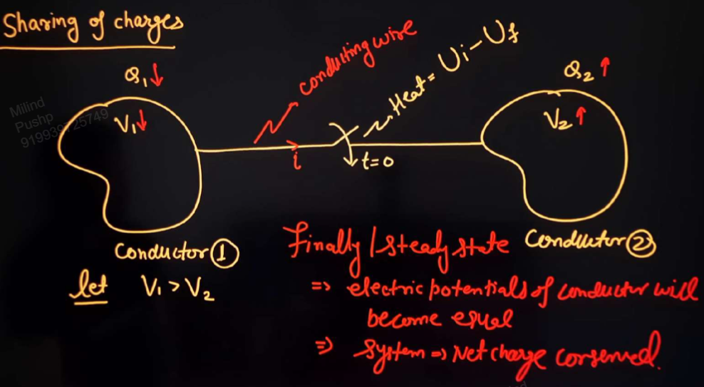

##### Conducting Spheres Connected by Wire
Condition in which there is no flow of charge in the wire,
$$
\begin{split}
\frac{ kQ_{1} }{ R_{1} } &= \frac{ kQ_{2} }{ R_{2} } \\
\frac{ Q_{1} }{ R_{1} } &= \frac{ Q_{2} }{ R_{2} }
\end{split}
$$

If $Q_{1} /R_{1} > Q_{2} /R_{2}$, then final charge on the spheres, $q_{1},q_{2}$

Equating final voltages,
$$
\begin{split}
V = \frac{ kq_{1} }{ R_{1} } &= \frac{ kq_{2} }{ R_{2} } \\
\frac{ q_{1} }{ q_{2} } &= \frac{ R_{1} }{ R_{2} }
\end{split}
$$
Using conservation of charge,
$$Q_{1} + Q_{2} = q_{1} + q_{2}$$

Thus giving,
$$
\begin{split}
q_{1} &= \frac{ R_{1} }{ R_{1} + R_{2} } (Q_{1} + Q_{2}) \\
q_{2} &= \frac{ R_{2} }{ R_{1} + R_{2} } (Q_{1} + Q_{2}) \\
\end{split}
$$
i.e. shells *share charge proportional to their radii.*

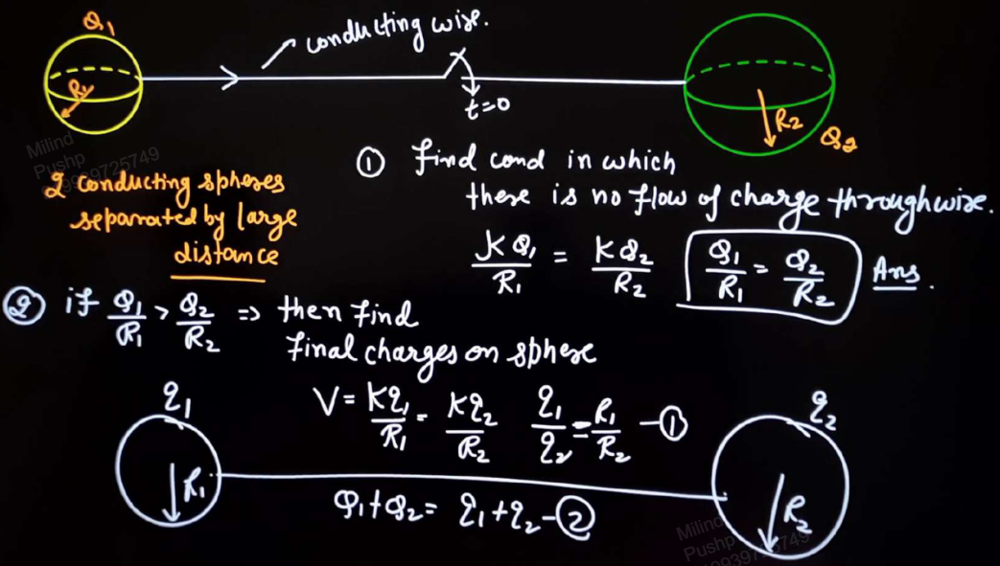

Now,
$$
\begin{split}
\frac{ q_{1} }{ q_{2} } &= \frac{ R_{1} }{ R_{2} } \\
\frac{ \sigma_{1} 4\pi R_{1}^{2} }{ \sigma_{2} 4\pi R_{2}^{2} } &= \frac{ R_{1} }{ R_{2} } \\
\frac{ \sigma_{1} }{ \sigma_{2} } &= \frac{ R_{2} }{ R_{1} }
\end{split}
$$
Thus, areal *charge density is inversely proportional to radius.*

Heat dissipated from the conducting wire can be given as,
$$
\begin{split}
\text{Heat} &= U_{i} - U_{f} \\
&= \text{self energy}_{i} - \text{self energy}_{f} \\
&= \frac{ kQ_{1}^{2} }{ 2R_{1} } + \frac{ kQ_{2}^{2} }{ 2R_{2} } - \left( \frac{ kq_{1}^{2} }{ 2R_{1} } + \frac{ kq_{2}^{2} }{ 2R_{2} } \right) 
\end{split}
$$

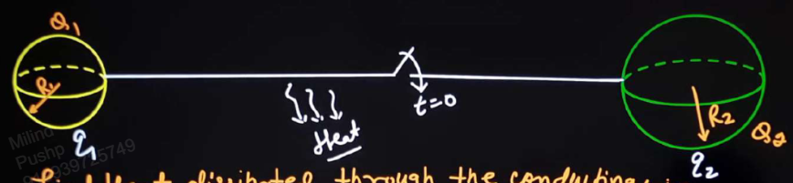

##### Concentric Spheres Connected by Wire
Final charges on the shells,
$$
\begin{split}
V_{A} &= V_{B} \\
\frac{ kx^{2} }{ R_{1} } + \frac{ k(Q_{1}+Q_{2} - x)^{2} }{ R_{2} } &= \frac{ kx^{2} }{ R_{2} } + \frac{ k(Q_{1}+Q_{2} - x)^{2} }{ R_{2} } \\
\frac{ kx^{2} }{ R_{1} } &= \frac{ kx^{2} }{ R_{2} } \\
x &= 0
\end{split}
$$
This means that all the charge goes to the outer shell. 

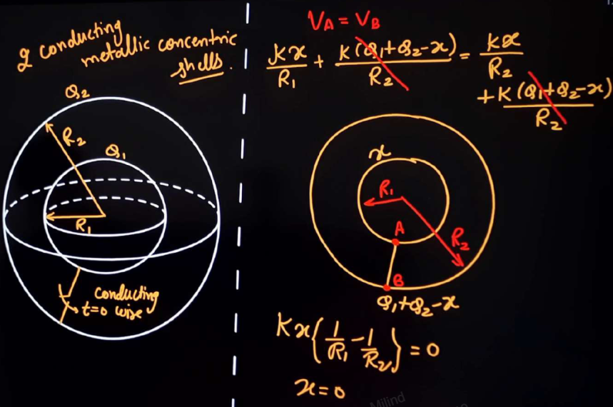

Example,

### Grounding/Earthing 
Earth is considered a large conducting sphere. 

Earth's charge and potential is fixed and is thus considered zero. 

Any appliance connected with Earth has its potential dropped to zero.

If a conducting object is connected to earth through a conducting wire, then its electric potential will become the same as earth, i.e. zero.

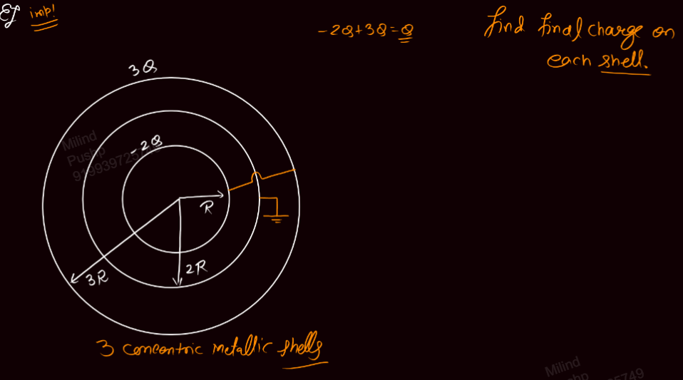
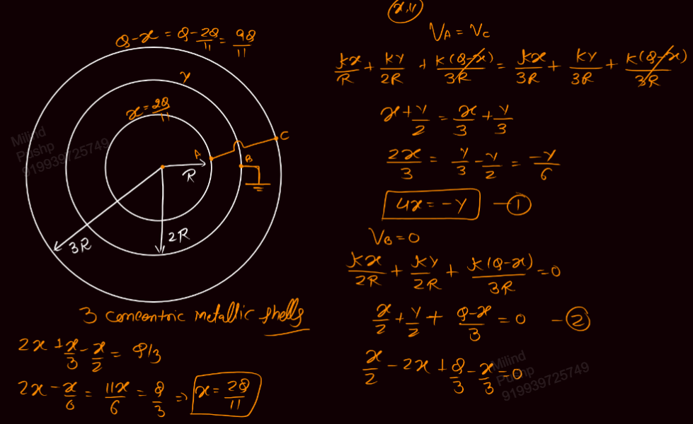

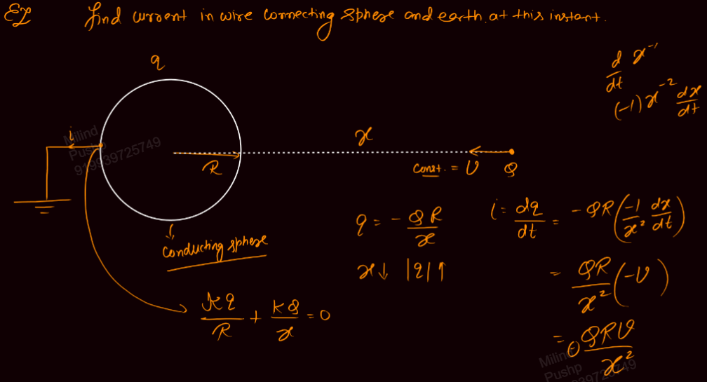

### Charge dist. and Induction in Cavity 
There is a point charge q inside the cavity. 

We take a gaussian surface enclosing the cavity. 

Flux through this surface,
$$\phi = \oint \vec{E}.d\vec{s} = 0$$
Since there is no field inside conductor. 

Using gauss law,
$$\phi = \frac{ q + q_{ind} }{ \varepsilon_{o} } = 0$$
Thus giving,
$$q_{ind} = -q$$

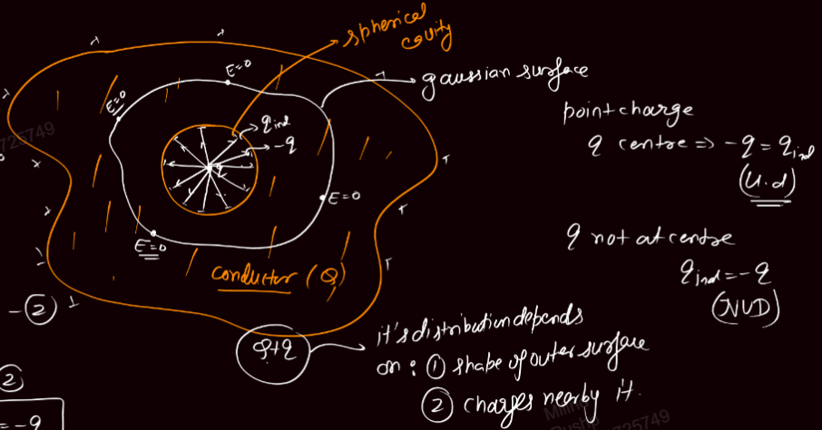

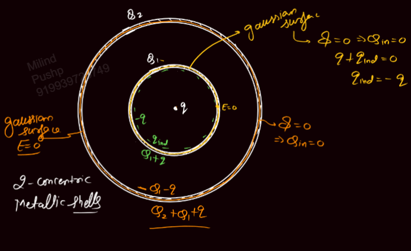

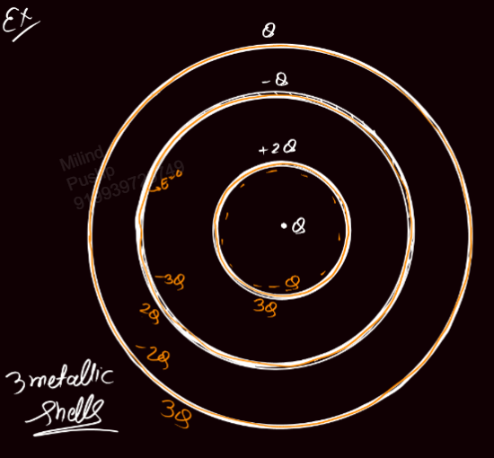

### Electrostatic Shielding 
Distribution of induced charge in the cavity is decided by shaped of it and positions of the charges inside it.

Distribution of charge on outer surface depends on shape of it and the positions of other charges.

Charges inside cavity and charge induced on it will have no *net* electric effect outside the cavity. 

Charges outside outer surface and charge on it will have no *net* electric effect inside the cavity. 

This is known as Electrostatic Shielding, 

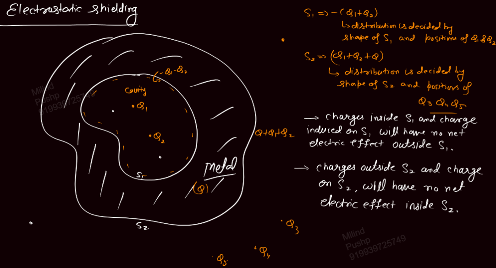

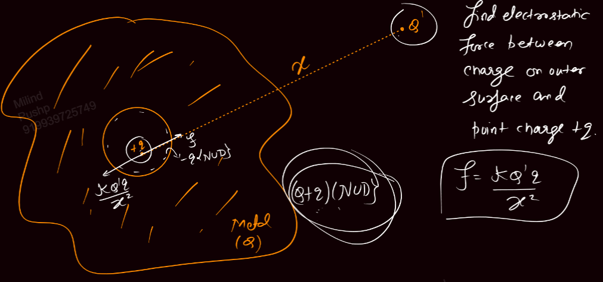

### Large Conducting  Plate
Between non metallic and metallic plates, charge distribution is different. In metallic plate, the charge is distributed in two layers, and thus the charge density is half for metallic plate.

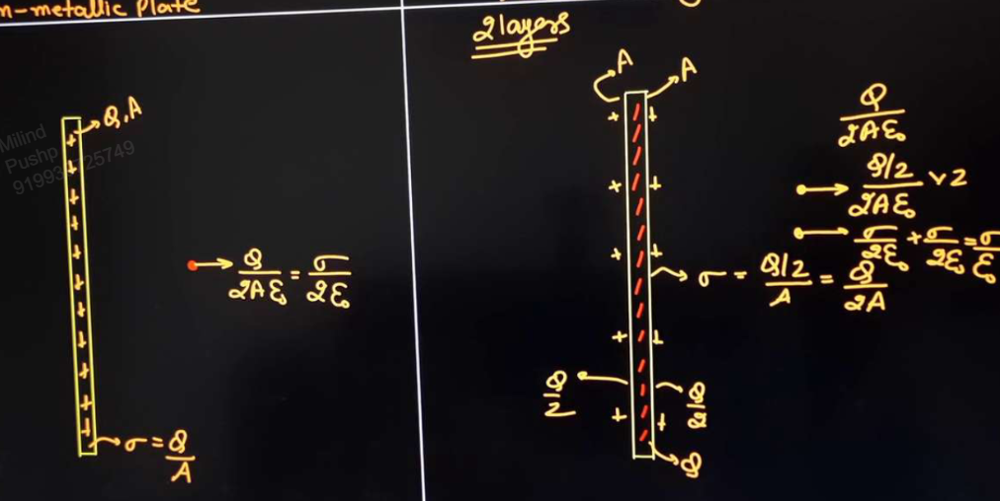

However, if charge given is the same, then field is also the same.
And if $\sigma$ is the same, the charge and thus the field for the metallic plate will be double. 

Proof that the charge is distributed evenly,
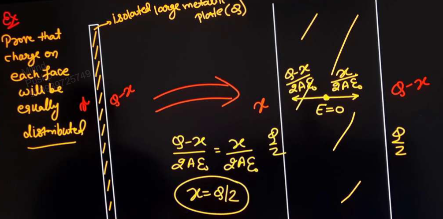

#### Field due to large conducting plate 
By gauss law. 

We make a cylindrical gaussian surface on one of the sides of the plate. One of the circles of the cylinder is inside the metal plate.  

The flux through this is,
$$
\begin{split}
\phi &= \phi_{1} + \phi_{2} + \phi_{3} \\
&= EA + 0 + 0 
\end{split}
$$

Using gauss law,
$$
\begin{split}
\phi &= \frac{ \sigma A }{ \varepsilon_{o} } \\
EA &= \frac{ \sigma A }{ \varepsilon_{o} } \\
E &= \frac{ \sigma }{ \varepsilon_{o} }
\end{split}
$$

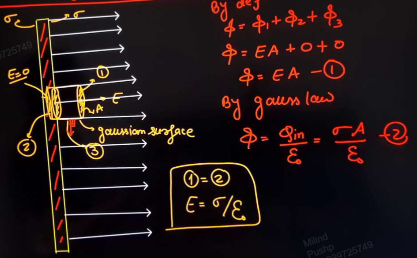

#### Induction of Charge 
If two large metallic plates are placed parallelly near each other, then charging on their opposing faces will be equal and opposite.

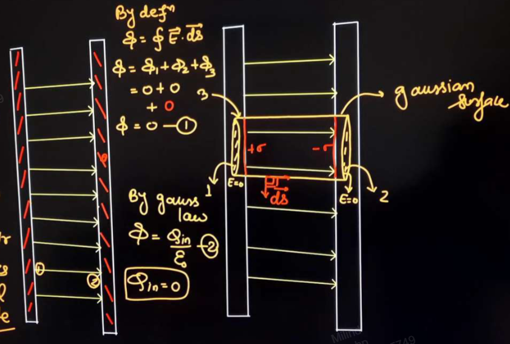

To find the induced charge, we always do $E_{in} = 0$ for any point inside any of the conductors. 

Short cut if there is no external electric field,
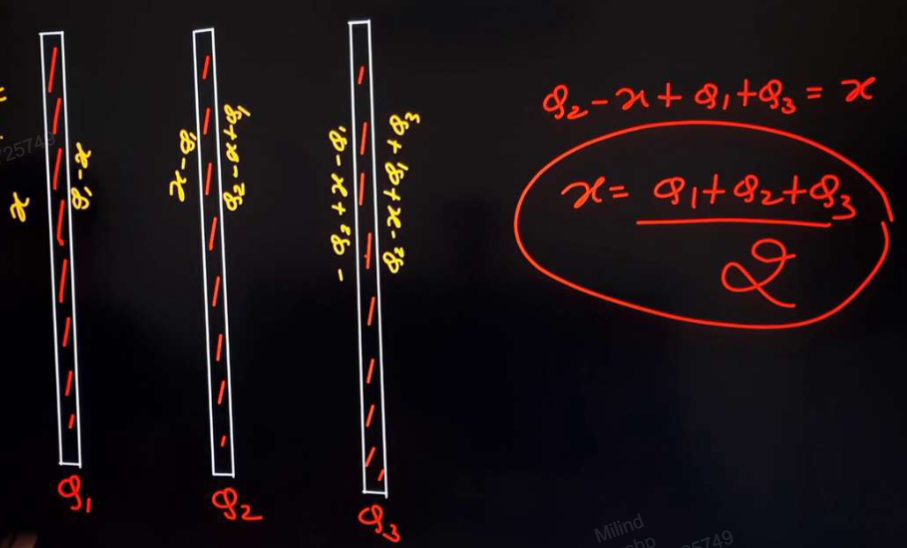

##### Examples 
We are not writing the elrctric field due to Q-x and x-Q because they will cancel each other.
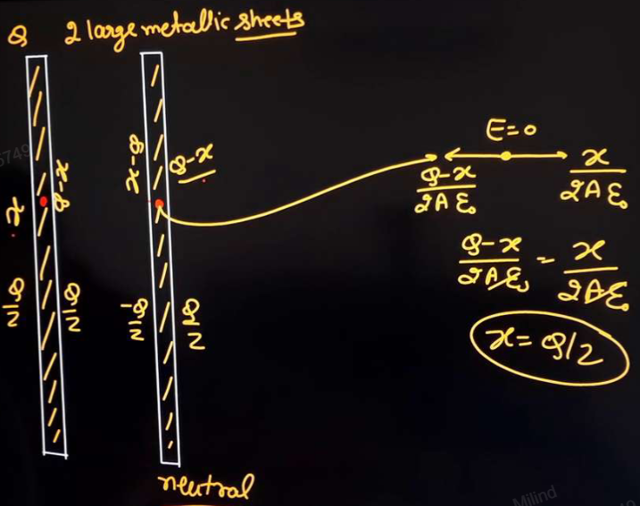

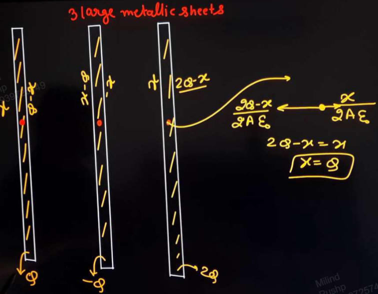

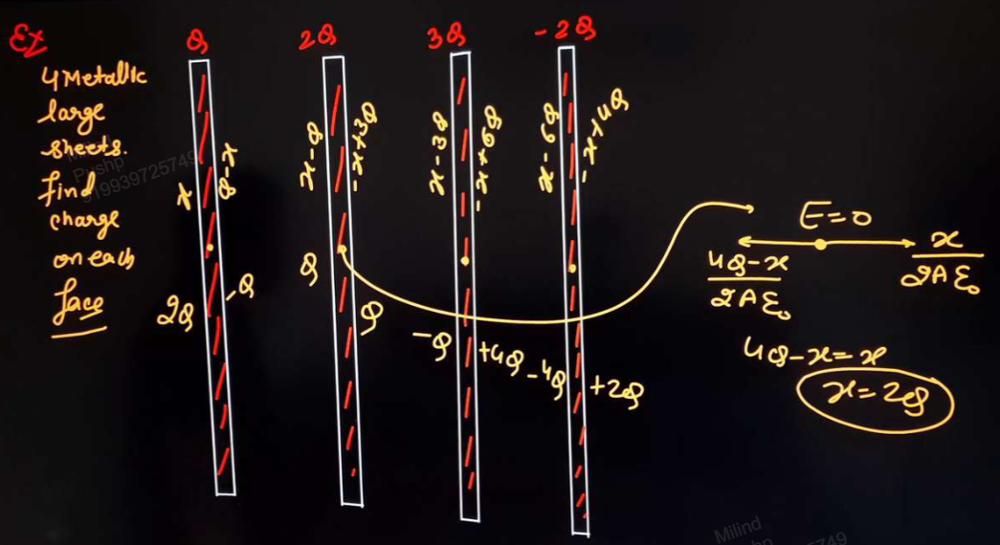

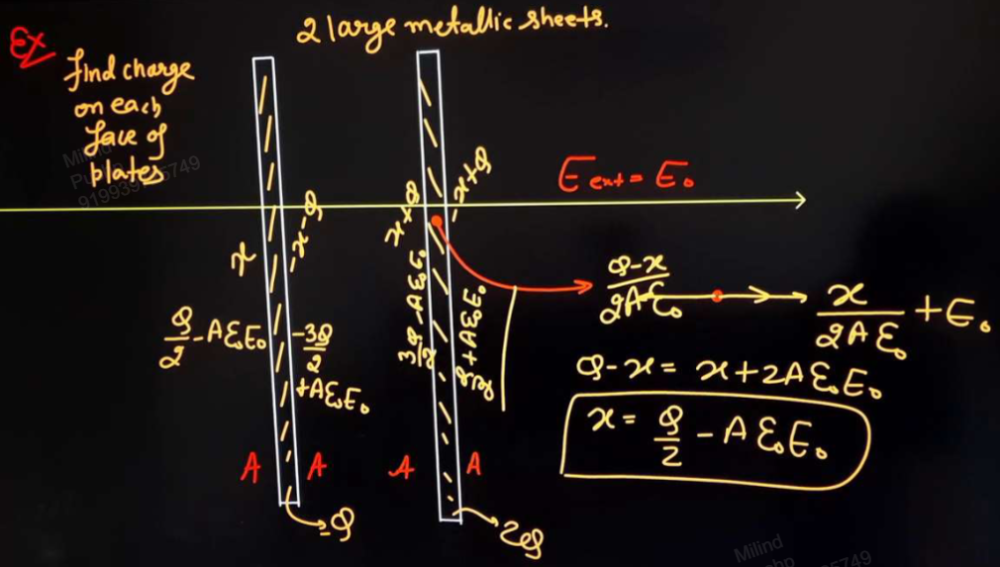

#### Earthing of Plate 
Final charge on isolated metallic plate becomes zero. 

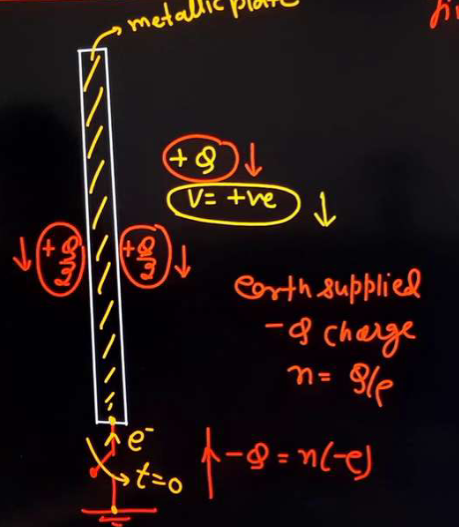

However if there is some other charged plate near it, the charge on one side of the plate will increase while the other side will decrease. 

The left most and the right most charge will become zero.
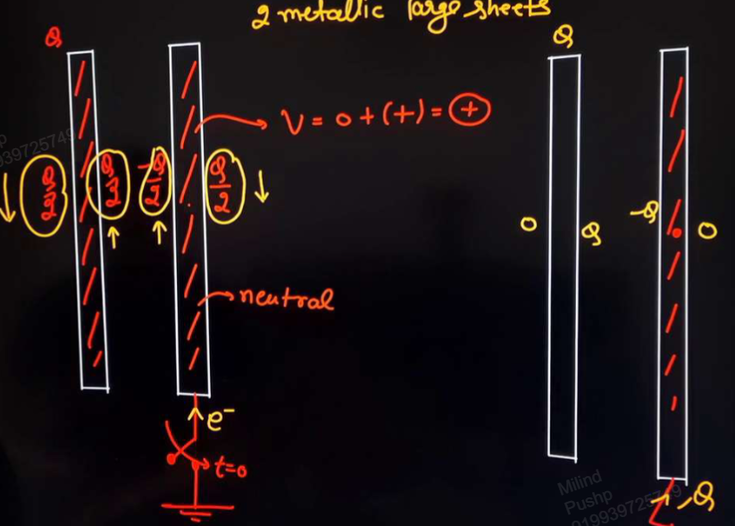

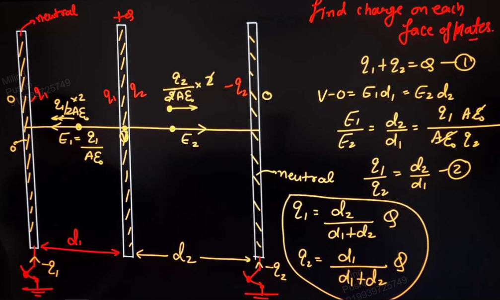
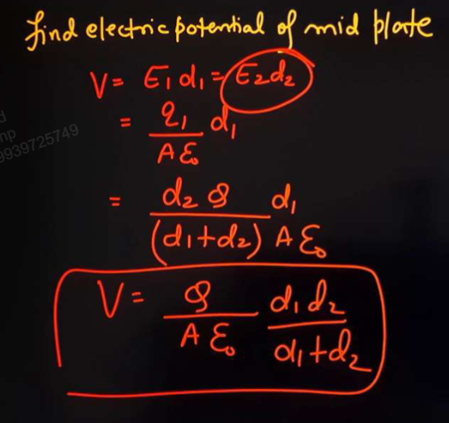

