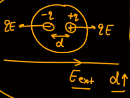
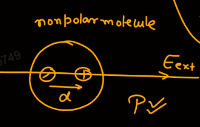
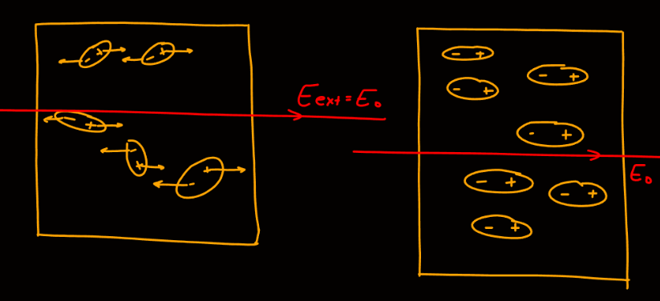
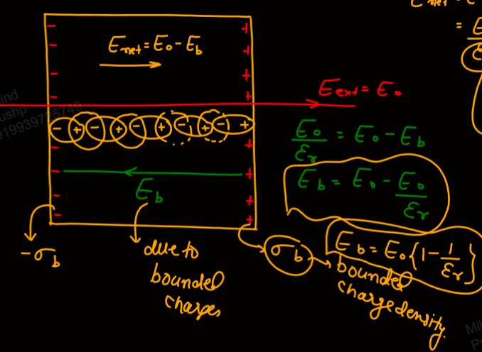
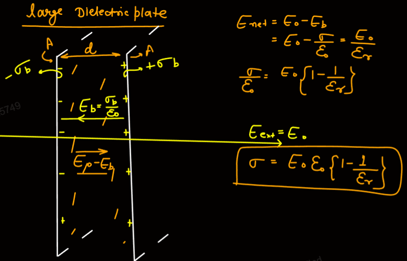
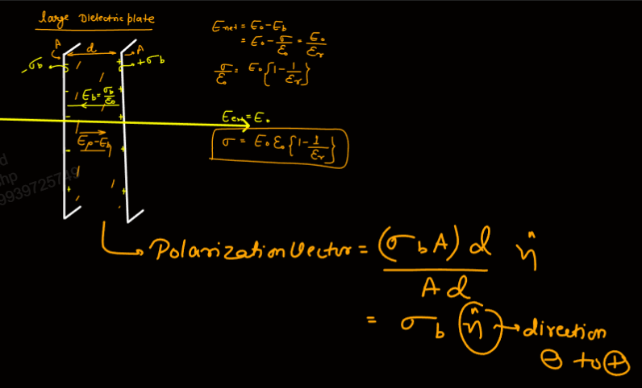

Links: [[00 Electrostatics]], [[12 Electrostatics of Conductors]]
___
# Dielectrics 
They are non-conductors and they have no free electrons.

They are divided into two parts,
#### Polar Molecules 
Where the +ve and -ve charge do not coincide. 
I.e. nucleus and COM of e doesn't coincide.

Centres of +ve charge and -ve charge do not coincide. 

Polar molecules have some dipole moment. 
$$P = qd$$

On applying electric field, dipole moment changes. In general dipole moment increases. 

First the dipole aligns and then the dipole moment increases. 

#### Non Polar Molecules 
Centres of +ve charge and -ve charge coincide and thus the dipole moment is zero in absence of external electric field.

On applying external electric field, the molecules get polarized and a dipole moment is created along the field. 

On removing the external electric field, dipole moment becomes zero. 

### Polarization 
The aligning of all the dipole moments along the electric field is called Polarization. 

The ease with which the dielectric aligns with the field is a property of the material. 

After the application of external field, there will be a layer of +ve and a layer of -ve charges. 

These charges are bounded and has charge density $\sigma_{d}$. 

Due to these bounded charges, there will be an electric field, $E_{b}$. The intensity of this field is a property of the material.

Thus the net electric field inside will be,
$$E_{net} = E_{o} - E_{b}$$
This field is,
$$E_{net} = \frac{ E_{o} }{ \varepsilon_{r} }$$
$\varepsilon_{r}$ is dielectric constant and is property of the material. 

Material which are easily polarized have higher $\varepsilon_{r}$. 

The field due to bounded charge is,
$$
\begin{split}
\frac{ E_{o} }{ \varepsilon_{r} } &= E_{o} - E_{b} \\
E_{b} &= E_{o} \left( 1 - \frac{ 1 }{ \varepsilon_{r} } \right)
\end{split}
$$

### Polarization Vector 
It is dipole moment per unit volume. 

It is always along dipole moment (from -ve to +ve charge).

Its unit is $\ce{ C m^{-2} }$. Which is the same as $\sigma$. 

