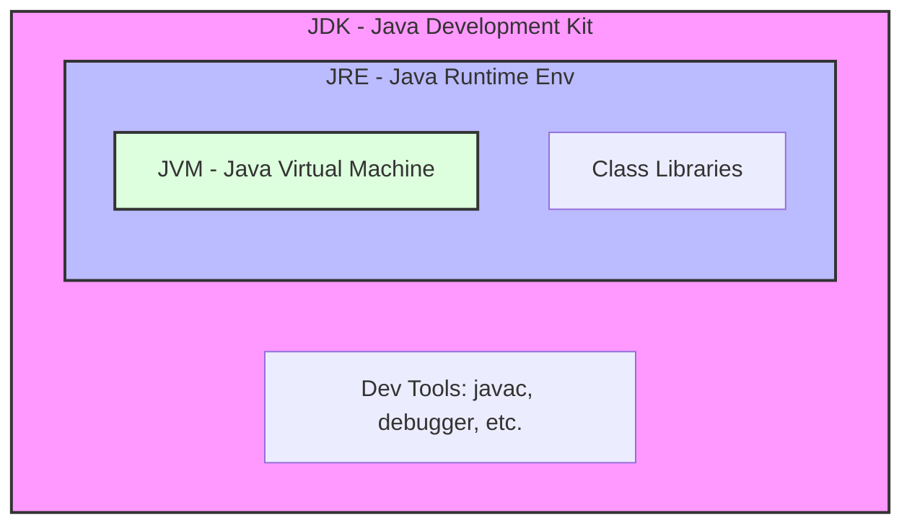
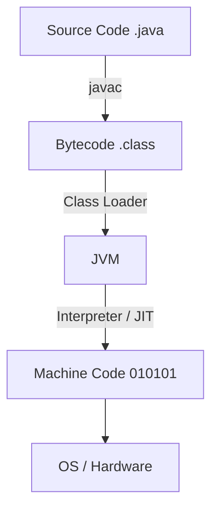

Links:

---

# Java

Java is a high-level, class-based, object-oriented programming language that is designed to have as few implementation dependencies as possible. It is a general-purpose programming language intended to let application developers _write once, run anywhere_ (WORA).

It follows the four pillars of OOP:

1. [[01 Inheritance]]
2. [[02 Polymorphism]]
3. [[03 Encapsulation]]
4. [[04 Abstraction]]

## Java Environment

The Java environment consists of three main components: JDK, JRE, and JVM.

### JDK (Java Development Kit)

It is a software development environment used for developing Java applications. It includes the JRE, an interpreter/loader (Java), a compiler (javac), an archiver (jar), a documentation generator (Javadoc), and other tools needed in Java development.

### JRE (Java Runtime Environment)

It provides the libraries, the Java Virtual Machine (JVM), and other components to run applets and applications written in the Java programming language. It does not contain tools for development like compilers or debuggers.

### JVM (Java Virtual Machine)

It is an abstract machine. It is a specification that provides a runtime environment in which Java bytecode can be executed.

**Responsibilities of JVM:**

- Loads code
- Verifies code
- Executes code
- Provides runtime environment



> [!TIP] > Analogy: The Kitchen
>
> - **JDK (The Whole Kit):** The entire kitchen setup. It has the stove, ingredients, **AND** the recipe books/tools to _create_ new dishes.
> - **JRE (Runtime Env):** A kitchen that is only for _serving_ food. It has the stove and ingredients to cook (run) the meal, but no tools to write new recipes.
> - **JVM (The Chef):** The person who actually cooks. They read the recipe (Bytecode) and use the stove (Hardware) to make the food (Machine Code).

## Compilation Process

1.  **Source Code**: The programmer writes code in `.java` files.
2.  **Compilation**: The `javac` compiler converts the source code into **Bytecode** (`.class` files). Bytecode is platform-independent.
3.  **Execution**: The JVM reads the bytecode and translates it into machine code (native machine language) for the specific operating system.



## Java Source File Structure

A Java source file can contain multiple classes, but there are specific rules:

1.  There can be only **one** `public` class per source file.
2.  If there is a public class, the name of the file must match the name of the public class.
3.  If there is no public class, the file can have any name.

```java
// File: Main.java
public class Main { // File name must be Main.java
    public static void main(String[] args) {
        System.out.println("Hello World");
    }
}
class Helper { // Non-public class allowed in the same file
    // ...
}
```

## Classes and Objects

### Class

A class is a blueprint or template from which objects are created. It defines a set of properties (fields) and methods that are common to all objects of one type.

### Object

An object is an instance of a class. It has:

- **State**: Represented by attributes (variables).
- **Behavior**: Represented by methods.
- **Identity**: A unique name (reference) to interact with it.

> [!TIP] > Analogy: Blueprint vs. House
>
> - **Class** = **The Blueprint**. It's just a drawing on paper. You can't live in it. It describes what the house _will_ look like.
> - **Object** = **The House**. It's the actual physical building created from the blueprint. You can build 100 identical houses (Objects) from 1 blueprint (Class).

```java
class Car {
    // Fields (State)
    String color;
    String model;

    // Method (Behavior)
    void drive() {
        System.out.println("Driving " + model);
    }
}

public class Test {
    public static void main(String[] args) {
        Car myCar = new Car(); // Creating an object
        myCar.model = "Tesla";
        myCar.drive();
    }
}
```

## Access Specifiers

Access specifiers determine the visibility of classes, methods, and variables.

| Specifier                 | Class | Package | Subclass | World |
| :------------------------ | :---: | :-----: | :------: | :---: |
| **public**                |  Yes  |   Yes   |   Yes    |  Yes  |
| **protected**             |  Yes  |   Yes   |   Yes    |  No   |
| **default** (no modifier) |  Yes  |   Yes   |    No    |  No   |
| **private**               |  Yes  |   No    |    No    |  No   |

1.  **private**: Accessible only within the class.
2.  **default**: Accessible only within the package.
3.  **protected**: Accessible within the package and by subclasses in other packages.
4.  **public**: Accessible everywhere.

## Static Members

The `static` keyword indicates that a member belongs to the **class** rather than to any specific instance (object).

### Static Variable

- Shared among all instances of the class.
- Memory is allocated only once when the class is loaded.

### Static Method

- Can be called without creating an object of the class.
- Can only access static data members and other static methods.
- Cannot use `this` or `super` keywords.

```java
class Counter {
    static int count = 0; // Static variable

    Counter() {
        count++; // Increments the shared counter
    }

    static void showCount() { // Static method
        System.out.println("Count: " + count);
    }
}
```

## Final Members

The `final` keyword is used to restrict the user.

1.  **Final Variable**: Value cannot be changed (constant).
2.  **Final Method**: Cannot be overridden by subclasses.
3.  **Final Class**: Cannot be inherited.

```java
final int MAX_SPEED = 100;
// MAX_SPEED = 120; // Compilation Error
```

## Constructors

A constructor is a block of code similar to a method that is called when an instance of an object is created.

### Rules

- Name must be the same as the class name.
- No return type (not even `void`).
- Called automatically when `new` is used.

### Types

1.  **Default Constructor**: Provided by the compiler if no constructor is defined.
2.  **No-Args Constructor**: A constructor with no parameters defined by the user.
3.  **Parameterized Constructor**: A constructor with parameters to initialize fields.
4.  **Copy Constructor**: Used to create an object by copying variables from another object.

```java
class Student {
    String name;
    int age;

    // No-Args Constructor
    Student() {
        this.name = "Unknown";
        this.age = 0;
    }

    // Parameterized Constructor
    Student(String name, int age) {
        this.name = name;
        this.age = age;
    }

    // Copy Constructor
    Student(Student s) {
        this.name = s.name;
        this.age = s.age;
    }
}
```

## `this` Keyword

`this` is a reference variable that refers to the **current object**.

**Usages:**

1.  Refer to current class instance variable (to resolve shadowing).
2.  Invoke current class constructor (`this()`).
3.  Return the current class instance.

```java
class A {
    int x;

    A(int x) {
        this.x = x; // Distinguishes instance variable from parameter
    }

    A() {
        this(10); // Calls the parameterized constructor
    }
}
```
