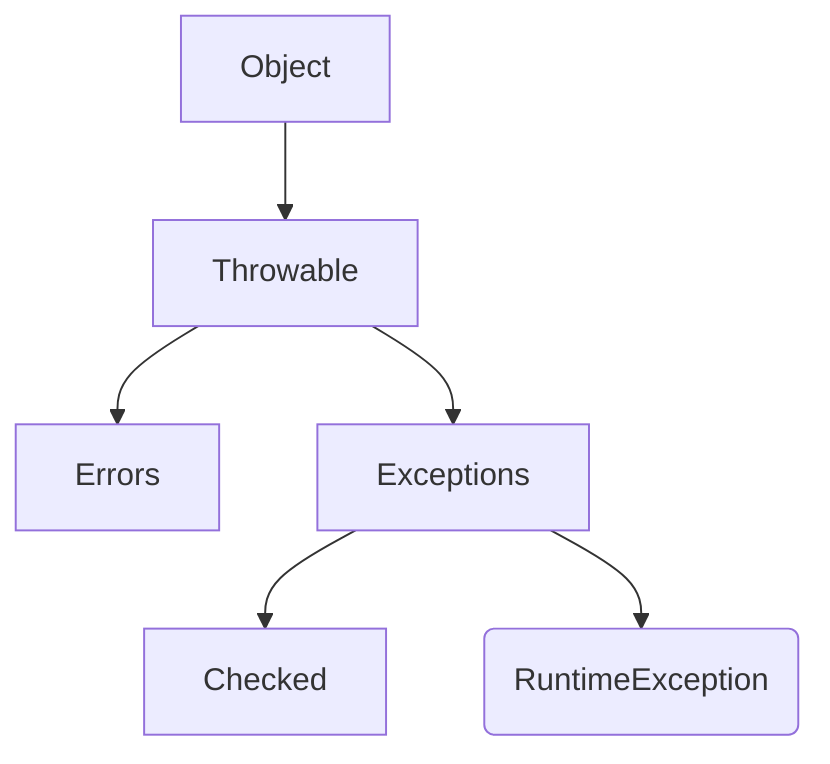

Links:

---

# Exception Handling

Java is robust i.e. it can deal with the errors.

Exception handling is a mechanism through which we catch and manage errors or unusual events during run time that disrupts the normal flow of the program.

Exceptions are run-time errors.

> [!TIP] > Analogy: The Safety Net
>
> - **Program Execution:** Walking on a tightrope.
> - **Exception:** Slipping and falling.
> - **Default Behavior (No Handling):** You fall to the ground and crash (Program Terminates/Crashes).
> - **Exception Handling (Try-Catch):** You have a **Safety Net** below. If you fall, the net catches you, and you can climb back down safely (Graceful Termination or Recovery) instead of dying.

To handle an exception, we can either:

- **Handle it:** Using a `try-catch` block.
- **Duck it (Declare it):** Using the `throws` keyword, forcing the calling method to handle it.

$\\$



**Throwable:** The root class for everything that can be thrown.

- **Error:** Represents serious, unrecoverable problems that should not be caught (e.g., `OutOfMemoryError`, `StackOverflowError`).

- **Exception:** Represents conditions that a program might want to catch and handle.

There are two types of exceptions:

- **Checked:** Exceptions that are checked at compile-time. The compiler forces you to handle them (with try-catch or throws).

  E.g. `IOException`, `SQLException`, `FileNotFoundException`, `ClassNotFoundException`.

- **Unchecked (RuntimeExceptions):** Exceptions that are checked at run-time. They are typically programming errors and the compiler does not force you to handle them.

  E.g. `ArithmeticException`, `ArrayIndexOutOfBoundsException`, `NumberFormatException`, `NullPointerException`.

### Using `try-catch-finally` block

- **`try`:** The code which might throw an exception is written inside the `try` block.
- **`catch`:** The handler for the exception. If an exception of the specified type occurs in `try`, this block is executed.
- **`finally`:** This block is **always** executed, whether an exception was thrown or not. It's used for cleanup (e.g., closing a file or database connection).

```java
try {
    // Code that might cause an error
    int[] myNumbers = {1, 2, 3};
    System.out.println(myNumbers[10]); // This throws an exception
} catch (ArrayIndexOutOfBoundsException e) {
    // Handler for that specific error
    System.out.println("Error: Index is out of bounds.");
} catch (Exception e) {
    // A general handler for any other exception
    System.out.println("Something else went wrong.");
} finally {
    // This code always runs
    System.out.println("The 'try-catch' block is finished.");
}
```

### `throw` Keyword

The `throw` keyword is used to **manually** or **explicitly** throw an exception (or any `Throwable` object) from within a method body.

You use it when your program logic detects an error condition.

```java
public void validateAge(int age) {
    if (age < 18) {
        // We create a new exception object and "throw" it.
        // This immediately stops the method.
        throw new ArithmeticException("Access denied: You must be 18 or older.");
    } else {
        System.out.println("Access granted.");
    }
}

// How to call it:
public static void main(String[] args) {
    try {
        validateAge(15);
    } catch (ArithmeticException e) {
        System.out.println("Caught exception: " + e.getMessage());
    }
}
```

### `throws` Keyword

The throws keyword is used in a method signature (the method declaration).

It tells the compiler that this method might throw a checked exception.

It does _not_ handle the exception. It "ducks" or passes the responsibility of handling the exception to whatever method _calls_ it.

```java
// This method "throws" a checked exception
// It does not handle it, it just warns the caller.
public void readFile(String fileName) throws FileNotFoundException {
    File file = new File(fileName);
    FileInputStream fis = new FileInputStream(file);
    // ... logic to read file
}

// The calling method MUST handle it
public void openMyFile() {
    try {
        readFile("myFile.txt");
    } catch (FileNotFoundException e) {
        System.out.println("Error: The file was not found.");
    }
}
```

### `throw` vs. `throws`

| Feature     | `throw`                                               | `throws`                                                       |
| ----------- | ----------------------------------------------------- | -------------------------------------------------------------- |
| **Purpose** | To **explicitly throw** an exception.                 | To **declare** that a method might throw an exception.         |
| **Usage**   | Inside a method body.                                 | In the method signature.                                       |
| **Syntax**  | Followed by an **instance** (object) of an exception. | Followed by the **class names** of exceptions.                 |
| **Example** | `throw new IOException();`                            | `void myMethod() throws IOException { ... }`                   |
| **Type**    | Can throw any `Throwable`.                            | Used only for **checked exceptions** (unchecked are optional). |

### User Defined Exceptions

We can create our own exceptions by extending the `Exception` class (for checked) or `RuntimeException` class (for unchecked).

```java
// 1. Create the exception class
class InsufficientFundsException extends Exception {
    public InsufficientFundsException(String message) {
        super(message);
    }
}

// 2. Use it
class BankAccount {
    double balance;

    void withdraw(double amount) throws InsufficientFundsException {
        if (amount > balance) {
            throw new InsufficientFundsException("Not enough money!");
        }
        balance -= amount;
    }
}
```

### Try with resource

We can use try with resource on objects of classes which implement `AutoClosable` interface.

```java
// The resource (fis) is automatically closed at the end
try (FileInputStream fis = new FileInputStream("test.txt")) {
    // read file
} catch (IOException e) {
    e.printStackTrace();
}
```

We use this when we want to perform an operation on one resource and then close it. E.g. file I/O.
