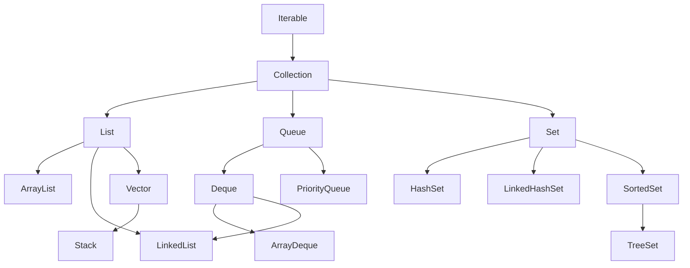

Links: [[01 Inheritance]], [[04 Abstraction]]
___
# Collections

Collections are predefined data structures that Java provides.
Collections are a group of objects or entities considered as a single unit that store data.

We only need to make their objects and use them.

A package in java has either classes or interfaces.
Collections have all of their data structures defined using classes and interfaces in the `java.util` package.

The main interfaces are **List**, **Queue**, **Set**, and **Map**.

- List, Queue, and Set store single items.
- Map stores data in **key-value pairs**.

#### Synchronization

Synchronization (in this context) means **thread-safety**.

- A synchronized collection can be safely accessed by multiple threads at the same time.
- A non-synchronized collection can be corrupted if modified by multiple threads simultaneously.
- Most modern collections (`ArrayList`, `HashMap`) are **non-synchronized** for better performance in single-threaded applications.
- Legacy classes (`Vector`, `Hashtable`) are synchronized.

#### Collection Framework

The Collection Framework is a group of classes and interfaces that implements these data structures.

It is divided into two main categories:

1.  `java.util.Collection`: The root interface for lists, sets, and queues.
2.  `java.util.Map`: A separate interface for key-value pair structures.



##### Collection Interface

It is the main interface of the collection framework that is inherited by `List`, `Queue`, and `Set`.

### Wrapper Classes for Primitive Datatypes

Since collections can only store objects, we need wrapper classes for primitive datatypes.

- `Integer` for `int`
- `Double` for `double`
- `Boolean` for `boolean`
- `Character` for `char`
- Also: `Float`, `Long`, `Short`, `Byte`

### Array

A basic, fixed-size data structure.

```java
int[] arr1;
int []arr2;
int arr3[] = { 0, 1, 3 };
```

To declare size:

```java
String[] st = new String[10];
st[0] = "John"
st[9] = "Silksong"
```

### Iterator

It is an interface used to traverse (access) the data in a `Collection`.

It traverses elements in a sequential, forward-only manner.

It allows for the safe removal of elements while traversing. You cannot do this with a for-each loop (it would cause a ConcurrentModificationException).

It lies in `java.util` package.

Creation of Iterator:

```java
Iterator<String> it = myCollection.iterator();
```

#### Methods of Iterator

- `hasNext() -> bool`: Returns `true` if the iteration has more elements.
- `next() -> Object`: Returns the next element in the iteration.
- `remove()`: Removes the last element returned by `next()` from the collection.

### ListIterator (child of Iterator)

An iterator for `List`s that allows traversal in both directions.

It has these extra functions:

- `hasPrevious()`
- `previous()`
- `add(Object o)`
- `set(Object o)`

It is created as:

```java
ListIterator<Integer> it = myList.listIterator();
```

## [[06.1 Linear Collections]]

## [[06.2 Maps]]

## [[06.3 Sets]]