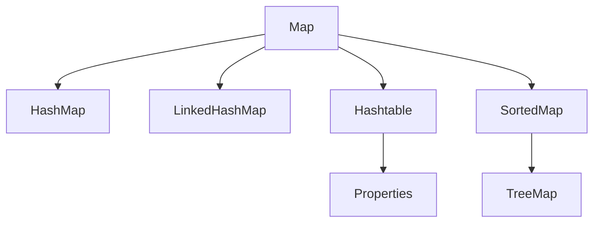

Links: 

---

# Maps

A `Map` is an object that maps keys to values. A map cannot contain duplicate keys; each key can map to at most one value.

It does **not** inherit from the `Collection` interface.



## Map Interface Methods

- `put(K key, V value)`: Associates the specified value with the specified key.
- `get(Object key)`: Returns the value to which the specified key is mapped.
- `remove(Object key)`: Removes the mapping for a key.
- `containsKey(Object key)`: Returns `true` if this map contains a mapping for the specified key.
- `keySet()`: Returns a `Set` view of the keys.
- `entrySet()`: Returns a `Set` view of the mappings.

## HashMap

`HashMap` is a hash table based implementation.

- **Order**: Unordered.
- **Null**: Allows one null key and multiple null values.
- **Synchronization**: Non-synchronized.
- **Performance**: $O(1)$ for `get` and `put`.

```java
Map<String, Integer> map = new HashMap<>();
map.put("Apple", 10);
map.put("Banana", 20);
map.put(null, 0); // Valid

System.out.println(map.get("Apple")); // 10
```

## LinkedHashMap

`LinkedHashMap` extends `HashMap` and maintains a linked list of the entries.

- **Order**: Insertion order (or access order).
- **Null**: Allows one null key.
- **Performance**: Slightly slower than `HashMap` due to linked list overhead.

```java
Map<String, Integer> map = new LinkedHashMap<>();
map.put("One", 1);
map.put("Two", 2);
// Iteration will guarantee "One" then "Two"
```

## TreeMap

`TreeMap` implements `SortedMap` and uses a Red-Black tree.

- **Order**: Sorted according to the natural ordering of its keys, or by a `Comparator`.
- **Null**: **Cannot** have a null key.
- **Performance**: $O(\log n)$.

```java
Map<String, Integer> map = new TreeMap<>();
map.put("Banana", 2);
map.put("Apple", 1);

System.out.println(map); // {Apple=1, Banana=2} (Sorted by Key)
```

## Hashtable

`Hashtable` is a legacy class (JDK 1.0).

- **Order**: Unordered.
- **Null**: **Cannot** have null keys or values.
- **Synchronization**: **Synchronized** (Thread-safe).
- **Performance**: Slower than `HashMap` due to synchronization.

## Properties Class

The `Properties` class extends `Hashtable`. It represents a persistent set of properties.

- Keys and values are both **Strings**.
- Used to read/write configuration files (`.properties`).

**Key Methods:**

- `setProperty(String key, String value)`
- `getProperty(String key)`
- `store(OutputStream out, String comments)`
- `load(InputStream in)`

```java
Properties p = new Properties();
p.setProperty("user", "admin");
p.setProperty("password", "1234");

// Saving to a file
try (FileOutputStream fos = new FileOutputStream("config.properties")) {
    p.store(fos, "User Config");
} catch (IOException e) {
    e.printStackTrace();
}
```

### Comparison

| Feature          | HashMap     | LinkedHashMap | TreeMap     | Hashtable   |
| :--------------- | :---------- | :------------ | :---------- | :---------- |
| **Order**        | Random      | Insertion     | Sorted      | Random      |
| **Null Key**     | Allowed (1) | Allowed (1)   | Not Allowed | Not Allowed |
| **Null Value**   | Allowed     | Allowed       | Allowed     | Not Allowed |
| **Synchronized** | No          | No            | No          | Yes         |
