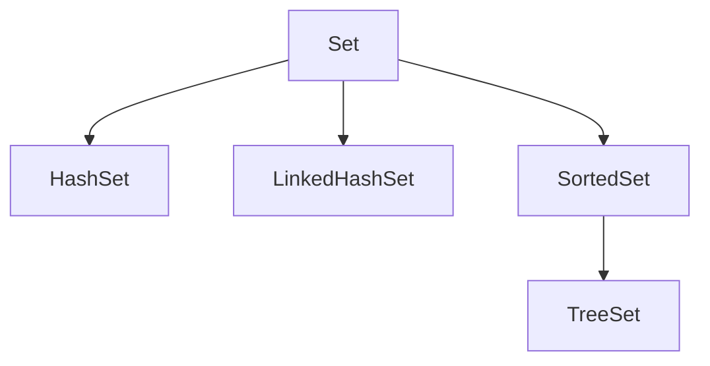

Links: [[06 Collections]]
___
# Sets

A `Set` is a collection that cannot contain duplicate elements. It models the mathematical set abstraction.

The `Set` interface contains only methods inherited from `Collection` and adds the restriction that duplicate elements are prohibited.



## HashSet

`HashSet` is the best-performing implementation. It uses a hash table.

- **Order**: Unordered (no guarantee of iteration order).
- **Null**: Allows one null element.
- **Performance**: Constant time $O(1)$ for basic operations (`add`, `remove`, `contains`), assuming the hash function disperses elements properly.
- **Synchronization**: Not synchronized.

```java
Set<String> fruits = new HashSet<>();
fruits.add("Apple");
fruits.add("Banana");
fruits.add("Apple"); // Duplicate, will be ignored

System.out.println(fruits); // Output order is unpredictable
```

## LinkedHashSet

`LinkedHashSet` is a hash table and linked list implementation of the `Set` interface.

- **Order**: Insertion order (the order in which elements were inserted).
- **Null**: Allows one null element.
- **Performance**: Slightly slower than `HashSet` due to the added expense of maintaining the linked list, but still $O(1)$.

```java
Set<String> fruits = new LinkedHashSet<>();
fruits.add("Apple");
fruits.add("Banana");
fruits.add("Orange");

System.out.println(fruits); // Output: [Apple, Banana, Orange]
```

## SortedSet Interface

A `Set` that further provides a _total ordering_ on its elements. The elements are ordered using their **natural ordering**, or by a `Comparator` provided at sorted set creation time.

## TreeSet

`TreeSet` implements `SortedSet` (and `NavigableSet`). It uses a **Red-Black tree** structure.

- **Order**: Sorted (Natural ascending order or custom Comparator).
- **Null**: Does **not** allow null elements (throws `NullPointerException`).
- **Performance**: $O(\log n)$ for basic operations.
- **Use Case**: When you need a set that is always sorted.

```java
Set<Integer> numbers = new TreeSet<>();
numbers.add(5);
numbers.add(1);
numbers.add(10);

System.out.println(numbers); // Output: [1, 5, 10]
```

### Comparison

| Feature              | HashSet     | LinkedHashSet        | TreeSet                  |
| :------------------- | :---------- | :------------------- | :----------------------- |
| **Internal Storage** | HashMap     | HashMap + LinkedList | TreeMap (Red-Black Tree) |
| **Order**            | Unordered   | Insertion Order      | Sorted Order             |
| **Null Elements**    | Allowed (1) | Allowed (1)          | Not Allowed              |
| **Performance**      | $O(1)$      | $O(1)$               | $O(\log n)$              |
